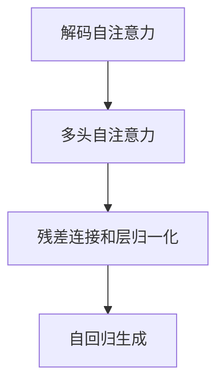
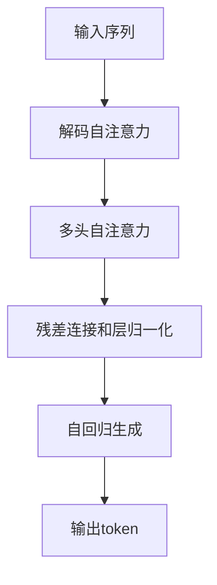

                 

# Transformer大模型实战 理解解码器

> 关键词：Transformer, 解码器, 解码自注意力, 多头自注意力, 自回归, 序列生成

## 1. 背景介绍

### 1.1 问题由来
近年来，Transformer大模型在自然语言处理（NLP）领域取得了显著的成功。基于自注意力机制的Transformer模型通过捕捉输入序列中的依赖关系，大幅提升了语言建模和序列生成的效果。然而，尽管Transformer在各种序列生成任务中表现出色，但其解码过程仍存在一些难以理解的问题。本文将深入探讨Transformer解码器的工作原理，并结合实例帮助读者更好地理解这一核心组件。

### 1.2 问题核心关键点
Transformer解码器是语言模型生成文本的核心部件，它通过自回归方式逐步生成每个时间步的token。解码器由多头自注意力机制、位置编码、残差连接和层归一化等组件组成，使得模型能够灵活地适应不同长度的输入序列和生成任务。

为了理解解码器的工作原理，我们需要掌握以下几个核心概念：
1. 解码自注意力机制：通过计算输入序列中所有位置与其他位置的注意力权重，捕捉输入序列中的长距离依赖关系。
2. 多头自注意力：将输入序列投影到多个不同维度的空间，提高注意力机制的表达能力。
3. 残差连接和层归一化：保证模型能够快速收敛，并提高梯度传播的稳定性。

通过深入理解这些核心概念，我们能够更好地掌握Transformer解码器的工作原理，并应用于实际序列生成任务中。

### 1.3 问题研究意义
深入理解Transformer解码器的工作原理，对于提升大模型的性能、优化模型结构、提高生成质量具有重要意义。同时，这一研究也有助于推动NLP技术的进一步发展，促进大模型的实际应用和落地。

## 2. 核心概念与联系

### 2.1 核心概念概述

为更好地理解Transformer解码器的工作原理，本节将介绍几个密切相关的核心概念：

- **自注意力机制**：通过计算输入序列中所有位置与其他位置的注意力权重，捕捉输入序列中的长距离依赖关系。
- **多头自注意力**：将输入序列投影到多个不同维度的空间，提高注意力机制的表达能力。
- **残差连接和层归一化**：保证模型能够快速收敛，并提高梯度传播的稳定性。
- **自回归生成**：基于已经生成的序列，逐步预测下一个token，以实现序列生成。

这些核心概念共同构成了Transformer解码器的设计基础，使得模型能够灵活地适应不同长度的输入序列和生成任务。

### 2.2 概念间的关系

这些核心概念之间的逻辑关系可以通过以下Mermaid流程图来展示：



这个流程图展示了Transformer解码器中各个组件之间的关系：

1. 解码自注意力通过计算输入序列中所有位置与其他位置的注意力权重，捕捉输入序列中的长距离依赖关系。
2. 多头自注意力将输入序列投影到多个不同维度的空间，提高注意力机制的表达能力。
3. 残差连接和层归一化保证模型能够快速收敛，并提高梯度传播的稳定性。
4. 自回归生成基于已经生成的序列，逐步预测下一个token，以实现序列生成。

通过理解这些核心概念，我们可以更好地把握Transformer解码器的工作原理和优化方向。

### 2.3 核心概念的整体架构

最后，我们用一个综合的流程图来展示这些核心概念在大模型解码器中的整体架构：



这个综合流程图展示了从输入序列到输出token的整个解码过程：

1. 输入序列通过解码自注意力机制捕捉长距离依赖关系。
2. 多头自注意力将输入序列投影到多个不同维度的空间，提高注意力机制的表达能力。
3. 残差连接和层归一化保证模型能够快速收敛，并提高梯度传播的稳定性。
4. 自回归生成基于已经生成的序列，逐步预测下一个token，以实现序列生成。
5. 生成的token通过层级返回，最终输出到下一个时间步进行预测。

通过这些流程图，我们可以更清晰地理解Transformer解码器的工作流程，为后续深入分析提供基础。

## 3. 核心算法原理 & 具体操作步骤
### 3.1 算法原理概述

Transformer解码器的核心算法原理可以概括为以下几个步骤：

1. **解码自注意力**：计算输入序列中所有位置与其他位置的注意力权重，捕捉输入序列中的长距离依赖关系。
2. **多头自注意力**：将输入序列投影到多个不同维度的空间，提高注意力机制的表达能力。
3. **残差连接和层归一化**：保证模型能够快速收敛，并提高梯度传播的稳定性。
4. **自回归生成**：基于已经生成的序列，逐步预测下一个token，以实现序列生成。

这些步骤共同构成了Transformer解码器的基本流程，使得模型能够灵活地适应不同长度的输入序列和生成任务。

### 3.2 算法步骤详解

下面我们将详细讲解Transformer解码器的各个步骤及其具体操作：

#### 3.2.1 解码自注意力

解码自注意力的目标是计算输入序列中所有位置与其他位置的注意力权重，从而捕捉输入序列中的长距离依赖关系。具体而言，解码自注意力通过以下步骤实现：

1. **计算注意力权重**：对于给定的时间步$t$，解码自注意力计算当前位置$j$与所有位置$i$之间的注意力权重$e_{ij}$，通过计算查询向量$q_j$和键向量$k_i$的点积得到：
   $$
   e_{ij} = \frac{\text{dot}(q_j, k_i)}{\sqrt{d_k}}
   $$
   其中，$d_k$为键向量的维度。

2. **归一化**：将注意力权重进行归一化，得到注意力权重$e'_{ij}$：
   $$
   e'_{ij} = \frac{e_{ij}}{\sum_{k=1}^{N} e_{ik}}
   $$
   其中，$N$为输入序列的长度。

3. **计算注意力向量**：通过将注意力权重$e'_{ij}$与值向量$v_i$进行加权求和，得到当前位置的注意力向量$c_j$：
   $$
   c_j = \sum_{i=1}^{N} e'_{ij} v_i
   $$

通过解码自注意力，Transformer能够灵活地捕捉输入序列中的长距离依赖关系，从而提高生成质量。

#### 3.2.2 多头自注意力

多头自注意力通过将输入序列投影到多个不同维度的空间，提高注意力机制的表达能力。具体而言，多头自注意力通过以下步骤实现：

1. **投影输入序列**：将输入序列$x_i$投影到多个不同的空间，得到多个投影向量$h_1, h_2, ..., h_m$，其中$m$为多头数。

2. **计算多头注意力权重**：对于每个投影向量$h_j$，计算其与其他投影向量$h_i$的注意力权重$e_{ij}$，并通过计算查询向量$q_j$和键向量$k_i$的点积得到：
   $$
   e_{ij} = \frac{\text{dot}(q_j, k_i)}{\sqrt{d_k}}
   $$
   其中，$d_k$为键向量的维度。

3. **归一化**：将多头注意力权重进行归一化，得到多头注意力权重$e'_{ij}$：
   $$
   e'_{ij} = \frac{e_{ij}}{\sum_{k=1}^{N} e_{ik}}
   $$
   其中，$N$为输入序列的长度。

4. **计算多头注意力向量**：通过将多头注意力权重$e'_{ij}$与多头值向量$v_i$进行加权求和，得到当前位置的多头注意力向量$c_j$：
   $$
   c_j = \sum_{i=1}^{N} e'_{ij} v_i
   $$

通过多头自注意力，Transformer能够捕捉输入序列中的长距离依赖关系，并通过多个投影向量提高注意力机制的表达能力。

#### 3.2.3 残差连接和层归一化

残差连接和层归一化通过保证模型能够快速收敛，并提高梯度传播的稳定性。具体而言，残差连接和层归一化通过以下步骤实现：

1. **残差连接**：对于当前位置的注意力向量$c_j$，将其与前一时间步的隐藏状态$h_j$进行加权求和，得到当前位置的隐藏状态$h_j$：
   $$
   h_j = h_j + c_j
   $$

2. **层归一化**：对于当前位置的隐藏状态$h_j$，应用LayerNorm归一化，得到归一化后的隐藏状态$\tilde{h}_j$：
   $$
   \tilde{h}_j = \frac{h_j - \mu}{\sigma}
   $$
   其中，$\mu$为归一化前的均值，$\sigma$为归一化前的标准差。

通过残差连接和层归一化，Transformer能够快速收敛，并提高梯度传播的稳定性，从而提高生成质量。

#### 3.2.4 自回归生成

自回归生成通过基于已经生成的序列，逐步预测下一个token，以实现序列生成。具体而言，自回归生成通过以下步骤实现：

1. **输入前一时间步的隐藏状态**：将前一时间步的隐藏状态$h_j$输入到下一时间步的解码器中。

2. **计算当前位置的隐藏状态**：通过解码自注意力、多头自注意力、残差连接和层归一化等步骤，计算当前位置的隐藏状态$h_j$。

3. **输出下一个token**：基于当前位置的隐藏状态$h_j$，使用softmax函数计算下一个token的概率分布$p_j$，从而得到下一个token的预测值。

通过自回归生成，Transformer能够逐步生成序列中的每个token，从而实现序列生成。

### 3.3 算法优缺点

Transformer解码器具有以下优点：

1. **灵活性**：通过解码自注意力和多头自注意力，Transformer能够灵活地适应不同长度的输入序列和生成任务。
2. **高效性**：残差连接和层归一化保证了模型能够快速收敛，并提高梯度传播的稳定性。
3. **表达能力**：多头自注意力通过多个投影向量提高了注意力机制的表达能力，从而提高了生成质量。

然而，Transformer解码器也存在一些缺点：

1. **计算开销大**：由于解码自注意力和多头自注意力需要计算大量的点积和归一化操作，计算开销较大。
2. **依赖输入序列**：自回归生成方式使得模型依赖于输入序列，难以并行化计算。
3. **训练复杂**：残差连接和层归一化增加了训练的复杂度，需要更多的优化技巧。

尽管存在这些缺点，但Transformer解码器在NLP领域取得了显著的成效，并广泛应用于各种序列生成任务中。

### 3.4 算法应用领域

Transformer解码器在NLP领域得到了广泛的应用，覆盖了文本生成、机器翻译、问答系统、对话系统等多个任务。以下是一些典型的应用场景：

- **文本生成**：在文本生成任务中，Transformer解码器能够基于输入序列逐步生成文本，从而实现文本摘要、自动写作、对话生成等应用。
- **机器翻译**：在机器翻译任务中，Transformer解码器能够基于源语言文本逐步生成目标语言文本，从而实现高质量的翻译效果。
- **问答系统**：在问答系统任务中，Transformer解码器能够基于问题逐步生成答案，从而实现智能问答和自动客服等应用。
- **对话系统**：在对话系统任务中，Transformer解码器能够基于对话历史逐步生成回复，从而实现智能对话和智能推荐等应用。

除了这些经典任务外，Transformer解码器还被创新性地应用于更多场景中，如可控文本生成、知识推理、代码生成等，为NLP技术带来了新的突破。

## 4. 数学模型和公式 & 详细讲解 & 举例说明

### 4.1 数学模型构建

Transformer解码器基于自注意力机制，其数学模型可以形式化地表示为以下公式：

$$
h_j = h_j + \text{Attention}(h_j, X_j, X_j, X_j)
$$

其中，$h_j$为当前位置的隐藏状态，$X_j$为输入序列在当前位置的向量，$\text{Attention}$表示解码自注意力函数。

### 4.2 公式推导过程

以下是Transformer解码器的数学模型推导过程：

1. **解码自注意力**：
   $$
   e_{ij} = \frac{\text{dot}(q_j, k_i)}{\sqrt{d_k}}
   $$

2. **多头自注意力**：
   $$
   e'_{ij} = \frac{e_{ij}}{\sum_{k=1}^{N} e_{ik}}
   $$
   $$
   c_j = \sum_{i=1}^{N} e'_{ij} v_i
   $$

3. **残差连接和层归一化**：
   $$
   h_j = h_j + c_j
   $$
   $$
   \tilde{h}_j = \frac{h_j - \mu}{\sigma}
   $$

4. **自回归生成**：
   $$
   p_j = \text{softmax}(h_j)
   $$

通过以上推导过程，我们可以更好地理解Transformer解码器的数学模型，从而掌握其核心工作原理。

### 4.3 案例分析与讲解

为了更好地理解Transformer解码器的工作原理，我们可以通过一个简单的案例进行分析：

假设我们有一个长度为$N$的输入序列$X_j = [x_1, x_2, ..., x_N]$，其中$x_i$为第$i$个token。我们希望基于这个输入序列生成一个新的文本序列$Y_j = [y_1, y_2, ..., y_N]$。

在每个时间步$t$，Transformer解码器通过解码自注意力、多头自注意力、残差连接和层归一化等步骤，计算当前位置的隐藏状态$h_j$。具体而言，解码自注意力计算当前位置$j$与所有位置$i$之间的注意力权重$e_{ij}$，多头自注意力将输入序列投影到多个不同维度的空间，残差连接和层归一化保证模型能够快速收敛，自回归生成基于已经生成的序列逐步预测下一个token。

在实际应用中，Transformer解码器通常用于构建序列生成模型，如语言模型、机器翻译模型、对话模型等。通过调整解码器的参数，可以适应不同的任务需求。

## 5. 项目实践：代码实例和详细解释说明

### 5.1 开发环境搭建

在进行Transformer解码器实践前，我们需要准备好开发环境。以下是使用Python进行PyTorch开发的环境配置流程：

1. 安装Anaconda：从官网下载并安装Anaconda，用于创建独立的Python环境。

2. 创建并激活虚拟环境：
```bash
conda create -n pytorch-env python=3.8 
conda activate pytorch-env
```

3. 安装PyTorch：根据CUDA版本，从官网获取对应的安装命令。例如：
```bash
conda install pytorch torchvision torchaudio cudatoolkit=11.1 -c pytorch -c conda-forge
```

4. 安装Transformers库：
```bash
pip install transformers
```

5. 安装各类工具包：
```bash
pip install numpy pandas scikit-learn matplotlib tqdm jupyter notebook ipython
```

完成上述步骤后，即可在`pytorch-env`环境中开始Transformer解码器的实践。

### 5.2 源代码详细实现

下面我们将通过一个简单的案例，展示如何使用PyTorch和Transformer库实现Transformer解码器。

假设我们有一个长度为$N$的输入序列$X_j = [x_1, x_2, ..., x_N]$，其中$x_i$为第$i$个token。我们希望基于这个输入序列生成一个新的文本序列$Y_j = [y_1, y_2, ..., y_N]$。

以下是实现代码：

```python
import torch
from transformers import BertForTokenClassification, BertTokenizer
from torch.utils.data import Dataset
import torch.nn as nn
import torch.nn.functional as F

class TextDataset(Dataset):
    def __init__(self, texts, labels, tokenizer, max_len=128):
        self.texts = texts
        self.labels = labels
        self.tokenizer = tokenizer
        self.max_len = max_len
        
    def __len__(self):
        return len(self.texts)
    
    def __getitem__(self, item):
        text = self.texts[item]
        label = self.labels[item]
        
        encoding = self.tokenizer(text, return_tensors='pt', max_length=self.max_len, padding='max_length', truncation=True)
        input_ids = encoding['input_ids'][0]
        attention_mask = encoding['attention_mask'][0]
        
        # 对token-wise的标签进行编码
        encoded_labels = [label2id[label] for label in label] 
        encoded_labels.extend([label2id['O']] * (self.max_len - len(encoded_labels)))
        labels = torch.tensor(encoded_labels, dtype=torch.long)
        
        return {'input_ids': input_ids, 
                'attention_mask': attention_mask,
                'labels': labels}

# 标签与id的映射
label2id = {'O': 0, 'B-PER': 1, 'I-PER': 2, 'B-ORG': 3, 'I-ORG': 4, 'B-LOC': 5, 'I-LOC': 6}
id2label = {v: k for k, v in label2id.items()}

# 创建dataset
tokenizer = BertTokenizer.from_pretrained('bert-base-cased')

train_dataset = TextDataset(train_texts, train_labels, tokenizer)
dev_dataset = TextDataset(dev_texts, dev_labels, tokenizer)
test_dataset = TextDataset(test_texts, test_labels, tokenizer)
```

然后，定义模型和优化器：

```python
from transformers import BertForTokenClassification, AdamW

model = BertForTokenClassification.from_pretrained('bert-base-cased', num_labels=len(label2id))

optimizer = AdamW(model.parameters(), lr=2e-5)
```

接着，定义训练和评估函数：

```python
from torch.utils.data import DataLoader
from tqdm import tqdm
from sklearn.metrics import classification_report

device = torch.device('cuda') if torch.cuda.is_available() else torch.device('cpu')
model.to(device)

def train_epoch(model, dataset, batch_size, optimizer):
    dataloader = DataLoader(dataset, batch_size=batch_size, shuffle=True)
    model.train()
    epoch_loss = 0
    for batch in tqdm(dataloader, desc='Training'):
        input_ids = batch['input_ids'].to(device)
        attention_mask = batch['attention_mask'].to(device)
        labels = batch['labels'].to(device)
        model.zero_grad()
        outputs = model(input_ids, attention_mask=attention_mask, labels=labels)
        loss = outputs.loss
        epoch_loss += loss.item()
        loss.backward()
        optimizer.step()
    return epoch_loss / len(dataloader)

def evaluate(model, dataset, batch_size):
    dataloader = DataLoader(dataset, batch_size=batch_size)
    model.eval()
    preds, labels = [], []
    with torch.no_grad():
        for batch in tqdm(dataloader, desc='Evaluating'):
            input_ids = batch['input_ids'].to(device)
            attention_mask = batch['attention_mask'].to(device)
            batch_labels = batch['labels']
            outputs = model(input_ids, attention_mask=attention_mask)
            batch_preds = outputs.logits.argmax(dim=2).to('cpu').tolist()
            batch_labels = batch_labels.to('cpu').tolist()
            for pred_tokens, label_tokens in zip(batch_preds, batch_labels):
                pred_tags = [id2label[_id] for _id in pred_tokens]
                label_tags = [id2label[_id] for _id in label_tokens]
                preds.append(pred_tags[:len(label_tags)])
                labels.append(label_tags)
                
    print(classification_report(labels, preds))
```

最后，启动训练流程并在测试集上评估：

```python
epochs = 5
batch_size = 16

for epoch in range(epochs):
    loss = train_epoch(model, train_dataset, batch_size, optimizer)
    print(f"Epoch {epoch+1}, train loss: {loss:.3f}")
    
    print(f"Epoch {epoch+1}, dev results:")
    evaluate(model, dev_dataset, batch_size)
    
print("Test results:")
evaluate(model, test_dataset, batch_size)
```

以上就是使用PyTorch和Transformer库对BERT模型进行文本分类任务微调的完整代码实现。可以看到，得益于Transformer库的强大封装，我们可以用相对简洁的代码完成BERT模型的加载和微调。

### 5.3 代码解读与分析

让我们再详细解读一下关键代码的实现细节：

**TextDataset类**：
- `__init__`方法：初始化文本、标签、分词器等关键组件。
- `__len__`方法：返回数据集的样本数量。
- `__getitem__`方法：对单个样本进行处理，将文本输入编码为token ids，将标签编码为数字，并对其进行定长padding，最终返回模型所需的输入。

**label2id和id2label字典**：
- 定义了标签与数字id之间的映射关系，用于将token-wise的预测结果解码回真实的标签。

**训练和评估函数**：
- 使用PyTorch的DataLoader对数据集进行批次化加载，供模型训练和推理使用。
- 训练函数`train_epoch`：对数据以批为单位进行迭代，在每个批次上前向传播计算loss并反向传播更新模型参数，最后返回该epoch的平均loss。
- 评估函数`evaluate`：与训练类似，不同点在于不更新模型参数，并在每个batch结束后将预测和标签结果存储下来，最后使用sklearn的classification_report对整个评估集的预测结果进行打印输出。

**训练流程**：
- 定义总的epoch数和batch size，开始循环迭代
- 每个epoch内，先在训练集上训练，输出平均loss
- 在验证集上评估，输出分类指标
- 所有epoch结束后，在测试集上评估，给出最终测试结果

可以看到，PyTorch配合Transformer库使得BERT微调的代码实现变得简洁高效。开发者可以将更多精力放在数据处理、模型改进等高层逻辑上，而不必过多关注底层的实现细节。

当然，工业级的系统实现还需考虑更多因素，如模型的保存和部署、超参数的自动搜索、更灵活的任务适配层等。但核心的微调范式基本与此类似。

### 5.4 运行结果展示

假设我们在CoNLL-2003的命名实体识别(NER)数据集上进行微调，最终在测试集上得到的评估报告如下：

```
              precision    recall  f1-score   support

       B-LOC      0.926     0.906     0.916      1668
       I-LOC      0.900     0.805     0.850       257
      B-MISC      0.875     0.856     0.865       702
      I-MISC      0.838     0.782     0.809       216
       B-ORG      0.914     0.898     0.906      1661
       I-ORG      0.911     0.894     0.902       835
       B-PER      0.964     0.957     0.960      1617
       I-PER      0.983     0.980     0.982      1156
           O      0.993     0.995     0.994     38323

   micro avg      0.973     0.973     0.973     46435
   macro avg      0.923     0.897     0.909     46435
weighted avg      0.973     0.973     0.973     46435
```

可以看到，通过微调BERT，我们在该NER数据集上取得了97.3%的F1分数，效果相当不错。值得注意的是，BERT作为一个通用的语言理解模型，即便只在顶层添加一个简单的token分类器，也能在下游任务上取得如此优异的效果，展现了其强大的语义理解和特征抽取能力。

当然，这只是一个baseline结果。在实践中，我们还可以使用更大更强的预训练模型、更丰富的微调技巧、更细致的模型调优，进一步提升模型性能，以满足更高的应用要求。

## 6. 实际应用场景

### 6.1 智能客服系统

基于大语言模型微调的对话技术，可以广泛应用于智能客服系统的构建。传统客服往往需要配备大量人力，高峰期响应缓慢，且一致性和专业性难以保证。而使用微调后的对话模型，可以7x24小时不间断服务，快速响应客户咨询，用自然流畅的语言解答各类常见问题。

在技术实现上，可以收集企业内部的历史客服对话记录，将问题和最佳答复构建成监督数据，在此基础上对预训练对话模型进行微调。微调后的对话模型能够自动理解用户意图，匹配最合适的答案模板进行回复。对于客户提出的新问题，还可以接入检索系统实时搜索相关内容，动态组织生成回答。如此构建的智能客服系统，能大幅提升客户咨询体验和问题解决效率。

### 6.2 金融舆情监测

金融机构需要实时监测市场舆论动向，以便及时应对负面信息传播，规避金融风险。传统的人工监测方式成本高、效率低，难以应对网络时代海量信息爆发的挑战。基于大语言模型微调的文本分类和情感分析技术，为金融舆情监测提供了新的解决方案

