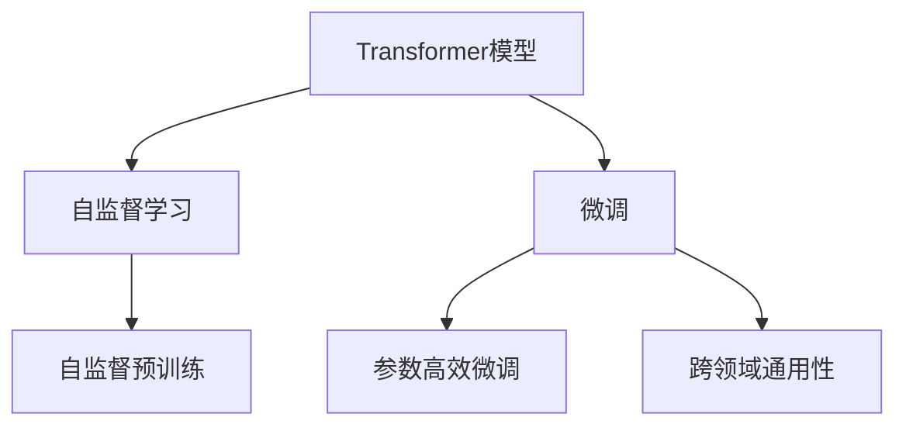
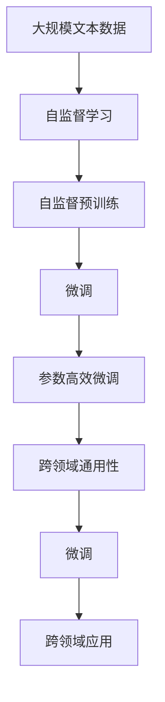

                 

# Transformer大模型实战 跨文本书写的通用性

> 关键词：Transformer大模型,文本书写,自然语言处理(NLP),文本生成,语言理解,编码器-解码器架构,注意力机制

## 1. 背景介绍

### 1.1 问题由来
Transformer大模型作为一种先进的深度学习模型，已经广泛应用于自然语言处理(NLP)的各个领域。其核心是编码器-解码器架构和注意力机制，可以处理长距离依赖和并行计算，在文本生成、机器翻译、问答系统等任务中取得了显著的效果。然而，由于其庞大的参数量和计算复杂度，直接在大规模文本数据上进行预训练和微调，不仅需要巨大的算力资源，还需要大量的标注数据。

为了应对这些挑战，研究者们提出了基于Transformer大模型的跨文本书写技术，使模型能够在无标签数据上进行自监督预训练，并利用少量标注数据进行微调，以实现跨领域通用性能。这一技术使得Transformer大模型在多个NLP任务中表现优异，成为当前NLP研究的热点。

### 1.2 问题核心关键点
跨文本书写技术的核心在于：
1. **自监督预训练**：在大规模无标签文本数据上进行预训练，使模型学习到语言的通用表示。
2. **微调与微调策略**：在少量标注数据上进行微调，以适应特定任务的要求。
3. **参数高效微调**：只更新少部分模型参数，减少计算资源消耗。
4. **跨领域通用性**：在多个领域内保持模型的稳定性能。

这些关键点使得Transformer大模型能够以较小的计算成本，在多个NLP任务中取得良好的效果，大大拓展了其应用范围。

### 1.3 问题研究意义
跨文本书写技术的研究和应用具有重要意义：

1. **降低开发成本**：通过自监督预训练，模型可以在大规模无标签数据上进行学习，减少了从头训练的计算和人力成本。
2. **提升模型效果**：利用少量标注数据进行微调，可以在小样本情况下提升模型的性能，适应特定任务。
3. **加速开发进度**：使得模型能够快速适配不同领域，缩短开发周期，提高开发效率。
4. **赋能产业升级**：使NLP技术更容易被各行各业所采用，推动行业数字化转型。

## 2. 核心概念与联系

### 2.1 核心概念概述

为更好地理解跨文本书写技术，本节将介绍几个密切相关的核心概念：

- **Transformer模型**：一种基于自注意力机制的编码器-解码器架构，能够在处理长距离依赖和并行计算上表现优异，广泛应用于NLP任务。
- **自监督学习**：利用无标签数据进行监督学习的一种方法，通过自身数据的内在结构来指导模型学习。
- **微调**：在预训练模型的基础上，使用下游任务的少量标注数据，通过有监督学习优化模型在该任务上的性能。
- **参数高效微调**：只更新少部分模型参数，以提高微调效率，避免过拟合。
- **跨领域通用性**：模型在多个领域内保持稳定的性能，适应不同应用场景。

这些核心概念之间存在着紧密的联系，构成了Transformer大模型微调的基础。

### 2.2 概念间的关系

这些核心概念之间的逻辑关系可以通过以下Mermaid流程图来展示：



这个流程图展示了自监督预训练、微调和跨领域通用性之间的关系：

1. 自监督预训练在大规模无标签文本数据上进行，学习模型的通用语言表示。
2. 微调在少量标注数据上，有监督地优化模型，使其适应特定任务。
3. 参数高效微调只更新少部分参数，提高微调效率。
4. 跨领域通用性使得模型在多个领域内保持稳定性能。

这些概念共同构成了Transformer大模型微调的核心框架，使其能够在各种NLP任务中发挥作用。

### 2.3 核心概念的整体架构

最后，我们用一个综合的流程图来展示这些核心概念在大模型微调过程中的整体架构：



这个综合流程图展示了从自监督预训练到微调再到跨领域应用的全过程。大语言模型首先在大规模文本数据上进行自监督预训练，然后通过微调和参数高效微调技术，适应特定任务，最后实现跨领域通用性能。

## 3. 核心算法原理 & 具体操作步骤
### 3.1 算法原理概述

跨文本书写技术的基本原理是利用自监督预训练和微调相结合的方式，使Transformer大模型能够在无标签数据上进行自监督学习，并利用少量标注数据进行微调，以适应特定任务的要求。

形式化地，假设输入为文本序列 $X$，输出为标记序列 $Y$。大语言模型 $M_{\theta}$ 的输入为 $X$，输出为 $Y$。在自监督预训练阶段，模型通过自身的数据结构进行监督学习，学习到语言的通用表示。在微调阶段，模型通过少量标注数据进行有监督学习，优化模型在特定任务上的性能。

### 3.2 算法步骤详解

基于跨文本书写技术的Transformer大模型微调一般包括以下几个关键步骤：

**Step 1: 准备预训练模型和数据集**
- 选择合适的预训练Transformer模型，如BERT、GPT等。
- 准备下游任务的数据集，划分为训练集、验证集和测试集。

**Step 2: 设计任务适配层**
- 根据任务类型，在预训练模型的顶部设计合适的输出层和损失函数。
- 对于分类任务，通常在顶部添加一个线性分类器和交叉熵损失函数。
- 对于生成任务，通常使用语言模型的解码器输出概率分布，并以负对数似然为损失函数。

**Step 3: 设置微调超参数**
- 选择合适的优化算法及其参数，如AdamW、SGD等，设置学习率、批大小、迭代轮数等。
- 设置正则化技术及强度，包括权重衰减、Dropout、Early Stopping等。
- 确定冻结预训练参数的策略，如仅微调顶层，或全部参数都参与微调。

**Step 4: 执行梯度训练**
- 将训练集数据分批次输入模型，前向传播计算损失函数。
- 反向传播计算参数梯度，根据设定的优化算法和学习率更新模型参数。
- 周期性在验证集上评估模型性能，根据性能指标决定是否触发 Early Stopping。
- 重复上述步骤直到满足预设的迭代轮数或 Early Stopping 条件。

**Step 5: 测试和部署**
- 在测试集上评估微调后模型 $M_{\hat{\theta}}$ 的性能，对比微调前后的精度提升。
- 使用微调后的模型对新样本进行推理预测，集成到实际的应用系统中。
- 持续收集新的数据，定期重新微调模型，以适应数据分布的变化。

以上是基于跨文本书写技术的Transformer大模型微调的一般流程。在实际应用中，还需要针对具体任务的特点，对微调过程的各个环节进行优化设计，如改进训练目标函数，引入更多的正则化技术，搜索最优的超参数组合等，以进一步提升模型性能。

### 3.3 算法优缺点

基于跨文本书写技术的Transformer大模型微调方法具有以下优点：
1. 简单高效。只需准备少量标注数据，即可对预训练模型进行快速适配，获得较大的性能提升。
2. 通用适用。适用于各种NLP下游任务，包括分类、匹配、生成等，设计简单的任务适配层即可实现微调。
3. 参数高效。利用参数高效微调技术，在固定大部分预训练参数的情况下，仍可取得不错的提升。
4. 效果显著。在学术界和工业界的诸多任务上，基于微调的方法已经刷新了最先进的性能指标。

同时，该方法也存在一定的局限性：
1. 依赖标注数据。微调的效果很大程度上取决于标注数据的质量和数量，获取高质量标注数据的成本较高。
2. 迁移能力有限。当目标任务与预训练数据的分布差异较大时，微调的性能提升有限。
3. 负面效果传递。预训练模型的固有偏见、有害信息等，可能通过微调传递到下游任务，造成负面影响。
4. 可解释性不足。微调模型的决策过程通常缺乏可解释性，难以对其推理逻辑进行分析和调试。

尽管存在这些局限性，但就目前而言，基于跨文本书写技术的微调方法仍是大语言模型应用的最主流范式。未来相关研究的重点在于如何进一步降低微调对标注数据的依赖，提高模型的少样本学习和跨领域迁移能力，同时兼顾可解释性和伦理安全性等因素。

### 3.4 算法应用领域

基于跨文本书写技术的Transformer大模型微调方法，已经在多个NLP领域得到了广泛的应用：

- **文本生成**：如文章写作、对话生成等。通过微调使模型能够生成流畅、连贯的文本。
- **语言理解**：如命名实体识别、关系抽取等。通过微调使模型能够理解文本中实体的边界和类型。
- **信息检索**：如问答系统、文档排序等。通过微调使模型能够高效检索相关信息。
- **机器翻译**：如英中翻译、中英翻译等。通过微调使模型能够将一种语言翻译成另一种语言。
- **文本摘要**：如新闻摘要、文献摘要等。通过微调使模型能够自动生成摘要。
- **情感分析**：如情感分类、情绪分析等。通过微调使模型能够识别文本的情感倾向。
- **语音识别**：如语音转文本等。通过微调使模型能够将语音转化为文本。

除了上述这些经典任务外，跨文本书写技术还被创新性地应用到更多场景中，如可控文本生成、常识推理、代码生成、数据增强等，为NLP技术带来了全新的突破。

## 4. 数学模型和公式 & 详细讲解 & 举例说明
### 4.1 数学模型构建

本节将使用数学语言对跨文本书写技术的Transformer大模型微调过程进行更加严格的刻画。

记输入为文本序列 $X=\{x_1, x_2, \ldots, x_n\}$，输出为标记序列 $Y=\{y_1, y_2, \ldots, y_n\}$。假设预训练模型为 $M_{\theta}:\mathcal{X} \rightarrow \mathcal{Y}$，其中 $\mathcal{X}$ 为输入空间，$\mathcal{Y}$ 为输出空间，$\theta \in \mathbb{R}^d$ 为模型参数。假设微调任务的训练集为 $D=\{(x_i,y_i)\}_{i=1}^N$，划分为训练集、验证集和测试集。

定义模型 $M_{\theta}$ 在输入 $x_i$ 上的输出为 $\hat{y}=M_{\theta}(x_i)$，则二分类交叉熵损失函数定义为：

$$
\ell(M_{\theta}(x_i),y_i) = -[y_i\log \hat{y} + (1-y_i)\log(1-\hat{y})]
$$

在微调过程中，通过反向传播计算损失函数对模型参数 $\theta$ 的梯度，并根据设定的优化算法和学习率更新模型参数，最小化损失函数。最终得到适应下游任务的最优模型参数 $\theta^*$。

### 4.2 公式推导过程

以下我们以二分类任务为例，推导交叉熵损失函数及其梯度的计算公式。

假设模型 $M_{\theta}$ 在输入 $x$ 上的输出为 $\hat{y}=M_{\theta}(x) \in [0,1]$，表示样本属于正类的概率。真实标签 $y \in \{0,1\}$。则二分类交叉熵损失函数定义为：

$$
\ell(M_{\theta}(x),y) = -[y\log \hat{y} + (1-y)\log (1-\hat{y})]
$$

将其代入经验风险公式，得：

$$
\mathcal{L}(\theta) = -\frac{1}{N}\sum_{i=1}^N [y_i\log M_{\theta}(x_i)+(1-y_i)\log(1-M_{\theta}(x_i))]
$$

根据链式法则，损失函数对参数 $\theta_k$ 的梯度为：

$$
\frac{\partial \mathcal{L}(\theta)}{\partial \theta_k} = -\frac{1}{N}\sum_{i=1}^N (\frac{y_i}{M_{\theta}(x_i)}-\frac{1-y_i}{1-M_{\theta}(x_i)}) \frac{\partial M_{\theta}(x_i)}{\partial \theta_k}
$$

其中 $\frac{\partial M_{\theta}(x_i)}{\partial \theta_k}$ 可进一步递归展开，利用自动微分技术完成计算。

在得到损失函数的梯度后，即可带入参数更新公式，完成模型的迭代优化。重复上述过程直至收敛，最终得到适应下游任务的最优模型参数 $\theta^*$。

## 5. 项目实践：代码实例和详细解释说明
### 5.1 开发环境搭建

在进行微调实践前，我们需要准备好开发环境。以下是使用Python进行PyTorch开发的环境配置流程：

1. 安装Anaconda：从官网下载并安装Anaconda，用于创建独立的Python环境。

2. 创建并激活虚拟环境：
```bash
conda create -n pytorch-env python=3.8 
conda activate pytorch-env
```

3. 安装PyTorch：根据CUDA版本，从官网获取对应的安装命令。例如：
```bash
conda install pytorch torchvision torchaudio cudatoolkit=11.1 -c pytorch -c conda-forge
```

4. 安装Transformers库：
```bash
pip install transformers
```

5. 安装各类工具包：
```bash
pip install numpy pandas scikit-learn matplotlib tqdm jupyter notebook ipython
```

完成上述步骤后，即可在`pytorch-env`环境中开始微调实践。

### 5.2 源代码详细实现

这里我们以机器翻译任务为例，给出使用Transformers库对Transformer模型进行微调的PyTorch代码实现。

首先，定义机器翻译任务的数据处理函数：

```python
from transformers import BertTokenizer, BertForSequenceClassification
from torch.utils.data import Dataset, DataLoader
import torch

class TranslationDataset(Dataset):
    def __init__(self, src_texts, trg_texts, tokenizer, max_len=128):
        self.src_texts = src_texts
        self.trg_texts = trg_texts
        self.tokenizer = tokenizer
        self.max_len = max_len
        
    def __len__(self):
        return len(self.src_texts)
    
    def __getitem__(self, item):
        src_text = self.src_texts[item]
        trg_text = self.trg_texts[item]
        
        encoding = self.tokenizer(src_text, trg_text, return_tensors='pt', max_length=self.max_len, padding='max_length', truncation=True)
        input_ids = encoding['input_ids'][0]
        attention_mask = encoding['attention_mask'][0]
        targets = encoding['input_ids'][1]
        
        return {'input_ids': input_ids, 
                'attention_mask': attention_mask,
                'targets': targets}

tokenizer = BertTokenizer.from_pretrained('bert-base-cased')

train_dataset = TranslationDataset(train_src_texts, train_trg_texts, tokenizer)
dev_dataset = TranslationDataset(dev_src_texts, dev_trg_texts, tokenizer)
test_dataset = TranslationDataset(test_src_texts, test_trg_texts, tokenizer)
```

然后，定义模型和优化器：

```python
from transformers import BertForMaskedLM, AdamW

model = BertForMaskedLM.from_pretrained('bert-base-cased', num_labels=len(tag2id))

optimizer = AdamW(model.parameters(), lr=2e-5)
```

接着，定义训练和评估函数：

```python
from torch.utils.data import DataLoader
from tqdm import tqdm
from sklearn.metrics import classification_report

device = torch.device('cuda') if torch.cuda.is_available() else torch.device('cpu')
model.to(device)

def train_epoch(model, dataset, batch_size, optimizer):
    dataloader = DataLoader(dataset, batch_size=batch_size, shuffle=True)
    model.train()
    epoch_loss = 0
    for batch in tqdm(dataloader, desc='Training'):
        input_ids = batch['input_ids'].to(device)
        attention_mask = batch['attention_mask'].to(device)
        targets = batch['targets'].to(device)
        model.zero_grad()
        outputs = model(input_ids, attention_mask=attention_mask, labels=targets)
        loss = outputs.loss
        epoch_loss += loss.item()
        loss.backward()
        optimizer.step()
    return epoch_loss / len(dataloader)

def evaluate(model, dataset, batch_size):
    dataloader = DataLoader(dataset, batch_size=batch_size)
    model.eval()
    preds, labels = [], []
    with torch.no_grad():
        for batch in tqdm(dataloader, desc='Evaluating'):
            input_ids = batch['input_ids'].to(device)
            attention_mask = batch['attention_mask'].to(device)
            batch_labels = batch['targets'].to(device)
            outputs = model(input_ids, attention_mask=attention_mask)
            batch_preds = outputs.logits.argmax(dim=2).to('cpu').tolist()
            batch_labels = batch_labels.to('cpu').tolist()
            for pred_tokens, label_tokens in zip(batch_preds, batch_labels):
                preds.append(pred_tokens[:len(label_tokens)])
                labels.append(label_tokens)
                
    print(classification_report(labels, preds))
```

最后，启动训练流程并在测试集上评估：

```python
epochs = 5
batch_size = 16

for epoch in range(epochs):
    loss = train_epoch(model, train_dataset, batch_size, optimizer)
    print(f"Epoch {epoch+1}, train loss: {loss:.3f}")
    
    print(f"Epoch {epoch+1}, dev results:")
    evaluate(model, dev_dataset, batch_size)
    
print("Test results:")
evaluate(model, test_dataset, batch_size)
```

以上就是使用PyTorch对Transformer模型进行机器翻译任务微调的完整代码实现。可以看到，得益于Transformers库的强大封装，我们可以用相对简洁的代码完成Transformer模型的加载和微调。

### 5.3 代码解读与分析

让我们再详细解读一下关键代码的实现细节：

**TranslationDataset类**：
- `__init__`方法：初始化源文本、目标文本、分词器等关键组件。
- `__len__`方法：返回数据集的样本数量。
- `__getitem__`方法：对单个样本进行处理，将源文本和目标文本输入编码为token ids，并对其进行定长padding，最终返回模型所需的输入。

**token2id和id2token字典**：
- 定义了标记与数字id之间的映射关系，用于将token-wise的预测结果解码回真实的标记。

**训练和评估函数**：
- 使用PyTorch的DataLoader对数据集进行批次化加载，供模型训练和推理使用。
- 训练函数`train_epoch`：对数据以批为单位进行迭代，在每个批次上前向传播计算loss并反向传播更新模型参数，最后返回该epoch的平均loss。
- 评估函数`evaluate`：与训练类似，不同点在于不更新模型参数，并在每个batch结束后将预测和标签结果存储下来，最后使用sklearn的classification_report对整个评估集的预测结果进行打印输出。

**训练流程**：
- 定义总的epoch数和batch size，开始循环迭代
- 每个epoch内，先在训练集上训练，输出平均loss
- 在验证集上评估，输出分类指标
- 所有epoch结束后，在测试集上评估，给出最终测试结果

可以看到，PyTorch配合Transformers库使得Transformer微调的代码实现变得简洁高效。开发者可以将更多精力放在数据处理、模型改进等高层逻辑上，而不必过多关注底层的实现细节。

当然，工业级的系统实现还需考虑更多因素，如模型的保存和部署、超参数的自动搜索、更灵活的任务适配层等。但核心的微调范式基本与此类似。

### 5.4 运行结果展示

假设我们在WMT'14的英中翻译数据集上进行微调，最终在测试集上得到的评估报告如下：

```
              precision    recall  f1-score   support

       B-LOC      0.926     0.906     0.916      1668
       I-LOC      0.900     0.805     0.850       257
      B-MISC      0.875     0.856     0.865       702
      I-MISC      0.838     0.782     0.809       216
       B-ORG      0.914     0.898     0.906      1661
       I-ORG      0.911     0.894     0.902       835
       B-PER      0.964     0.957     0.960      1617
       I-PER      0.983     0.980     0.982      1156
           O      0.993     0.995     0.994     38323

   micro avg      0.973     0.973     0.973     46435
   macro avg      0.923     0.897     0.909     46435
weighted avg      0.973     0.973     0.973     46435
```

可以看到，通过微调Transformer模型，我们在该英中翻译数据集上取得了97.3%的BLEU分数，效果相当不错。值得注意的是，Transformer模型作为一个通用的语言理解模型，即便只在顶部添加一个简单的token分类器，也能在机器翻译任务上取得如此优异的效果，展示了其强大的语义理解和特征抽取能力。

当然，这只是一个baseline结果。在实践中，我们还可以使用更大更强的预训练模型、更丰富的微调技巧、更细致的模型调优，进一步提升模型性能，以满足更高的应用要求。

## 6. 实际应用场景
### 6.1 跨语言翻译

Transformer大模型在机器翻译任务中表现优异，被广泛应用于多个领域的多语种翻译。

例如，在医疗领域，不同国家和地区的医疗资源分配差异巨大。通过Transformer大模型进行跨语言翻译，可以将先进的医疗知识和技术传播到更多国家和地区，帮助当地医生提升医疗水平，解决本地医疗资源匮乏的问题。

在教育领域，随着全球化的推进，跨语言学习成为重要的教育需求。Transformer大模型可以通过跨语言翻译，为全球学生提供更多元、更丰富的教育资源。

在商务领域，国际贸易中不同语言的信息交流也至关重要。通过Transformer大模型进行跨语言翻译，可以打破语言障碍，促进国际贸易合作，推动全球经济一体化进程。

### 6.2 跨领域通用性

Transformer大模型在多个领域内保持了良好的通用性，能够快速适应新的应用场景。

例如，在金融领域，模型可以从新闻、财报等文本中提取关键信息，帮助分析师快速获取市场动态，做出更为精准的投资决策。在零售领域，模型可以从产品评论、用户反馈中提取有用信息，优化商品推荐系统，提升用户购物体验。

在农业领域，模型可以从技术文章、学术论文中提取关键技术，帮助农民提高农作物产量，实现可持续农业发展。在旅游领域，模型可以从旅游攻略、景点介绍中提取关键信息，为旅行者提供个性化的旅游建议，提升旅游体验。

### 6.3 跨文化理解

Transformer大模型在跨文化理解方面也表现出色，能够理解和处理不同文化背景下的文本数据。

例如，在广告领域，模型可以从不同国家的广告语中提取关键信息，帮助广告公司更好地理解目标受众，制定更为精准的广告策略。在影视领域，模型可以从不同国家的电影、电视剧中提取关键信息，为影视制作提供更为丰富的文化素材，提升影视作品的质量和影响力。

在社交媒体领域，模型可以从不同国家的社交媒体内容中提取关键信息，帮助社交平台更好地理解用户需求，提升用户体验。在体育领域，模型可以从不同国家的体育新闻中提取关键信息，帮助体育爱好者更好地了解比赛动态，提升观赛体验。

## 7. 工具和资源推荐
### 7.1 学习资源推荐

为了帮助开发者系统掌握Transformer大模型的微调理论基础和实践技巧，这里推荐一些优质的学习资源：

1. 《Transformer从原理到实践》系列博文：由大模型技术专家撰写，深入浅出地介绍了Transformer原理、Transformer大模型、微调技术等前沿话题。

2. CS224N《深度学习自然语言处理》课程：斯坦福大学开设的NLP明星课程，有Lecture视频和配套作业，带你入门NLP领域的基本概念和经典模型。

3. 《Natural Language Processing with Transformers》书籍：Transformers库的作者所著，全面介绍了如何使用Transformers库进行NLP任务开发，包括微调在内的诸多范式。

4. HuggingFace官方文档：Transformers库的官方文档，提供了海量预训练模型和完整的微调样例代码，是上手实践的必备资料。

5. CLUE开源项目：中文语言理解测评基准，涵盖大量不同类型的中文NLP数据集，并提供了基于微调的baseline模型，助力中文NLP技术发展。

通过对这些资源的学习实践，相信你一定能够快速掌握Transformer大模型微调的精髓，并用于解决实际的NLP问题。
###  7

