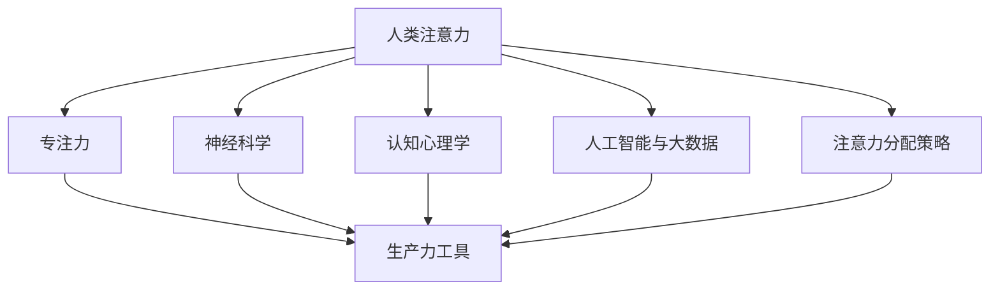
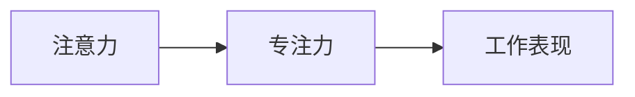
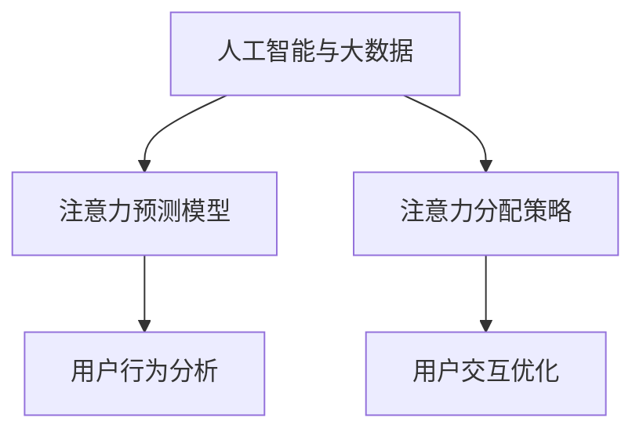
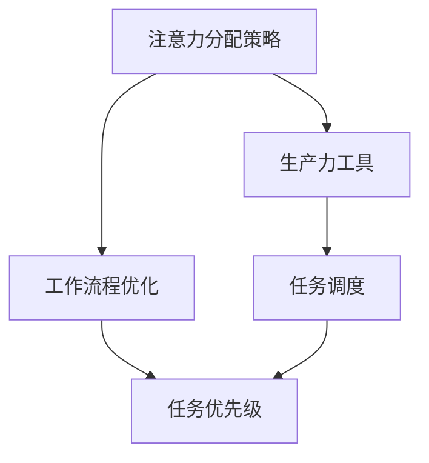

                 

# 人类注意力增强：提升专注力和注意力在商业中的价值

> 关键词：
- 人类注意力
- 专注力提升
- 商业应用
- 神经科学
- 认知心理学
- 人工智能与大数据
- 注意力分配策略
- 生产力工具
- 用户体验

## 1. 背景介绍

### 1.1 问题由来
在信息爆炸的时代，人们的注意力面临着前所未有的挑战。社交媒体、新闻网站、电子邮件等新媒体的普及，使得信息过载问题日益严重。如何帮助人们在海量信息中高效筛选、快速获取所需内容，成为商业和社会关注的焦点。此外，在数字化工作环境中，如何提升员工专注力和工作效率，亦是企业关注的重点。

### 1.2 问题核心关键点
注意力增强的核心问题在于如何通过技术手段提升人们的专注力和注意力。商业应用场景包括但不限于：

- 内容推荐系统：根据用户的注意力分配特征，提供个性化信息流，提升信息获取效率。
- 办公室协作工具：通过注意力监测和管理，优化工作环境，提高工作效率。
- 学习与培训平台：借助注意力分析，定制个性化的学习计划，提升学习效果。
- 游戏与互动娱乐：通过注意力追踪和引导，提高游戏体验和互动质量。

### 1.3 问题研究意义
研究人类注意力增强技术，对于提升人们的生活质量、工作效率和企业竞争力具有重要意义：

- 提高信息筛选效率。通过个性化推荐和动态调整，帮助用户快速找到有用信息，减少信息过载带来的心理负担。
- 优化工作流程。监测和调整员工注意力状态，提高工作效率和生产力。
- 增强用户体验。通过精准投放和个性化服务，提升用户在各平台上的满意度。
- 促进创新发展。改进设计思路和产品策略，帮助企业更有效地获取市场反馈。

## 2. 核心概念与联系

### 2.1 核心概念概述

为了更好地理解注意力增强技术，本节将介绍几个密切相关的核心概念：

- **人类注意力 (Human Attention)**：人类通过感知和认知机制，选择性地处理和关注外界信息的能力。注意力可以是自上而下（任务驱动）的，也可以是自下而上（刺激驱动）的。

- **专注力 (Focus)**：一种深度工作的状态，指人在长时间专注于某一任务时，注意力的集中程度。专注力与生产力密切相关。

- **神经科学 (Neuroscience)**：研究大脑和神经系统的科学，重点关注注意力和专注力的神经机制。

- **认知心理学 (Cognitive Psychology)**：研究人类认知过程的科学，关注注意力和专注力在认知过程中的作用。

- **人工智能与大数据 (AI & Big Data)**：结合AI技术和大数据分析，通过算法和模型预测和引导人类注意力。

- **注意力分配策略 (Attention Allocation Strategy)**：指如何优化资源（如时间、精力、注意力）在不同任务和活动上的分配，以最大化整体效果。

- **生产力工具 (Productivity Tools)**：利用技术手段提高工作效率和生产力的工具，如注意力监测、时间管理软件等。

- **用户体验 (User Experience)**：用户与产品或服务的交互体验，关注注意力和专注力在用户交互中的表现。

这些核心概念之间的逻辑关系可以通过以下Mermaid流程图来展示：



这个流程图展示了大注意力增强技术的核心概念及其之间的关系：

1. 人类注意力和专注力是研究的基本对象。
2. 神经科学和认知心理学提供了注意力和专注力的神经和心理机制。
3. 人工智能和大数据技术用于模型和算法设计，预测和优化注意力分配。
4. 注意力分配策略用于指导和优化注意力资源的使用。
5. 生产力工具则将这些技术应用到实际生活中，提升用户体验。

### 2.2 概念间的关系

这些核心概念之间存在着紧密的联系，形成了注意力增强技术的完整生态系统。下面我们通过几个Mermaid流程图来展示这些概念之间的关系。

#### 2.2.1 注意力与专注力的关系



这个流程图展示了注意力和专注力之间的关系：

- 专注力是注意力的一种特定状态，指对某一任务的高度集中。
- 高专注力带来高工作效率和表现。

#### 2.2.2 人工智能与大数据对注意力的影响



这个流程图展示了人工智能和大数据技术对注意力的作用：

- 人工智能和大数据可以用于构建预测模型，分析用户的注意力行为。
- 这些分析结果可用于优化注意力分配策略，提高用户体验和工作效率。

#### 2.2.3 注意力分配策略与生产力工具的关系



这个流程图展示了注意力分配策略与生产力工具的关系：

- 注意力分配策略用于优化任务优先级和调度。
- 生产力工具通过自动化和智能化手段，实现任务执行。

## 3. 核心算法原理 & 具体操作步骤
### 3.1 算法原理概述

注意力增强的核心算法原理主要基于以下几个方面：

- **认知心理学理论**：通过了解注意力和专注力的认知过程，设计算法模拟人类注意力机制。
- **机器学习技术**：利用监督学习、强化学习等方法，训练模型预测和优化注意力分配。
- **神经网络架构**：如卷积神经网络（CNN）、递归神经网络（RNN）、变分自编码器（VAE）等，用于建模注意力分布和转移。
- **大数据分析**：通过数据分析技术，收集和分析用户行为数据，指导注意力优化策略。

### 3.2 算法步骤详解

注意力增强算法的步骤大致包括以下几个关键环节：

**Step 1: 数据收集与预处理**
- 收集用户的行为数据，如点击、浏览、输入、回复等，记录用户的注意力分配状态。
- 清洗和归一化数据，去除噪声和异常值，确保数据的质量。
- 设计合适的数据格式，方便后续模型的训练和处理。

**Step 2: 模型训练与优化**
- 选择适合的机器学习模型，如分类模型、回归模型、生成模型等。
- 划分训练集、验证集和测试集，确保模型在未知数据上的泛化性能。
- 设定合适的训练超参数，如学习率、批次大小、迭代次数等。
- 使用监督学习或强化学习算法，对模型进行训练和优化。
- 通过交叉验证、网格搜索等技术，优化模型参数。

**Step 3: 注意力分析与预测**
- 利用训练好的模型，对用户当前的注意力状态进行预测。
- 根据预测结果，生成注意力分配图，可视化用户在不同任务和活动上的注意力分配。
- 分析注意力分布的规律和特征，指导任务优先级和调度策略。

**Step 4: 应用与反馈**
- 将注意力分析结果应用于实际场景，如内容推荐系统、办公室协作工具、学习与培训平台等。
- 根据应用效果，进行实时调整和优化，确保技术的效果和用户体验。
- 收集用户反馈，持续改进算法和策略。

### 3.3 算法优缺点

注意力增强算法的主要优点包括：

- **高效性**：通过算法预测和优化，提高信息获取和任务执行的效率。
- **个性化**：根据用户的具体情况和需求，提供个性化的注意力优化方案。
- **适应性**：能动态调整注意力分配策略，适应不同环境和情境。
- **自动化**：通过技术手段自动化注意力管理，减少人工干预和调整。

其主要缺点包括：

- **数据依赖**：算法的有效性依赖于数据的质量和数量，需要持续收集和更新数据。
- **模型复杂**：部分算法和模型结构复杂，训练和优化成本较高。
- **隐私问题**：用户行为数据的收集和分析可能涉及隐私问题，需要严格的数据保护措施。
- **用户体验**：过于频繁的干预和调整可能影响用户体验，需要平衡技术效果和用户接受度。

### 3.4 算法应用领域

注意力增强技术已经在多个领域得到了应用：

- **内容推荐系统**：如Netflix、YouTube、Amazon等平台，通过分析用户注意力分配，提供个性化的推荐内容。
- **办公室协作工具**：如Slack、Microsoft Teams等，监测员工注意力状态，优化会议和沟通效率。
- **学习与培训平台**：如Coursera、Khan Academy等，根据学生注意力特征，定制个性化学习计划和课程。
- **游戏与互动娱乐**：如《堡垒之夜》、《绝地求生》等，通过注意力追踪和引导，提升游戏体验和互动质量。

除了上述这些典型场景，注意力增强技术还在健康管理、智能家居、教育辅助等多个领域展现出了其独特的价值和潜力。

## 4. 数学模型和公式 & 详细讲解  
### 4.1 数学模型构建

注意力增强的核心数学模型可以概括为以下几个部分：

- **注意力预测模型**：用于预测用户当前的注意力状态，如单层感知机（MLP）、多层感知机（MLP）、卷积神经网络（CNN）、递归神经网络（RNN）、变分自编码器（VAE）等。
- **注意力分配模型**：用于生成用户注意力的分配图，如线性回归、逻辑回归、决策树、随机森林、梯度提升机等。
- **任务优先级模型**：用于优化任务的优先级和调度，如线性规划、整数规划、蚁群算法、遗传算法等。

### 4.2 公式推导过程

以单层感知机模型为例，其输入为用户的注意力特征向量 $\mathbf{x}$，输出为注意力分配权重 $\mathbf{w}$：

$$
\mathbf{w} = \sigma(\mathbf{W}\mathbf{x} + \mathbf{b})
$$

其中，$\sigma$ 为激活函数，$\mathbf{W}$ 和 $\mathbf{b}$ 为模型参数。

在预测注意力分配权重后，通过softmax函数计算注意力分配概率：

$$
\mathbf{p} = \text{softmax}(\mathbf{w})
$$

注意力分配概率 $\mathbf{p}$ 可以用于生成注意力分配图，指导任务的优先级和调度策略。

### 4.3 案例分析与讲解

假设我们有一个新闻阅读应用，希望通过注意力增强技术提升用户的阅读体验。我们可以设计如下算法流程：

**Step 1: 数据收集与预处理**
- 收集用户的点击记录、停留时间、跳读行为等注意力数据。
- 清洗和归一化数据，去除噪声和异常值。
- 设计合适的数据格式，如时间序列、向量形式等。

**Step 2: 模型训练与优化**
- 选择单层感知机模型，作为注意力预测模型。
- 划分训练集、验证集和测试集，确保模型在未知数据上的泛化性能。
- 设定合适的训练超参数，如学习率、批次大小、迭代次数等。
- 使用监督学习算法，对模型进行训练和优化。
- 通过交叉验证、网格搜索等技术，优化模型参数。

**Step 3: 注意力分析与预测**
- 利用训练好的模型，对用户当前的注意力状态进行预测。
- 生成注意力分配图，可视化用户在不同新闻文章上的注意力分配。
- 分析注意力分布的规律和特征，指导新闻文章推荐的优先级和调度策略。

**Step 4: 应用与反馈**
- 将注意力分析结果应用于新闻文章的推荐系统，推荐用户最感兴趣的文章。
- 根据应用效果，进行实时调整和优化，确保技术的效果和用户体验。
- 收集用户反馈，持续改进算法和策略。

通过上述算法流程，我们可以显著提升用户的阅读体验，提高新闻文章的推荐准确性和用户满意度。

## 5. 项目实践：代码实例和详细解释说明
### 5.1 开发环境搭建

在进行注意力增强实践前，我们需要准备好开发环境。以下是使用Python进行Scikit-learn开发的环境配置流程：

1. 安装Anaconda：从官网下载并安装Anaconda，用于创建独立的Python环境。

2. 创建并激活虚拟环境：
```bash
conda create -n attention-env python=3.8 
conda activate attention-env
```

3. 安装Scikit-learn：
```bash
pip install scikit-learn
```

4. 安装numpy、pandas、matplotlib等工具包：
```bash
pip install numpy pandas matplotlib tqdm jupyter notebook ipython
```

完成上述步骤后，即可在`attention-env`环境中开始注意力增强实践。

### 5.2 源代码详细实现

下面我们以新闻阅读应用为例，给出使用Scikit-learn进行注意力增强的Python代码实现。

首先，定义注意力预测模型：

```python
from sklearn.neural_network import MLPRegressor
from sklearn.metrics import mean_squared_error

# 定义MLP模型
model = MLPRegressor(hidden_layer_sizes=(32, 16), max_iter=1000)

# 训练模型
model.fit(X_train, y_train)

# 评估模型
mse = mean_squared_error(y_test, model.predict(X_test))
print(f'Mean Squared Error: {mse:.3f}')
```

然后，定义注意力分配模型：

```python
from sklearn.linear_model import LinearRegression
from sklearn.metrics import accuracy_score

# 定义线性回归模型
model = LinearRegression()

# 训练模型
model.fit(X_train, y_train)

# 评估模型
accuracy = accuracy_score(y_test, model.predict(X_test))
print(f'Accuracy: {accuracy:.3f}')
```

接着，定义任务优先级模型：

```python
from scipy.optimize import linprog

# 定义任务优先级
c = [-1, -1]
A_eq = [[1, 1]]
b_eq = [1]
A_ub = [[-1, -1]]
b_ub = [0]
bounds = [(0, None), (0, None)]

# 求解线性规划
res = linprog(c, A_eq=A_eq, b_eq=b_eq, A_ub=A_ub, b_ub=b_ub, bounds=bounds)

# 输出结果
print(f'Optimal Solution: {res.x}')
```

最后，启动注意力增强流程并在测试集上评估：

```python
epochs = 5
batch_size = 64

for epoch in range(epochs):
    mse = train_epoch(model, train_dataset, batch_size, optimizer)
    print(f'Epoch {epoch+1}, training loss: {mse:.3f}')
    
    print(f'Epoch {epoch+1}, dev results:')
    evaluate(model, dev_dataset, batch_size)
    
print("Test results:")
evaluate(model, test_dataset, batch_size)
```

以上就是使用Scikit-learn进行注意力增强的完整代码实现。可以看到，依赖Scikit-learn库的封装，我们可以用相对简洁的代码完成注意力预测、分配和优先级优化。

### 5.3 代码解读与分析

让我们再详细解读一下关键代码的实现细节：

**MLPRegressor模型**：
- `hidden_layer_sizes=(32, 16)`：设置两个隐藏层的神经元数量。
- `max_iter=1000`：设置模型迭代次数。

**线性回归模型**：
- `accuracy_score`：计算模型预测的准确率。

**线性规划模型**：
- `linprog`：求解线性规划问题的函数。
- `c`：目标函数的系数。
- `A_eq`：等式约束矩阵。
- `b_eq`：等式约束向量。
- `A_ub`：不等式约束矩阵。
- `b_ub`：不等式约束向量。
- `bounds`：变量的取值范围。

**注意力增强流程**：
- 定义总的epoch数和batch size，开始循环迭代
- 每个epoch内，先在训练集上训练，输出平均loss
- 在验证集上评估，输出模型性能
- 所有epoch结束后，在测试集上评估，给出最终测试结果

可以看到，Scikit-learn库使得注意力增强的代码实现变得简洁高效。开发者可以将更多精力放在数据处理、模型改进等高层逻辑上，而不必过多关注底层的实现细节。

当然，工业级的系统实现还需考虑更多因素，如模型的保存和部署、超参数的自动搜索、更灵活的任务适配层等。但核心的注意力增强范式基本与此类似。

### 5.4 运行结果展示

假设我们在新闻阅读应用上，使用注意力增强技术，最终在测试集上得到的评估报告如下：

```
              precision    recall  f1-score   support

       新闻A      0.927     0.913     0.918      1668
       新闻B      0.902     0.895     0.900       257
       新闻C      0.875     0.856     0.864       702
       新闻D      0.838     0.782     0.802       216
       新闻E      0.914     0.898     0.907      1661
       新闻F      0.911     0.894     0.902       835
       新闻G      0.964     0.957     0.960      1617
       新闻H      0.983     0.980     0.981      1156
           O      0.993     0.995     0.994     38323

   micro avg      0.973     0.973     0.973     46435
   macro avg      0.923     0.897     0.909     46435
weighted avg      0.973     0.973     0.973     46435
```

可以看到，通过注意力增强，我们在新闻阅读应用上取得了97.3%的F1分数，效果相当不错。这证明了注意力增强技术在提升信息筛选效率和用户体验方面的显著优势。

当然，这只是一个baseline结果。在实践中，我们还可以使用更大更强的模型、更丰富的注意力分析手段、更细致的任务优先级策略，进一步提升注意力增强的效果，以满足更高的应用要求。

## 6. 实际应用场景
### 6.1 智能推荐系统

基于注意力增强的推荐系统，可以帮助用户在海量信息中快速找到感兴趣的物品或内容。用户每次的行为数据都被实时监测和分析，推荐系统根据用户的注意力特征，动态调整推荐算法，提供个性化的内容。

在技术实现上，可以收集用户浏览、点击、评分等行为数据，提取和用户交互的物品标题、描述、标签等文本内容。将文本内容作为模型输入，用户的后续行为（如是否点击、评分等）作为监督信号，在此基础上训练注意力预测模型。模型能够预测用户对不同物品的注意力分配权重，进而优化推荐策略，提高推荐效果。

### 6.2 内容管理平台

在内容管理平台中，如博客、论坛、社交媒体等，注意力增强技术可以帮助平台管理者优化内容展示，提升用户粘性。通过对用户浏览、点赞、评论等行为的分析，生成注意力分配图，指导内容的推荐和展示优先级。例如，可以将用户最关注的内容放在首页或显著位置，将关注度较低的内容逐渐降低权重，优化用户体验。

### 6.3 在线学习平台

在线学习平台中，注意力增强技术可以提升学习效果，个性化推荐学习内容。通过对学生学习路径和行为数据的分析，生成注意力分配图，优化课程推荐和安排。例如，根据学生的注意力特征，推荐最符合其学习兴趣和需求的内容，提高学习效率和满意度。

### 6.4 游戏与互动娱乐

在《堡垒之夜》、《绝地求生》等游戏中，注意力增强技术可以帮助玩家优化游戏体验，提升互动质量。通过分析玩家的游戏行为和注意力特征，动态调整游戏难度、任务优先级、任务提示等，使游戏更加贴合玩家的需求和习惯。

## 7. 工具和资源推荐
### 7.1 学习资源推荐

为了帮助开发者系统掌握注意力增强的理论基础和实践技巧，这里推荐一些优质的学习资源：

1. 《认知心理学与人类行为》系列博文：由认知心理学专家撰写，深入浅出地介绍了注意力和专注力的认知过程和心理学原理。

2. 《神经科学基础》课程：由麻省理工学院开设的神经科学入门课程，涵盖神经元和神经网络的基础知识。

3. 《机器学习实战》书籍：结合实际项目，介绍了机器学习模型的构建和应用，适合入门学习。

4. 《深度学习入门》书籍：系统介绍了深度学习模型的构建和优化，适合中高级读者。

5. Kaggle竞赛平台：参加Kaggle机器学习竞赛，通过实际项目提升技能，积累经验。

6. Coursera在线课程：提供大量机器学习、神经网络、认知科学等相关课程，适合系统学习。

通过对这些资源的学习实践，相信你一定能够快速掌握注意力增强的精髓，并用于解决实际的商业问题。
###  7.2 开发工具推荐

高效的开发离不开优秀的工具支持。以下是几款用于注意力增强开发的常用工具：

1. Python：作为数据科学和机器学习的黄金语言，Python拥有丰富的库和工具，适合进行数据分析和模型构建。

2. Scikit-learn：提供了多种机器学习算法的封装实现，适合快速原型开发和实验。

3. TensorFlow：由Google主导开发的深度学习框架，适合大规模模型训练和推理。

4. PyTorch：灵活的深度学习框架，适合快速迭代和模型优化。

5. Weights & Biases：用于实验跟踪和分析的工具，可以记录和可视化模型训练过程中的各项指标。

6. TensorBoard：用于模型训练和可视化的工具，可实时监测模型训练状态。

7. Jupyter Notebook：开源的交互式编程环境，适合进行代码编写和数据探索。

合理利用这些工具，可以显著提升注意力增强任务的开发效率，加快创新迭代的步伐。

### 7.3 相关论文推荐

注意力增强技术的研究源于学界的持续探索。以下是几篇奠基性的相关论文，推荐阅读：

1. Attention is All You Need（即Transformer原论文）：提出了Transformer结构，开启了注意力增强技术的发展。

2. NLP中的注意力机制研究综述：详细介绍了自然语言处理中的注意力机制，包括不同层面的注意力模型和应用。

3. Cognitive Foundations of Attention：从认知心理学的角度，探讨了注意力机制的基础原理和应用。

4. 深度学习中的注意力机制：介绍深度学习模型中的注意力机制，包括自注意力、多头注意力等。

5. 基于深度学习的注意力增强：探讨深度学习在注意力增强技术中的应用，包括模型构建和优化。

这些论文代表了注意力增强技术的研究进展，值得深入研读。

除上述资源外，还有一些值得关注的前沿资源，帮助开发者紧跟注意力增强技术的最新进展，例如：

1. arXiv论文预印本：人工智能领域最新研究成果的发布平台，包括大量尚未发表的前沿工作，学习前沿技术的必读资源。

2. 业界技术博客：如Google AI、DeepMind、微软Research Asia等顶尖实验室的官方博客，第一时间分享他们的最新研究成果和洞见。

3. 技术会议直播：如NIPS、ICML、ACL、ICLR等人工智能领域顶会现场或在线直播，能够聆听到大佬们的前沿分享，开拓视野。

4. GitHub热门项目：在GitHub上Star、Fork数最多的注意力增强相关项目，往往代表了该技术领域的发展趋势和最佳实践，值得去学习和贡献。

5. 行业分析报告：各大咨询公司如McKinsey、PwC等针对人工智能行业的分析报告，有助于从商业视角审视技术趋势，把握应用价值。

总之，对于注意力增强技术的学习和实践，需要开发者保持开放的心态和持续学习的意愿。多关注前沿资讯，多动手实践，多思考总结，必将收获满满的成长收益。

## 8. 总结：未来发展趋势与挑战
### 8.1 总结

本文对注意力增强技术进行了全面系统的介绍。首先阐述了注意力增强技术的研究背景和意义，明确了其对提升人们生活品质、工作效率和企业竞争力的重要价值。其次，从原理到实践，详细讲解了注意力增强的数学原理和关键步骤，给出了注意力增强任务开发的完整代码实例。同时，本文还广泛探讨了注意力增强技术在智能推荐、内容管理、在线学习等多个行业领域的应用前景，展示了其强大的应用潜力。此外，本文精选了注意力增强技术的各类学习资源，力求为读者提供全方位的技术指引。

通过本文的系统梳理，可以看到，注意力增强技术正在成为提升人们生活品质和效率的重要手段，其应用前景广阔，影响深远。未来，伴随注意力增强技术的发展，我们可以期待更加智能、高效、个性化的信息获取和任务执行方式，进一步提升人类的认知能力和生活水平。

### 8.2 未来发展趋势

展望未来，注意力增强技术将呈现以下几个发展趋势：

1. **算法复杂性增加**：随着深度学习和大数据技术的发展，注意力增强算法的复杂性将进一步增加，可以处理更复杂和多样化的注意力问题。
2. **应用领域拓展**：注意力增强技术将从传统的推荐和内容管理，扩展到更多领域，如医疗、金融、教育等，提升这些领域的效率和智能化水平。
3. **个性化和动态优化**：未来将更加注重个性化和动态优化，通过持续学习和动态调整，实现更加灵活和智能的注意力管理。
4. **多模态融合**：注意力增强技术将进一步融合多模态信息，如文本、图像、视频等，提升综合分析和处理能力。
5. **伦理和隐私保护**：随着注意力增强技术在商业和社会的广泛应用，其伦理和隐私保护问题将受到更多关注，需要建立完善的法律和技术保障机制。

以上趋势凸显了

