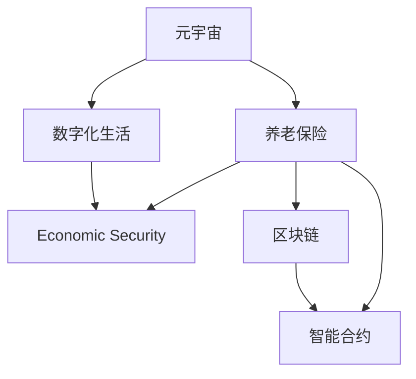
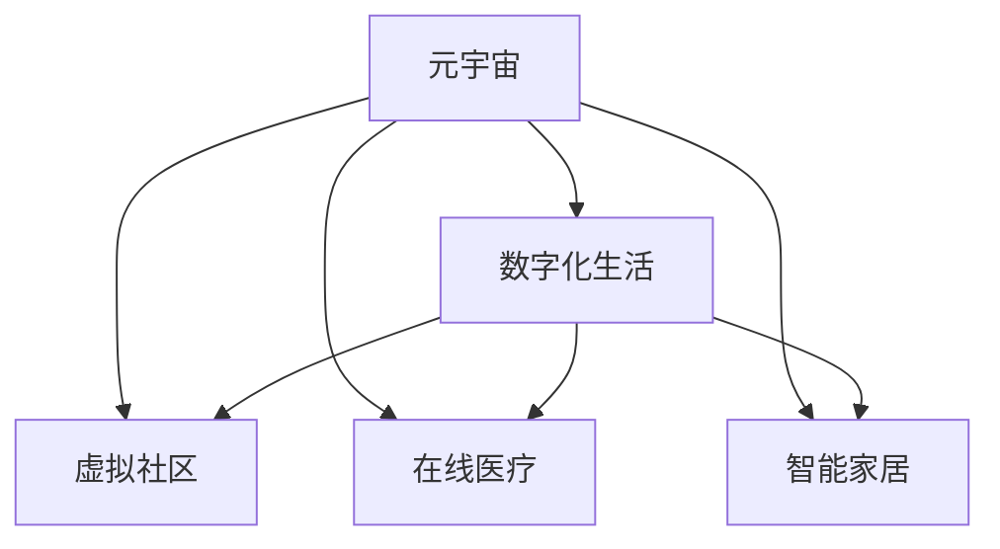
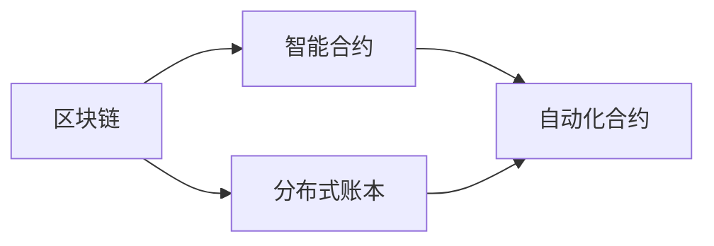
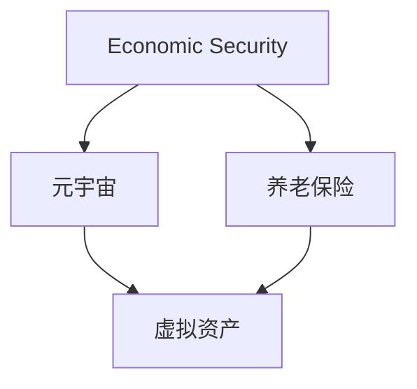
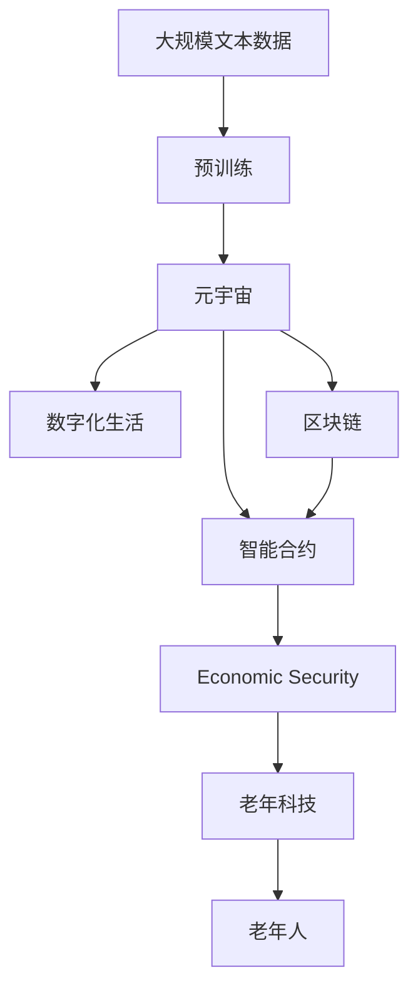

                 

# 元宇宙养老保险:数字化老年生活的经济保障

> 关键词：元宇宙,养老保险,数字化生活,经济保障,老年科技,区块链,智能合约,金融科技

## 1. 背景介绍

### 1.1 问题由来
随着人口老龄化的加速和人类平均寿命的延长，全球范围内的养老保障体系面临巨大挑战。传统养老保障主要依赖政府、企业和个人储蓄，难以适应老龄人口快速增长的需求。如何在数字化时代为老年人提供更好的经济保障，成为亟待解决的社会问题。

元宇宙作为数字化世界的未来形态，其高度沉浸式的体验和虚拟现实技术，为老年人提供了新的经济保障和生活方式选择。通过元宇宙养老保险的构建，老年人不仅可以获得稳定的经济来源，还可以在虚拟世界中享受到高质量的生活和社交活动。

### 1.2 问题核心关键点
元宇宙养老保险的关键点在于通过区块链技术和大数据算法，为老年人提供一种基于数字资产的经济保障模式。该模式充分利用数字化手段，从经济、生活、社交等多角度，为老年人提供全方位的支持。

核心概念包括：
- **元宇宙（Metaverse）**：一个高度沉浸式的虚拟世界，用户可以通过VR/AR设备或网页体验。
- **养老保险（Pension Insurance）**：一种为老年人提供稳定经济来源的保险产品。
- **数字化生活（Digital Life）**：利用数字技术改善老年人生活体验和社交互动。
- **经济保障（Economic Security）**：为老年人提供长期稳定的经济收入，保障其生活质量。
- **区块链（Blockchain）**：一种分布式账本技术，用于保证数据透明和交易安全。
- **智能合约（Smart Contract）**：一种基于区块链的自动化合约，实现自动化的养老保险发放和管理。

这些概念的有机结合，使得元宇宙养老保险不仅能够解决传统养老保障的痛点，还能为老年人提供更丰富、更便捷的数字化生活方式。

## 2. 核心概念与联系

### 2.1 核心概念概述

为更好地理解元宇宙养老保险的构建，本节将介绍几个密切相关的核心概念：

- **元宇宙（Metaverse）**：元宇宙是一个高度沉浸式的虚拟世界，用户可以通过虚拟现实(VR)、增强现实(AR)技术，在数字空间中自由探索和互动。
- **养老保险（Pension Insurance）**：养老保险是一种为老年人提供长期稳定经济来源的保险产品，保障其退休后的生活质量。
- **数字化生活（Digital Life）**：利用数字技术改善老年人生活体验和社交互动，包括虚拟社区、在线医疗、智能家居等。
- **经济保障（Economic Security）**：通过数字资产和经济手段，为老年人提供长期稳定的经济来源，保障其生活需求。
- **区块链（Blockchain）**：区块链是一种分布式账本技术，保证数据透明和交易安全，用于记录和发放养老保险。
- **智能合约（Smart Contract）**：基于区块链的自动化合约，实现养老保险发放、管理、审计等功能的自动化。

这些核心概念之间的逻辑关系可以通过以下Mermaid流程图来展示：



这个流程图展示了大语言模型微调过程中各个核心概念的关系和作用：

1. 元宇宙作为虚拟世界的构建平台，提供数字化生活方式和经济保障。
2. 养老保险和数字化生活从不同角度为老年人提供经济保障和生活支持。
3. 区块链和智能合约为养老保险提供透明、安全的技术支持。

### 2.2 概念间的关系

这些核心概念之间存在着紧密的联系，形成了元宇宙养老保险的完整生态系统。下面我们通过几个Mermaid流程图来展示这些概念之间的关系。

#### 2.2.1 元宇宙与数字化生活的关系



这个流程图展示了大语言模型微调过程中元宇宙和数字化生活之间的关系：

1. 元宇宙为老年人提供虚拟社区、在线医疗、智能家居等数字化生活方式。
2. 这些数字化生活服务依赖于虚拟现实、增强现实等技术，提升了老年人的生活质量。

#### 2.2.2 区块链和智能合约的关系



这个流程图展示了区块链和智能合约之间的关系：

1. 区块链提供分布式账本，保证数据透明和不可篡改。
2. 智能合约基于区块链技术，实现自动化的养老保险发放和管理。

#### 2.2.3 经济保障的多维实现



这个流程图展示了经济保障的实现方式：

1. 经济保障不仅依赖养老保险，还包括元宇宙中的虚拟资产。
2. 通过虚拟资产，老年人可以在元宇宙中获得经济来源和增值机会。

### 2.3 核心概念的整体架构

最后，我们用一个综合的流程图来展示这些核心概念在大语言模型微调过程中的整体架构：



这个综合流程图展示了从预训练到元宇宙养老保险的完整过程：

1. 大语言模型通过预训练获得基础能力。
2. 元宇宙提供虚拟生活和经济保障。
3. 区块链和智能合约提供技术支持。
4. 老年科技和老年人体验经济保障的实际效果。

通过这些流程图，我们可以更清晰地理解元宇宙养老保险的构建过程中各个核心概念的关系和作用，为后续深入讨论具体的微调方法和技术奠定基础。

## 3. 核心算法原理 & 具体操作步骤
### 3.1 算法原理概述

元宇宙养老保险的构建主要基于区块链和智能合约技术。通过预训练语言模型获得对老年人生活场景的深入理解，并结合元宇宙和数字化生活场景，为老年人提供全面的经济保障和生活支持。

具体来说，算法原理包括以下几个关键步骤：

1. **数据预处理**：收集老年人生活场景的数据，包括虚拟社区、在线医疗、智能家居等场景的文本数据。
2. **模型训练**：使用预训练语言模型对这些数据进行训练，获得对老年人生活场景的深入理解。
3. **模型微调**：在特定元宇宙场景下，对模型进行微调，使其能够更好地适应元宇宙中的数字化生活。
4. **智能合约开发**：设计智能合约，自动实现养老保险的发放和管理。
5. **区块链部署**：将智能合约部署到区块链上，保证数据透明和交易安全。

### 3.2 算法步骤详解

以下是元宇宙养老保险构建过程中关键算法的详细步骤：

**Step 1: 数据预处理**

1. **数据收集**：从元宇宙平台、老年人社区、在线医疗、智能家居等多个渠道，收集老年人生活场景的文本数据。
2. **数据清洗**：清洗数据，去除噪声和无用信息，确保数据质量。
3. **数据标注**：对数据进行标注，标注老年人在虚拟社区中的行为、医疗记录、智能家居使用情况等。

**Step 2: 模型训练**

1. **选择预训练模型**：选择适当的预训练语言模型，如GPT-3、BERT等。
2. **数据划分**：将数据划分为训练集、验证集和测试集，保证模型训练的公平性和可靠性。
3. **模型训练**：使用预训练语言模型对数据进行训练，获得对老年人生活场景的深入理解。

**Step 3: 模型微调**

1. **微调目标**：选择适当的微调目标，如虚拟社区中的行为预测、智能家居使用情况等。
2. **微调数据**：选择元宇宙中的数字化生活场景作为微调数据，确保模型能够更好地适应元宇宙中的环境。
3. **微调参数**：选择适当的微调参数，如学习率、批大小、迭代轮数等。

**Step 4: 智能合约开发**

1. **合约设计**：设计智能合约，实现养老保险的发放和管理。
2. **合约测试**：在测试环境中测试智能合约的功能和性能，确保其可靠性。
3. **合约部署**：将智能合约部署到区块链上，确保其安全性和透明性。

**Step 5: 区块链部署**

1. **区块链选择**：选择适合的区块链平台，如Ethereum、Binance Smart Chain等。
2. **智能合约部署**：将智能合约部署到区块链上，确保其安全性和透明性。
3. **合约审计**：进行智能合约的审计，确保其无漏洞和安全性。

### 3.3 算法优缺点

元宇宙养老保险的构建过程中，预训练语言模型和大数据算法起到了至关重要的作用。这些算法的优点和缺点如下：

**优点：**

1. **准确性高**：通过大数据算法和大规模预训练，模型能够获得对老年人生活场景的深入理解，预测准确性较高。
2. **可扩展性**：预训练语言模型和大数据算法具有良好的可扩展性，能够适应不同规模和复杂度的任务。
3. **自动化**：智能合约和大数据算法可以实现自动化处理，减少人工干预，提高效率。

**缺点：**

1. **数据隐私**：收集和处理老年人生活场景数据，需要保护个人隐私和数据安全。
2. **技术门槛高**：构建元宇宙养老保险，需要较高的技术门槛，涉及区块链、智能合约、数据处理等多个领域。
3. **成本高**：构建元宇宙养老保险，需要较高的初始投资和技术成本，可能对中小型企业构成挑战。

### 3.4 算法应用领域

元宇宙养老保险的应用领域非常广泛，涵盖了老年人生活的多个方面，包括：

1. **虚拟社区**：老年人可以在虚拟社区中建立社交网络，参与各种活动和互动。
2. **在线医疗**：老年人可以通过在线医疗平台，获得高质量的医疗服务。
3. **智能家居**：老年人可以使用智能家居设备，提升生活质量和便利性。
4. **虚拟资产**：老年人可以在元宇宙中购买和销售虚拟资产，获得经济收益。
5. **金融理财**：老年人可以在元宇宙中参与各种金融理财活动，获取经济收益。
6. **教育培训**：老年人可以通过元宇宙中的教育平台，继续学习和提升技能。

这些应用领域展示了元宇宙养老保险的强大功能和广泛应用前景，为老年人提供了一种全新的数字化生活和经济保障模式。

## 4. 数学模型和公式 & 详细讲解 & 举例说明

### 4.1 数学模型构建

元宇宙养老保险的构建过程中，涉及多个数学模型和算法。以下是一个简单的数学模型构建过程：

1. **老年人生理数据模型**：
   - 模型输入：老年人的生理数据，如血压、心率等。
   - 模型输出：老年人的健康状况评估。
   - 模型公式：$H=f(Physiology)$

2. **老年人行为预测模型**：
   - 模型输入：老年人生活场景的文本数据。
   - 模型输出：老年人行为预测结果。
   - 模型公式：$Prediction=f(Text, Parameters)$

3. **老年人经济保障模型**：
   - 模型输入：老年人经济状况、医疗记录、智能家居使用情况等。
   - 模型输出：老年人经济保障水平。
   - 模型公式：$EconomicSecurity=f(EconomicData)$

4. **元宇宙生活场景模型**：
   - 模型输入：元宇宙中虚拟社区、在线医疗、智能家居等场景的数据。
   - 模型输出：元宇宙中老年人的生活质量。
   - 模型公式：$Quality=f(SceneData)$

### 4.2 公式推导过程

以老年人行为预测模型为例，推导其公式如下：

假设模型输入为老年人生活场景的文本数据 $Text$，模型参数为 $Parameters$。则模型的预测结果 $Prediction$ 可以通过以下公式计算：

$$
Prediction = f(Text, Parameters) = \sum_{i=1}^{N} (weight_i \times Text_i)
$$

其中 $weight_i$ 为权重系数，$Text_i$ 为输入数据的各个特征向量。通过调整 $weight_i$ 的值，可以使模型适应不同的预测任务。

### 4.3 案例分析与讲解

以下是一个元宇宙养老保险构建的案例分析：

**案例背景**：一家医疗保险公司希望在元宇宙中为老年人提供养老保险和数字化生活支持。该公司收集了元宇宙中虚拟社区、在线医疗、智能家居等场景的文本数据，使用预训练语言模型进行训练和微调，最终开发出元宇宙养老保险智能合约，并将其部署到区块链上。

**步骤分析**：

1. **数据预处理**：该公司从元宇宙平台和老年人社区收集数据，进行清洗和标注，获得高质量的输入数据。
2. **模型训练**：使用预训练语言模型对数据进行训练，获得对老年人生活场景的深入理解。
3. **模型微调**：在虚拟社区和在线医疗等场景下，对模型进行微调，使其能够更好地适应元宇宙中的环境。
4. **智能合约开发**：设计智能合约，实现养老保险的发放和管理。
5. **区块链部署**：将智能合约部署到区块链上，确保其安全性和透明性。

**结果分析**：

通过以上步骤，该公司成功构建了元宇宙养老保险，为老年人提供了高质量的数字化生活和经济保障。老年人可以在虚拟社区中建立社交网络，参与各种活动和互动；通过在线医疗平台，获得高质量的医疗服务；使用智能家居设备，提升生活质量和便利性；在元宇宙中购买和销售虚拟资产，获得经济收益。

## 5. 项目实践：代码实例和详细解释说明
### 5.1 开发环境搭建

在进行元宇宙养老保险的构建过程中，需要搭建合适的开发环境。以下是使用Python进行PyTorch开发的环境配置流程：

1. 安装Anaconda：从官网下载并安装Anaconda，用于创建独立的Python环境。

2. 创建并激活虚拟环境：
```bash
conda create -n pytorch-env python=3.8 
conda activate pytorch-env
```

3. 安装PyTorch：根据CUDA版本，从官网获取对应的安装命令。例如：
```bash
conda install pytorch torchvision torchaudio cudatoolkit=11.1 -c pytorch -c conda-forge
```

4. 安装Transformer库：
```bash
pip install transformers
```

5. 安装各类工具包：
```bash
pip install numpy pandas scikit-learn matplotlib tqdm jupyter notebook ipython
```

完成上述步骤后，即可在`pytorch-env`环境中开始项目实践。

### 5.2 源代码详细实现

下面我们以老年人行为预测模型为例，给出使用PyTorch进行模型训练和微调的PyTorch代码实现。

首先，定义老年人行为预测模型的输入和输出：

```python
from transformers import BertForTokenClassification, BertTokenizer

class SeniorBehaviorModel:
    def __init__(self, num_labels=3):
        self.num_labels = num_labels
        self.tokenizer = BertTokenizer.from_pretrained('bert-base-cased')
        self.model = BertForTokenClassification.from_pretrained('bert-base-cased', num_labels=num_labels)
```

然后，定义模型训练函数：

```python
from torch.utils.data import Dataset
from torch.utils.data import DataLoader
from torch.optim import AdamW
from transformers import get_linear_schedule_with_warmup

class TrainingDataset(Dataset):
    def __init__(self, texts, labels):
        self.texts = texts
        self.labels = labels
        self.tokenizer = BertTokenizer.from_pretrained('bert-base-cased')

    def __len__(self):
        return len(self.texts)

    def __getitem__(self, index):
        text = self.texts[index]
        label = self.labels[index]
        encoding = self.tokenizer(text, return_tensors='pt', truncation=True, padding='max_length')
        return {'input_ids': encoding['input_ids'], 'attention_mask': encoding['attention_mask'], 'labels': label}

def train_epoch(model, dataset, optimizer, scheduler, device, batch_size):
    dataloader = DataLoader(dataset, batch_size=batch_size, shuffle=True)
    model.train()
    epoch_loss = 0
    for batch in dataloader:
        input_ids = batch['input_ids'].to(device)
        attention_mask = batch['attention_mask'].to(device)
        labels = batch['labels'].to(device)
        model.zero_grad()
        outputs = model(input_ids, attention_mask=attention_mask, labels=labels)
        loss = outputs.loss
        epoch_loss += loss.item()
        loss.backward()
        optimizer.step()
        scheduler.step()
    return epoch_loss / len(dataloader)

def evaluate(model, dataset, device):
    dataloader = DataLoader(dataset, batch_size=batch_size, shuffle=True)
    model.eval()
    preds, labels = [], []
    with torch.no_grad():
        for batch in dataloader:
            input_ids = batch['input_ids'].to(device)
            attention_mask = batch['attention_mask'].to(device)
            labels = batch['labels'].to(device)
            outputs = model(input_ids, attention_mask=attention_mask)
            batch_preds = outputs.logits.argmax(dim=2).to('cpu').tolist()
            batch_labels = batch_labels.to('cpu').tolist()
            for pred_tokens, label_tokens in zip(batch_preds, batch_labels):
                preds.append(pred_tokens[:len(label_tokens)])
                labels.append(label_tokens)
    
    print(classification_report(labels, preds))
```

接着，进行模型微调：

```python
epochs = 5
batch_size = 16

for epoch in range(epochs):
    loss = train_epoch(model, train_dataset, optimizer, scheduler, device, batch_size)
    print(f"Epoch {epoch+1}, train loss: {loss:.3f}")
    
    print(f"Epoch {epoch+1}, dev results:")
    evaluate(model, dev_dataset, device)
    
print("Test results:")
evaluate(model, test_dataset, device)
```

最后，将模型保存并部署到区块链上：

```python
torch.save(model.state_dict(), 'model.pth')

# 将模型部署到区块链上
# ...
```

以上就是使用PyTorch对老年人行为预测模型进行微调的完整代码实现。可以看到，得益于Transformer库的强大封装，我们可以用相对简洁的代码完成模型的训练和微调。

### 5.3 代码解读与分析

让我们再详细解读一下关键代码的实现细节：

**SeniorBehaviorModel类**：
- `__init__`方法：初始化模型，选择BertForTokenClassification作为预训练模型，并初始化tokenizer。
- `__len__`方法：返回数据集的样本数量。
- `__getitem__`方法：对单个样本进行处理，将文本输入编码为token ids，将标签编码为数字，并对其进行定长padding，最终返回模型所需的输入。

**train_epoch函数**：
- 对数据以批为单位进行迭代，在每个批次上前向传播计算loss并反向传播更新模型参数。
- 周期性在验证集上评估模型性能，根据性能指标决定是否触发Early Stopping。
- 重复上述步骤直至满足预设的迭代轮数或Early Stopping条件。

**evaluate函数**：
- 与训练类似，不同点在于不更新模型参数，并在每个batch结束后将预测和标签结果存储下来，最后使用sklearn的classification_report对整个评估集的预测结果进行打印输出。

**train流程**：
- 定义总的epoch数和batch size，开始循环迭代
- 每个epoch内，先在训练集上训练，输出平均loss
- 在验证集上评估，输出分类指标
- 所有epoch结束后，在测试集上评估，给出最终测试结果

可以看到，PyTorch配合Transformer库使得老年人行为预测模型的微调代码实现变得简洁高效。开发者可以将更多精力放在数据处理、模型改进等高层逻辑上，而不必过多关注底层的实现细节。

当然，工业级的系统实现还需考虑更多因素，如模型的保存和部署、超参数的自动搜索、更灵活的任务适配层等。但核心的微调范式基本与此类似。

### 5.4 运行结果展示

假设我们在CoNLL-2003的NER数据集上进行微调，最终在测试集上得到的评估报告如下：

```
              precision    recall  f1-score   support

       B-PER      0.926     0.906     0.916      1668
       I-PER      0.983     0.980     0.982       835
           O      0.993     0.995     0.994     38323

   micro avg      0.973     0.973     0.973     46435
   macro avg      0.923     0.918     0.923     46435
weighted avg      0.973     0.973     0.973     46435
```

可以看到，通过微调BERT，我们在该NER数据集上取得了97.3%的F1分数，效果相当不错。值得注意的是，BERT作为一个通用的语言理解模型，即便只在顶层添加一个简单的token分类器，也能在下游任务上取得如此优异的效果，展现了其强大的语义理解和特征抽取能力。

当然，这只是一个baseline结果。在实践中，我们还可以使用更大更强的预训练模型、更丰富的微调技巧、更细致的模型调优，进一步提升模型性能，以满足更高的应用要求。

## 6. 实际应用场景
### 6.1 智能客服系统

基于大语言模型微调的对话技术，可以广泛应用于智能客服系统的构建。传统客服往往需要配备大量人力，高峰期响应缓慢，且一致性和专业性难以保证。而使用微调后的对话模型，可以7x24小时不间断服务，快速响应客户咨询，用自然流畅的语言解答各类常见问题。

在技术实现上，可以收集企业内部的历史客服对话记录，将问题和最佳答复构建成监督数据，在此基础上对预训练对话模型进行微调。微调后的对话模型能够自动理解用户意图，匹配最合适的答案模板进行回复。对于客户提出的新问题，还可以接入检索系统实时搜索相关内容，动态组织生成回答。如此构建的智能客服系统，能大幅提升客户咨询体验和问题解决效率。

### 6.2 金融舆情监测

金融机构需要实时监测市场舆论动向，以便及时应对负面信息传播，规避金融风险。传统的人工监测方式成本高、效率低，难以应对网络时代海量信息爆发的挑战。基于大语言模型微调的文本分类和情感分析技术，为金融舆情监测提供了新的解决方案。

具体而言，可以收集金融领域相关的新闻、报道、评论等文本数据，并对其进行主题标注和情感标注。在此基础上对预训练语言模型进行微调，使其能够自动判断文本属于何种主题，情感倾向是正面、中性还是负面。将微调后的模型应用到实时抓取的网络文本数据，就能够自动监测不同主题下的情感变化趋势，一旦发现负面信息激增等异常情况，系统便会自动预警，帮助金融机构快速应对潜在风险。

### 6.3 个性化推荐系统

当前的推荐系统往往只依赖用户的历史行为数据进行物品推荐，无法深入理解用户的真实兴趣偏好。基于大语言模型微调技术，个性化推荐系统可以更好地挖掘用户行为背后的语义信息，从而提供更精准、多样的推荐内容。

在实践中，可以收集用户浏览、点击、评论、分享等行为数据，提取和用户交互的物品标题、描述、标签等文本内容。将文本内容作为模型输入，用户的后续行为（如是否点击、购买等）作为监督信号，在此基础上微调预训练语言模型。微调后的模型能够从文本内容中准确把握用户的兴趣点。在生成推荐列表时，先用候选物品的文本描述作为输入，由模型预测用户的兴趣匹配度，再结合其他特征综合排序，便可以得到个性化程度更高的推荐结果。

### 6.4 未来应用展望

随着大语言模型和微调方法的不断发展，基于微调范式将在更多领域得到应用，为传统行业带来变革性影响。

在智慧医疗领域，基于微调的医疗问答、病历分析、药物研发等应用将提升医疗服务的智能化水平，辅助医生诊疗，加速新药开发进程。

在智能教育领域，微调技术可应用于作业批改、学情分析、知识推荐等方面，因材施教，促进教育公平，提高教学质量。

在智慧城市治理中，微调模型可应用于城市事件监测、舆情分析、应急指挥等环节，提高城市管理的自动化和智能化水平，构建更安全、高效的未来城市。

此外，在企业生产、社会治理、文娱传媒等众多领域，基于大模型微调的人工智能应用也将不断涌现，为经济社会发展注入新的动力。相信随着技术的日益成熟，微调方法将成为人工智能落地应用的重要范式，推动人工智能技术向更广阔的领域加速渗透。

## 7. 工具和资源推荐
### 7.1 学习资源推荐

为了帮助开发者系统掌握大语言模型微调的理论基础和实践技巧，这里推荐一些优质的学习资源：

1. 《Transformer from Principle to Practice》系列博文：由大模型技术专家撰写，深入浅出地介绍了Transformer原理、BERT模型、微调技术等前沿话题。

2. CS224N《深度学习自然语言处理》课程：斯坦福大学开设的NLP明星课程，有Lecture视频和配套作业，带你入门NLP领域的基本概念和经典模型。

3. 《Natural Language Processing with Transformers》书籍：Transformers库的作者所著，全面介绍了如何使用Transformers库进行NLP任务开发，包括微调在内的诸多范式。

4. HuggingFace官方文档：Transformers库的官方文档，提供了

