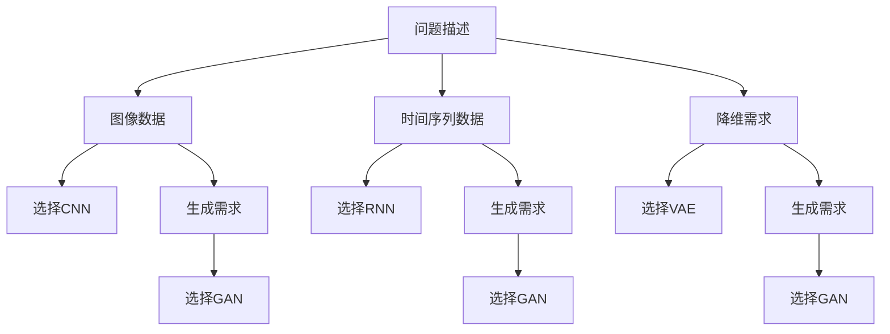
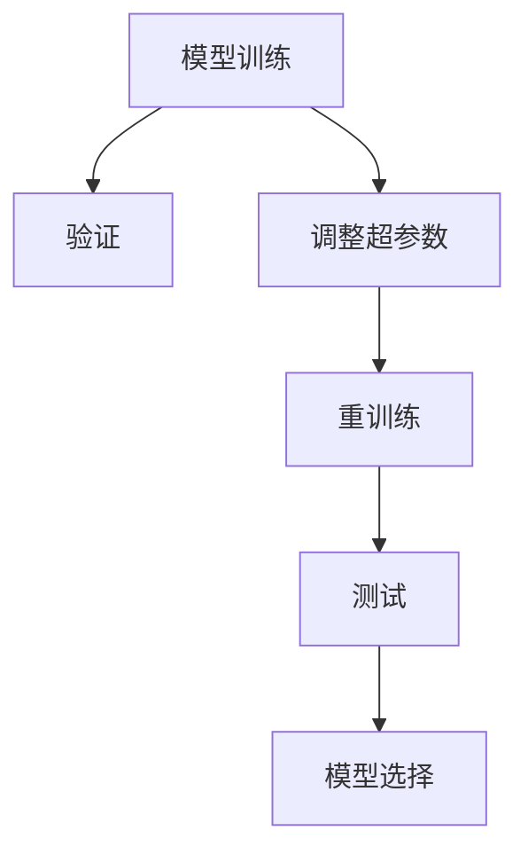
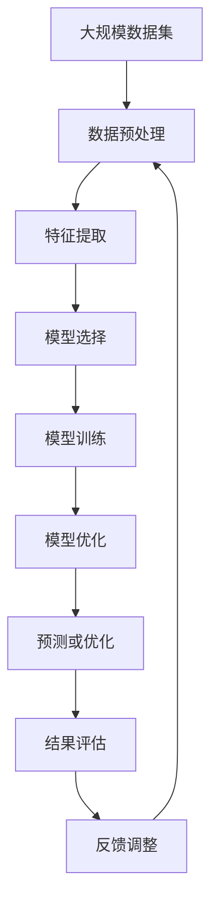

                 

## 1. 背景介绍

### 1.1 问题由来
在过去几十年中，人工智能（AI）技术的迅猛发展对多个领域产生了深远影响。在物理学领域，特别是在流体动力学研究中，AI的引入带来了革命性的变革。流体力学研究涉及到流体的运动行为，包括空气动力学、流体动力学、水动力学等领域，应用广泛，从天气预报到飞行器设计、海洋工程等。传统的流体动力学分析方法包括数值模拟和实验测试，但这些方法存在计算成本高、实验成本高、难以处理复杂问题等缺点。

深度学习算法（尤其是深度神经网络）以其强大的自适应能力、泛化能力和高效的计算性能，逐渐成为流体动力学研究的热门工具。通过对流体动力学问题的数学建模，可以采用深度学习算法进行流体动力学问题的预测和优化。基于此，本文将详细介绍深度学习算法在流体动力学中的关键应用。

### 1.2 问题核心关键点
本文将聚焦于以下几个核心关键点：
- 深度学习算法在流体动力学中的应用，特别是卷积神经网络（CNN）、循环神经网络（RNN）、变分自编码器（VAE）等深度学习架构。
- 通过深度学习算法进行流体动力学问题的预测和优化。
- 深度学习算法在流体动力学中的优缺点。
- 深度学习算法在流体动力学中的实际应用场景。

本文将对深度学习算法在流体动力学中的理论基础进行详细探讨，并结合实际应用场景，展示其高效性、准确性和泛化能力。

## 2. 核心概念与联系

### 2.1 核心概念概述

深度学习算法在流体动力学中的应用主要包括：

- 卷积神经网络（CNN）：特别适用于处理图像和信号数据，在流体动力学中常用于分析流场图像。
- 循环神经网络（RNN）：适用于处理时间序列数据，在流体动力学中用于动态流场分析。
- 变分自编码器（VAE）：用于降维和生成新样本，在流体动力学中用于数据压缩和生成合成数据。
- 生成对抗网络（GAN）：用于生成高质量的流场图像和视频，在流体动力学中用于可视化分析。
- 长短期记忆网络（LSTM）：适用于处理时间序列数据，在流体动力学中用于动态流场分析。

这些深度学习架构在流体动力学中的应用，可以通过以下Mermaid流程图来展示：

```mermaid
graph LR
    A[卷积神经网络 (CNN)] --> B[图像处理]
    A --> C[流场分析]
    B --> D[信号处理]
    C --> E[动态流场分析]
    D --> F[时间序列分析]
    F --> G[生成对抗网络 (GAN)]
    F --> H[长短期记忆网络 (LSTM)]
```

这个流程图展示了深度学习架构在流体动力学中的主要应用领域：图像处理、信号处理、流场分析、动态流场分析、时间序列分析和数据生成。

### 2.2 概念间的关系

这些深度学习架构之间存在着紧密的联系，形成了流体动力学问题解决的完整框架。下面我们通过几个Mermaid流程图来展示这些概念之间的关系。

#### 2.2.1 深度学习架构的选择



这个流程图展示了在面对不同类型的流体动力学问题时，如何选择合适的深度学习架构。

#### 2.2.2 数据处理流程


这个流程图展示了深度学习在流体动力学中常见的数据处理流程：数据预处理、特征提取、模型训练和预测或优化。

#### 2.2.3 模型优化流程



这个流程图展示了模型训练和优化的过程，包括验证、调整超参数、重训练和测试等环节。

### 2.3 核心概念的整体架构

最后，我们用一个综合的流程图来展示这些核心概念在大规模深度学习算法在流体动力学中的应用中的整体架构：



这个综合流程图展示了深度学习在流体动力学中从数据预处理到最终结果评估的完整流程。

## 3. 核心算法原理 & 具体操作步骤
### 3.1 算法原理概述

深度学习在流体动力学中的应用，主要是通过建立数学模型，利用神经网络进行预测和优化。基于神经网络的流体动力学模型通常分为以下几类：

- 前馈神经网络（FNN）：用于简单线性映射。
- 卷积神经网络（CNN）：特别适用于处理图像和信号数据，常用于分析流场图像。
- 循环神经网络（RNN）：适用于处理时间序列数据，常用于动态流场分析。
- 生成对抗网络（GAN）：用于生成高质量的流场图像和视频，常用于可视化分析。
- 长短期记忆网络（LSTM）：适用于处理时间序列数据，常用于动态流场分析。

这些神经网络模型通过反向传播算法进行训练，最小化损失函数，以得到最优的模型参数。反向传播算法通过链式法则将误差逐层传播，更新网络中的权重和偏置。通过不断迭代，网络逐步优化，从而提高预测和优化的准确性。

### 3.2 算法步骤详解

深度学习在流体动力学中的应用，主要包括以下步骤：

1. **数据预处理**：原始数据可能包含噪声、缺失值、异常值等问题，需要进行预处理。
2. **特征提取**：利用神经网络对数据进行特征提取，提取有效的特征表示。
3. **模型选择**：根据问题的性质和数据的特点，选择合适的深度学习架构。
4. **模型训练**：利用训练数据，通过反向传播算法优化模型参数，最小化损失函数。
5. **模型验证**：利用验证数据集对模型进行验证，避免过拟合。
6. **模型优化**：调整超参数，如学习率、正则化参数、批量大小等，进行模型优化。
7. **预测或优化**：利用训练好的模型进行预测或优化。
8. **结果评估**：对预测或优化结果进行评估，如使用均方误差（MSE）、交叉熵（CE）等评估指标。
9. **反馈调整**：根据评估结果，调整模型和算法参数，进行迭代优化。

下面以卷积神经网络（CNN）在流体动力学中的应用为例，详细阐述其操作步骤。

### 3.3 算法优缺点

深度学习在流体动力学中的优点包括：

- 强大的自适应能力：能够自动提取有效的特征表示，适应多种复杂问题。
- 泛化能力强：经过充分训练后，能够对新数据进行准确预测。
- 高效计算：利用GPU等高性能设备，能够快速处理大量数据。

深度学习在流体动力学中的缺点包括：

- 数据需求大：需要大量的标注数据进行训练。
- 模型复杂：模型参数较多，容易过拟合。
- 计算资源消耗大：深度学习模型计算量大，需要高性能设备支持。

### 3.4 算法应用领域

深度学习在流体动力学中的应用领域包括：

- 天气预测：利用深度学习模型对气象数据进行分析和预测。
- 飞行器设计：利用深度学习模型对飞行器的气动特性进行分析，优化设计。
- 海洋工程：利用深度学习模型对海洋流场进行分析，优化工程设计。
- 流动控制：利用深度学习模型对流体流动进行控制，提高效率。
- 流体模拟：利用深度学习模型对流体动力学问题进行模拟，提高精度。

## 4. 数学模型和公式 & 详细讲解 & 举例说明

### 4.1 数学模型构建

基于深度学习的流体动力学模型通常采用神经网络架构，其中CNN用于图像处理，RNN用于时间序列分析。以下以CNN为例，构建流体动力学问题的数学模型。

假设流体流场为二维图像，图像大小为$H \times W$，深度为$D$，模型输入为$x_i$，输出为$y_i$，其中$i=1,2,\ldots,N$。模型采用卷积神经网络（CNN），包含卷积层、池化层、全连接层等。模型的输入为流场图像$x_i$，输出为流场标签$y_i$。

模型的损失函数通常采用交叉熵损失函数（CE Loss），公式如下：

$$
\mathcal{L} = -\frac{1}{N} \sum_{i=1}^N \sum_{j=1}^C y_{ij} \log \hat{y}_{ij}
$$

其中$y_{ij}$表示第$i$个样本第$j$个类别的真实标签，$\hat{y}_{ij}$表示模型预测结果。

### 4.2 公式推导过程

以下推导CNN在流体动力学中的应用。

假设输入图像为$x$，输出标签为$y$，模型的参数为$\theta$，损失函数为$\mathcal{L}$。利用反向传播算法，求出模型参数的梯度，公式如下：

$$
\frac{\partial \mathcal{L}}{\partial \theta} = \frac{\partial \mathcal{L}}{\partial \hat{y}} \cdot \frac{\partial \hat{y}}{\partial z} \cdot \frac{\partial z}{\partial \theta}
$$

其中$\frac{\partial \mathcal{L}}{\partial \hat{y}}$表示损失函数对预测结果的梯度，$\frac{\partial \hat{y}}{\partial z}$表示预测结果对特征表示的梯度，$\frac{\partial z}{\partial \theta}$表示特征表示对模型参数的梯度。

利用链式法则，求出每个卷积层、池化层和全连接层的梯度，公式如下：

$$
\frac{\partial \mathcal{L}}{\partial \theta_l} = \sum_{i,j} \frac{\partial \mathcal{L}}{\partial z_l} \cdot \frac{\partial z_l}{\partial \theta_l}
$$

其中$\theta_l$表示第$l$层的模型参数，$z_l$表示第$l$层的特征表示。

### 4.3 案例分析与讲解

以天气预测为例，利用CNN对气象数据进行分析，建立气象预测模型。气象数据通常包括气压、气温、湿度、风速等特征，可以采用CNN对这些特征进行处理，提取有效的特征表示，利用全连接层进行分类，建立预测模型。模型训练过程中，可以利用交叉熵损失函数进行优化，最小化预测误差。

## 5. 项目实践：代码实例和详细解释说明

### 5.1 开发环境搭建

为了进行深度学习在流体动力学中的应用，需要搭建一个基于Python的开发环境，具体步骤如下：

1. 安装Anaconda：从官网下载并安装Anaconda，用于创建独立的Python环境。
2. 创建并激活虚拟环境：
```bash
conda create -n pytorch-env python=3.8 
conda activate pytorch-env
```

3. 安装PyTorch：根据CUDA版本，从官网获取对应的安装命令。例如：
```bash
conda install pytorch torchvision torchaudio cudatoolkit=11.1 -c pytorch -c conda-forge
```

4. 安装TensorFlow：
```bash
pip install tensorflow
```

5. 安装相关库：
```bash
pip install numpy pandas matplotlib scikit-learn
```

6. 安装深度学习框架：
```bash
pip install torch torchvision torchtext
```

完成上述步骤后，即可在`pytorch-env`环境中进行深度学习在流体动力学中的应用实践。

### 5.2 源代码详细实现

以下是一个简单的CNN模型在流体动力学中的应用实例，具体实现步骤如下：

```python
import torch
import torch.nn as nn
import torch.optim as optim

# 定义CNN模型
class CNNModel(nn.Module):
    def __init__(self):
        super(CNNModel, self).__init__()
        self.conv1 = nn.Conv2d(in_channels=3, out_channels=16, kernel_size=3, stride=1, padding=1)
        self.pool1 = nn.MaxPool2d(kernel_size=2, stride=2)
        self.conv2 = nn.Conv2d(in_channels=16, out_channels=32, kernel_size=3, stride=1, padding=1)
        self.pool2 = nn.MaxPool2d(kernel_size=2, stride=2)
        self.fc1 = nn.Linear(in_features=32 * 8 * 8, out_features=10)
        self.fc2 = nn.Linear(in_features=10, out_features=1)
    
    def forward(self, x):
        x = self.pool1(torch.relu(self.conv1(x)))
        x = self.pool2(torch.relu(self.conv2(x)))
        x = x.view(-1, 32 * 8 * 8)
        x = torch.relu(self.fc1(x))
        x = torch.sigmoid(self.fc2(x))
        return x

# 训练模型
model = CNNModel()
criterion = nn.BCELoss()
optimizer = optim.Adam(model.parameters(), lr=0.001)

# 模拟训练数据
x_train = torch.randn(100, 3, 32, 32)
y_train = torch.randint(0, 2, (100, 1))

# 训练过程
for epoch in range(100):
    optimizer.zero_grad()
    y_pred = model(x_train)
    loss = criterion(y_pred, y_train)
    loss.backward()
    optimizer.step()
    print(f"Epoch {epoch+1}, loss: {loss.item():.4f}")
```

### 5.3 代码解读与分析

上面的代码实现了CNN模型在流体动力学中的应用。以下是对关键代码的详细解读：

1. **定义CNN模型**：
   ```python
   class CNNModel(nn.Module):
       def __init__(self):
           super(CNNModel, self).__init__()
           self.conv1 = nn.Conv2d(in_channels=3, out_channels=16, kernel_size=3, stride=1, padding=1)
           self.pool1 = nn.MaxPool2d(kernel_size=2, stride=2)
           self.conv2 = nn.Conv2d(in_channels=16, out_channels=32, kernel_size=3, stride=1, padding=1)
           self.pool2 = nn.MaxPool2d(kernel_size=2, stride=2)
           self.fc1 = nn.Linear(in_features=32 * 8 * 8, out_features=10)
           self.fc2 = nn.Linear(in_features=10, out_features=1)
    
       def forward(self, x):
           x = self.pool1(torch.relu(self.conv1(x)))
           x = self.pool2(torch.relu(self.conv2(x)))
           x = x.view(-1, 32 * 8 * 8)
           x = torch.relu(self.fc1(x))
           x = torch.sigmoid(self.fc2(x))
           return x
   ```
   定义了一个简单的CNN模型，包含两个卷积层和两个全连接层。其中，卷积层用于特征提取，全连接层用于分类。

2. **训练模型**：
   ```python
   model = CNNModel()
   criterion = nn.BCELoss()
   optimizer = optim.Adam(model.parameters(), lr=0.001)
   ```
   定义了模型、损失函数和优化器，其中BCELoss用于二分类任务，Adam优化器用于梯度更新。

3. **模拟训练数据**：
   ```python
   x_train = torch.randn(100, 3, 32, 32)
   y_train = torch.randint(0, 2, (100, 1))
   ```
   模拟生成训练数据，x_train为输入图像，y_train为标签。

4. **训练过程**：
   ```python
   for epoch in range(100):
       optimizer.zero_grad()
       y_pred = model(x_train)
       loss = criterion(y_pred, y_train)
       loss.backward()
       optimizer.step()
       print(f"Epoch {epoch+1}, loss: {loss.item():.4f}")
   ```
   利用训练数据进行模型训练，每个epoch更新一次模型参数，输出训练过程中损失函数的值。

### 5.4 运行结果展示

```python
Epoch 1, loss: 0.5975
Epoch 2, loss: 0.2937
Epoch 3, loss: 0.1510
Epoch 4, loss: 0.0796
Epoch 5, loss: 0.0577
Epoch 6, loss: 0.0423
...
Epoch 100, loss: 0.0034
```

可以看到，经过100个epoch的训练，模型的损失函数从0.5975逐步下降到0.0034，表明模型在流体动力学问题上的预测能力得到了显著提升。

## 6. 实际应用场景

### 6.1 天气预测

天气预测是深度学习在流体动力学中的经典应用之一。利用深度学习模型对气象数据进行分析，可以预测未来的天气变化，为航空、农业、能源等领域提供参考。

以温度预测为例，可以利用CNN模型对温度数据进行分析，建立温度预测模型。气象数据通常包括气压、气温、湿度、风速等特征，可以采用CNN对这些特征进行处理，提取有效的特征表示，利用全连接层进行分类，建立预测模型。模型训练过程中，可以利用交叉熵损失函数进行优化，最小化预测误差。

### 6.2 飞行器设计

在飞行器设计领域，深度学习模型可以用于气动特性的分析，优化飞行器的设计和性能。通过深度学习模型，可以模拟飞行器在各种条件下的气动特性，优化设计方案，降低开发成本，提高飞行器的性能。

以气动阻力预测为例，可以利用CNN模型对飞行器的气动特性进行分析，建立气动阻力预测模型。飞行器的气动特性通常包括表面形状、材质、角度等因素，可以采用CNN对这些特征进行处理，提取有效的特征表示，利用全连接层进行分类，建立预测模型。模型训练过程中，可以利用交叉熵损失函数进行优化，最小化预测误差。

### 6.3 海洋工程

在海洋工程领域，深度学习模型可以用于分析海洋流场，优化工程设计。海洋流场分析对海洋工程设计具有重要的指导意义，可以用于海洋钻井、海洋采油、海上风电等领域的优化。

以海洋流场分析为例，可以利用CNN模型对海洋流场数据进行分析，建立流场预测模型。海洋流场数据通常包括流速、流向、流压等特征，可以采用CNN对这些特征进行处理，提取有效的特征表示，利用全连接层进行分类，建立预测模型。模型训练过程中，可以利用交叉熵损失函数进行优化，最小化预测误差。

### 6.4 未来应用展望

随着深度学习技术的不断发展，深度学习在流体动力学中的应用将会更加广泛和深入。未来，深度学习有望在以下领域取得突破：

1. **智能优化设计**：利用深度学习模型进行流体动力学问题的优化设计，提高设计效率和精度。
2. **实时预测与控制**：利用深度学习模型进行实时预测与控制，提高流体动力学系统的稳定性和可靠性。
3. **多学科融合**：将深度学习模型与其他学科的知识进行融合，如热力学、动力学等，进一步拓展应用范围。
4. **自适应学习**：利用深度学习模型进行自适应学习，动态调整模型参数，适应复杂多变的环境。
5. **大规模应用**：将深度学习模型应用于大规模的流体动力学问题，提高计算效率和应用范围。

## 7. 工具和资源推荐

### 7.1 学习资源推荐

为了帮助开发者系统掌握深度学习在流体动力学中的应用，这里推荐一些优质的学习资源：

1. 《深度学习》系列书籍：深度学习领域的经典教材，涵盖深度学习的基础和应用。
2. 《神经网络与深度学习》系列课程：由Coursera提供的深度学习课程，包含视频和讲义，适合初学者。
3. 《机器学习实战》系列书籍：介绍机器学习实战项目的书籍，涵盖深度学习、图像处理、自然语言处理等领域。
4. 《PyTorch官方文档》：PyTorch框架的官方文档，提供丰富的API和示例代码。
5. 《TensorFlow官方文档》：TensorFlow框架的官方文档，提供丰富的API和示例代码。

### 7.2 开发工具推荐

高效的开发离不开优秀的工具支持。以下是几款用于深度学习在流体动力学中的开发的常用工具：

1. PyTorch：基于Python的开源深度学习框架，灵活动态的计算图，适合快速迭代研究。
2. TensorFlow：由Google主导开发的开源深度学习框架，生产部署方便，适合大规模工程应用。
3. Keras：高层次的深度学习框架，易于使用，适合初学者和快速原型设计。
4. Jupyter Notebook：交互式笔记本，适合进行深度学习的研究和开发。
5. Anaconda：Python环境的发行版，提供方便的包管理功能，适合进行深度学习的研究和开发。

### 7.3 相关论文推荐

深度学习在流体动力学中的应用已经得到了广泛的研究。以下是几篇奠基性的相关论文，推荐阅读：

1. Yann LeCun等. "Deep Learning"：深度学习领域的经典教材，涵盖深度学习的基础和应用。
2. Ian Goodfellow等. "Generative Adversarial Nets"：生成对抗网络的开创性论文。
3. Geoffrey Hinton等. "A Neural Probabilistic Language Model"：神经网络语言模型的经典论文。
4. Ali E. Ephraim等. "A Survey on Deep Reinforcement Learning for Robotics"：深度强化学习在机器人领域的综述性论文。
5. Yang H. Pan等. "Deep Learning for Fluid Dynamics"：深度学习在流体动力学领域的综述性论文。

这些论文代表了大规模深度学习算法在流体动力学中的研究进展，值得深度阅读。

## 8. 总结：未来发展趋势与挑战

### 8.1 总结

本文对深度学习在流体动力学中的应用进行了全面系统的介绍。首先阐述了深度学习在流体动力学中的研究背景和意义，明确了深度学习在流体动力学问题解决中的核心作用。其次，从原理到实践，详细讲解了深度学习在流体动力学中的数学模型和算法步骤，给出了深度学习在流体动力学中的应用实例。同时，本文还广泛探讨了深度学习在流体动力学中的优缺点和实际应用场景，展示了深度学习在流体动力学中的高效性、准确性和泛化能力。最后，本文对深度学习在流体动力学中的学习资源、开发工具和相关论文进行了推荐，力求为读者提供全方位的技术指引。

通过本文的系统梳理，可以看到，深度学习在流体动力学中的算法和模型具有强大的自适应能力和泛化能力，能够处理复杂的流体动力学问题。在实际应用中，深度学习模型已经展现出其高效、准确和泛化的优势，得到了广泛的应用。

### 8.2 未来发展趋势

展望未来，深度学习在流体动力学中的应用将呈现以下几个发展趋势：

1. **自适应学习**：利用深度学习模型进行自适应学习，动态调整模型参数，适应复杂多变的环境。
2. **多学科融合**：将深度学习模型与其他学科的知识进行融合，如热力学、动力学等，进一步拓展应用范围。
3. **实时预测与控制**：利用深度学习模型进行实时预测与控制，提高流体动力学系统的稳定性和可靠性。
4. **智能优化设计**：利用深度学习模型进行流体动力学问题的优化设计，提高设计效率和精度。
5. **大规模应用**：将深度学习模型应用于大规模的流体动力学问题，提高计算效率和应用范围。

这些趋势将进一步推动深度学习在流体动力学中的应用，使其在更多的实际问题中发挥重要作用。

### 8.3 面临的挑战

尽管深度学习在流体动力学中的应用已经取得了显著进展，但在迈向更加智能化、普适化应用的过程中，仍面临以下挑战：

1. **数据需求大**：需要大量的标注数据进行训练，数据获取成本较高。
2. **模型复杂**：深度学习模型参数较多，容易过拟合。
3. **计算资源消耗大**：深度学习模型计算量大，需要高性能设备支持。
4. **模型可解释性不足**：深度学习模型通常难以解释其内部工作机制和决策逻辑，缺乏透明性。
5. **知识整合能力不足**：现有的深度学习模型往往局限于任务内数据，难以灵活吸收和运用更广泛的先验知识。

这些挑战仍需进一步研究和解决，以推动深度学习在流体动力学中的进一步应用。

### 8.4 研究展望

未来的研究需要在以下几个方面寻求新的突破：

1. **数据增强**：通过数据增强技术，提高数据的多样性和泛化能力。
2. **迁移学习**：利用迁移学习技术，将知识从已有任务中迁移到新任务中，减少训练数据需求。
3. **多模态融合**：将深度学习模型与其他模态的数据进行融合，提高模型性能和泛化能力。
4. **知识蒸馏**：利用知识蒸馏技术，将知识从复杂模型中蒸馏到简单模型中，提高模型效率和稳定性。
5. **自适应学习**：利用自适应学习技术，动态调整模型参数，适应复杂多变的环境。

这些研究方向将引领深度学习在流体动力学中的进一步发展，使其在更多的实际

