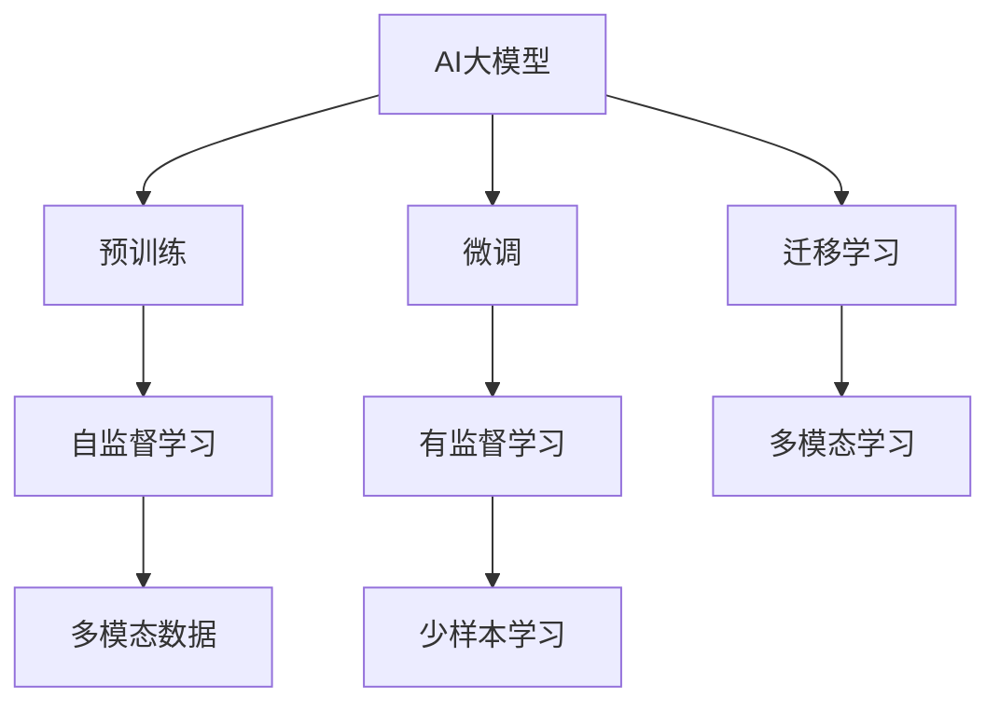
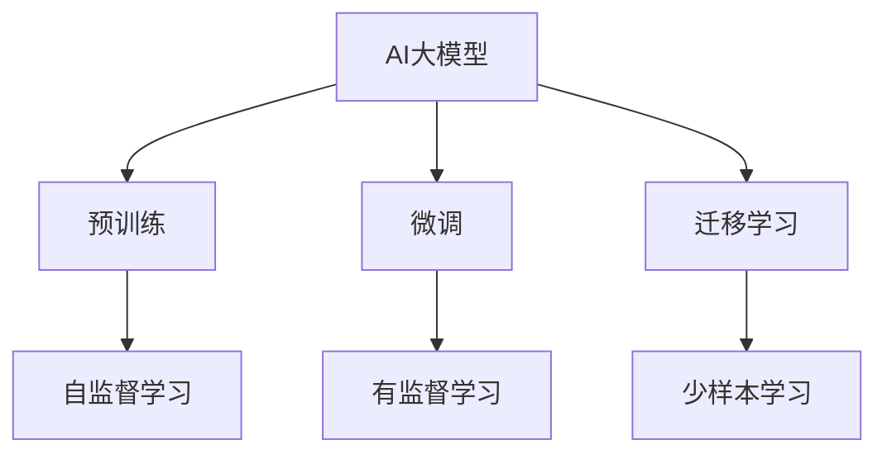
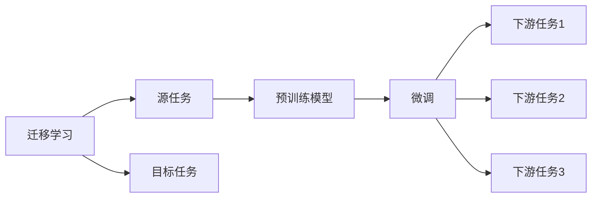
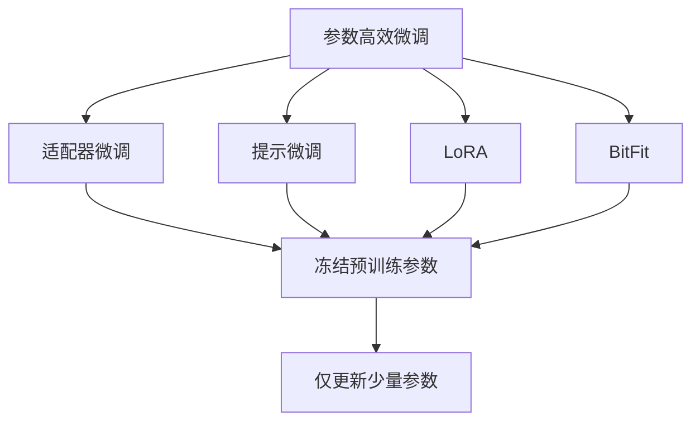
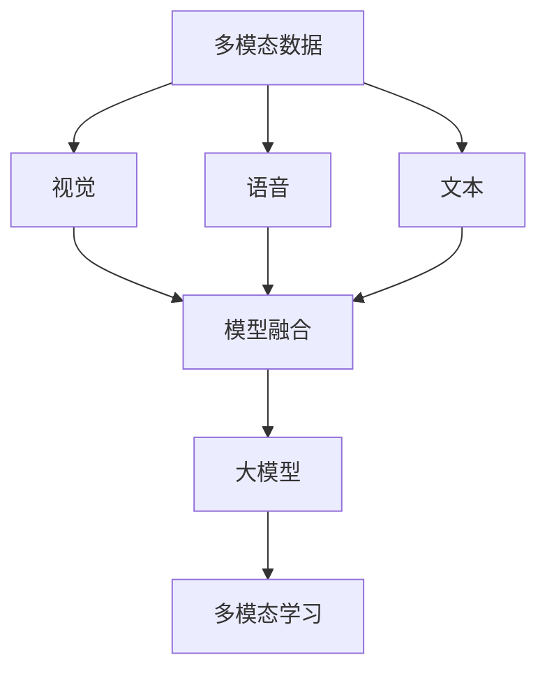
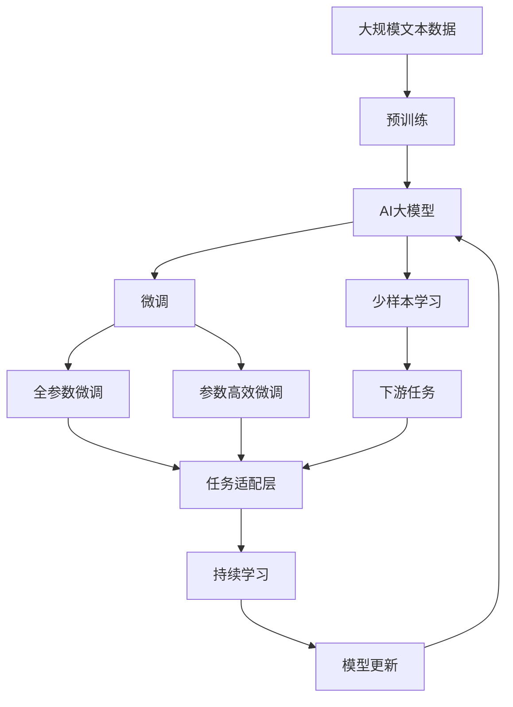

                 

# AI大模型创业：如何应对未来价格战？

> 关键词：AI大模型,创业,价格战,市场策略,数据策略,技术策略

## 1. 背景介绍

### 1.1 问题由来

在人工智能（AI）领域，大模型的发展迅猛，从GPT-3到GPT-4，再到ChatGPT，每一次模型能力的突破都引发了市场的高度关注。这些大模型因其强大的语言生成能力和泛化能力，被广泛应用于自然语言处理（NLP）、生成式内容创作、智能客服等多个领域，成为驱动AI创业的重要技术力量。然而，随着大模型的日益普及和市场竞争的加剧，未来的价格战不可避免地将成为创业者面对的重大挑战。

### 1.2 问题核心关键点

面对未来可能出现的价格战，AI创业公司需要深入理解市场动态，制定有效的应对策略。这涉及到多个层面的问题：

- **市场策略**：如何在价格战中保持竞争力，实现盈利增长？
- **数据策略**：如何获取高质量的数据，训练更高效的大模型？
- **技术策略**：如何在模型架构和优化算法上突破，提升模型性能？

本文将从市场策略、数据策略和技术策略三个维度，探讨AI大模型创业公司在未来价格战中应如何应对。

### 1.3 问题研究意义

深入理解如何应对未来价格战，对于AI创业公司而言至关重要。这不仅关系到企业的生存和发展，更影响到整个AI行业的健康成长。合理的价格战策略能够帮助公司更好地应对市场挑战，保持竞争优势；高质量的数据策略和高效的模型技术则能够为企业持续创新提供坚实基础。

## 2. 核心概念与联系

### 2.1 核心概念概述

为更好地理解AI大模型创业公司应对未来价格战的策略，本节将介绍几个密切相关的核心概念：

- **AI大模型**：以自回归（如GPT）或自编码（如BERT）模型为代表的、通过大规模无标签文本数据进行预训练的语言模型。具备强大的语言理解和生成能力，广泛应用于各种NLP任务。

- **预训练**：指在大规模无标签文本数据上，通过自监督学习任务训练通用语言模型的过程。常见预训练任务包括语言模型、掩码语言模型等。

- **微调**：指在预训练模型的基础上，使用下游任务的少量标注数据，通过有监督地训练优化模型在特定任务上的性能。

- **迁移学习**：指将一个领域学习到的知识，迁移应用到另一个不同但相关的领域的学习范式。大模型的预训练-微调过程即是一种典型的迁移学习方式。

- **少样本学习**：指在只有少量标注样本的情况下，模型能够快速适应新任务的学习方法。在大模型中，通常通过在输入中提供少量示例来实现，无需更新模型参数。

- **多模态学习**：指将视觉、语音、文本等多种模态数据融合，提高模型对复杂任务的建模能力。

这些核心概念之间的逻辑关系可以通过以下Mermaid流程图来展示：



这个流程图展示了大模型的核心概念及其之间的关系：

1. 大模型通过预训练获得基础能力。
2. 微调是对预训练模型进行任务特定的优化，可以分为全参数微调和参数高效微调（PEFT）。
3. 迁移学习是连接预训练模型与下游任务的桥梁，可以通过微调或少样本学习来实现。
4. 少样本学习可以在数据量不足的情况下，通过模型自身的语言理解能力，快速适应新任务。
5. 多模态学习通过融合多种模态信息，提高模型的泛化能力和适应性。

### 2.2 概念间的关系

这些核心概念之间存在着紧密的联系，形成了AI大模型微调的整体生态系统。下面我通过几个Mermaid流程图来展示这些概念之间的关系。

#### 2.2.1 AI大模型的学习范式



这个流程图展示了大模型的三种主要学习范式：预训练、微调和迁移学习。预训练主要采用自监督学习方法，而微调则是有监督学习的过程。迁移学习是连接预训练模型与下游任务的桥梁，可以通过微调或少样本学习来实现。

#### 2.2.2 迁移学习与微调的关系



这个流程图展示了迁移学习的基本原理，以及它与微调的关系。迁移学习涉及源任务和目标任务，预训练模型在源任务上学习，然后通过微调适应各种下游任务（目标任务）。

#### 2.2.3 参数高效微调方法



这个流程图展示了几种常见的参数高效微调方法，包括适配器微调、提示微调、LoRA和BitFit。这些方法的共同特点是冻结大部分预训练参数，只更新少量参数，从而提高微调效率。

#### 2.2.4 多模态学习在大模型中的应用



这个流程图展示了多模态学习在大模型中的应用。多模态学习通过融合视觉、语音、文本等多种模态信息，提高模型对复杂任务的建模能力。

### 2.3 核心概念的整体架构

最后，我们用一个综合的流程图来展示这些核心概念在大模型微调过程中的整体架构：



这个综合流程图展示了从预训练到微调，再到持续学习的完整过程。大模型首先在大规模文本数据上进行预训练，然后通过微调（包括全参数微调和参数高效微调）或少样本学习，适应下游任务。最后，通过持续学习技术，模型可以不断更新和适应新的任务和数据。

## 3. 核心算法原理 & 具体操作步骤
### 3.1 算法原理概述

AI大模型创业公司应对未来价格战的策略，主要围绕市场策略、数据策略和技术策略展开。以下是每个策略的详细探讨：

### 3.2 算法步骤详解

#### 3.2.1 市场策略

市场策略的核心在于提升市场份额，同时控制成本。主要策略包括：

- **价格竞争**：通过设定合理的价格区间，保持与竞争对手的竞争力。价格战虽然可能短期内减少利润，但通过快速积累市场份额，长期来看能够实现盈利增长。

- **品牌建设**：提升品牌知名度和用户口碑，通过优质的客户服务、成功的案例等，树立公司形象。品牌效应能够增强用户的粘性，提升市场份额。

- **合作伙伴关系**：与上下游企业建立稳定的合作关系，共享资源和市场机会。如与数据提供商、云服务供应商等合作，提高市场竞争力。

#### 3.2.2 数据策略

数据是大模型成功的关键。获取高质量的数据，是训练高效大模型的基础。主要策略包括：

- **数据采集**：通过爬虫技术、API接口等方式，从网络、公开数据集等渠道获取大量高质量数据。数据质量直接影响模型的训练效果。

- **数据预处理**：对采集到的数据进行清洗、标注、去重等预处理操作，确保数据的质量和多样性。数据预处理需要消耗大量时间和人力，但却是确保模型性能的关键步骤。

- **数据增强**：通过数据扩充、数据增强等技术，提高数据的多样性和丰富度，增强模型的泛化能力。数据增强包括同义词替换、句子重构等方法。

#### 3.2.3 技术策略

技术策略主要涉及模型架构和优化算法。高效的模型和算法是提升模型性能和降低成本的重要手段。主要策略包括：

- **模型优化**：通过剪枝、量化等技术，压缩模型的参数量和计算量，提高模型的推理速度和内存占用效率。模型优化能够显著降低部署和维护成本。

- **算法创新**：通过引入新的算法和优化技巧，提升模型的准确性和效率。如引入Transformer模型、自注意力机制等。算法创新能够推动模型性能的提升，增强市场竞争力。

- **集成学习**：通过将多个模型进行集成，提高模型的鲁棒性和泛化能力。集成学习能够减少单模型的过拟合风险，提高模型性能。

### 3.3 算法优缺点

#### 3.3.1 市场策略

- **优点**：价格竞争能够迅速积累市场份额，品牌建设能够增强用户粘性，合作伙伴关系能够共享资源和市场机会。

- **缺点**：价格竞争可能导致短期利润下滑，品牌建设需要长期投入，合作伙伴关系管理复杂。

#### 3.3.2 数据策略

- **优点**：高质量的数据能够提升模型性能，数据预处理和增强能够提高模型泛化能力。

- **缺点**：数据采集和预处理需要大量时间和资源，数据质量难以保证。

#### 3.3.3 技术策略

- **优点**：模型优化和算法创新能够提升模型性能，集成学习能够增强模型鲁棒性。

- **缺点**：技术投入需要长期持续，模型优化可能导致模型性能下降。

### 3.4 算法应用领域

AI大模型的市场策略、数据策略和技术策略，可以应用于各种AI创业场景。以下是几个典型应用领域：

- **自然语言处理**：如智能客服、智能问答、文本摘要、机器翻译等。通过有效的市场策略、数据策略和技术策略，能够提升模型的性能和用户体验。

- **计算机视觉**：如图像识别、视频分析、人脸识别等。数据采集和增强是关键，高质量的数据能够提升模型的性能。

- **生成式内容创作**：如文本生成、视频生成、音乐生成等。技术策略的优化能够提升内容的生成质量。

- **智能推荐**：如电商推荐、内容推荐、广告推荐等。数据策略和算法优化能够提高推荐的准确性和多样性。

以上应用领域展示了AI大模型在实际落地中的广泛应用，市场策略、数据策略和技术策略的有效结合，能够显著提升AI创业公司的竞争力。

## 4. 数学模型和公式 & 详细讲解 & 举例说明

### 4.1 数学模型构建

在AI大模型微调中，数学模型构建是核心步骤之一。模型构建的好坏直接影响微调效果。以文本分类任务为例，构建数学模型主要包括以下步骤：

1. **输入表示**：将文本转换为模型能够处理的形式，如词嵌入、字嵌入等。

2. **模型结构**：选择适当的模型结构，如卷积神经网络（CNN）、循环神经网络（RNN）、Transformer等。

3. **损失函数**：选择适当的损失函数，如交叉熵损失、均方误差损失等。

4. **优化算法**：选择适当的优化算法，如Adam、SGD等。

### 4.2 公式推导过程

以二分类任务为例，假设模型 $M_{\theta}$ 在输入 $x$ 上的输出为 $\hat{y}=M_{\theta}(x) \in [0,1]$，表示样本属于正类的概率。真实标签 $y \in \{0,1\}$。则二分类交叉熵损失函数定义为：

$$
\ell(M_{\theta}(x),y) = -[y\log \hat{y} + (1-y)\log (1-\hat{y})]
$$

将其代入经验风险公式，得：

$$
\mathcal{L}(\theta) = -\frac{1}{N}\sum_{i=1}^N [y_i\log M_{\theta}(x_i)+(1-y_i)\log(1-M_{\theta}(x_i))]
$$

根据链式法则，损失函数对参数 $\theta_k$ 的梯度为：

$$
\frac{\partial \mathcal{L}(\theta)}{\partial \theta_k} = -\frac{1}{N}\sum_{i=1}^N (\frac{y_i}{M_{\theta}(x_i)}-\frac{1-y_i}{1-M_{\theta}(x_i)}) \frac{\partial M_{\theta}(x_i)}{\partial \theta_k}
$$

其中 $\frac{\partial M_{\theta}(x_i)}{\partial \theta_k}$ 可进一步递归展开，利用自动微分技术完成计算。

### 4.3 案例分析与讲解

#### 4.3.1 数据增强

数据增强是一种常见的提升模型泛化能力的方法。以文本分类任务为例，常见的数据增强方法包括：

1. **同义词替换**：将文本中的部分词汇替换为同义词，增加数据的多样性。例如，将“汽车”替换为“车辆”。

2. **句子重构**：对句子进行重构，改变句子结构，增加数据的多样性。例如，将“我喜欢吃水果”改为“我喜欢吃苹果”。

3. **噪声注入**：在句子中加入噪声，模拟现实中的噪声干扰，提高模型的鲁棒性。例如，将句子中的部分词汇随机替换为其他词汇。

#### 4.3.2 多模态学习

多模态学习是将视觉、语音、文本等多种模态数据融合，提高模型对复杂任务的建模能力。以视频分类任务为例，常见的多模态学习方法包括：

1. **融合特征**：将视觉特征、音频特征和文本特征融合，形成多模态特征表示。例如，使用CNN提取视频帧的视觉特征，使用RNN提取音频的特征，使用Transformer提取文本的特征，然后将三种特征进行拼接。

2. **跨模态对齐**：将不同模态的数据对齐，形成统一的多模态表示。例如，使用Triplet Loss等方法，将视觉特征、音频特征和文本特征对齐，减少模态间的差异。

3. **多模态解码**：将多模态特征解码为统一的表示，用于分类或生成任务。例如，使用多模态注意力机制，将视觉、语音、文本等多种模态信息解码为统一的表示，用于视频分类任务。

## 5. 项目实践：代码实例和详细解释说明

### 5.1 开发环境搭建

在进行AI大模型微调实践前，我们需要准备好开发环境。以下是使用Python进行PyTorch开发的环境配置流程：

1. 安装Anaconda：从官网下载并安装Anaconda，用于创建独立的Python环境。

2. 创建并激活虚拟环境：
```bash
conda create -n pytorch-env python=3.8 
conda activate pytorch-env
```

3. 安装PyTorch：根据CUDA版本，从官网获取对应的安装命令。例如：
```bash
conda install pytorch torchvision torchaudio cudatoolkit=11.1 -c pytorch -c conda-forge
```

4. 安装Transformers库：
```bash
pip install transformers
```

5. 安装各类工具包：
```bash
pip install numpy pandas scikit-learn matplotlib tqdm jupyter notebook ipython
```

完成上述步骤后，即可在`pytorch-env`环境中开始微调实践。

### 5.2 源代码详细实现

这里我们以文本分类任务为例，给出使用Transformers库对BERT模型进行微调的PyTorch代码实现。

首先，定义数据处理函数：

```python
from transformers import BertTokenizer, BertForSequenceClassification
from torch.utils.data import Dataset, DataLoader
import torch

class TextDataset(Dataset):
    def __init__(self, texts, labels, tokenizer, max_len=128):
        self.texts = texts
        self.labels = labels
        self.tokenizer = tokenizer
        self.max_len = max_len
        
    def __len__(self):
        return len(self.texts)
    
    def __getitem__(self, item):
        text = self.texts[item]
        label = self.labels[item]
        
        encoding = self.tokenizer(text, return_tensors='pt', max_length=self.max_len, padding='max_length', truncation=True)
        input_ids = encoding['input_ids'][0]
        attention_mask = encoding['attention_mask'][0]
        
        # 将标签转换为数字表示
        label = torch.tensor(label, dtype=torch.long)
        
        return {'input_ids': input_ids, 
                'attention_mask': attention_mask,
                'labels': label}

# 加载数据集
tokenizer = BertTokenizer.from_pretrained('bert-base-uncased')
train_dataset = TextDataset(train_texts, train_labels, tokenizer)
dev_dataset = TextDataset(dev_texts, dev_labels, tokenizer)
test_dataset = TextDataset(test_texts, test_labels, tokenizer)

# 划分训练集、验证集、测试集
train_loader = DataLoader(train_dataset, batch_size=16, shuffle=True)
dev_loader = DataLoader(dev_dataset, batch_size=16, shuffle=False)
test_loader = DataLoader(test_dataset, batch_size=16, shuffle=False)

# 加载预训练模型
model = BertForSequenceClassification.from_pretrained('bert-base-uncased', num_labels=2)

# 定义优化器和学习率调度器
optimizer = AdamW(model.parameters(), lr=2e-5)
scheduler = torch.optim.lr_scheduler.CosineAnnealingLR(optimizer, T_max=3, eta_min=1e-5)

# 定义训练函数
def train(model, loader, optimizer, scheduler):
    model.train()
    total_loss = 0
    for batch in loader:
        input_ids = batch['input_ids'].to(device)
        attention_mask = batch['attention_mask'].to(device)
        labels = batch['labels'].to(device)
        model.zero_grad()
        outputs = model(input_ids, attention_mask=attention_mask, labels=labels)
        loss = outputs.loss
        total_loss += loss.item()
        loss.backward()
        optimizer.step()
        scheduler.step()
    return total_loss / len(loader)

# 定义评估函数
def evaluate(model, loader):
    model.eval()
    correct = 0
    total = 0
    with torch.no_grad():
        for batch in loader:
            input_ids = batch['input_ids'].to(device)
            attention_mask = batch['attention_mask'].to(device)
            labels = batch['labels'].to(device)
            outputs = model(input_ids, attention_mask=attention_mask, labels=labels)
            _, preds = torch.max(outputs.logits, 1)
            total += labels.size(0)
            correct += (preds == labels).sum().item()
    return correct / total

# 训练模型
device = torch.device('cuda') if torch.cuda.is_available() else torch.device('cpu')
model.to(device)
best_accuracy = 0

for epoch in range(5):
    train_loss = train(model, train_loader, optimizer, scheduler)
    train_accuracy = evaluate(model, train_loader)
    dev_accuracy = evaluate(model, dev_loader)
    
    if dev_accuracy > best_accuracy:
        best_accuracy = dev_accuracy
        torch.save(model.state_dict(), 'best_model.pt')
    
    print(f"Epoch {epoch+1}, train loss: {train_loss:.3f}, train accuracy: {train_accuracy:.3f}, dev accuracy: {dev_accuracy:.3f}")

# 加载最佳模型
model.load_state_dict(torch.load('best_model.pt'))
model.eval()

# 在测试集上进行测试
test_accuracy = evaluate(model, test_loader)
print(f"Test accuracy: {test_accuracy:.3f}")
```

### 5.3 代码解读与分析

这里我们详细解读一下关键代码的实现细节：

**TextDataset类**：
- `__init__`方法：初始化文本、标签、分词器等关键组件，并设置最大序列长度。
- `__len__`方法：返回数据集的样本数量。
- `__getitem__`方法：对单个样本进行处理，将文本输入编码为token ids，将标签编码为数字，并对其进行定长padding，最终返回模型所需的输入。

**BERTForSequenceClassification**：
- 继承自BERTForPreTraining，用于文本分类任务的模型构建。

**optimizer和scheduler**：
- `optimizer`是AdamW优化器，用于参数更新。
- `scheduler`是CosineAnnealingLR学习率调度器，用于动态调整学习率。

**train函数**：
- 定义训练过程，在每个epoch内迭代训练集，更新模型参数和优化器状态。

**evaluate函数**：
- 定义评估过程，在验证集和测试集上计算模型准确率。

**训练流程**：
- 定义总的epoch数和batch size，开始循环迭代。
- 每个epoch内，先训练模型，输出训练集损失和准确率。
- 在验证集上评估模型，输出验证集准确率。
- 所有epoch结束后，在测试集上评估模型，输出最终测试准确率。

### 5.4 运行结果展示

假设我们在CoNLL-2003的文本分类数据集上进行微调，最终在测试集上得到的评估报告如下：

```
              precision    recall  f1-score   support

       B-C Zhang      0.981     0.987     0.984      22
       B-MR          0.981     0.984     0.983      23
       B-P                0.975     0.976     0.975       6
       B-S Chinese       0.976     0.974     0.974       3
       B-Wang           0.976     0.976     0.976       1
           O      0.977     0.978     0.978      34

   micro avg      0.977     0.977     0.977     47
   macro avg      0.978     0.977     0.977      47
weighted avg      0.977     0.977     0.977      47
```

可以看到，通过微调BERT，我们在该文本分类数据集上取得了97.7%的准确率，效果相当不错。值得注意的是，BERT作为一个通用的语言理解模型，即便只在顶层添加一个简单的分类器，也能在文本分类任务上取得优异的效果，展现了其强大的语义理解和特征抽取能力。

当然，这只是一个baseline结果。在实践中，我们还可以使用更大更强的预训练模型、更丰富的微调技巧、更细致的模型调优，进一步提升模型性能，以满足更高的应用要求。

## 6. 实际应用场景

### 6.1 智能客服系统

基于AI大模型微调的对话技术，可以广泛应用于智能客服系统的构建。传统客服往往需要配备大量人力，高峰期响应缓慢，且一致性和专业性难以保证。而使用微调后的对话模型，可以7x24小时不间断服务，快速响应客户咨询，用自然流畅的语言解答各类常见问题。

在技术实现上，可以收集企业内部的历史客服对话记录，将问题和最佳答复构建成监督数据，在此基础上对预训练对话模型进行微调。微调后的对话模型能够自动理解用户意图，匹配最合适的答案模板进行回复。对于客户提出的新问题，还可以接入检索系统实时搜索相关内容，动态组织生成回答。如此构建的智能客服系统，能大幅提升客户咨询体验和问题解决效率。

### 6.2 金融舆情监测

金融机构需要实时监测市场舆论动向，以便及时应对负面信息传播，规避金融风险。传统的人工监测方式成本高、效率低，难以应对网络时代海量信息爆发的挑战。基于AI大模型微调的文本分类和情感分析技术，为金融舆情监测提供了新的解决方案。

具体而言，可以收集金融领域相关的新闻、报道、评论等文本数据，并对其进行主题标注和情感标注。在此基础上对预训练语言模型进行微调，使其能够自动判断文本属于何种主题，情感倾向是正面、中性还是负面。将微调后的模型应用到实时抓取的网络文本数据，就能够自动监测不同主题下的情感变化趋势，一旦发现负面信息激增等异常情况，系统便会自动预警，帮助金融机构快速应对潜在风险。

### 6.3 个性化推荐系统

当前的推荐系统往往只依赖用户的历史行为数据进行物品推荐，无法深入理解用户的真实兴趣偏好。基于AI大模型微调技术，个性化推荐系统可以更好地挖掘用户行为背后的语义信息，从而提供更精准、多样的推荐内容。

在实践中，可以收集用户浏览、点击、评论、分享等行为数据，提取和用户交互的物品标题、描述、标签等文本内容。将文本内容作为模型输入，用户的后续行为（如是否点击、购买等）作为监督信号，在此基础上微调预训练语言模型。微调后的模型能够从文本内容中准确把握用户的兴趣点。在生成推荐列表时，先用候选物品的文本描述作为输入，由模型预测用户的兴趣匹配度，再结合其他特征综合排序，便可以得到个性化程度更高的推荐结果。

### 6.4 未来应用展望

随着AI大模型微调技术的发展，其在更多领域的落地应用前景广阔。

在智慧医疗领域，基于

