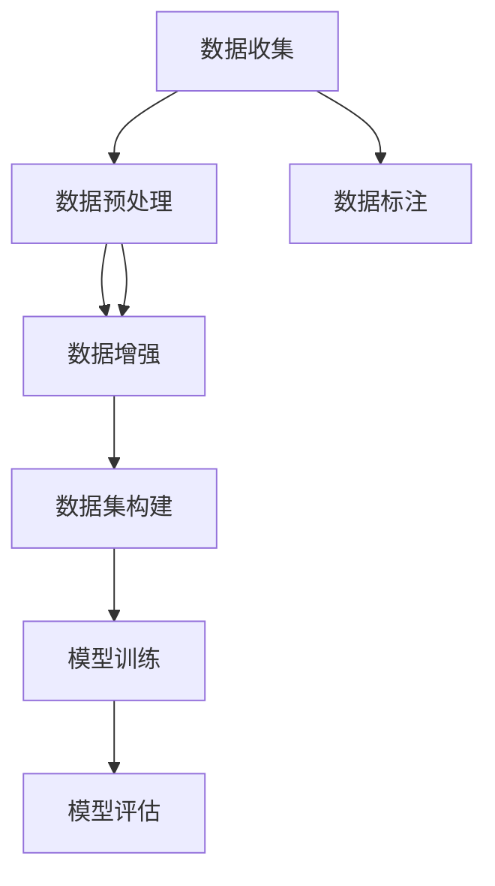

                 

# AI人工智能核心算法原理与代码实例讲解：数据收集

> 关键词：数据收集, 数据预处理, 数据标注, 数据增强, 数据集构建

## 1. 背景介绍

### 1.1 问题由来
数据收集是大数据时代人工智能(AI)应用的核心步骤之一。无论是机器学习、深度学习还是自然语言处理(NLP)，数据的数量和质量都直接决定着模型的表现。因此，在AI应用的初期阶段，如何快速、高效地获取、整理和处理数据，成为了研究者和开发者亟需解决的问题。

数据收集的复杂性和多样性使得这一问题尤为突出。不同的应用场景需要收集不同的数据类型，如结构化数据、非结构化数据、图像数据、音频数据等。此外，数据收集过程中还涉及数据源的选择、数据清洗、数据标注等多个环节，需要耗费大量时间和人力资源。

### 1.2 问题核心关键点
数据收集的主要挑战包括：
- 如何高效地获取数据，减少数据收集的成本和复杂度？
- 如何保证数据的完整性和多样性，避免数据的偏差和噪声？
- 如何自动化地处理和清洗数据，提高数据处理效率？
- 如何有效地标注数据，确保数据的正确性和可用性？
- 如何利用数据增强技术，提升数据集的质量和数量？

本节将围绕这些问题，详细介绍数据收集的基本流程和关键技术，帮助读者构建高效、可靠的数据收集体系。

## 2. 核心概念与联系

### 2.1 核心概念概述

为了更好地理解数据收集的过程，我们先介绍几个核心概念：

- **数据收集**：从各种数据源获取数据的过程。数据源包括网站、数据库、API、传感器、社交媒体等。数据收集需要确定数据源、设计数据采集逻辑，并确保数据的质量和时效性。
- **数据预处理**：对原始数据进行清洗、筛选、归一化、去噪等处理，以保证数据的完整性和一致性。预处理过程包括数据清洗、数据归一化、特征选择等步骤。
- **数据标注**：对数据进行人工或自动化的标签或注释，以便后续的模型训练和评估。数据标注涉及数据标注的策略、标注工具、标注质量控制等多个环节。
- **数据增强**：通过数据扩充技术生成更多的训练样本，提升数据集的多样性和丰富度。数据增强技术包括图像翻转、旋转、裁剪、混合等。
- **数据集构建**：将清洗和标注后的数据组织成机器学习模型可以使用的格式，如CSV、TFRecord、HDF5等。数据集构建需要考虑数据划分、采样、存储等技术细节。

这些概念之间通过数据的流向和处理逻辑连接起来，形成了数据收集的完整流程。数据收集的最终目的是构建高质量的数据集，为模型的训练和评估提供坚实的基础。

### 2.2 概念间的关系

数据收集流程中各个环节的关系可以通过以下Mermaid流程图来展示：



这个流程图展示了数据收集的基本流程和关键技术。首先从各种数据源获取数据，然后对数据进行清洗和预处理，接着对数据进行标注和增强，最后将处理后的数据构建为模型训练所需的数据集。

## 3. 核心算法原理 & 具体操作步骤
### 3.1 算法原理概述

数据收集的算法原理涉及数据的获取、清洗、标注和增强等多个环节。其核心思想是通过自动化和手动相结合的方式，构建高效、可靠、多样性的数据集，为模型的训练和评估提供坚实的基础。

数据收集的主要步骤包括：

1. **数据源选择**：选择合适的数据源，如公开数据库、API接口、传感器数据、社交媒体等。
2. **数据采集**：设计数据采集逻辑，自动从数据源中抓取数据。
3. **数据清洗**：去除数据中的噪声和异常值，确保数据的质量和一致性。
4. **数据标注**：对数据进行人工或自动化的标签或注释。
5. **数据增强**：通过数据扩充技术生成更多的训练样本，提升数据集的多样性和丰富度。
6. **数据集构建**：将清洗和标注后的数据组织成模型训练所需的数据格式。

### 3.2 算法步骤详解

#### 3.2.1 数据源选择

数据源的选择直接影响数据的获取效率和数据质量。常用的数据源包括：

- **公开数据库**：如Kaggle、UCI机器学习库、政府公开数据集等。这些数据集通常经过严格的审查和标注，适合用于研究。
- **API接口**：如Twitter API、Google Maps API、YouTube API等。API接口可以实时获取数据，适用于动态数据收集。
- **传感器数据**：如GPS、温度、湿度、气压等传感器数据，适合用于物联网和实时监测应用。
- **社交媒体**：如Twitter、Facebook、微博等社交媒体平台。社交媒体数据真实反映了用户行为和情感，适合用于情感分析和舆情监测。
- **网络爬虫**：如BeautifulSoup、Scrapy等工具，可以自动抓取网站上的数据，适合于大规模数据收集。

在选择数据源时，需要考虑数据的获取成本、数据量、数据更新频率、数据质量等多个因素。一般建议选择多样化的数据源，以获得更全面的数据视角。

#### 3.2.2 数据采集

数据采集通常使用API接口、网络爬虫、数据库查询等方式。以下是常见的数据采集方法：

- **API接口**：通过API接口获取数据，如调用Twitter API获取推文数据，调用Google Maps API获取地理位置数据等。
- **网络爬虫**：使用Scrapy等工具，自动抓取网站上的数据，适用于大规模数据采集。
- **数据库查询**：从关系型数据库或NoSQL数据库中查询数据，适合于结构化数据的采集。

数据采集过程中需要注意数据的合法性、隐私保护和数据源的稳定性和可靠性。

#### 3.2.3 数据清洗

数据清洗是数据预处理的重要环节，目的是去除数据中的噪声和异常值，确保数据的质量和一致性。常见的数据清洗技术包括：

- **缺失值处理**：使用均值、中位数、众数等方法填补缺失值。
- **异常值检测**：使用统计方法（如z-score）或机器学习算法（如孤立森林）检测和处理异常值。
- **数据去重**：通过唯一标识符或数据比较方法，去除重复的数据记录。
- **数据归一化**：将数据缩放到指定范围内，如将数值型数据缩放到[0,1]或[-1,1]区间。
- **特征选择**：去除无关或冗余的特征，提高数据集的效率和质量。

数据清洗过程需要根据具体应用场景和数据特点进行优化，通常需要结合领域知识和业务需求。

#### 3.2.4 数据标注

数据标注是数据预处理的另一个重要环节，目的是对数据进行人工或自动化的标签或注释。数据标注涉及以下步骤：

- **标注策略设计**：确定标注的目标、标注的粒度和标注的范围。常见的标注任务包括分类、标注、标注边界等。
- **标注工具选择**：选择适合的标注工具，如Labelbox、VGG Image Annotator、Pro Label等。
- **标注质量控制**：通过人工审核、交叉验证等方法，确保标注的准确性和一致性。
- **标注数据管理**：将标注数据存储在数据库或标注工具中，方便后续的访问和管理。

数据标注的质量直接影响模型的性能，标注过程中需要注重标注工具的选择和标注质量的控制。

#### 3.2.5 数据增强

数据增强是提升数据集多样性和丰富度的重要技术，通过数据扩充技术生成更多的训练样本。常见的数据增强技术包括：

- **图像翻转**：对图像进行水平或垂直翻转，增加数据的多样性。
- **图像旋转**：对图像进行旋转，改变图像的视角和角度。
- **图像裁剪**：对图像进行随机裁剪，生成不同尺寸的图像。
- **颜色混合**：对图像进行颜色混合或滤波，改变图像的视觉特征。
- **噪声注入**：向图像或音频数据注入噪声，模拟数据噪声。

数据增强技术需要根据具体任务和数据类型进行选择，通常需要在数据集构建前进行。

#### 3.2.6 数据集构建

数据集构建是将清洗和标注后的数据组织成模型训练所需的数据格式的过程。常用的数据格式包括：

- **CSV格式**：适合于结构化数据，易于读取和处理。
- **TFRecord格式**：适合于大规模数据存储和处理，支持并行读取。
- **HDF5格式**：适合于非结构化数据，支持高效的数据访问和存储。

数据集构建需要考虑数据划分、采样、存储等多个技术细节。通常需要设计合理的数据划分策略，如随机划分、分层划分等，以提高模型的泛化能力。

### 3.3 算法优缺点

数据收集的算法原理和操作步骤在提高数据质量和效率的同时，也存在一些缺点：

#### 3.3.1 优点

1. **提高数据质量**：通过数据清洗和标注，可以去除数据中的噪声和异常值，确保数据的质量和一致性。
2. **提升数据多样性**：通过数据增强技术，可以生成更多的训练样本，提升数据集的多样性和丰富度。
3. **降低数据成本**：通过网络爬虫和API接口，可以自动获取大规模数据，减少人工标注和数据处理的成本。

#### 3.3.2 缺点

1. **数据隐私问题**：大规模数据收集可能涉及用户隐私，需要采取隐私保护措施，如数据匿名化和加密。
2. **标注成本高**：高质量的数据标注通常需要大量人力和时间，成本较高。
3. **数据标注一致性**：自动化的标注工具可能存在标注一致性问题，需要人工审核和校验。
4. **数据源不稳定**：API接口和网络爬虫可能受到数据源的稳定性和可靠性影响，数据获取可能存在不确定性。
5. **数据处理方法复杂**：数据清洗和增强方法需要根据具体数据类型和任务进行优化，处理过程复杂。

## 4. 数学模型和公式 & 详细讲解 & 举例说明

### 4.1 数学模型构建

数据收集过程可以抽象为一个数学模型，包括数据源选择、数据采集、数据清洗、数据标注、数据增强和数据集构建等环节。以下是一个简单的数据收集数学模型：

$$
\text{DataCollection} = \text{DataSourceSelection} \times \text{DataAcquisition} \times \text{DataCleaning} \times \text{DataAnnotation} \times \text{DataAugmentation} \times \text{DatasetConstruction}
$$

这个数学模型展示了数据收集过程中各个环节的逻辑关系和作用。

### 4.2 公式推导过程

以数据增强为例，通过简单的数学公式，我们可以推导出数据增强的具体方法。假设原始图像为 $I$，数据增强的目标是生成一个新的图像 $I'$。假设数据增强的变换矩阵为 $T$，则变换关系为：

$$
I' = T(I)
$$

其中 $T$ 可以是旋转、平移、缩放等变换。具体的变换矩阵 $T$ 可以根据具体的数据增强方法进行设计，如：

- **图像旋转**：将原始图像 $I$ 旋转 $\theta$ 度，得到新的图像 $I'$。变换矩阵为：

$$
T = \begin{bmatrix}
\cos\theta & -\sin\theta \\
\sin\theta & \cos\theta
\end{bmatrix}
$$

- **图像翻转**：将原始图像 $I$ 水平或垂直翻转，得到新的图像 $I'$。变换矩阵为：

$$
T = \begin{bmatrix}
1 & 0 \\
0 & -1
\end{bmatrix}
$$

通过上述数学公式，我们可以根据具体的任务和数据类型，设计不同的数据增强方法，提升数据集的多样性和丰富度。

### 4.3 案例分析与讲解

#### 4.3.1 图像数据增强

假设我们有一个图像数据集，包括10,000张猫和狗的图像。为了提升数据集的多样性，我们可以使用图像翻转、旋转等技术进行数据增强。以下是数据增强的Python代码实现：

```python
from PIL import Image
import numpy as np
import random

def rotate_image(image_path, degrees):
    image = Image.open(image_path)
    image = image.rotate(degrees)
    return image

def flip_image(image_path):
    image = Image.open(image_path)
    image = image.transpose(Image.FLIP_LEFT_RIGHT)
    return image

def augment_image(image_path, augmentation_rate):
    augmented_images = []
    image = Image.open(image_path)
    for i in range(augmentation_rate):
        augmented_image = flip_image(image_path)
        augmented_images.append(augmented_image)
    return augmented_images

augmented_images = augment_image('cat.png', 0.5)
for image in augmented_images:
    image.save('augmented_cat.png')
```

在这个例子中，我们首先定义了旋转和翻转的函数，然后调用数据增强函数 `augment_image`，指定图像路径和增强率，生成增强后的图像。增强后的图像保存在 `augmented_cat.png` 文件中。

#### 4.3.2 文本数据清洗

假设我们有一个文本数据集，包括1000条评论数据。为了提升数据集的质量，我们可以使用文本清洗和归一化等技术进行处理。以下是数据清洗的Python代码实现：

```python
import re

def clean_text(text):
    text = re.sub(r'[^\w\s]', '', text)
    text = text.lower()
    return text

def preprocess_text(texts):
    cleaned_texts = []
    for text in texts:
        cleaned_text = clean_text(text)
        cleaned_texts.append(cleaned_text)
    return cleaned_texts

texts = ["This is a good movie.", "I don't like it.", "It's not worth watching."]
cleaned_texts = preprocess_text(texts)
for text in cleaned_texts:
    print(text)
```

在这个例子中，我们首先定义了文本清洗函数 `clean_text`，使用正则表达式去除非字母和数字字符，并将文本转换为小写。然后调用文本预处理函数 `preprocess_text`，对所有文本进行清洗和归一化处理。最后输出清洗后的文本。

## 5. 项目实践：代码实例和详细解释说明

### 5.1 开发环境搭建

在进行数据收集实践前，我们需要准备好开发环境。以下是使用Python进行数据收集的环境配置流程：

1. 安装Anaconda：从官网下载并安装Anaconda，用于创建独立的Python环境。

2. 创建并激活虚拟环境：
```bash
conda create -n data-collection python=3.8 
conda activate data-collection
```

3. 安装Python的第三方库：
```bash
pip install beautifulsoup4 requests tensorflow h5py
```

完成上述步骤后，即可在`data-collection`环境中开始数据收集实践。

### 5.2 源代码详细实现

#### 5.2.1 图像数据收集

以下是一个使用Scrapy工具进行图像数据收集的Python代码示例：

```python
import scrapy

class ImageSpider(scrapy.Spider):
    name = 'image_spider'
    start_urls = ['https://example.com']
    
    def parse(self, response):
        for img in response.css('img'):
            image_url = img.attrib['img'].get()
            yield {"url": image_url}

with open('image_urls.txt', 'w') as f:
    for image_url in images:
        f.write(image_url + '\n')
```

在这个例子中，我们定义了一个爬虫 `ImageSpider`，设置起始URL和数据抓取逻辑。在解析页面时，通过CSS选择器获取所有图片的URL，并将URL写入文件 `image_urls.txt` 中。

#### 5.2.2 文本数据清洗

以下是一个使用Python进行文本数据清洗的代码示例：

```python
import re

def clean_text(text):
    text = re.sub(r'[^\w\s]', '', text)
    text = text.lower()
    return text

texts = ["This is a good movie.", "I don't like it.", "It's not worth watching."]
cleaned_texts = [clean_text(text) for text in texts]
for text in cleaned_texts:
    print(text)
```

在这个例子中，我们定义了文本清洗函数 `clean_text`，使用正则表达式去除非字母和数字字符，并将文本转换为小写。然后对所有文本进行清洗和归一化处理。

#### 5.2.3 数据标注

以下是一个使用Labelbox进行图像数据标注的代码示例：

1. 安装Labelbox库：
```bash
pip install labelbox
```

2. 运行Labelbox标注界面：
```bash
labelbox annotation --task=image_classification --dataset=my_dataset
```

在这个例子中，我们首先安装了Labelbox库，然后使用Labelbox的标注界面进行图像数据标注。在标注界面中输入标注结果，完成后将标注数据保存到本地文件 `my_dataset.jsonl` 中。

### 5.3 代码解读与分析

#### 5.3.1 图像数据收集

在这个代码示例中，我们使用了Scrapy工具进行图像数据收集。Scrapy是一个强大的Python爬虫框架，可以自动抓取网站上的数据。通过定义爬虫类 `ImageSpider`，设置起始URL和数据抓取逻辑，我们可以自动获取指定网站上的所有图片URL，并将其保存到一个文件中。

#### 5.3.2 文本数据清洗

在这个代码示例中，我们使用了Python的正则表达式库 `re` 进行文本清洗。正则表达式是一种强大的文本处理工具，可以方便地去除非字母和数字字符，并将文本转换为小写。通过使用列表推导式，我们可以快速对所有文本进行清洗和归一化处理。

#### 5.3.3 数据标注

在这个代码示例中，我们使用了Labelbox进行图像数据标注。Labelbox是一个基于Web的标注工具，可以方便地进行图像、文本、语音等多种数据类型的标注。通过运行Labelbox的标注界面，我们可以对图像进行分类标注，并将标注结果保存到本地文件中。

### 5.4 运行结果展示

假设我们使用Scrapy工具从某网站上爬取了一组图片数据，并使用Labelbox进行了标注，最终得到了一个标注好的数据集 `my_dataset.jsonl`。以下是数据集的样例：

```json
{"name": "image0", "url": "https://example.com/image0.jpg", "labels": ["cat", "dog"]}
{"name": "image1", "url": "https://example.com/image1.jpg", "labels": ["cat"]}
{"name": "image2", "url": "https://example.com/image2.jpg", "labels": ["dog"]}
```

可以看到，每个标注条目包括图片名称、URL和标签，用于后续的模型训练和评估。

## 6. 实际应用场景

### 6.1 智能推荐系统

智能推荐系统需要大量的用户行为数据和物品信息数据。通过数据收集，我们可以构建大规模的用户行为和物品信息数据库，为推荐算法提供数据支撑。以下是智能推荐系统数据收集的实际应用场景：

1. **用户行为数据收集**：通过爬取社交媒体、电商平台、视频网站等平台的用户行为数据，构建用户行为数据库。用户行为数据包括浏览记录、购买记录、评分记录等。
2. **物品信息数据收集**：通过爬取电商平台、商品网站、视频网站等平台的产品信息数据，构建物品信息数据库。物品信息数据包括商品描述、价格、评分、标签等。
3. **数据清洗和标注**：对收集到的用户行为和物品信息数据进行清洗和标注，去除噪声和异常值，确保数据的质量和一致性。
4. **数据增强**：通过数据扩充技术，生成更多的训练样本，提升数据集的多样性和丰富度。
5. **数据集构建**：将清洗和标注后的数据构建为推荐算法所需的数据格式，如TFRecord格式。

通过数据收集和预处理，我们可以构建高效、可靠、多样性的数据集，为推荐算法提供坚实的支撑，提升推荐系统的性能和用户体验。

### 6.2 金融舆情监测

金融舆情监测需要大量的金融新闻和舆情数据。通过数据收集，我们可以构建大规模的金融新闻和舆情数据库，为舆情监测模型提供数据支撑。以下是金融舆情监测数据收集的实际应用场景：

1. **金融新闻数据收集**：通过爬取金融网站、新闻网站、社交媒体等平台的新闻数据，构建金融新闻数据库。金融新闻数据包括新闻标题、摘要、正文、发布时间等。
2. **舆情数据收集**：通过爬取社交媒体、金融论坛、财经博客等平台的用户评论和讨论，构建舆情数据库。舆情数据包括评论内容、发布时间、情感倾向等。
3. **数据清洗和标注**：对收集到的金融新闻和舆情数据进行清洗和标注，去除噪声和异常值，确保数据的质量和一致性。
4. **数据增强**：通过数据扩充技术，生成更多的训练样本，提升数据集的多样性和丰富度。
5. **数据集构建**：将清洗和标注后的数据构建为舆情监测模型所需的数据格式，如TFRecord格式。

通过数据收集和预处理，我们可以构建高效、可靠、多样性的数据集，为舆情监测模型提供坚实的支撑，提升舆情监测模型的性能和准确性。

### 6.3 医学影像诊断

医学影像诊断需要大量的医学影像数据和标注数据。通过数据收集，我们可以构建大规模的医学影像和标注数据库，为医学影像诊断模型提供数据支撑。以下是医学影像诊断数据收集的实际应用场景：

1. **医学影像数据收集**：通过爬取医学影像网站、医院网站、科研机构网站等平台，获取医学影像数据。医学影像数据包括CT扫描、X光片、MRI等影像数据。
2. **医学标注数据收集**：通过手动标注医学影像数据，构建医学标注数据库。医学标注数据包括影像的诊断结果、病变区域、病变类型等。
3. **数据清洗和标注**：对收集到的医学影像和标注数据进行清洗和标注，去除噪声和异常值，确保数据的质量和一致性。
4. **数据增强**：通过数据扩充技术，生成更多的训练样本，提升数据集的多样性和丰富度。
5. **数据集构建**：将清洗和标注后的数据构建为医学影像诊断模型所需的数据格式，如TFRecord格式。

通过数据收集和预处理，我们可以构建高效、可靠、多样性的数据集，为医学影像诊断模型提供坚实的支撑，提升医学影像诊断模型的性能和诊断准确性。

### 6.4 未来应用展望

未来，随着数据收集技术的不断进步，数据收集的自动化和智能化水平将不断提升。以下是数据收集技术的未来发展趋势：

1. **自动标注技术**：使用预训练模型进行自动标注，减少手动标注的工作量，降低标注成本。
2. **多源数据融合**：通过跨平台、跨领域的数据收集和融合，构建更加全面、多样性的数据集。
3. **实时数据采集**：通过流式数据采集和存储技术，实现数据的实时收集和更新。
4. **数据隐私保护**：在数据收集和处理过程中，加强数据隐私保护和匿名化处理。
5. **数据质量保障**：建立数据质量保障体系，确保数据的准确性和一致性。

数据收集技术的进步将大大提升数据的质量和效率，为AI应用的落地提供坚实的基础。相信在未来，数据收集将成为AI应用的核心竞争力之一，为更多行业带来变革性影响。

## 7. 工具和资源推荐

### 7.1 学习资源推荐

为了帮助开发者系统掌握数据收集的理论基础和实践技巧，这里推荐一些优质的学习资源：

1. 《数据收集与处理》书籍：深入浅出地介绍了数据收集的基本概念和实用技巧，适合初学者和进阶开发者阅读。
2. Coursera《数据收集与处理》课程：斯坦福大学开设的课程，涵盖数据收集、数据清洗、数据标注等多个方面，适合全面学习。
3. 《Python数据科学手册》书籍：详细介绍了Python在数据处理和分析中的应用，适合Python开发者学习。
4. Kaggle数据集：Kaggle提供大量公开数据集，涵盖各个领域，适合进行数据收集和预处理的实践。
5. HuggingFace官方文档：HuggingFace提供的自然语言处理(NLP)数据集和数据处理工具，适合进行NLP数据收集和预处理。

通过对这些资源的学习实践，相信你一定能够快速掌握数据收集的精髓，并用于解决实际的AI应用问题。

### 7.2 开发工具推荐

高效的开发离不开优秀的工具支持。以下是几款用于数据收集开发的常用工具：

1. Scrapy：Python爬虫框架，支持分布式爬虫和异步爬虫，适用于大规模数据收集。
2. Beautiful Soup：Python爬虫工具，支持HTML和XML解析，适用于网页数据抓取。
3. Pandas：Python数据分析库，支持数据清洗、数据预处理和数据转换。
4. Labelbox：基于Web的标注工具，支持多种数据类型的标注，适用于大规模数据标注。
5. TensorFlow：Google开源的深度学习框架，支持分布式训练和模型优化，适用于大规模数据处理。

合理利用这些工具，可以显著提升数据收集的效率，加快创新迭代的步伐。

### 7.3 相关论文推荐

数据收集技术的进展源于学界的持续研究。以下是几篇奠基性的相关论文，推荐阅读：

1. "Web Scraping: A Survey and Tutorial"（网页抓取：综述与教程）：介绍网页抓取的基本概念和常用技术，适合初学者阅读。
2. "Data Collection and Processing in Big Data Analytics"（大数据分析中的数据收集与处理）：介绍大数据分析中数据收集和处理的基本方法，适合进阶开发者阅读。
3. "Labelbox: Scalable,

