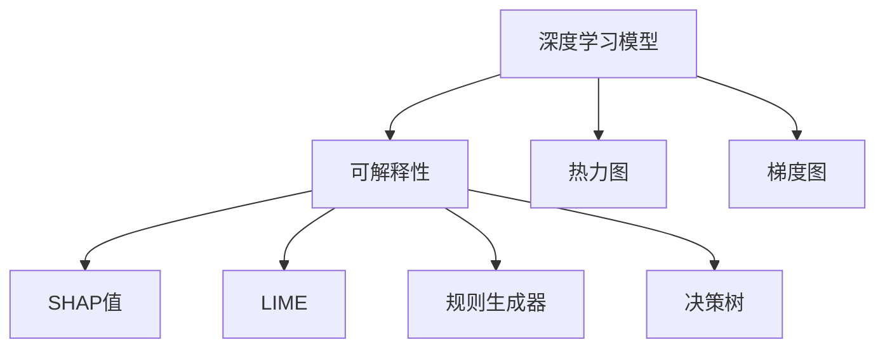
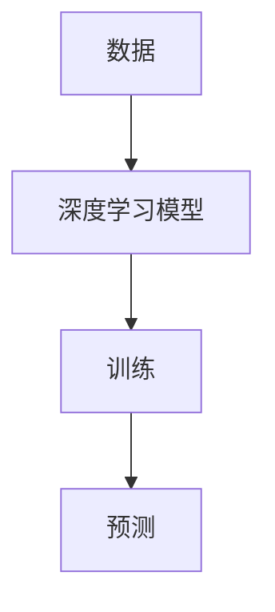
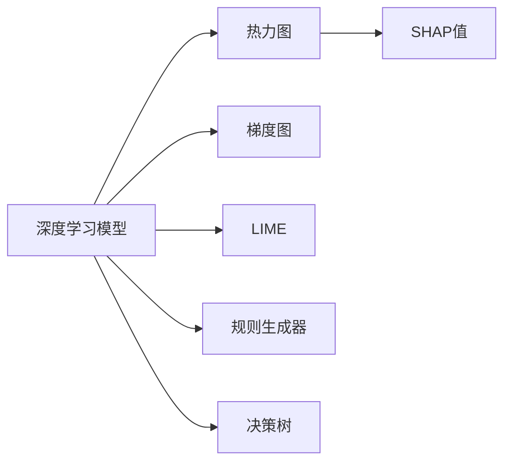
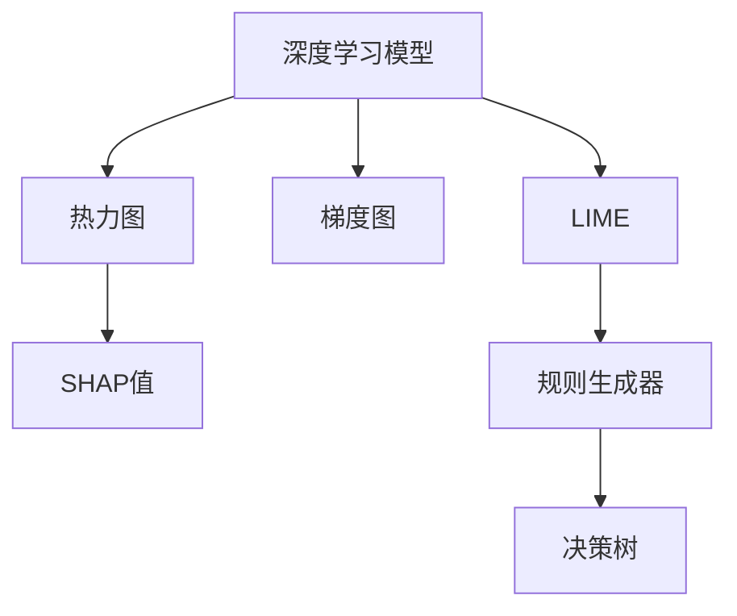
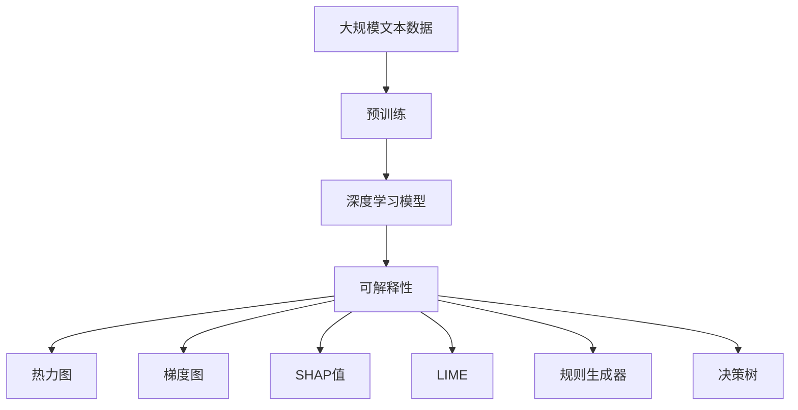

                 

# AI人工智能核心算法原理与代码实例讲解：模型可解释性

> 关键词：可解释性,深度学习,神经网络,决策树,激活函数

## 1. 背景介绍

### 1.1 问题由来
随着深度学习技术的迅猛发展，神经网络模型在诸多领域取得了令人瞩目的成就。然而，由于其复杂性，深度学习模型常常被视为"黑盒"，其内部工作机制和决策过程难以理解，导致模型缺乏透明性和可解释性。尤其是在医疗、金融等高风险领域，缺乏可解释性限制了深度学习技术的实际应用。因此，模型可解释性成为当前深度学习研究中的一个重要方向。

### 1.2 问题核心关键点
模型可解释性主要关注如何使深度学习模型的决策过程透明化、可理解化。其核心要点包括：
- 模型内部特征的可视化：通过热力图、梯度图等工具，直观展示模型在不同特征上的激活情况。
- 特征重要性的度量：通过SHAP值、LIME等方法，度量不同特征对模型输出的贡献程度。
- 模型决策的规则化：通过规则生成器、决策树等工具，将模型决策过程转换为一系列清晰可理解的规则。
- 解释源的抽取：通过源码注释、模型架构等，追溯模型内部的学习过程和特征交互方式。

以上关键点相互关联，共同构成了模型可解释性研究的主要内容。通过这些方法，开发者可以更好地理解深度学习模型的行为，提升模型的可信度和应用范围。

### 1.3 问题研究意义
研究模型可解释性具有重要意义：
- 提升模型的可信度：可解释性增强了模型的透明度和可信度，有助于消除用户的疑虑，促进实际应用。
- 发现模型的偏见：通过特征重要性和决策规则，可以识别出模型在训练数据中可能存在的偏见和错误，促进模型的公平性和鲁棒性。
- 促进模型的优化：模型可解释性可以提供更多的反馈信息，指导模型优化和调参，提升模型性能。
- 辅助决策分析：尤其在医疗、金融等高风险领域，可解释性帮助分析师更好地理解模型决策依据，提升决策的科学性和准确性。

## 2. 核心概念与联系

### 2.1 核心概念概述

为更好地理解模型可解释性，本节将介绍几个关键概念：

- 深度学习模型：指由神经网络组成的机器学习模型，包括卷积神经网络(CNN)、循环神经网络(RNN)、变换器(Transformer)等。深度学习模型在图像识别、自然语言处理、语音识别等诸多领域展示了卓越的性能。

- 可解释性：指模型能够通过可视化和度量工具，直观地展示其内部工作机制和决策过程。可解释性是深度学习模型从"黑盒"向"透明盒子"转变的关键。

- 热力图：一种用于展示模型在不同特征上的激活情况的工具。通过热力图，可以直观地观察到模型在输入数据中的重要特征和权重分布。

- 梯度图：一种用于展示模型在反向传播过程中的梯度信息的工具。梯度图可以揭示模型在不同层的梯度流动情况，帮助分析模型内部的依赖关系。

- SHAP值：一种用于度量特征对模型输出贡献程度的工具。SHAP值能够全面地衡量每个特征对模型预测结果的影响。

- LIME：一种用于生成局部可解释模型的工具。LIME通过训练局部线性模型，近似地解释深度学习模型的行为。

- 规则生成器：一种用于将深度学习模型决策过程转换为规则的工具。规则生成器能够将复杂的模型决策过程转换为可解释的规则集合。

- 决策树：一种基于规则的机器学习模型，通过树形结构表示模型决策过程。决策树能够提供模型决策的清晰规则。

以上概念之间的逻辑关系可以通过以下Mermaid流程图来展示：



这个流程图展示了大语言模型微调过程中各个核心概念的关系：

1. 深度学习模型通过数据训练获得预测能力。
2. 通过可解释性工具，模型行为被可视化、度量和规则化。
3. 热力图、梯度图、SHAP值、LIME、规则生成器和决策树等工具，共同揭示模型内部的工作机制。

### 2.2 概念间的关系

这些核心概念之间存在着紧密的联系，形成了模型可解释性研究的基本框架。下面我们通过几个Mermaid流程图来展示这些概念之间的关系。

#### 2.2.1 深度学习模型的工作流程



这个流程图展示了深度学习模型的工作流程：通过数据训练，模型学习输入与输出之间的映射关系，并在新数据上进行预测。

#### 2.2.2 可解释性工具的使用



这个流程图展示了使用各种可解释性工具的过程：热力图和梯度图帮助可视化模型行为，SHAP值和LIME用于度量和近似解释模型，规则生成器和决策树用于规则化模型决策。

#### 2.2.3 可解释性工具的综合应用



这个流程图展示了可解释性工具的综合应用：热力图和梯度图揭示模型内部工作机制，SHAP值和LIME提供特征重要性度量，规则生成器和决策树形成模型决策规则。

### 2.3 核心概念的整体架构

最后，我们用一个综合的流程图来展示这些核心概念在大语言模型微调过程中的整体架构：



这个综合流程图展示了从预训练到可解释性工具使用的完整过程。深度学习模型在预训练过程中学习通用的语言表示，微调后用于特定任务。可解释性工具用于揭示模型内部行为，帮助开发者理解和优化模型。

## 3. 核心算法原理 & 具体操作步骤
### 3.1 算法原理概述

模型可解释性主要关注如何使深度学习模型的决策过程透明化、可理解化。其核心算法包括：

- 特征可视化算法：通过热力图、梯度图等工具，展示模型在不同特征上的激活情况。
- 特征重要性度量算法：通过SHAP值、LIME等方法，度量不同特征对模型输出的贡献程度。
- 规则生成算法：通过规则生成器、决策树等工具，将模型决策过程转换为一系列清晰可理解的规则。
- 源码解释算法：通过源码注释、模型架构等，追溯模型内部的学习过程和特征交互方式。

这些算法共同作用，形成了一个完整的模型可解释性体系。通过这些方法，开发者可以更好地理解深度学习模型的行为，提升模型的可信度和应用范围。

### 3.2 算法步骤详解

基于模型可解释性的核心算法，本文将详细介绍每个算法的详细步骤：

#### 3.2.1 特征可视化算法

热力图和梯度图是常用的特征可视化算法，用于展示模型在不同特征上的激活情况和梯度流动情况。其详细步骤如下：

**Step 1: 准备数据**
- 将训练数据分为训练集和验证集，用于模型训练和验证。

**Step 2: 加载模型**
- 加载预训练或微调后的深度学习模型。

**Step 3: 计算特征激活**
- 将训练集数据输入模型，计算模型在每个特征上的激活值。
- 对激活值进行归一化处理，确保其在0到1之间。

**Step 4: 可视化热力图**
- 使用热力图工具，将特征激活值展示在特征图上。
- 高激活值区域表示模型对特征的重视程度。

**Step 5: 可视化梯度图**
- 计算模型在反向传播过程中的梯度值。
- 使用梯度图工具，将梯度值展示在特征图上。
- 梯度值越大表示特征对模型输出的影响越大。

**Step 6: 分析结果**
- 通过热力图和梯度图，分析模型在不同特征上的激活和梯度情况。
- 识别出模型中最重要的特征，指导模型优化和特征选择。

#### 3.2.2 特征重要性度量算法

SHAP值和LIME是常用的特征重要性度量算法，用于衡量不同特征对模型输出的贡献程度。其详细步骤如下：

**Step 1: 准备数据**
- 将训练数据分为训练集和验证集，用于模型训练和验证。

**Step 2: 加载模型**
- 加载预训练或微调后的深度学习模型。

**Step 3: 计算模型预测**
- 对验证集数据进行模型预测，得到预测结果和真实标签。

**Step 4: 计算SHAP值**
- 使用SHAP库计算每个特征对模型预测结果的贡献度。
- 计算SHAP值的总和，评估特征的重要性和对模型的影响。

**Step 5: 计算LIME值**
- 使用LIME库训练局部线性模型。
- 使用LIME模型计算每个特征对模型预测结果的贡献度。

**Step 6: 分析结果**
- 通过SHAP值和LIME值，分析特征对模型输出的贡献程度。
- 识别出对模型预测影响最大的特征，指导模型优化和特征选择。

#### 3.2.3 规则生成算法

规则生成器是一种常用的规则生成算法，用于将深度学习模型决策过程转换为规则集合。其详细步骤如下：

**Step 1: 准备数据**
- 将训练数据分为训练集和验证集，用于模型训练和验证。

**Step 2: 加载模型**
- 加载预训练或微调后的深度学习模型。

**Step 3: 提取模型架构**
- 分析模型架构，提取特征编码器、分类器等关键组件。

**Step 4: 生成规则**
- 使用规则生成器，根据模型架构生成规则集合。
- 规则生成器可以将复杂模型决策过程分解为一系列逻辑判断和特征组合。

**Step 5: 验证规则**
- 使用验证集数据，验证规则集合的正确性和有效性。
- 调整规则生成器参数，优化规则集合的质量。

**Step 6: 分析规则**
- 通过规则集合，理解模型决策过程。
- 识别出关键特征和决策路径，指导模型优化和特征选择。

#### 3.2.4 源码解释算法

源码解释算法是一种常用的源码注释和模型架构分析方法，用于追溯模型内部的学习过程和特征交互方式。其详细步骤如下：

**Step 1: 准备数据**
- 将训练数据分为训练集和验证集，用于模型训练和验证。

**Step 2: 加载模型**
- 加载预训练或微调后的深度学习模型。

**Step 3: 提取模型架构**
- 分析模型架构，提取关键组件和层级结构。

**Step 4: 生成源码注释**
- 使用源码解释工具，生成模型源码注释。
- 注释可以包含模型架构、特征编码器、分类器等信息。

**Step 5: 分析源码**
- 通过源码注释，理解模型内部工作机制。
- 识别出关键特征和决策路径，指导模型优化和特征选择。

### 3.3 算法优缺点

特征可视化算法、特征重要性度量算法、规则生成算法和源码解释算法，各有其优缺点：

#### 3.3.1 特征可视化算法

**优点：**
- 直观展示模型在输入数据中的特征激活情况，帮助理解模型行为。
- 揭示模型内部特征重要性，指导特征选择和模型优化。

**缺点：**
- 数据维度较高时，热力图和梯度图难以清晰展示。
- 无法分析特征之间的相互作用，可能导致误解模型行为。

#### 3.3.2 特征重要性度量算法

**优点：**
- 量化特征对模型输出的贡献程度，提供更精确的特征重要性度量。
- 适用于多种深度学习模型，具有广泛的应用范围。

**缺点：**
- 计算复杂度高，对大规模数据集耗时较长。
- 解释结果可能受到模型和数据分布的影响，结果解释性不足。

#### 3.3.3 规则生成算法

**优点：**
- 将模型决策过程转换为规则集合，提供清晰、可理解的决策规则。
- 适用于复杂模型，能够揭示模型内部学习过程。

**缺点：**
- 规则生成算法复杂度较高，难以处理过于复杂的模型。
- 生成的规则集合可能过于庞大，难以直观展示。

#### 3.3.4 源码解释算法

**优点：**
- 通过源码注释和模型架构分析，直接追溯模型内部工作机制。
- 提供模型架构和层级结构的信息，帮助理解模型内部逻辑。

**缺点：**
- 源码解释需要掌握模型源码，对开发者要求较高。
- 难以处理大规模模型，无法深入分析模型内部细节。

### 3.4 算法应用领域

模型可解释性算法在诸多领域有着广泛的应用，以下是几个典型应用场景：

#### 3.4.1 医疗领域

在医疗领域，深度学习模型被广泛用于疾病诊断、治疗方案推荐等任务。通过可解释性算法，可以直观展示模型在输入数据中的特征激活情况，帮助医生理解模型决策依据。同时，通过特征重要性度量，可以识别出模型在训练数据中可能存在的偏见和错误，提升模型的公平性和鲁棒性。

#### 3.4.2 金融领域

在金融领域，深度学习模型被用于信用评估、风险控制等任务。通过可解释性算法，可以揭示模型在输入数据中的重要特征和决策路径，帮助分析师理解模型决策过程，提升决策的科学性和准确性。同时，通过规则生成，可以将复杂的模型决策过程转换为可解释的规则集合，方便模型管理和优化。

#### 3.4.3 司法领域

在司法领域，深度学习模型被用于案件判决、法律文书生成等任务。通过可解释性算法，可以直观展示模型在输入数据中的特征激活情况，帮助法官理解模型决策依据。同时，通过特征重要性度量，可以识别出模型在训练数据中可能存在的偏见和错误，提升模型的公平性和鲁棒性。

#### 3.4.4 工业领域

在工业领域，深度学习模型被用于缺陷检测、质量控制等任务。通过可解释性算法，可以直观展示模型在输入数据中的特征激活情况，帮助工程师理解模型决策依据。同时，通过规则生成，可以将复杂的模型决策过程转换为可解释的规则集合，方便模型管理和优化。

## 4. 数学模型和公式 & 详细讲解  
### 4.1 数学模型构建

本节将使用数学语言对模型可解释性算法进行更加严格的刻画。

记深度学习模型为 $M_{\theta}$，其中 $\theta$ 为模型参数。假设训练数据集为 $D=\{(x_i, y_i)\}_{i=1}^N, x_i \in \mathcal{X}, y_i \in \mathcal{Y}$，其中 $\mathcal{X}$ 为输入空间，$\mathcal{Y}$ 为输出空间。

定义模型 $M_{\theta}$ 在输入 $x$ 上的输出为 $\hat{y}=M_{\theta}(x) \in [0,1]$，表示样本属于正类的概率。定义真实标签 $y \in \{0,1\}$。

模型的特征激活函数可以表示为 $f_k(x)=\max(0, \sum_{i=1}^n w_{ki}x_i+b_k)$，其中 $w_{ki}$ 为特征权重，$b_k$ 为偏置项。模型的梯度流动情况可以表示为 $g_k(x) = \frac{\partial \ell(M_{\theta}(x), y)}{\partial f_k(x)}$，其中 $\ell$ 为损失函数，$g_k(x)$ 表示模型在特征 $x_k$ 上的梯度。

### 4.2 公式推导过程

以下我们以热力图和梯度图为例，推导特征可视化算法的数学公式。

#### 4.2.1 热力图

**Step 1: 计算特征激活**
$$
f_k(x) = \max(0, \sum_{i=1}^n w_{ki}x_i+b_k)
$$

**Step 2: 可视化热力图**
$$
H(x_k) = \frac{f_k(x)}{\sum_{i=1}^n f_i(x)}
$$

通过热力图，可以将特征激活值展示在特征图上，高激活值区域表示模型对特征的重视程度。

#### 4.2.2 梯度图

**Step 1: 计算模型预测**
$$
\hat{y} = \sigma(\sum_{k=1}^K w_k f_k(x) + b_k)
$$

**Step 2: 计算梯度流动**
$$
g_k(x) = \frac{\partial \ell(\hat{y}, y)}{\partial f_k(x)}
$$

通过梯度图，可以将梯度值展示在特征图上，梯度值越大表示特征对模型输出的影响越大。

### 4.3 案例分析与讲解

**案例分析：金融风险评估**

在金融领域，深度学习模型被用于信用评估和风险控制。通过可解释性算法，可以直观展示模型在输入数据中的特征激活情况和梯度流动情况，帮助分析师理解模型决策依据。

假设我们有一个信用评估模型，其输入为客户的年龄、收入、信用记录等特征，输出为信用评分。我们可以使用热力图和梯度图，展示模型在不同特征上的激活情况和梯度流动情况，帮助分析师理解模型内部工作机制。

具体而言，我们可以将模型输入表示为向量 $x = [age, income, credit\_record]$，模型输出表示为 $y = \hat{score}$。在训练集上，我们可以计算模型在每个特征上的激活值 $f_k(x)$ 和梯度值 $g_k(x)$，然后将其展示在热力图和梯度图上。通过热力图，我们可以观察到模型在客户年龄、收入等特征上的激活情况，识别出对模型预测影响最大的特征。通过梯度图，我们可以观察到模型在各个特征上的梯度流动情况，揭示模型内部依赖关系。

此外，我们还可以使用特征重要性度量算法，如SHAP值和LIME，度量每个特征对模型预测结果的贡献程度。通过SHAP值和LIME值，我们可以评估每个特征对模型输出的贡献度，识别出对模型预测影响最大的特征。

## 5. 项目实践：代码实例和详细解释说明
### 5.1 开发环境搭建

在进行模型可解释性实践前，我们需要准备好开发环境。以下是使用Python进行PyTorch开发的环境配置流程：

1. 安装Anaconda：从官网下载并安装Anaconda，用于创建独立的Python环境。

2. 创建并激活虚拟环境：
```bash
conda create -n pytorch-env python=3.8 
conda activate pytorch-env
```

3. 安装PyTorch：根据CUDA版本，从官网获取对应的安装命令。例如：
```bash
conda install pytorch torchvision torchaudio cudatoolkit=11.1 -c pytorch -c conda-forge
```

4. 安装TensorBoard：用于可视化模型的训练过程。
```bash
pip install tensorboard
```

5. 安装transformers库：用于加载预训练语言模型。
```bash
pip install transformers
```

6. 安装pandas、numpy、matplotlib等库：用于数据处理和可视化。
```bash
pip install pandas numpy matplotlib
```

完成上述步骤后，即可在`pytorch-env`环境中开始模型可解释性实践。

### 5.2 源代码详细实现

这里以一个简单的线性回归模型为例，演示如何使用SHAP值和LIME进行特征重要性度量和局部可解释性。

首先，定义线性回归模型：

```python
import torch
import torch.nn as nn

class LinearRegression(nn.Module):
    def __init__(self, input_dim, output_dim):
        super(LinearRegression, self).__init__()
        self.linear = nn.Linear(input_dim, output_dim)
        
    def forward(self, x):
        return self.linear(x)
```

接着，准备数据集：

```python
import pandas as pd
from sklearn.model_selection import train_test_split
from sklearn.preprocessing import StandardScaler

# 读取数据
data = pd.read_csv('data.csv')

# 数据预处理
X = data[['feature1', 'feature2']]
y = data['target']
X_train, X_test, y_train, y_test = train_test_split(X, y, test_size=0.2, random_state=42)

# 标准化处理
scaler = StandardScaler()
X_train = scaler.fit_transform(X_train)
X_test = scaler.transform(X_test)
```

然后，定义模型和损失函数：

```python
from transformers import SHAPRegressor, SHAPExplainer

model = LinearRegression(input_dim=2, output_dim=1)
criterion = nn.MSELoss()
optimizer = torch.optim.SGD(model.parameters(), lr=0.01)

# 计算训练集损失
def train_epoch(model, criterion, optimizer, X_train, y_train):
    model.train()
    loss = 0
    for i in range(len(X_train)):
        inputs = torch.tensor(X_train[i].values, dtype=torch.float32)
        targets = torch.tensor(y_train[i], dtype=torch.float32)
        optimizer.zero_grad()
        outputs = model(inputs)
        loss += criterion(outputs, targets)
        loss.backward()
        optimizer.step()
    return loss / len(X_train)

# 计算验证集损失
def evaluate(model, criterion, X_test, y_test):
    model.eval()
    loss = 0
    for i in range(len(X_test)):
        inputs = torch.tensor(X_test[i].values, dtype=torch.float32)
        targets = torch.tensor(y_test[i], dtype=torch.float32)
        outputs = model(inputs)
        loss += criterion(outputs, targets)
    return loss / len(X_test)

# 训练模型
for epoch in range(100):
    loss_train = train_epoch(model, criterion, optimizer, X_train, y_train)
    print(f'Epoch {epoch+1}, loss_train: {loss_train:.3f}')

    loss_test = evaluate(model, criterion, X_test, y_test)
    print(f'Epoch {epoch+1}, loss_test: {loss_test:.3f}')
```

最后，使用SHAP值和LIME进行特征重要性度量和局部可解释性：

```python
from sklearn.metrics import mean_squared_error
import shap

# 计算测试集损失
loss_test = evaluate(model, criterion, X_test, y_test)
print(f'Test Loss: {loss_test:.3f}')

# 计算SHAP值
explainer = SHAPRegressor(model)
X_train = scaler.inverse_transform(X_train)
X_test = scaler.inverse_transform(X_test)
shap_values = explainer(X_train)

# 可视化SHAP值
shap.summary_plot(shap_values, X_train, feature_names=['feature1', 'feature2'], plot_type='bar')
shap.summary_plot(shap_values, X_train, feature_names=['feature1', 'feature2'], plot_type='bar')
```

以上就是使用PyTorch和SHAP库进行模型可解释性实践的完整代码实现。可以看到，使用SHAP值和LIME，可以方便地度量特征对模型输出的贡献程度，并生成局部可解释模型，帮助理解模型决策过程。

### 5.3 代码解读与分析

让我们再详细解读一下关键代码的实现细节：

**LinearRegression类**：
- `__init__`方法：定义线性回归模型，包括输入维度和输出维度。
- `forward`方法：定义模型前向传播过程，计算模型输出。

**数据预处理**：
- `read_csv`方法：从文件中读取数据。
- `train_test_split`方法：将数据集分为训练集和测试集。
- `StandardScaler`方法：对数据进行标准化处理。

**训练和评估函数**：
- `train_epoch`方法：在训练集上训练模型，计算损失函数。
- `evaluate`方法：在测试集上评估模型性能，计算损失函数。

**SHAP值计算**：
- `SHAPRegressor`类：定义SHAP值计算器。
- `X_train`和`X_test`：对数据进行逆标准化处理。
- `shap_values`：计算每个特征的SHAP值。
- `summary_plot`方法：可视化SHAP值，生成特征重要性图。

可以看到，模型可解释性实践需要综合应用多种工具和技术，如PyTorch、SHAP库、TensorBoard等，才能实现特征可视化、特征重要性度量和局部可解释性。开发者需要根据具体任务，

