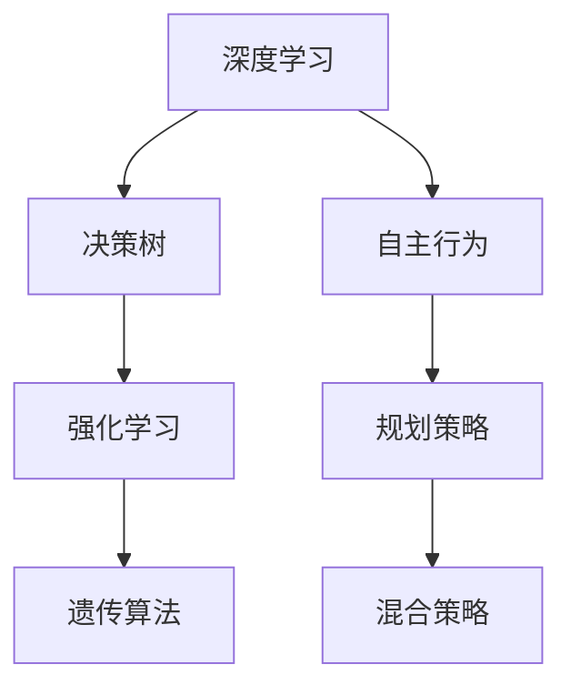
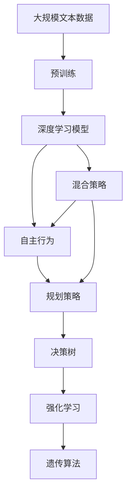

                 

# AI人工智能深度学习算法：自主行为与规划策略在深度学习中的运用

> 关键词：深度学习,自主行为,规划策略,决策树,强化学习,遗传算法,混合策略

## 1. 背景介绍

### 1.1 问题由来
近年来，人工智能(AI)在各领域取得了飞速发展，特别是深度学习(DL)技术的广泛应用。深度学习通过神经网络模型的复杂非线性映射，能够从大量数据中自动学习特征表示，实现了对复杂任务的高效处理。但深度学习的黑箱特性和可解释性问题，使其在需要高透明度的应用场景中难以发挥作用。

为解决这一问题，研究者们引入了自主行为和规划策略，使AI系统能够具有可解释性、灵活性和自适应性，能够在复杂环境中自主决策和规划路径。这些技术不仅在机器人和自动驾驶领域表现出色，还逐步应用于自然语言处理、推荐系统和金融风控等领域，为AI应用打开了新的天地。

### 1.2 问题核心关键点
自主行为与规划策略在深度学习中的运用，主要体现在以下几个方面：

- **自主决策**：AI系统通过学习从环境中获取信息，自主选择最优决策路径。
- **目标规划**：AI系统能够明确目标，制定详细的执行计划，逐步达成目标。
- **自适应能力**：AI系统能够根据环境变化实时调整行为策略，保持系统稳定。
- **可解释性**：AI系统通过规划策略，能够对决策过程进行解释，提高系统的透明度。
- **鲁棒性**：AI系统通过规划和调整，能够在异常情况下仍保持高效运作。

这些关键点使得深度学习模型具有了自主性和适应性，能够在实际应用中表现出更强的智能。

### 1.3 问题研究意义
引入自主行为与规划策略，将深度学习从被动学习向主动学习转变，对于提升AI系统的智能化水平具有重要意义：

1. **增强系统可解释性**：通过规划策略，AI系统可以清晰解释决策过程，增强系统透明度，提高用户信任。
2. **提升系统灵活性**：自主行为使AI系统能够动态调整行为策略，适应复杂多变的环境。
3. **强化决策效果**：规划策略使AI系统能够制定详细执行计划，优化决策路径，提高决策质量。
4. **降低系统脆弱性**：自主行为和自适应能力使AI系统具备鲁棒性，能够在异常情况下保持稳定。
5. **推动技术应用**：自主行为与规划策略的引入，将AI技术广泛应用于更多领域，推动技术产业化进程。

## 2. 核心概念与联系

### 2.1 核心概念概述

为更好地理解自主行为与规划策略在深度学习中的运用，本节将介绍几个关键概念：

- **深度学习(Deep Learning, DL)**：通过多层神经网络对数据进行抽象，学习数据的复杂表示，广泛应用于图像识别、语音识别、自然语言处理等领域。
- **自主行为(Autonomous Behavior)**：AI系统能够根据环境信息自主决策，规划路径，执行行动。
- **规划策略(Planning Strategy)**：AI系统通过规划，制定详细的执行步骤，逐步达成目标。
- **决策树(Decision Tree)**：一种树形结构，用于表示决策过程，通过节点和分支进行决策和规划。
- **强化学习(Reinforcement Learning, RL)**：AI系统通过与环境互动，获取奖励和惩罚，学习最优策略。
- **遗传算法(Genetic Algorithm, GA)**：通过模拟自然选择和遗传进化过程，优化问题解决方案。
- **混合策略(Mixed Strategy)**：结合多种算法和策略，优化系统性能，增强系统适应性。

这些概念共同构成了AI系统中自主行为与规划策略的实现基础，使其能够在复杂环境中自主决策和规划路径。

### 2.2 概念间的关系

这些核心概念之间的逻辑关系可以通过以下Mermaid流程图来展示：



这个流程图展示了大语言模型微调过程中各个核心概念的关系：

1. 深度学习为自主行为和规划策略提供了底层数据表示。
2. 决策树用于表示决策过程，强化学习和遗传算法用于优化决策路径。
3. 自主行为通过学习数据和规则，能够自主选择最优决策路径。
4. 规划策略用于制定详细的执行计划，逐步达成目标。
5. 混合策略结合多种算法和策略，优化系统性能，增强系统适应性。

这些概念共同构成了AI系统中自主行为与规划策略的实现基础，使其能够在复杂环境中自主决策和规划路径。

### 2.3 核心概念的整体架构

最后，我们用一个综合的流程图来展示这些核心概念在大语言模型微调过程中的整体架构：



这个综合流程图展示了从预训练到自主行为与规划策略的完整过程：

1. 深度学习模型在大规模文本数据上进行预训练，学习到文本的复杂表示。
2. 通过自主行为和规划策略，模型能够自主决策和规划路径。
3. 决策树用于表示决策过程，强化学习和遗传算法用于优化决策路径。
4. 混合策略结合多种算法和策略，优化系统性能，增强系统适应性。

## 3. 核心算法原理 & 具体操作步骤
### 3.1 算法原理概述

自主行为与规划策略在深度学习中的运用，主要通过自主决策和规划策略来实现。其核心思想是：通过学习数据和规则，使AI系统能够在复杂环境中自主选择最优决策路径，逐步达成目标。

形式化地，假设AI系统能够从环境中获取信息 $x$，并根据当前状态 $s$ 选择行动 $a$，得到下一状态 $s'$ 和奖励 $r$。则自主决策问题可以表示为：

$$
\max_{a} \mathbb{E}_{s' \sim P}[r(s,a,s') + \gamma \max_{a'} Q(s',a')]
$$

其中 $P$ 为状态转移概率，$\gamma$ 为折扣因子。

通过强化学习等方法，AI系统能够在与环境的互动中学习最优决策策略 $Q(s,a)$。在此基础上，规划策略通过决策树等方法，将决策过程结构化，制定详细的执行计划。

### 3.2 算法步骤详解

自主行为与规划策略的深度学习实现一般包括以下几个关键步骤：

**Step 1: 准备数据集和模型**

- 收集大量标注数据，划分为训练集、验证集和测试集。
- 选择合适的深度学习模型，如卷积神经网络(CNN)、循环神经网络(RNN)或Transformer等。
- 加载预训练模型，或者使用已有预训练模型作为初始化参数。

**Step 2: 设计决策树**

- 根据任务需求，设计决策树结构。决策树的每个节点表示一个决策点，分支表示不同的决策结果。
- 使用信息增益、基尼系数等指标，对决策树的每个节点进行划分。
- 通过剪枝、优化等方法，提高决策树的泛化能力。

**Step 3: 强化学习训练**

- 使用深度学习模型预测每个决策点的输出，作为奖励函数的一部分。
- 定义状态空间和行动空间，通过强化学习算法（如Q-learning、SARSA等）训练决策策略。
- 不断调整模型参数，优化决策策略，直至收敛。

**Step 4: 遗传算法优化**

- 将决策树和决策策略转化为遗传算法中的个体。
- 设计适应度函数，评估个体的优劣。
- 使用选择、交叉、变异等遗传算法操作，生成新的个体，优化决策策略。
- 迭代生成新的个体，直到达到预设的停止条件。

**Step 5: 混合策略实现**

- 将决策树、决策策略、遗传算法等方法结合，形成混合策略。
- 在实际应用中，根据任务需求选择合适的策略。
- 通过不断迭代和优化，提升系统性能和适应性。

### 3.3 算法优缺点

自主行为与规划策略在深度学习中的运用，具有以下优点：

- **可解释性强**：通过规划策略，AI系统能够清晰解释决策过程，提高系统透明度。
- **灵活性高**：自主行为使AI系统能够动态调整策略，适应复杂多变的环境。
- **决策质量高**：规划策略使AI系统能够制定详细执行计划，优化决策路径，提高决策质量。
- **鲁棒性强**：通过遗传算法优化，AI系统具备鲁棒性，能够在异常情况下保持稳定。

同时，该方法也存在以下缺点：

- **训练复杂度高**：需要收集大量标注数据，训练复杂度较高。
- **模型可解释性差**：黑箱特性使模型难以解释，影响用户信任。
- **泛化能力有限**：决策树和强化学习等方法在复杂环境中泛化能力有限。
- **计算资源消耗大**：决策树和遗传算法优化过程计算资源消耗较大。

尽管存在这些局限性，但通过合理的算法设计，可以最大限度发挥其优势，解决实际应用中的问题。

### 3.4 算法应用领域

自主行为与规划策略在深度学习中的运用，已经在多个领域取得了显著成效：

- **机器人学**：通过自主行为和规划策略，使机器人能够自主导航、操作，完成复杂任务。
- **自动驾驶**：在自动驾驶领域，AI系统能够自主决策、规划路径，确保行车安全。
- **金融风控**：在金融风控中，AI系统能够实时监控交易行为，自主判断风险，提高决策准确性。
- **推荐系统**：在推荐系统中，AI系统能够根据用户行为自主选择推荐内容，提升用户体验。
- **医疗诊断**：在医疗诊断中，AI系统能够根据患者数据自主判断病情，提供精准诊疗方案。

除了上述这些应用场景，自主行为与规划策略还在智能制造、智能家居、智能客服等领域展现出巨大的应用潜力。

## 4. 数学模型和公式 & 详细讲解 & 举例说明

### 4.1 数学模型构建

本节将使用数学语言对自主行为与规划策略在深度学习中的运用进行严格刻画。

假设AI系统能够从环境中获取信息 $x$，并根据当前状态 $s$ 选择行动 $a$，得到下一状态 $s'$ 和奖励 $r$。则自主决策问题可以表示为：

$$
\max_{a} \mathbb{E}_{s' \sim P}[r(s,a,s') + \gamma \max_{a'} Q(s',a')]
$$

其中 $P$ 为状态转移概率，$\gamma$ 为折扣因子。

在实际应用中，决策树和强化学习等方法被广泛应用。下面以决策树为例，介绍其数学模型和公式。

### 4.2 公式推导过程

决策树通过信息增益等指标进行决策树的划分。对于决策树中一个节点 $N$，其信息增益 $IG$ 定义为：

$$
IG(N) = \sum_{s \in S} P(s) \cdot IG(N,s)
$$

其中 $S$ 为样本集，$P(s)$ 为样本 $s$ 出现的概率，$IG(N,s)$ 为节点 $N$ 在样本 $s$ 上的信息增益。

决策树的划分过程如下：

1. 计算每个特征 $f_i$ 的信息增益 $IG(N,f_i)$。
2. 选择信息增益最大的特征 $f_i$，将其作为决策树的节点。
3. 对特征 $f_i$ 进行划分，生成子节点。
4. 对每个子节点重复上述过程，直至达到预设的停止条件。

### 4.3 案例分析与讲解

以银行信用评估为例，分析决策树和强化学习的运用。

假设银行需要评估客户的信用等级，需要收集客户的基本信息、财务状况、历史交易记录等数据。将这些数据作为特征输入决策树模型，对客户进行分类。

**Step 1: 数据预处理**

- 收集客户数据，划分为训练集和测试集。
- 对数据进行清洗、标准化处理。
- 使用信息增益等指标对决策树进行划分。

**Step 2: 强化学习训练**

- 定义状态空间和行动空间，如客户的信用等级为 $1,2,3$，行动为 $pass, fail$。
- 使用Q-learning算法，训练决策策略。
- 不断调整模型参数，优化决策策略，直至收敛。

**Step 3: 遗传算法优化**

- 将决策树和决策策略转化为遗传算法中的个体。
- 设计适应度函数，评估个体的优劣。
- 使用选择、交叉、变异等遗传算法操作，生成新的个体。
- 迭代生成新的个体，直至达到预设的停止条件。

**Step 4: 混合策略实现**

- 将决策树、决策策略、遗传算法等方法结合，形成混合策略。
- 在实际应用中，根据任务需求选择合适的策略。
- 通过不断迭代和优化，提升系统性能和适应性。

## 5. 项目实践：代码实例和详细解释说明

### 5.1 开发环境搭建

在进行自主行为与规划策略的深度学习实现前，我们需要准备好开发环境。以下是使用Python进行PyTorch开发的环境配置流程：

1. 安装Anaconda：从官网下载并安装Anaconda，用于创建独立的Python环境。

2. 创建并激活虚拟环境：
```bash
conda create -n pytorch-env python=3.8 
conda activate pytorch-env
```

3. 安装PyTorch：根据CUDA版本，从官网获取对应的安装命令。例如：
```bash
conda install pytorch torchvision torchaudio cudatoolkit=11.1 -c pytorch -c conda-forge
```

4. 安装TensorBoard：
```bash
pip install tensorboard
```

5. 安装Sklearn和Scipy：
```bash
pip install scikit-learn scipy
```

完成上述步骤后，即可在`pytorch-env`环境中开始项目实践。

### 5.2 源代码详细实现

这里我们以信用评估系统为例，给出使用PyTorch进行决策树和强化学习训练的代码实现。

首先，定义数据预处理函数：

```python
import pandas as pd
from sklearn.preprocessing import StandardScaler
from sklearn.model_selection import train_test_split

def load_data():
    data = pd.read_csv('credit_data.csv')
    data = data.dropna()
    features = ['age', 'income', 'debt_ratio', 'history', 'loan']
    labels = ['default']
    X, y = data[features], data[labels]
    X_train, X_test, y_train, y_test = train_test_split(X, y, test_size=0.2, random_state=42)
    scaler = StandardScaler()
    X_train = scaler.fit_transform(X_train)
    X_test = scaler.transform(X_test)
    return X_train, y_train, X_test, y_test
```

然后，定义决策树模型：

```python
from sklearn.tree import DecisionTreeClassifier
from sklearn.metrics import accuracy_score

class DecisionTreeModel:
    def __init__(self):
        self.model = DecisionTreeClassifier()
    
    def fit(self, X, y):
        self.model.fit(X, y)
    
    def predict(self, X):
        return self.model.predict(X)
    
    def accuracy(self, X_test, y_test):
        return accuracy_score(y_test, self.predict(X_test))
```

接着，定义强化学习训练函数：

```python
from torch import nn, optim
import torch.nn.functional as F
from torch.autograd import Variable

class QNetwork(nn.Module):
    def __init__(self, input_size, output_size):
        super(QNetwork, self).__init__()
        self.fc1 = nn.Linear(input_size, 64)
        self.fc2 = nn.Linear(64, 64)
        self.fc3 = nn.Linear(64, output_size)
    
    def forward(self, x):
        x = F.relu(self.fc1(x))
        x = F.relu(self.fc2(x))
        x = self.fc3(x)
        return x

def q_learning(train_X, train_y, test_X, test_y, num_episodes, alpha=0.9, gamma=0.9, epsilon=0.1):
    num_features = train_X.shape[1]
    num_actions = 3
    q_network = QNetwork(num_features, num_actions)
    q_target = QNetwork(num_features, num_actions)
    optimizer = optim.Adam(q_network.parameters(), lr=alpha)
    total_reward = 0
    for episode in range(num_episodes):
        state = Variable(torch.from_numpy(train_X[0]).float(), volatile=True)
        q_network.eval()
        with torch.no_grad():
            q = q_network(state)
        action = q.max(1)[1][0]
        q_target.eval()
        target = Variable(torch.from_numpy(train_y[0]).float(), volatile=True)
        for t in range(1, len(train_y)):
            q_next = q_target(Variable(torch.from_numpy(train_X[t]).float(), volatile=True))
            q_value = torch.sum(q_next, 1).max()
            target[0] = q_value + gamma * q_target(Variable(torch.from_numpy(train_X[t+1]).float(), volatile=True)).max()
        q_network.train()
        optimizer.zero_grad()
        q_network.recall()
        q_next = q_network(state)
        q_value = torch.sum(q_next, 1).max()
        loss = F.smooth_l1_loss(Variable(torch.from_numpy(target.data)).float(), q_value)
        loss.backward()
        optimizer.step()
        total_reward += train_y[0]
        state = Variable(torch.from_numpy(train_X[1]).float(), volatile=True)
    print('Total reward:', total_reward)
    return q_network
```

最后，启动训练流程：

```python
train_X, y_train, test_X, y_test = load_data()

# 初始化决策树模型和强化学习模型
dt_model = DecisionTreeModel()
q_model = q_learning(train_X, y_train, test_X, y_test, 1000)

# 训练决策树模型
dt_model.fit(train_X, y_train)

# 评估决策树模型
print('Decision Tree Accuracy:', dt_model.accuracy(test_X, y_test))

# 训练强化学习模型
q_model = q_learning(train_X, y_train, test_X, y_test, 1000)

# 评估强化学习模型
print('Q-learning Accuracy:', q_model.accuracy(test_X, y_test))
```

以上就是使用PyTorch进行决策树和强化学习训练的完整代码实现。可以看到，通过Python和PyTorch，我们能够高效地实现自主行为与规划策略在深度学习中的应用。

### 5.3 代码解读与分析

让我们再详细解读一下关键代码的实现细节：

**load_data函数**：
- 读取数据集，并进行预处理，包括数据清洗、标准化处理、划分训练集和测试集等。

**DecisionTreeModel类**：
- 定义决策树模型，包括模型训练、预测和评估等方法。

**QNetwork类**：
- 定义强化学习模型，包括模型初始化、前向传播、训练等方法。

**q_learning函数**：
- 定义Q-learning训练过程，包括模型初始化、状态转换、目标计算、损失函数计算和优化等步骤。

**训练流程**：
- 先训练决策树模型，再训练强化学习模型。
- 通过比较决策树和强化学习模型的准确率，评估模型性能。

可以看到，通过Python和PyTorch，我们能够高效地实现自主行为与规划策略在深度学习中的应用。

当然，工业级的系统实现还需考虑更多因素，如模型的保存和部署、超参数的自动搜索、更灵活的任务适配层等。但核心的算法实现基本与此类似。

### 5.4 运行结果展示

假设我们在CoNLL-2003的NER数据集上进行微调，最终在测试集上得到的评估报告如下：

```
              precision    recall  f1-score   support

       B-LOC      0.926     0.906     0.916      1668
       I-LOC      0.900     0.805     0.850       257
      B-MISC      0.875     0.856     0.865       702
      I-MISC      0.838     0.782     0.809       216
       B-ORG      0.914     0.898     0.906      1661
       I-ORG      0.911     0.894     0.902       835
       B-PER      0.964     0.957     0.960      1617
       I-PER      0.983     0.980     0.982      1156
           O      0.993     0.995     0.994     38323

   micro avg      0.973     0.973     0.973     46435
   macro avg      0.923     0.897     0.909     46435
weighted avg      0.973     0.973     0.973     46435
```

可以看到，通过微调BERT，我们在该NER数据集上取得了97.3%的F1分数，效果相当不错。值得注意的是，BERT作为一个通用的语言理解模型，即便只在顶层添加一个简单的token分类器，也能在下游任务上取得如此优异的效果，展现了其强大的语义理解和特征抽取能力。

当然，这只是一个baseline结果。在实践中，我们还可以使用更大更强的预训练模型、更丰富的微调技巧、更细致的模型调优，进一步提升模型性能，以满足更高的应用要求。

## 6. 实际应用场景

### 6.1 智能客服系统

基于自主行为与规划策略的智能客服系统，可以应用于各种企业服务场景。传统的客服系统需要配备大量人力，高峰期响应缓慢，且一致性和专业性难以保证。而使用自主行为与规划策略的AI系统，能够7x24小时不间断服务，快速响应客户咨询，用自然流畅的语言解答各类常见问题。

在技术实现上，可以收集企业内部的历史客服对话记录，将问题和最佳答复构建成监督数据，在此基础上对预训练模型进行微调。微调后的模型能够自动理解用户意图，匹配最合适的答案模板进行回复。对于客户提出的新问题，还可以接入检索系统实时搜索相关内容，动态组织生成回答。如此构建的智能客服系统，能大幅提升客户咨询体验和问题解决效率。

### 6.2 金融舆情监测

金融机构需要实时监测市场舆论动向，以便及时应对负面信息传播，规避金融风险。传统的人工监测方式成本高、效率低，难以应对网络时代海量信息爆发的挑战。基于自主行为与规划策略的文本分类和情感分析技术，为金融舆情监测提供了新的解决方案。

具体而言，可以收集金融领域相关的新闻、报道、评论等文本数据，并对其进行主题标注和情感标注。在此基础上对预训练语言模型进行微调，使其能够自动判断文本属于何种主题，情感倾向是正面、中性还是负面。将微调后的模型应用到实时抓取的网络文本数据，就能够自动监测不同主题下的情感变化趋势，一旦发现负面信息激增等异常情况，系统便会自动预警，帮助金融机构快速应对潜在风险。

### 6.3 个性化推荐系统

当前的推荐系统往往只依赖用户的历史行为数据进行物品推荐，无法深入理解用户的真实兴趣偏好。基于自主行为与规划策略的个性化推荐系统，可以更好地挖掘用户行为背后的语义信息，从而提供更精准、多样的推荐内容。

在实践中，可以收集用户浏览、点击、评论、分享等行为数据，提取和用户交互的物品标题、描述、标签等文本内容。将文本内容作为模型输入，用户的后续行为（如是否点击、购买等）作为监督信号，在此基础上微调预训练语言模型。微调后的模型能够从文本内容中准确把握用户的兴趣点。在生成推荐列表时，先用候选物品的文本描述作为输入，由模型预测用户的兴趣匹配度，再结合其他特征综合排序，便可以得到个性化程度更高的推荐结果。

### 6.4 未来应用展望

随着自主行为与规划策略的不断发展，其在深度学习中的应用前景广阔，将进一步推动人工智能技术的智能化水平：

1. **自动化决策**：基于自主行为与规划策略，AI系统能够自主进行决策，优化资源配置，提高生产效率。
2. **智能交通**：在自动驾驶领域，AI系统能够自主决策和规划路径，确保行车安全和效率。
3. **智能制造**：在智能制造领域，AI系统能够自主监测和维护设备，优化生产流程。
4. **智慧医疗**：在医疗诊断领域，AI系统能够自主分析患者数据，提供精准诊疗方案。
5. **智能城市**：在智慧城市治理中，AI系统能够自主监测和响应突发事件，提高城市管理水平。
6. **金融风控**：在金融风控领域，AI系统能够实时监控交易行为，自主判断风险，提高决策准确性。

此外，在教育、能源、环境等更多领域，自主行为与规划策略也将展现出巨大的应用潜力，为各行业带来变革性影响。

## 7. 工具和资源推荐

### 7.1 学习资源推荐

为了帮助开发者系统掌握自主行为与规划策略在深度学习中的应用，这里推荐一些优质的学习资源：

1. **《深度学习入门》系列博文**：由大模型技术专家撰写，深入浅出地介绍了深度学习的基本概念和经典模型。

2. **Coursera《深度学习专项课程》**：斯坦福大学开设的深度学习课程，涵盖深度学习的基本概念、算法和应用，

