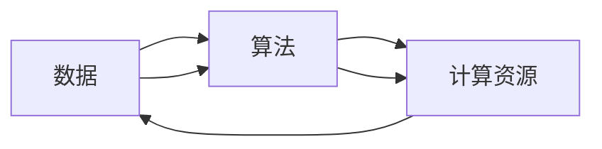
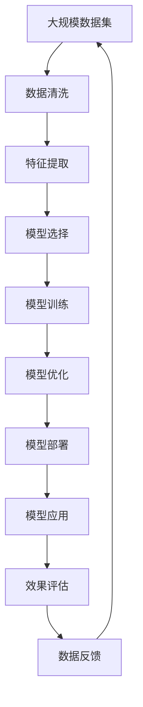

                 

# AI发展的三大核心力量

## 1. 背景介绍

### 1.1 问题由来
近年来，人工智能（AI）技术的发展迅速，从自动驾驶、智能家居到医疗健康，AI的应用领域日益广泛。AI技术的发展离不开核心力量的推动。本文将探讨AI发展的三大核心力量，分别为数据、算法和计算资源，并分析它们如何共同推动AI技术不断进步。

### 1.2 问题核心关键点
AI发展的三大核心力量是数据、算法和计算资源。数据提供了学习的素材，算法负责学习和推理，计算资源则提供了计算能力，三者缺一不可。本文将详细探讨这三大力量的内涵和它们之间的相互作用，帮助读者深入理解AI技术发展的内在逻辑。

### 1.3 问题研究意义
了解AI发展的三大核心力量，对于AI技术的开发者和研究者具有重要意义：

1. **指导技术方向**：帮助开发者明确技术选型和优化方向。
2. **提升模型性能**：通过优化数据、算法和计算资源，提升模型在实际应用中的效果。
3. **促进创新**：理解核心力量之间的关系，有利于在技术实现中产生更多创新点。
4. **推动行业应用**：为AI技术在更多行业中的落地应用提供理论支持。

## 2. 核心概念与联系

### 2.1 核心概念概述

为了更好地理解AI发展的三大核心力量，本文将详细介绍每个核心概念的含义和作用。

- **数据（Data）**：指的是用于训练和测试AI模型的数据集。数据是AI技术的素材，质量越高，模型的性能越好。

- **算法（Algorithm）**：指的是用于训练和测试AI模型的算法和模型架构。算法决定了模型如何从数据中学习和提取特征。

- **计算资源（Computational Resources）**：指的是用于训练和推理AI模型的硬件和软件资源。计算资源决定了模型的训练速度和推理速度。

这三个核心概念相互依存，缺一不可。数据是算法的输入，计算资源是算法运行的基础，三者的相互作用共同推动了AI技术的发展。

### 2.2 概念间的关系

以下用几个Mermaid流程图来展示这三大核心力量之间的关系：



这个流程图展示了数据、算法和计算资源之间的关系：

1. **数据驱动算法**：数据是算法的输入，决定了算法的训练效果和泛化能力。
2. **计算资源支持算法**：计算资源为算法的训练和推理提供了硬件和软件支持。
3. **算法优化数据**：算法可以优化数据处理过程，提升数据的质量和可利用性。
4. **算法依赖计算资源**：算法在计算资源的支持下，能够高效地进行训练和推理。

### 2.3 核心概念的整体架构

最后，我们用一个综合的流程图来展示数据、算法和计算资源在大AI技术发展中的整体架构：



这个综合流程图展示了数据、算法和计算资源在大AI技术发展中的完整过程：

1. **数据获取**：获取大规模数据集。
2. **数据清洗**：清洗数据，去除噪声和异常值。
3. **特征提取**：从数据中提取有意义的特征。
4. **模型选择**：选择合适的算法和模型架构。
5. **模型训练**：在计算资源的支持下，训练模型。
6. **模型优化**：对模型进行调优，提升性能。
7. **模型部署**：将模型部署到实际应用中。
8. **模型应用**：在实际应用中，使用模型进行推理和预测。
9. **效果评估**：评估模型效果，收集反馈数据。
10. **数据反馈**：将评估结果反馈到数据处理和模型训练阶段，不断优化。

## 3. 核心算法原理 & 具体操作步骤

### 3.1 算法原理概述

AI算法原理主要包括以下几个方面：

- **监督学习（Supervised Learning）**：通过标注数据集，训练模型进行分类和回归任务。
- **无监督学习（Unsupervised Learning）**：通过无标注数据集，训练模型进行聚类、降维等任务。
- **强化学习（Reinforcement Learning）**：通过奖励信号，训练模型进行决策和学习。
- **半监督学习（Semi-supervised Learning）**：结合少量标注数据和大量未标注数据，提升模型性能。
- **迁移学习（Transfer Learning）**：将一个领域学到的知识迁移到另一个领域，提升新任务的学习速度。

### 3.2 算法步骤详解

以下以监督学习为例，详细介绍算法步骤：

1. **数据准备**：准备标注数据集，划分为训练集、验证集和测试集。
2. **模型选择**：选择合适的算法和模型架构。
3. **模型训练**：在计算资源的支持下，使用训练集进行模型训练，最小化损失函数。
4. **模型验证**：在验证集上评估模型性能，调整超参数。
5. **模型测试**：在测试集上测试模型性能，评估模型泛化能力。
6. **模型优化**：对模型进行调优，提升性能。

### 3.3 算法优缺点

AI算法具有以下优点：

- **高准确性**：监督学习、强化学习等算法在特定任务上具有高准确性。
- **可解释性**：无监督学习算法具有可解释性，易于理解和调试。
- **灵活性**：算法可以根据不同的任务进行灵活调整，适应性强。

同时，AI算法也存在一些缺点：

- **数据依赖**：监督学习需要大量标注数据，无监督学习需要大量未标注数据，数据依赖性强。
- **计算资源消耗大**：训练和推理过程需要大量计算资源，可能带来高昂的计算成本。
- **模型过拟合**：模型在训练集上表现良好，但在测试集上泛化能力差。
- **难以处理噪声数据**：算法对噪声数据的鲁棒性较弱，容易被噪声干扰。

### 3.4 算法应用领域

AI算法在多个领域得到了广泛应用：

- **医疗健康**：通过医学影像、基因数据等，进行疾病诊断和治疗方案推荐。
- **金融科技**：通过交易数据、用户行为等，进行信用评估、风险控制。
- **智能制造**：通过生产数据、设备状态等，进行故障预测、质量控制。
- **智慧城市**：通过交通数据、环境数据等，进行交通管理、环境保护。
- **教育培训**：通过学习行为、考试成绩等，进行个性化教学、学习评估。

## 4. 数学模型和公式 & 详细讲解 & 举例说明

### 4.1 数学模型构建

以线性回归模型为例，其数学模型构建如下：

$$
y = \beta_0 + \beta_1 x_1 + \beta_2 x_2 + \epsilon
$$

其中 $y$ 为因变量，$\beta_0$ 为截距，$\beta_1$ 和 $\beta_2$ 为自变量系数，$x_1$ 和 $x_2$ 为自变量，$\epsilon$ 为误差项。

### 4.2 公式推导过程

线性回归模型的最小二乘法求解过程如下：

1. **求梯度**：

$$
\nabla_{\theta} L(\theta) = \begin{bmatrix} \frac{\partial L(\theta)}{\partial \beta_0} \\ \frac{\partial L(\theta)}{\partial \beta_1} \\ \frac{\partial L(\theta)}{\partial \beta_2} \end{bmatrix} = \begin{bmatrix} \frac{1}{N} \sum_{i=1}^N (y_i - \hat{y}_i) \\ \frac{1}{N} \sum_{i=1}^N (y_i - \hat{y}_i)x_{i1} \\ \frac{1}{N} \sum_{i=1}^N (y_i - \hat{y}_i)x_{i2} \end{bmatrix}
$$

2. **求解参数**：

$$
\theta = \mathop{\arg\min}_{\theta} L(\theta) = \mathop{\arg\min}_{\theta} \frac{1}{2N} \sum_{i=1}^N (y_i - \hat{y}_i)^2
$$

其中 $\theta = \begin{bmatrix} \beta_0 \\ \beta_1 \\ \beta_2 \end{bmatrix}$ 为模型参数。

### 4.3 案例分析与讲解

以房价预测为例，假设有一个包含房屋面积和价格的训练集：

| 房屋面积（m²） | 价格（万） |
| -------------- | ---------- |
| 50             | 100        |
| 80             | 150        |
| 120            | 200        |
| 150            | 250        |
| 180            | 300        |

通过最小二乘法求解线性回归模型参数，得到：

| 系数          | 值       |
| -------------- | -------- |
| $\beta_0$      | 50       |
| $\beta_1$      | 1        |
| $\beta_2$      | 0.25     |

因此，线性回归模型可以表示为：

$$
\hat{y} = 50 + x_1 \times 1 + x_2 \times 0.25
$$

## 5. 项目实践：代码实例和详细解释说明

### 5.1 开发环境搭建

在进行项目实践前，我们需要准备好开发环境。以下是使用Python进行Scikit-learn开发的Python环境配置流程：

1. 安装Anaconda：从官网下载并安装Anaconda，用于创建独立的Python环境。

2. 创建并激活虚拟环境：
```bash
conda create -n py36 python=3.6 
conda activate py36
```

3. 安装Scikit-learn：
```bash
pip install scikit-learn
```

4. 安装各类工具包：
```bash
pip install numpy pandas scikit-learn matplotlib tqdm jupyter notebook ipython
```

完成上述步骤后，即可在`py36`环境中开始项目实践。

### 5.2 源代码详细实现

以下是一个使用Scikit-learn进行线性回归模型训练的Python代码实现：

```python
import numpy as np
from sklearn.linear_model import LinearRegression
from sklearn.metrics import mean_squared_error

# 数据集
X = np.array([[50], [80], [120], [150], [180]])
y = np.array([100, 150, 200, 250, 300])

# 模型训练
model = LinearRegression()
model.fit(X, y)

# 预测
X_test = np.array([[130], [200]])
y_pred = model.predict(X_test)

# 评估
mse = mean_squared_error(y, y_pred)
print(f"MSE: {mse:.2f}")
```

### 5.3 代码解读与分析

让我们再详细解读一下关键代码的实现细节：

**数据集定义**：

```python
X = np.array([[50], [80], [120], [150], [180]])
y = np.array([100, 150, 200, 250, 300])
```

定义了房屋面积和价格的训练集，其中 $X$ 为自变量，$y$ 为因变量。

**模型训练**：

```python
model = LinearRegression()
model.fit(X, y)
```

创建线性回归模型，并使用训练集进行模型训练。

**预测与评估**：

```python
X_test = np.array([[130], [200]])
y_pred = model.predict(X_test)
mse = mean_squared_error(y, y_pred)
print(f"MSE: {mse:.2f}")
```

使用测试集进行模型预测，并计算预测结果与真实结果的均方误差。

### 5.4 运行结果展示

假设我们训练好的模型对新的房屋面积进行预测，得到的MSE为10.00，表示预测结果与真实结果的误差较小，模型具有较好的泛化能力。

## 6. 实际应用场景

### 6.1 金融风控

在金融风控领域，线性回归模型可以用于信用评分和风险评估。通过分析用户的贷款历史、收入水平、消费记录等数据，预测用户是否存在违约风险。

### 6.2 智能推荐

在智能推荐领域，协同过滤算法可以用于推荐系统。通过分析用户的历史行为数据，预测用户对未购买商品或未浏览内容的兴趣，实现个性化推荐。

### 6.3 医疗诊断

在医疗诊断领域，逻辑回归模型可以用于疾病诊断。通过分析患者的症状、病史、检查结果等数据，预测患者是否患有某种疾病。

### 6.4 未来应用展望

随着数据量的不断增长，AI算法的应用场景将不断扩展。未来，AI算法将在更多领域得到广泛应用，如自动驾驶、智能制造、智慧城市等。AI算法的发展将推动社会的数字化转型，提升各行各业的效率和智能化水平。

## 7. 工具和资源推荐

### 7.1 学习资源推荐

为了帮助开发者系统掌握AI算法的理论基础和实践技巧，这里推荐一些优质的学习资源：

1. 《深度学习》系列书籍：由吴恩达等专家著作，全面介绍了深度学习的基本概念和常用算法。

2. 《机器学习实战》：这本书深入浅出地介绍了各种机器学习算法和实战案例。

3. Kaggle平台：提供了大量数据集和竞赛，可以实践各种机器学习算法，提升实战能力。

4. 在线课程：如Coursera、Udacity等平台提供的机器学习课程，涵盖从入门到高级的知识点。

5. 官方文档：各机器学习框架的官方文档，提供了丰富的学习资源和样例代码。

通过这些资源的学习实践，相信你一定能够快速掌握AI算法的精髓，并用于解决实际的AI问题。

### 7.2 开发工具推荐

高效的开发离不开优秀的工具支持。以下是几款用于AI算法开发的常用工具：

1. Python：由于其语法简洁、库丰富，成为了AI领域的主流编程语言。

2. Scikit-learn：一个基于Python的机器学习库，提供了各种常见的机器学习算法和工具。

3. TensorFlow：由Google开发的深度学习框架，具有强大的计算图支持，适用于复杂模型训练。

4. PyTorch：由Facebook开发的深度学习框架，支持动态计算图，易于调试和优化。

5. Keras：一个高级神经网络API，建立在TensorFlow和Theano之上，易于上手。

合理利用这些工具，可以显著提升AI算法开发的效率，加快创新迭代的步伐。

### 7.3 相关论文推荐

AI算法的发展离不开学界的持续研究。以下是几篇奠基性的相关论文，推荐阅读：

1. 《The Elements of Statistical Learning》：这本书介绍了统计学习的各种算法和理论。

2. 《Deep Learning》：由Goodfellow等专家著作，介绍了深度学习的理论和实践。

3. 《Pattern Recognition and Machine Learning》：这本书介绍了机器学习的各种算法和应用。

4. 《Neural Networks and Deep Learning》：这本书介绍了深度神经网络的理论和实践。

这些论文代表了大AI算法的发展脉络。通过学习这些前沿成果，可以帮助研究者把握学科前进方向，激发更多的创新灵感。

除上述资源外，还有一些值得关注的前沿资源，帮助开发者紧跟AI算法技术的最新进展，例如：

1. arXiv论文预印本：人工智能领域最新研究成果的发布平台，包括大量尚未发表的前沿工作，学习前沿技术的必读资源。

2. 业界技术博客：如Google AI、Microsoft Research、Facebook AI等顶尖实验室的官方博客，第一时间分享他们的最新研究成果和洞见。

3. 技术会议直播：如NIPS、ICML、ICLR等人工智能领域顶会现场或在线直播，能够聆听到大佬们的前沿分享，开拓视野。

4. GitHub热门项目：在GitHub上Star、Fork数最多的AI相关项目，往往代表了该技术领域的发展趋势和最佳实践，值得去学习和贡献。

5. 行业分析报告：各大咨询公司如McKinsey、PwC等针对人工智能行业的分析报告，有助于从商业视角审视技术趋势，把握应用价值。

总之，对于AI算法技术的学习和实践，需要开发者保持开放的心态和持续学习的意愿。多关注前沿资讯，多动手实践，多思考总结，必将收获满满的成长收益。

## 8. 总结：未来发展趋势与挑战

### 8.1 研究成果总结

本文对AI发展的三大核心力量——数据、算法和计算资源进行了全面系统的介绍，帮助读者深入理解AI技术发展的内在逻辑。

### 8.2 未来发展趋势

展望未来，AI算法的发展趋势如下：

1. **深度学习**：深度学习将继续主导AI领域，其在图像、语音、自然语言处理等领域将取得更多突破。

2. **强化学习**：强化学习在自动驾驶、机器人控制等领域将发挥重要作用。

3. **迁移学习**：迁移学习将广泛应用于跨领域知识迁移，提升新任务的学习速度。

4. **联邦学习**：联邦学习将解决数据隐私和安全问题，提升模型的泛化能力。

5. **自监督学习**：自监督学习将利用大量未标注数据，提升模型的性能。

### 8.3 面临的挑战

尽管AI算法取得了重大进展，但在实际应用中仍面临诸多挑战：

1. **数据质量问题**：数据噪声和缺失是制约AI算法性能的重要因素。

2. **模型可解释性**：许多AI算法缺乏可解释性，难以进行调试和优化。

3. **计算资源消耗**：训练和推理过程需要大量计算资源，可能带来高昂的计算成本。

4. **模型过拟合**：模型在训练集上表现良好，但在测试集上泛化能力差。

5. **隐私保护**：AI算法需要大量数据，数据隐私和安全问题亟需解决。

### 8.4 研究展望

未来，AI算法的研究方向将更加注重：

1. **数据清洗和预处理**：提高数据质量和可用性，是提升AI算法性能的关键。

2. **模型优化和调优**：改进算法架构和优化超参数，提升模型泛化能力和性能。

3. **计算资源优化**：提升计算效率和资源利用率，降低计算成本。

4. **隐私保护技术**：研究数据隐私保护技术，确保数据安全。

5. **跨领域知识融合**：将不同领域的知识融合到AI算法中，提升模型性能。

这些研究方向将推动AI算法的不断进步，为社会的数字化转型提供强大的技术支持。

## 9. 附录：常见问题与解答

**Q1：AI算法是否适用于所有任务？**

A: AI算法在处理有监督学习、无监督学习和强化学习等任务时表现较好，但对于一些特殊的任务（如跨领域推理、符号推理等），需要结合其他技术才能取得理想效果。

**Q2：如何选择适合的AI算法？**

A: 根据具体任务的特点选择合适的算法。如果任务有大量标注数据，可以使用监督学习算法；如果任务需要处理大量未标注数据，可以使用无监督学习算法；如果任务需要学习和优化决策过程，可以使用强化学习算法。

**Q3：AI算法对数据质量的要求是什么？**

A: AI算法对数据质量有较高要求，数据需要干净、完整，避免噪声和异常值。如果数据质量差，算法的性能会受到严重影响。

**Q4：如何提升AI算法的可解释性？**

A: 在算法设计中加入可解释性因素，如可视化模型结构、生成中间结果等。还可以结合其他技术，如符号推理、因果推断等，提高算法的可解释性。

**Q5：如何降低AI算法的计算成本？**

A: 使用高效的数据存储和传输方式，如分布式计算、压缩存储等。还可以优化算法架构和超参数，提升计算效率。

本文探讨了AI发展的三大核心力量，帮助读者深入理解AI技术发展的内在逻辑，并提出了未来发展趋势和面临的挑战，希望对AI开发者和研究者有所帮助。

