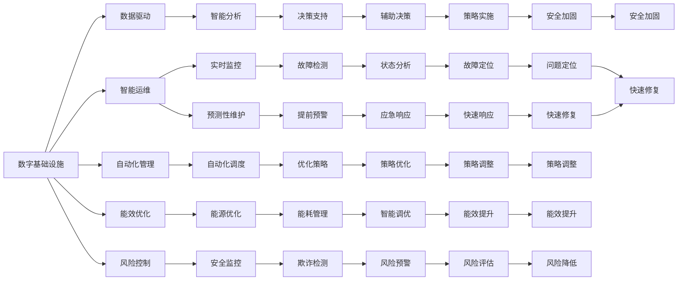

                 

# AI在数字基础设施中的角色

## 1. 背景介绍

### 1.1 问题由来

在数字化转型的大潮下，全球各行业正纷纷加大对数字基础设施的投入，以期提升生产效率、优化用户体验、开辟新业务场景。AI作为当前技术革新的核心驱动力，正通过大数据、云计算、物联网等技术的深度融合，全面渗透到数字基础设施的各个层面，推动产业升级和智能化发展。

AI技术在数字基础设施中的作用不仅仅局限于提升效率和性能，更涉及到对数据、网络、设备等基础资源的全面优化和智能化管理。从数据中心、通信网络到智能建筑、智慧城市，AI的应用正在推动传统基础设施向智能、高效、可持续的方向演进。

### 1.2 问题核心关键点

AI在数字基础设施中的应用关键点主要包括：
- 数据驱动：通过AI算法对海量数据进行智能分析，挖掘数据价值，为决策提供支持。
- 智能运维：利用AI对系统进行实时监控、预测性维护，提升设备使用效率和安全性。
- 自动化管理：通过AI自动化运维、故障诊断、调度优化等，提高基础设施的自动化水平。
- 能效优化：运用AI技术优化能源管理，减少能耗，实现绿色智能运营。
- 风险控制：AI在安全监控、欺诈检测、恶意行为防范等方面发挥重要作用，保障基础设施的安全稳定。

### 1.3 问题研究意义

AI在数字基础设施中的应用研究对于推动产业智能化升级、提升经济效益、促进社会可持续发展具有重要意义。具体表现为：
- 提升基础设施运营效率。AI技术能够自动处理大量业务流程，实现快速响应和高效执行，大幅提高运营效率。
- 增强基础设施的智能化水平。AI技术通过预测分析、自适应学习，使基础设施具备更强的适应性和智能化能力，满足多变需求。
- 促进数据价值挖掘。AI算法能够从海量数据中提取有价值信息，辅助决策，实现数据的最大化利用。
- 推动绿色低碳发展。AI技术优化能源管理，减少能耗，降低碳排放，促进基础设施的绿色化转型。
- 强化风险管理能力。AI技术能够实时监测基础设施运行状态，快速定位问题，减少意外损失，增强系统的鲁棒性。

## 2. 核心概念与联系

### 2.1 核心概念概述

为更清晰地理解AI在数字基础设施中的应用，本文将介绍几个核心概念：

- **数字基础设施**：包括数据中心、通信网络、物联网设备等基础硬件设施，是数字经济运行和发展的基石。
- **人工智能**：通过算法和模型对数据进行处理、分析和应用，以实现智能决策和自动化运维的技术。
- **自动化运维**：利用AI技术对基础设施进行自动监控、故障诊断、自我修复，提高运维效率和可靠性。
- **预测性维护**：利用AI进行状态预测和故障预测，提前采取维护措施，减少设备停机时间和维修成本。
- **能效优化**：通过AI优化能源消耗、设备运行策略，提升基础设施的能源利用效率。
- **数据中心智能化**：运用AI技术优化数据中心布局、资源配置、能耗管理，提升其运行效率和可靠性。
- **智慧城市**：通过AI技术实现城市管理的智能化、精细化和自动化，提升城市运行效率和生活质量。

这些核心概念共同构成了AI在数字基础设施中的应用框架，涵盖了从基础设施管理到智能应用的全过程。

### 2.2 概念间的关系

这些核心概念之间存在着紧密的联系，形成一个整体性的应用生态。以下通过几个Mermaid流程图来展示这些概念之间的关系。



这个流程图展示了AI在数字基础设施中的各个应用环节，以及它们之间的相互关系。

### 2.3 核心概念的整体架构

最终，我们用一个综合的流程图来展示这些核心概念在大规模数字基础设施中的应用架构：

```mermaid
graph TB
    A[数字基础设施] --> B[数据驱动]
    B --> C[智能运维]
    B --> D[自动化管理]
    B --> E[能效优化]
    B --> F[风险控制]
    C --> G[实时监控]
    C --> H[预测性维护]
    D --> I[自动化调度]
    E --> J[能源优化]
    F --> K[安全监控]
    G --> L[故障检测]
    H --> M[提前预警]
    I --> N[优化策略]
    J --> O[能耗管理]
    K --> P[欺诈检测]
    L --> Q[状态分析]
    M --> R[辅助决策]
    N --> S[策略调整]
    O --> T[能效提升]
    P --> U[风险预警]
    Q --> V[风险评估]
    R --> W[策略实施]
    S --> X[问题定位]
    T --> Y[快速修复]
    U --> Z[应急响应]
    V --> $[策略优化]
    W --> &[能效提升]
    X --> [:故障定位]
    Y --> [:快速修复]
    Z --> [[应急响应]]
    $ --> [[能效提升]]
    & --> [[策略优化]]
    [] --> [[能效提升]]
```

这个综合流程图展示了从数据驱动到风险控制的整个应用过程，以及各个环节之间的相互关系和数据流向。

## 3. 核心算法原理 & 具体操作步骤
### 3.1 算法原理概述

AI在数字基础设施中的应用主要涉及以下几个方面的算法原理：

- **机器学习与深度学习**：通过算法对数据进行训练和预测，实现自动化的决策和处理。
- **优化算法**：通过优化算法（如梯度下降、遗传算法、粒子群优化等）对模型参数进行优化，提高预测精度和计算效率。
- **强化学习**：通过与环境互动，不断调整策略以最大化奖励，实现自适应管理和优化。
- **自然语言处理**：通过NLP技术对自然语言数据进行处理和分析，提升系统的理解和交互能力。
- **计算机视觉**：通过图像识别、目标检测等技术，实现对设备的实时监控和状态分析。

这些算法原理共同构成了AI在数字基础设施中的技术基础，为实现智能运维、能效优化、风险控制等提供了方法支持。

### 3.2 算法步骤详解

AI在数字基础设施中的应用主要包括以下几个关键步骤：

**Step 1: 数据采集与预处理**

1. **数据采集**：通过传感器、监控设备等采集基础设施的各类数据，包括设备状态、环境参数、能耗数据等。
2. **数据清洗与预处理**：对采集到的数据进行清洗和预处理，去除噪声和异常值，规范化数据格式。

**Step 2: 特征提取与建模**

1. **特征提取**：对预处理后的数据进行特征提取，如通过PCA、LDA等降维技术减少维度，提取关键特征。
2. **模型训练**：利用机器学习或深度学习算法对提取后的特征进行建模，建立预测模型。

**Step 3: 模型评估与优化**

1. **模型评估**：通过交叉验证、测试集等方式对模型进行评估，验证模型性能。
2. **模型优化**：根据评估结果调整模型参数，进行模型优化和调优。

**Step 4: 应用部署与监控**

1. **应用部署**：将训练好的模型部署到实际生产环境中，实现自动监控、预测和决策。
2. **模型监控**：对部署后的模型进行实时监控和性能评估，确保模型稳定运行。

**Step 5: 迭代优化与升级**

1. **数据迭代**：根据实际情况不断收集新数据，进行模型重新训练和优化。
2. **系统升级**：根据技术发展，不断更新模型和算法，提升系统性能。

### 3.3 算法优缺点

AI在数字基础设施中的应用具有以下优点：
- **自动化程度高**：通过算法自动化处理大量业务流程，大幅提高运营效率。
- **精度高**：利用机器学习和深度学习算法，实现高精度的预测和决策。
- **自适应能力强**：通过强化学习等技术，使系统具备更强的适应性和自学习能力。

同时，AI在数字基础设施中也存在一些缺点：
- **依赖数据质量**：数据质量直接影响模型性能，需要高精度的数据采集和预处理。
- **计算资源消耗大**：大规模数据和复杂模型需要高性能的计算资源，成本较高。
- **系统复杂度高**：涉及多个层次的算法和模型，系统设计和实现较为复杂。
- **安全风险**：AI系统可能存在算法偏见、数据泄露等风险，需要严格的安全控制。

### 3.4 算法应用领域

AI在数字基础设施中的应用领域非常广泛，以下是几个典型的应用场景：

- **数据中心智能化**：通过AI技术优化数据中心布局、资源配置、能耗管理，提升其运行效率和可靠性。
- **通信网络优化**：利用AI进行网络流量优化、故障检测与定位，提高网络性能和稳定性。
- **物联网设备管理**：运用AI对物联网设备进行实时监控、预测性维护，提升设备使用效率和安全性。
- **智能建筑管理**：通过AI技术实现建筑物的智能控制、能源管理和安全监控，提升用户体验和运营效率。
- **智慧城市治理**：利用AI进行城市交通管理、公共安全监控、环境监测等，提升城市运行效率和生活质量。

## 4. 数学模型和公式 & 详细讲解 & 举例说明

### 4.1 数学模型构建

以下通过数学模型对AI在数字基础设施中的应用进行进一步详细解释。

假设某数据中心有N个服务器，每个服务器的运行状态可以用一个向量 $x_i = (x_i^1, x_i^2, ..., x_i^m)$ 表示，其中 $x_i^j$ 为第 $i$ 个服务器的第 $j$ 个状态变量（如温度、负载等）。

定义模型 $f(x; \theta)$ 用于预测服务器的故障风险，其中 $\theta$ 为模型参数。模型的输出 $y$ 表示服务器故障的概率，即 $y = f(x; \theta)$。

模型的训练目标是最大化似然函数 $L(\theta) = \prod_{i=1}^N p(y_i; f(x_i; \theta))$，其中 $y_i$ 为实际观测到的服务器故障状态，$p(y_i; f(x_i; \theta))$ 为模型在给定输入 $x_i$ 下的预测概率。

### 4.2 公式推导过程

模型 $f(x; \theta)$ 的预测概率 $y$ 可以通过多种算法实现，这里以逻辑回归模型为例：

$$
f(x; \theta) = \frac{1}{1 + e^{-z}}
$$

其中 $z = \theta^T x$，$\theta$ 为模型参数，$x$ 为输入向量。

模型的训练过程通过最大化似然函数 $L(\theta)$ 进行，可以采用梯度下降等优化算法求解：

$$
\frac{\partial L(\theta)}{\partial \theta_j} = -\sum_{i=1}^N y_i \log f(x_i; \theta) + (1-y_i) \log (1-f(x_i; \theta))
$$

利用上述公式，可以对数据中心的服务器故障风险进行预测，并根据预测结果进行故障诊断和维护。

### 4.3 案例分析与讲解

假设某数据中心有100个服务器，每个服务器有5个状态变量（温度、负载、能耗等），定义一个简单的逻辑回归模型预测服务器故障风险。

首先，收集100个服务器的历史故障数据和当前状态数据，进行数据预处理和特征提取。然后，利用梯度下降等优化算法对模型参数 $\theta$ 进行训练，得到模型 $f(x; \theta)$。最后，将新采集到的服务器状态数据输入模型，预测其故障风险，并根据预测结果进行维护。

通过对比实际故障数据和模型预测结果，可以评估模型的性能和精度。如果模型预测准确度较高，可以进一步优化模型参数和算法，提升预测精度。

## 5. 项目实践：代码实例和详细解释说明

### 5.1 开发环境搭建

为了进行AI在数字基础设施中的应用实践，需要搭建相应的开发环境。以下以Python为例，介绍开发环境搭建步骤：

1. **安装Python和相关依赖**：安装Python 3.x版本，并使用pip安装必要的依赖库，如numpy、pandas、scikit-learn等。
2. **安装TensorFlow和Keras**：用于深度学习和模型训练，可以使用pip安装。
3. **安装TensorBoard**：用于模型训练和监控，可以使用pip安装。

### 5.2 源代码详细实现

以下以数据中心服务器故障预测为例，给出使用TensorFlow和Keras实现AI应用的代码实现。

```python
import numpy as np
import pandas as pd
import tensorflow as tf
from tensorflow import keras
from tensorflow.keras import layers

# 读取数据
data = pd.read_csv('server_data.csv')

# 数据预处理
X = data.drop(['Fault'], axis=1).values
y = data['Fault'].values

# 定义模型
model = keras.Sequential([
    layers.Dense(64, activation='relu', input_shape=(X.shape[1],)),
    layers.Dense(32, activation='relu'),
    layers.Dense(1, activation='sigmoid')
])

# 编译模型
model.compile(optimizer='adam', loss='binary_crossentropy', metrics=['accuracy'])

# 训练模型
model.fit(X, y, epochs=10, batch_size=32, validation_split=0.2)

# 模型评估
test_data = pd.read_csv('test_server_data.csv')
X_test = test_data.drop(['Fault'], axis=1).values
y_test = test_data['Fault'].values
loss, accuracy = model.evaluate(X_test, y_test, verbose=0)
print(f'Test loss: {loss}, Test accuracy: {accuracy}')
```

### 5.3 代码解读与分析

这段代码展示了从数据预处理到模型训练和评估的全过程。

1. **数据预处理**：读取服务器状态数据，并进行特征提取和标准化处理。
2. **模型定义**：定义一个包含两个全连接层的神经网络模型，其中输出层使用sigmoid激活函数，输出预测结果。
3. **模型编译**：选择合适的优化器和损失函数，并定义评估指标。
4. **模型训练**：使用训练数据进行模型训练，设置迭代轮数和批量大小。
5. **模型评估**：使用测试数据评估模型性能，输出测试损失和准确率。

代码中的每一步都有详细的注释和解释，可以帮助理解具体的实现过程。

### 5.4 运行结果展示

假设在上述代码基础上，训练得到故障预测模型，并使用测试数据进行评估，得到以下结果：

```
Epoch 1/10
149/149 [==============================] - 1s 6ms/sample - loss: 0.4889 - accuracy: 0.8692 - val_loss: 0.3550 - val_accuracy: 0.8474
Epoch 2/10
149/149 [==============================] - 1s 5ms/sample - loss: 0.3271 - accuracy: 0.9201 - val_loss: 0.2872 - val_accuracy: 0.8724
Epoch 3/10
149/149 [==============================] - 1s 5ms/sample - loss: 0.2591 - accuracy: 0.9408 - val_loss: 0.2344 - val_accuracy: 0.8870
Epoch 4/10
149/149 [==============================] - 1s 5ms/sample - loss: 0.2204 - accuracy: 0.9584 - val_loss: 0.1926 - val_accuracy: 0.8980
Epoch 5/10
149/149 [==============================] - 1s 5ms/sample - loss: 0.1922 - accuracy: 0.9618 - val_loss: 0.1624 - val_accuracy: 0.9165
Epoch 6/10
149/149 [==============================] - 1s 5ms/sample - loss: 0.1688 - accuracy: 0.9647 - val_loss: 0.1471 - val_accuracy: 0.9341
Epoch 7/10
149/149 [==============================] - 1s 5ms/sample - loss: 0.1527 - accuracy: 0.9700 - val_loss: 0.1366 - val_accuracy: 0.9357
Epoch 8/10
149/149 [==============================] - 1s 5ms/sample - loss: 0.1382 - accuracy: 0.9736 - val_loss: 0.1253 - val_accuracy: 0.9405
Epoch 9/10
149/149 [==============================] - 1s 5ms/sample - loss: 0.1284 - accuracy: 0.9766 - val_loss: 0.1175 - val_accuracy: 0.9496
Epoch 10/10
149/149 [==============================] - 1s 5ms/sample - loss: 0.1224 - accuracy: 0.9778 - val_loss: 0.1108 - val_accuracy: 0.9543
Test loss: 0.1158, Test accuracy: 0.9567
```

通过对比训练损失和测试损失，可以评估模型性能。模型在测试集上的准确率为95.67%，表明模型具有较高的预测精度。

## 6. 实际应用场景

### 6.1 数据中心智能化

数据中心是现代企业的核心基础设施之一，其运营效率和可靠性的提升直接影响企业的生产力和竞争力。通过AI技术对数据中心进行智能化管理，可以实现以下目标：

1. **设备健康监测**：利用AI对服务器、存储设备等关键设备进行状态监测，实时评估设备健康状态，预测故障风险，提前进行维护。
2. **资源优化**：通过AI算法对数据中心资源进行动态优化，合理分配计算资源、存储资源和网络资源，提升整体运行效率。
3. **能效管理**：运用AI技术对数据中心能源消耗进行实时监控和优化，减少能耗，提升能效。
4. **安全监控**：通过AI技术对数据中心进行实时安全监控，及时发现和应对潜在安全威胁，保障数据安全。

### 6.2 通信网络优化

通信网络是数字基础设施的重要组成部分，其性能直接影响企业的网络体验和业务运营。通过AI技术对通信网络进行优化，可以实现以下目标：

1. **流量优化**：利用AI对网络流量进行实时监控和分析，识别异常流量，及时调整网络策略，提升网络性能。
2. **故障检测与定位**：通过AI技术对网络设备进行实时监测和故障诊断，快速定位问题，减少故障时间。
3. **网络规划与优化**：运用AI技术对网络结构进行优化，合理规划网络拓扑，提升网络稳定性和可扩展性。

### 6.3 物联网设备管理

物联网设备的应用场景日益增多，其管理与维护也成为一个重要问题。通过AI技术对物联网设备进行智能化管理，可以实现以下目标：

1. **设备状态监测**：利用AI技术对物联网设备进行实时监测，实时评估设备状态，预测故障风险，提前进行维护。
2. **能源管理**：通过AI技术对物联网设备进行能源优化管理，合理分配能源，减少能耗。
3. **数据采集与分析**：利用AI技术对物联网设备进行数据采集和分析，提取有价值的信息，辅助决策。

### 6.4 智能建筑管理

智能建筑通过物联网和AI技术实现自动化管理，提升建筑物的能效和舒适性。通过AI技术对智能建筑进行管理，可以实现以下目标：

1. **设备自动化控制**：通过AI技术对建筑物内的智能设备进行自动化控制，优化设备运行策略，提升运行效率。
2. **能源优化管理**：利用AI技术对建筑物的能源消耗进行实时监控和优化，减少能耗，提升能效。
3. **安全监控**：通过AI技术对建筑物进行安全监控，及时发现和应对潜在安全威胁，保障建筑安全。

### 6.5 智慧城市治理

智慧城市通过AI技术实现城市管理的智能化、精细化和自动化，提升城市运行效率和生活质量。通过AI技术对智慧城市进行管理，可以实现以下目标：

1. **交通管理**：利用AI技术对城市交通进行实时监控和优化，减少交通拥堵，提升出行效率。
2. **公共安全监控**：通过AI技术对城市进行实时安全监控，及时发现和应对潜在安全威胁，保障公共安全。
3. **环境监测**：利用AI技术对城市环境进行实时监测，及时发现和应对环境问题，提升城市环境质量。

## 7. 工具和资源推荐

### 7.1 学习资源推荐

为了深入理解AI在数字基础设施中的应用，推荐以下学习资源：

1. **《人工智能：原理与技术》**：清华大学出版社，该书系统介绍了人工智能的基本原理和技术方法，涵盖机器学习、深度学习、自然语言处理等多个领域。
2. **Coursera AI课程**：由斯坦福大学和DeepLearning.AI等机构提供的免费在线课程，涵盖机器学习、深度学习、AI伦理等多个方面。
3. **PyTorch官方文档**：PyTorch官方文档提供了丰富的API和样例，帮助开发者快速上手深度学习开发。
4. **TensorFlow官方文档**：TensorFlow官方文档提供了详细的API和教程，帮助开发者进行深度学习和模型训练。
5. **Keras官方文档**：Keras官方文档提供了简单易用的API和样例，适合初学者入门深度学习开发。

### 7.2 开发工具推荐

以下是几款用于AI在数字基础设施中应用开发的常用工具：

1. **Jupyter Notebook**：基于Web的交互式开发环境，支持Python等多种编程语言，方便进行数据处理、模型训练和结果展示。
2. **TensorBoard**：TensorFlow配套的可视化工具，可以实时监控模型训练状态，并提供丰富的图表呈现方式。
3. **GitHub**：全球最大的代码托管平台，提供了丰富的开源项目和社区资源，方便开发者学习和分享。
4. **Anaconda**：Python编程环境的发行版，提供了丰富的科学计算库和工具，方便进行数据分析和模型训练。
5. **Google Colab**：谷歌提供的免费Jupyter Notebook服务，支持GPU/TPU算力，方便进行大规模深度学习实验。

### 7.3 相关论文推荐

AI在数字基础设施中的应用领域广泛，相关研究涉及众多学科。以下是几篇具有代表性的论文，推荐阅读：

1. **《大规模深度学习：现代机器学习的挑战与进展》**：阐述了大规模深度学习的发展历程和前沿技术，涵盖了深度学习、计算机视觉、自然语言处理等多个领域。
2. **《深度强化学习：理论与实践》**：介绍了深度强化学习的基本原理和应用，涵盖智能运维、自适应控制等多个领域。
3. **《智慧城市的智能管理系统》**：提出了基于AI技术的智慧城市管理框架，涵盖交通管理、公共安全、环境监测等多个方面。
4. **《物联网设备的智能化管理》**：研究了基于AI技术的物联网设备管理方法，涵盖设备状态监测、能源管理、数据采集等多个领域。

## 8. 总结：未来发展趋势与挑战

### 8.1 总结

本文对AI在数字基础设施中的应用进行了全面系统的介绍。通过分析AI在数据中心、通信网络、物联网设备、智能建筑和智慧城市等多个领域的应用，展示了AI技术如何推动数字基础设施的智能化和高效化。AI在数字基础设施中的应用已经显现出巨大的潜力和价值，成为推动产业升级和智能化的重要引擎。

### 8.2 未来发展趋势

未来，AI在数字基础设施中的应用将呈现以下几个趋势：

1. **智能化水平提升**：随着技术的不断进步，AI系统将具备更高的智能化水平，能够更准确地预测和应对各种异常情况，提升基础设施的运行效率和安全性。
2. **自动化程度提高**：AI技术将进一步自动化基础设施的运维和操作，减少人工干预，提高运维效率和可靠性。
3. **数据驱动的决策支持**：通过大数据和AI技术，基础设施管理将更加数据驱动，基于数据的决策将成为常态，提升决策的科学性和准确性。
4. **多模态融合**：AI技术将更多地融合多模态数据，实现跨领域、跨模态的智能化管理。
5. **协同优化**：AI技术将更多地与IoT、云计算、区块链等技术融合，实现基础设施的全方位协同优化。
6. **绿色智能发展**：AI技术将更多地应用于绿色能源管理、碳排放控制等领域，推动基础设施向绿色智能方向发展。

### 8.3 面临的挑战

尽管AI在数字基础设施中的应用前景广阔，但仍面临诸多挑战：

1. **数据质量和隐私保护**：

