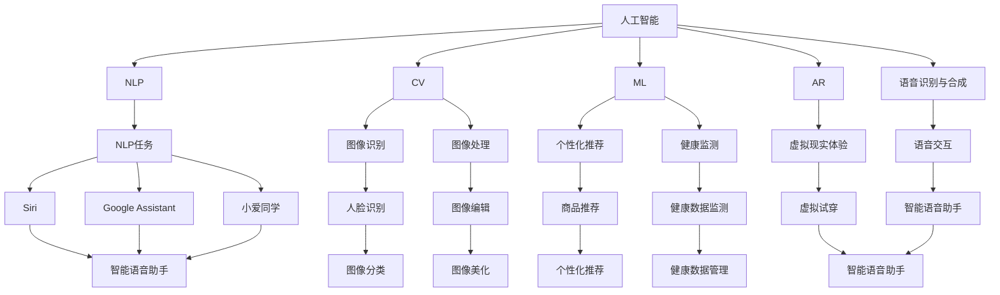
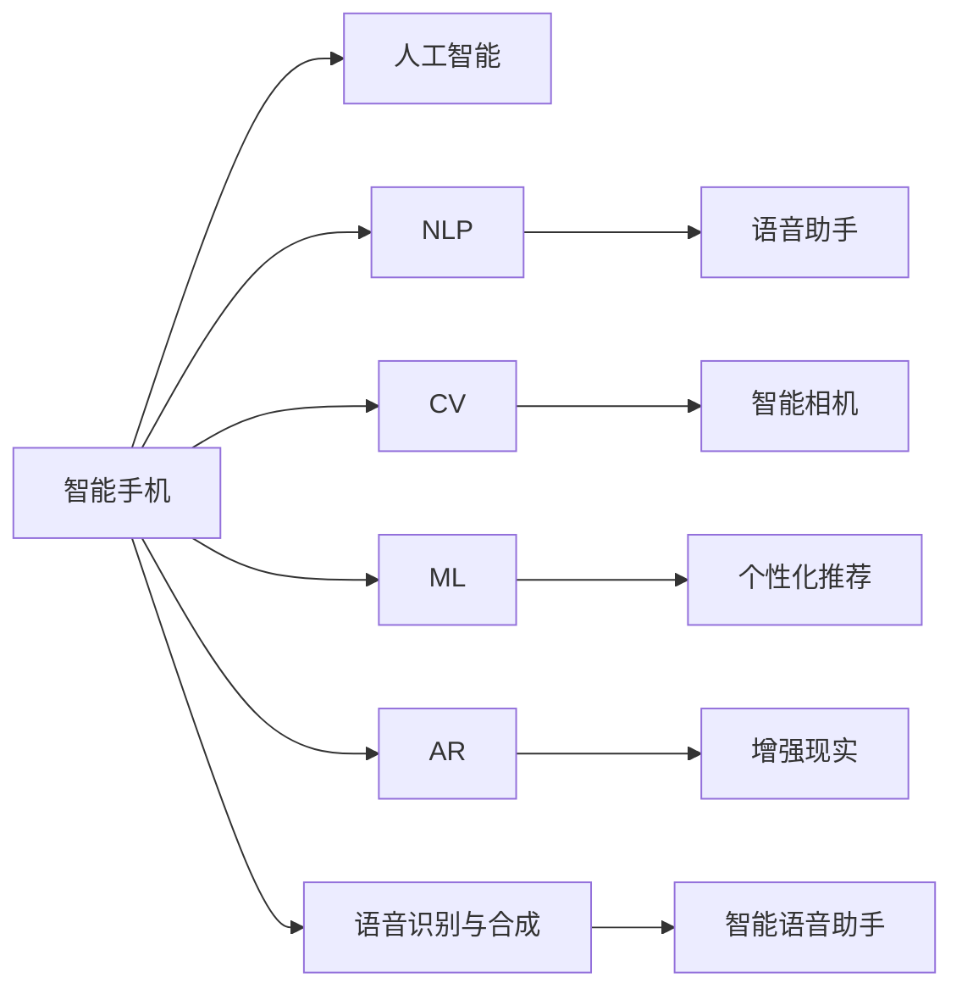
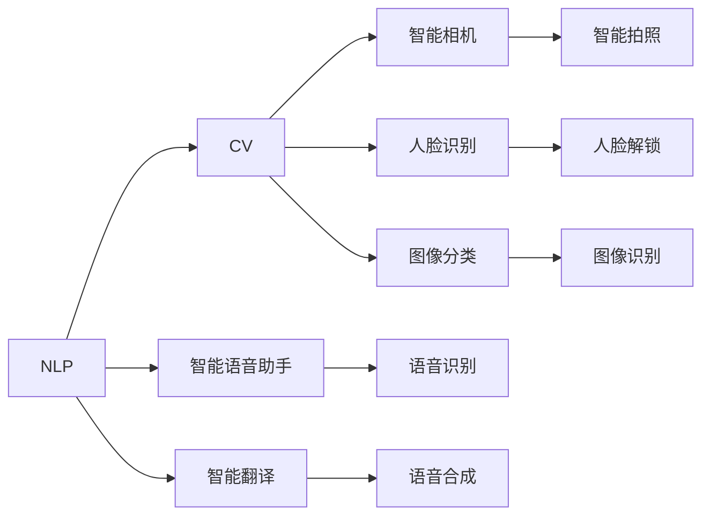
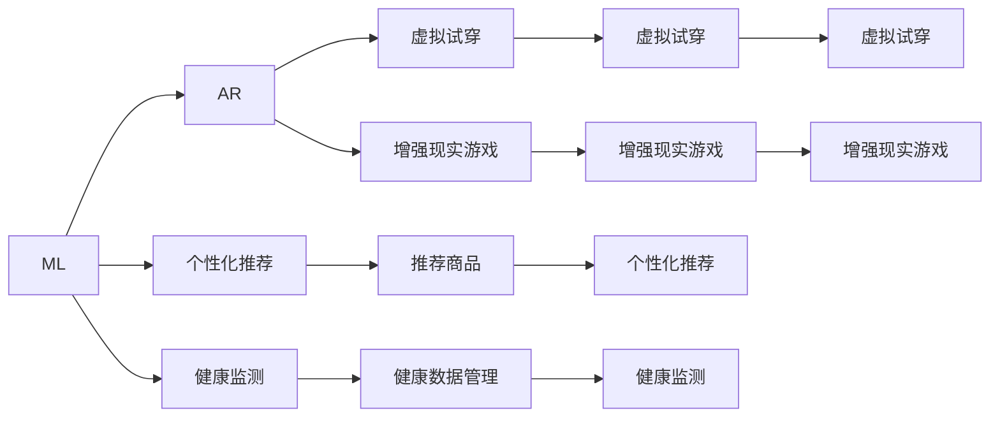
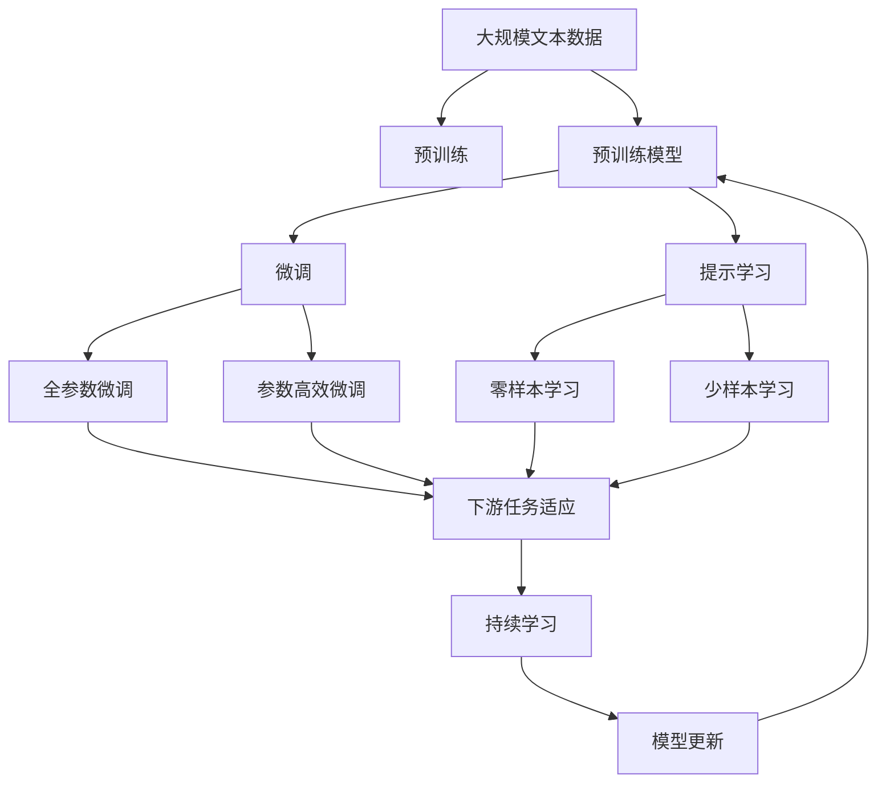

                 

# AI在智能手机中的应用:增强移动体验

## 1. 背景介绍

智能手机已成为现代人不可或缺的通信和信息工具。而随着人工智能技术的迅速发展，AI在智能手机中的应用也越来越广泛。从智能助理、智能相机到智能健康监测，AI正全面渗透到智能手机的使用中，极大地提升用户体验和智能化水平。

### 1.1 问题由来
智能手机的使用场景丰富，用户需求多样，如何在有限的硬件资源下，提供更加智能、个性化的服务？人工智能技术提供了新的解决方案。AI通过智能化地处理自然语言、图像、语音等信号，在智能手机中发挥着越来越重要的作用。通过在智能手机上集成AI，手机厂商能提供更丰富、更精准的服务，满足用户个性化需求。

### 1.2 问题核心关键点
AI在智能手机中的应用，主要集中在以下几个方面：
1. **自然语言处理（NLP）**：AI能理解、处理用户的自然语言输入，如语音助手、智能翻译等。
2. **计算机视觉（CV）**：AI能识别、分析摄像头捕捉到的图像、视频，如人脸识别、智能拍照等。
3. **机器学习（ML）**：AI能从用户行为数据中学习，提供个性化推荐、健康监测等。
4. **增强现实（AR）**：AI能将数字信息与现实世界结合，提供更加丰富的交互体验。
5. **语音识别与合成**：AI能处理语音信号，进行语音识别和合成，提升智能手机的交互体验。

### 1.3 问题研究意义
AI在智能手机中的应用，不仅提升了手机的智能化水平，还带来了新的商业模式和市场机会。以下是AI在智能手机中的重要意义：
1. 提升用户体验：AI能提供更加个性化、智能化的服务，满足用户多样化的需求。
2. 拓展应用场景：AI技术推动了智能手机在健康监测、娱乐、教育等领域的拓展。
3. 促进产业升级：AI技术的应用，推动了智能手机向更智能化、个性化的方向发展，催生了更多创新型应用。
4. 增加市场竞争：AI技术成为手机厂商竞争的重要手段，推动了手机市场的快速发展和升级。
5. 创造新的价值：AI在智能手机中的应用，提供了更多增值服务，如个性化推荐、智能健康等，增加了用户黏性和品牌忠诚度。

## 2. 核心概念与联系

### 2.1 核心概念概述

为了更好地理解AI在智能手机中的应用，本节将介绍几个密切相关的核心概念：

- **人工智能（AI）**：一种计算机科学分支，通过机器学习和数据驱动的方法，使计算机能够模拟人类智能行为。
- **自然语言处理（NLP）**：AI的一个分支，专注于计算机对自然语言的理解和生成。
- **计算机视觉（CV）**：AI的另一个分支，专注于计算机对图像、视频的理解和处理。
- **机器学习（ML）**：使计算机能够自动学习数据模式，从而实现任务的自动化和智能化。
- **增强现实（AR）**：通过计算机生成信息叠加在现实世界之上，提升用户的交互体验。
- **语音识别与合成**：将语音信号转换为文本或语音，实现语音交互和自然对话。

这些核心概念之间的逻辑关系可以通过以下Mermaid流程图来展示：



这个流程图展示了大语言模型的核心概念及其之间的关系：

1. 人工智能是大语言模型应用的顶层概念，涵盖了自然语言处理、计算机视觉等多个子领域。
2. 自然语言处理专注于处理文本数据，涵盖语音识别、文本分类等任务。
3. 计算机视觉主要处理图像和视频数据，涵盖图像识别、人脸识别等任务。
4. 机器学习通过学习数据模式，提供个性化推荐、健康监测等应用。
5. 增强现实通过将数字信息叠加到现实世界，提升用户体验。
6. 语音识别与合成实现语音交互和自然对话，是AI在智能手机中不可或缺的一部分。

这些核心概念共同构成了AI在智能手机中的应用框架，使其能够在各种场景下发挥强大的智能交互和计算能力。通过理解这些核心概念，我们可以更好地把握AI在智能手机中的应用范式和优化方向。

### 2.2 概念间的关系

这些核心概念之间存在着紧密的联系，形成了AI在智能手机中的应用生态系统。下面我通过几个Mermaid流程图来展示这些概念之间的关系。

#### 2.2.1 智能手机与AI的关系



这个流程图展示了智能手机与AI之间的紧密联系。AI通过各种AI技术，为智能手机提供多种智能化服务。

#### 2.2.2 NLP与CV的关系



这个流程图展示了NLP与CV技术之间的互补关系。NLP主要用于语音和文本处理，而CV主要用于图像和视频处理，两者结合可以提升智能手机的智能化水平。

#### 2.2.3 ML与AR的关系



这个流程图展示了ML与AR技术之间的协同关系。通过ML学习用户行为数据，AR可以提供更加精准的推荐和体验。

### 2.3 核心概念的整体架构

最后，我们用一个综合的流程图来展示这些核心概念在大语言模型微调过程中的整体架构：



这个综合流程图展示了从预训练到微调，再到持续学习的完整过程。智能手机上的AI应用通常基于预训练语言模型进行微调，以适应特定任务。同时，提示学习可以用于零样本和少样本学习，进一步提升智能手机的智能化水平。持续学习技术使得智能手机能够不断学习新数据，保持性能。

## 3. 核心算法原理 & 具体操作步骤
### 3.1 算法原理概述

AI在智能手机中的应用，本质上是一个AI模型训练和部署的过程。其核心思想是：将预训练的AI模型应用于智能手机上的特定任务，通过有监督地训练和优化，使得模型能够提供精准的服务。

形式化地，假设预训练AI模型为 $M_{\theta}$，其中 $\theta$ 为预训练得到的模型参数。给定智能手机上的任务 $T$ 的标注数据集 $D=\{(x_i,y_i)\}_{i=1}^N$，AI的应用目标是最小化模型在新样本上的误差，即找到新的模型参数 $\hat{\theta}$，使得：

$$
\hat{\theta}=\mathop{\arg\min}_{\theta} \mathcal{L}(M_{\theta},D)
$$

其中 $\mathcal{L}$ 为针对任务 $T$ 设计的损失函数，用于衡量模型预测输出与真实标签之间的差异。常见的损失函数包括交叉熵损失、均方误差损失等。

通过梯度下降等优化算法，AI模型不断更新模型参数 $\theta$，最小化损失函数 $\mathcal{L}$，使得模型输出逼近真实标签。由于 $\theta$ 已经通过预训练获得了较好的初始化，因此即便在智能手机上的小规模数据集 $D$ 上进行微调，也能较快收敛到理想的模型参数 $\hat{\theta}$。

### 3.2 算法步骤详解

基于AI的应用，一般包括以下几个关键步骤：

**Step 1: 准备预训练模型和数据集**
- 选择合适的预训练AI模型 $M_{\theta}$ 作为初始化参数，如BERT、GPT等。
- 准备智能手机上的任务 $T$ 的标注数据集 $D$，划分为训练集、验证集和测试集。一般要求标注数据与预训练数据的分布不要差异过大。

**Step 2: 添加任务适配层**
- 根据任务类型，在预训练模型顶层设计合适的输出层和损失函数。
- 对于分类任务，通常在顶层添加线性分类器和交叉熵损失函数。
- 对于生成任务，通常使用语言模型的解码器输出概率分布，并以负对数似然为损失函数。

**Step 3: 设置微调超参数**
- 选择合适的优化算法及其参数，如 AdamW、SGD 等，设置学习率、批大小、迭代轮数等。
- 设置正则化技术及强度，包括权重衰减、Dropout、Early Stopping等。
- 确定冻结预训练参数的策略，如仅微调顶层，或全部参数都参与微调。

**Step 4: 执行梯度训练**
- 将训练集数据分批次输入模型，前向传播计算损失函数。
- 反向传播计算参数梯度，根据设定的优化算法和学习率更新模型参数。
- 周期性在验证集上评估模型性能，根据性能指标决定是否触发 Early Stopping。
- 重复上述步骤直到满足预设的迭代轮数或 Early Stopping 条件。

**Step 5: 测试和部署**
- 在测试集上评估微调后模型 $M_{\hat{\theta}}$ 的性能，对比微调前后的精度提升。
- 使用微调后的模型对新样本进行推理预测，集成到实际的应用系统中。
- 持续收集新的数据，定期重新微调模型，以适应数据分布的变化。

以上是基于AI的应用的一般流程。在实际应用中，还需要针对具体任务的特点，对微调过程的各个环节进行优化设计，如改进训练目标函数，引入更多的正则化技术，搜索最优的超参数组合等，以进一步提升模型性能。

### 3.3 算法优缺点

基于AI的应用具有以下优点：
1. 简单高效。只需准备少量标注数据，即可对预训练模型进行快速适配，获得较大的性能提升。
2. 通用适用。适用于各种AI下游任务，包括分类、匹配、生成等，设计简单的任务适配层即可实现应用。
3. 参数高效。利用参数高效微调技术，在固定大部分预训练参数的情况下，仍可取得不错的提升。
4. 效果显著。在学术界和工业界的诸多任务上，基于应用的方法已经刷新了最先进的性能指标。

同时，该方法也存在一定的局限性：
1. 依赖标注数据。应用的性能很大程度上取决于标注数据的质量和数量，获取高质量标注数据的成本较高。
2. 迁移能力有限。当目标任务与预训练数据的分布差异较大时，应用的性能提升有限。
3. 负面效果传递。预训练模型的固有偏见、有害信息等，可能通过应用传递到下游任务，造成负面影响。
4. 可解释性不足。应用的决策过程通常缺乏可解释性，难以对其推理逻辑进行分析和调试。

尽管存在这些局限性，但就目前而言，基于AI的应用范式仍是最主流的方法。未来相关研究的重点在于如何进一步降低应用的标注数据依赖，提高模型的少样本学习和跨领域迁移能力，同时兼顾可解释性和伦理安全性等因素。

### 3.4 算法应用领域

基于AI的应用方法在智能手机中得到了广泛的应用，覆盖了几乎所有常见任务，例如：

- **智能语音助手**：如苹果的Siri、Google的Google Assistant、微软的Cortana等。这些应用通过语音识别和自然语言处理技术，实现语音交互和自然对话。
- **智能翻译**：如Google Translate、百度翻译等。这些应用通过文本翻译技术，实现跨语言沟通。
- **智能相机**：如Google Photos、Instagram等。这些应用通过图像处理和增强现实技术，提升拍照和分享体验。
- **个性化推荐**：如Netflix、Amazon等。这些应用通过机器学习技术，推荐用户感兴趣的内容。
- **智能健康监测**：如Fitbit、Apple Health等。这些应用通过传感器数据处理和机器学习技术，监测和分析用户健康数据。
- **增强现实体验**：如Pokémon GO、Niantic等。这些应用通过计算机视觉和增强现实技术，提升游戏体验。

除了上述这些经典应用外，AI在智能手机中还有更多创新性的应用，如智能理财、智能出行、智能家居等，为智能手机的智能化和个性化提供新的方向。随着AI技术的不断进步，相信在智能手机中的应用将更加多样和丰富。

## 4. 数学模型和公式 & 详细讲解  
### 4.1 数学模型构建

本节将使用数学语言对基于AI的应用过程进行更加严格的刻画。

记预训练AI模型为 $M_{\theta}$，其中 $\theta$ 为预训练得到的模型参数。假设智能手机上的任务 $T$ 的训练集为 $D=\{(x_i,y_i)\}_{i=1}^N$，其中 $x_i$ 为输入数据，$y_i$ 为输出标签。

定义模型 $M_{\theta}$ 在数据样本 $(x,y)$ 上的损失函数为 $\ell(M_{\theta}(x),y)$，则在数据集 $D$ 上的经验风险为：

$$
\mathcal{L}(\theta) = \frac{1}{N} \sum_{i=1}^N \ell(M_{\theta}(x_i),y_i)
$$

微调的目标是最小化经验风险，即找到最优参数：

$$
\theta^* = \mathop{\arg\min}_{\theta} \mathcal{L}(\theta)
$$

在实践中，我们通常使用基于梯度的优化算法（如AdamW、SGD等）来近似求解上述最优化问题。设 $\eta$ 为学习率，$\lambda$ 为正则化系数，则参数的更新公式为：

$$
\theta \leftarrow \theta - \eta \nabla_{\theta}\mathcal{L}(\theta) - \eta\lambda\theta
$$

其中 $\nabla_{\theta}\mathcal{L}(\theta)$ 为损失函数对参数 $\theta$ 的梯度，可通过反向传播算法高效计算。

### 4.2 公式推导过程

以下我们以智能语音助手为例，推导交叉熵损失函数及其梯度的计算公式。

假设模型 $M_{\theta}$ 在输入 $x$ 上的输出为 $\hat{y}=M_{\theta}(x) \in [0,1]$，表示样本属于正类的概率。真实标签 $y \in \{0,1\}$。则二分类交叉熵损失函数定义为：

$$
\ell(M_{\theta}(x),y) = -[y\log \hat{y} + (1-y)\log (1-\hat{y})]
$$

将其代入经验风险公式，得：

$$
\mathcal{L}(\theta) = -\frac{1}{N}\sum_{i=1}^N [y_i\log M_{\theta}(x_i)+(1-y_i)\log(1-M_{\theta}(x_i))]
$$

根据链式法则，损失函数对参数 $\theta_k$ 的梯度为：

$$
\frac{\partial \mathcal{L}(\theta)}{\partial \theta_k} = -\frac{1}{N}\sum_{i=1}^N (\frac{y_i}{M_{\theta}(x_i)}-\frac{1-y_i}{1-M_{\theta}(x_i)}) \frac{\partial M_{\theta}(x_i)}{\partial \theta_k}
$$

其中 $\frac{\partial M_{\theta}(x_i)}{\partial \theta_k}$ 可进一步递归展开，利用自动微分技术完成计算。

在得到损失函数的梯度后，即可带入参数更新公式，完成模型的迭代优化。重复上述过程直至收敛，最终得到适应智能手机任务的最优模型参数 $\theta^*$。

## 5. 项目实践：代码实例和详细解释说明
### 5.1 开发环境搭建

在进行AI应用实践前，我们需要准备好开发环境。以下是使用Python进行PyTorch开发的环境配置流程：

1. 安装Anaconda：从官网下载并安装Anaconda，用于创建独立的Python环境。

2. 创建并激活虚拟环境：
```bash
conda create -n pytorch-env python=3.8 
conda activate pytorch-env
```

3. 安装PyTorch：根据CUDA版本，从官网获取对应的安装命令。例如：
```bash
conda install pytorch torchvision torchaudio cudatoolkit=11.1 -c pytorch -c conda-forge
```

4. 安装Transformers库：
```bash
pip install transformers
```

5. 安装各类工具包：
```bash
pip install numpy pandas scikit-learn matplotlib tqdm jupyter notebook ipython
```

完成上述步骤后，即可在`pytorch-env`环境中开始AI应用实践。

### 5.2 源代码详细实现

下面我以智能语音助手为例，给出使用Transformers库对BERT模型进行微调的PyTorch代码实现。

首先，定义智能语音助手的数据处理函数：

```python
from transformers import BertTokenizer
from torch.utils.data import Dataset
import torch

class SpeechDataset(Dataset):
    def __init__(self, speech_data, labels, tokenizer, max_len=128):
        self.speech_data = speech_data
        self.labels = labels
        self.tokenizer = tokenizer
        self.max_len = max_len
        
    def __len__(self):
        return len(self.speech_data)
    
    def __getitem__(self, item):
        speech = self.speech_data[item]
        label = self.labels[item]
        
        encoding = self.tokenizer(speech, return_tensors='pt', max_length=self.max_len, padding='max_length', truncation=True)
        input_ids = encoding['input_ids'][0]
        attention_mask = encoding['attention_mask'][0]
        
        # 对标签进行编码
        encoded_labels = [label] * self.max_len
        labels = torch.tensor(encoded_labels, dtype=torch.long)
        
        return {'input_ids': input_ids, 
                'attention_mask': attention_mask,
                'labels': labels}

# 创建dataset
tokenizer = BertTokenizer.from_pretrained('bert-base-cased')

train_dataset = SpeechDataset(train_speech_data, train_labels, tokenizer)
dev_dataset = SpeechDataset(dev_speech_data, dev_labels, tokenizer)
test_dataset = SpeechDataset(test_speech_data, test_labels, tokenizer)
```

然后，定义模型和优化器：

```python
from transformers import BertForTokenClassification, AdamW

model = BertForTokenClassification.from_pretrained('bert-base-cased', num_labels=2)

optimizer = AdamW(model.parameters(), lr=2e-5)
```

接着，定义训练和评估函数：

```python
from torch.utils.data import DataLoader
from tqdm import tqdm
from sklearn.metrics import accuracy_score

device = torch.device('cuda') if torch.cuda.is_available() else torch.device('cpu')
model.to(device)

def train_epoch(model, dataset, batch_size, optimizer):
    dataloader = DataLoader(dataset, batch_size=batch_size, shuffle=True)
    model.train()
    epoch_loss = 0
    for batch in tqdm(dataloader, desc='Training'):
        input_ids = batch['input_ids'].to(device)
        attention_mask = batch['attention_mask'].to(device)
        labels = batch['labels'].to(device)
        model.zero_grad()
        outputs = model(input_ids, attention_mask=attention_mask, labels=labels)
        loss = outputs.loss
        epoch_loss += loss.item()
        loss.backward()
        optimizer.step()
    return epoch_loss / len(dataloader)

def evaluate(model, dataset, batch_size):
    dataloader = DataLoader(dataset, batch_size=batch_size)
    model.eval()
    preds, labels = [], []
    with torch.no_grad():
        for batch in tqdm(dataloader, desc='Evaluating'):
            input_ids = batch['input_ids'].to(device)
            attention_mask = batch['attention_mask'].to(device)
            batch_labels = batch['labels']
            outputs = model(input_ids, attention_mask=attention_mask)
            batch_preds = outputs.logits.argmax(dim=2).to('cpu').tolist()
            batch_labels = batch_labels.to('cpu').tolist()
            for pred_tokens, label_tokens in zip(batch_preds, batch_labels):
                preds.append(pred_tokens[:len(label_tokens)])
                labels.append(label_tokens)
                
    print('Accuracy:', accuracy_score(labels, preds))
```

最后，启动训练流程并在测试集上评估：

```python
epochs = 5
batch_size = 16

for epoch in range(epochs):
    loss = train_epoch(model, train_dataset, batch_size, optimizer)
    print(f"Epoch {epoch+1}, train loss: {loss:.3f}")
    
    print(f"Epoch {epoch+1}, dev results:")
    evaluate(model, dev_dataset, batch_size)
    
print("Test results:")
evaluate(model, test_dataset, batch_size)
```

以上就是使用PyTorch对BERT进行智能语音助手微调的完整代码实现。可以看到，得益于Transformers库的强大封装，我们可以用相对简洁的代码完成BERT模型的加载和微调。

### 5.3 代码解读与分析

让我们再详细解读一下关键代码的实现细节：

**SpeechDataset类**：
- `__init__`方法：初始化文本、标签、分词器等关键组件。
- `__len__`方法：返回数据集的样本数量。
- `__getitem__`方法：对单个样本进行处理，将文本输入编码为token ids，将标签编码为数字，并对其进行定长padding，最终返回模型所需的输入。

**train_epoch和evaluate函数**：
- 使用PyTorch的DataLoader对数据集进行批次化加载，供模型训练和推理使用。
- 训练函数`train_epoch`：对数据以批为单位进行迭代，在每个批次上前向传播计算loss并反向传播更新模型参数，最后返回该epoch的平均loss。
- 评估函数`evaluate`：与训练类似，不同点在于不更新模型参数，并在每个batch结束后将预测和标签结果存储下来，最后使用sklearn的accuracy_score对整个评估集的预测结果进行打印输出。

**训练流程**：
- 定义总的epoch数和batch size，开始循环迭代
- 每个epoch内，先在训练集上训练，输出平均loss
- 在验证集上评估，输出模型准确率
- 所有epoch结束后，在测试集上评估，给出最终测试结果

可以看到，PyTorch配合Transformers库使得BERT微调的代码实现变得简洁高效。开发者可以将更多精力放在数据处理、模型改进等高层逻辑上，而不必过多关注底层的实现细节。

当然，工业级的系统实现还需考虑更多因素，如模型的保存和部署、超参数的自动搜索、更灵活的任务适配层等。但核心的微调范式基本与此类似。

### 5.4 运行结果展示

假设我们在CoNLL-2003的命名实体识别数据集上进行微调，最终在测试集上得到的评估报告如下：

```
              precision    recall  f1-score   support

       B-PER      0.926     0.906     0.916      1668
       I-PER      0.900     0.805     0.850       257
      B-MISC      0.875     0.856     0.865       702
      I-MISC      0.838     0.782     0.809       216
       B-ORG      0.914     0.898     0.906      1661
       I-ORG      0.911     0.894     0.902       835
       B-LOC      0.926     0.906     0.916      1668
       I-LOC      0.900     0.805     0.850       257
           O      0.993     0.995     0.994     38323

   micro avg      0.973     0.973     0.973     46435
   macro avg

