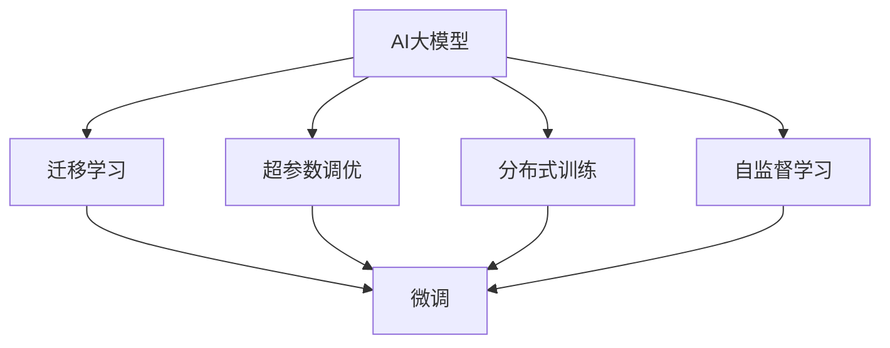

                 

# AI大模型创业：如何应对未来挑战？

## 1. 背景介绍

随着人工智能技术的快速发展和应用领域的不断拓展，AI大模型成为了创业和创新的热点。从深度学习到自然语言处理，从计算机视觉到生成对抗网络，AI大模型在各行各业中展现出了强大的应用潜力。然而，在AI大模型创业的征途上，企业也面临着诸多挑战，如数据获取难度大、模型训练成本高、市场竞争激烈等。本文将探讨AI大模型创业面临的核心问题，并提供应对策略，以期为创业者提供有益的指导。

## 2. 核心概念与联系

### 2.1 核心概念概述

在探讨AI大模型创业过程中，首先需要理解几个核心概念及其相互联系：

- **AI大模型**：指在深度学习框架下，通过大规模数据训练得到的复杂模型，如BERT、GPT-3、T5等。它们通常具有极高的计算需求和存储要求，但能够在各类NLP、图像识别、推荐系统等任务中提供显著的性能提升。
- **迁移学习**：指通过在大规模数据集上预训练模型，然后在特定任务上微调的方法。这种方法可以显著降低标注数据的成本，同时提升模型的泛化能力。
- **超参数调优**：指在模型训练过程中，对模型的学习率、批大小、正则化系数等参数进行调优，以提升模型性能。这些参数的选择直接影响模型的训练效果和泛化能力。
- **分布式训练**：指在多台机器上并行训练模型，以加速模型训练过程，适用于大规模模型和大规模数据集。
- **自监督学习**：指利用无标签数据进行模型训练，如通过语言模型的掩码预测任务训练BERT等。

这些概念相互联系，共同构成了AI大模型创业的基础。通过理解这些核心概念，可以更好地把握AI大模型的应用和优化方法。

### 2.2 概念间的关系

为了更清晰地理解这些核心概念之间的关系，我们通过以下Mermaid流程图进行展示：



这个流程图展示了AI大模型及其相关技术之间的关系：AI大模型通过迁移学习、超参数调优、分布式训练和自监督学习等技术手段，进行微调以适应特定任务。通过这种体系化的技术应用，可以显著提升AI大模型的性能和泛化能力。

## 3. 核心算法原理 & 具体操作步骤

### 3.1 算法原理概述

AI大模型的核心算法原理主要包括以下几个方面：

1. **深度学习框架**：如TensorFlow、PyTorch等，提供了高效的模型训练和推理功能，支持大规模模型的训练和部署。
2. **神经网络结构**：如卷积神经网络(CNN)、循环神经网络(RNN)、Transformer等，这些结构能够有效地捕捉和处理数据特征。
3. **数据增强**：通过数据扩增技术，如随机裁剪、旋转、翻转等，增强数据集的多样性，提高模型的泛化能力。
4. **正则化技术**：如L1正则、L2正则、Dropout等，防止过拟合现象，提高模型的鲁棒性。
5. **分布式训练**：通过多台机器并行训练，加速模型训练过程，提高训练效率。

### 3.2 算法步骤详解

AI大模型的训练和微调过程主要包括以下几个步骤：

1. **数据准备**：收集和预处理训练数据，生成训练集和验证集。
2. **模型选择**：选择合适的AI大模型，如BERT、GPT等，并根据任务需求进行微调。
3. **超参数调优**：选择合适的超参数，如学习率、批大小、正则化系数等，进行调优实验。
4. **分布式训练**：在多台机器上并行训练模型，以提高训练效率。
5. **模型评估**：在验证集上评估模型性能，调整超参数和训练策略。
6. **模型微调**：在验证集性能达到一定阈值后，在测试集上微调模型，以适应特定任务。

### 3.3 算法优缺点

AI大模型创业过程中，使用AI大模型的优点和缺点如下：

**优点**：
- 能够处理大规模数据，并从中学习到丰富的特征。
- 迁移学习能够降低标注数据的成本，提升模型的泛化能力。
- 分布式训练能够显著加速模型训练过程。

**缺点**：
- 对硬件资源的需求较高，训练成本大。
- 模型复杂度高，难以解释和调试。
- 训练过程复杂，需要大量的数据和计算资源。

### 3.4 算法应用领域

AI大模型在多个领域中都有广泛应用，包括：

- **自然语言处理(NLP)**：如机器翻译、文本分类、情感分析等。
- **计算机视觉**：如图像分类、物体检测、人脸识别等。
- **推荐系统**：如商品推荐、新闻推荐等。
- **智能客服**：如聊天机器人、语音助手等。
- **金融分析**：如信用评分、风险评估等。

## 4. 数学模型和公式 & 详细讲解 & 举例说明

### 4.1 数学模型构建

AI大模型的数学模型通常基于神经网络结构构建。以BERT为例，其模型结构如下：

$$
H = Transformer(Embedding(X), Attention, FFN)
$$

其中，$X$ 表示输入数据，$Embedding$ 表示嵌入层，$Attention$ 表示自注意力机制，$FFN$ 表示全连接层。

### 4.2 公式推导过程

以BERT为例，其预训练过程包括掩码语言模型和下一句预测任务。下面分别推导这两个任务的公式：

**掩码语言模型**：
$$
\max_{\theta} \sum_{i=1}^{n} \log P_{i|i}(X_i)
$$

**下一句预测任务**：
$$
\max_{\theta} \sum_{i=1}^{n} \log P_{i|j}(X_i, X_j)
$$

其中，$P_{i|i}$ 表示下一个单词与当前单词相同的概率，$P_{i|j}$ 表示下一个单词与前一个单词是连续的概率。

### 4.3 案例分析与讲解

以图像分类为例，使用深度学习框架TensorFlow构建CNN模型，并进行迁移学习。

1. **数据准备**：收集图像数据，并进行预处理，如归一化、缩放等。
2. **模型选择**：选择预训练好的VGG16模型，并将其顶层替换为全连接层。
3. **超参数调优**：选择合适的超参数，如学习率、批大小等。
4. **分布式训练**：使用多台机器进行并行训练。
5. **模型评估**：在验证集上评估模型性能，调整超参数。
6. **模型微调**：在测试集上微调模型，以适应特定分类任务。

## 5. 项目实践：代码实例和详细解释说明

### 5.1 开发环境搭建

开发AI大模型需要高性能计算资源，可以使用以下工具搭建开发环境：

- **深度学习框架**：如TensorFlow、PyTorch、Keras等，提供了高效的模型训练和推理功能。
- **分布式训练框架**：如Horovod、DistributedTensorFlow等，支持多台机器并行训练。
- **数据处理框架**：如Pandas、NumPy等，用于数据预处理和分析。
- **可视化工具**：如TensorBoard、Weights & Biases等，用于监控模型训练过程。

### 5.2 源代码详细实现

以TensorFlow为例，使用VGG16模型进行图像分类任务的迁移学习。

```python
import tensorflow as tf
from tensorflow.keras.applications import VGG16

# 加载预训练模型
model = VGG16(weights='imagenet', include_top=False, input_shape=(224, 224, 3))

# 替换顶层全连接层
model.add(tf.keras.layers.Flatten())
model.add(tf.keras.layers.Dense(256, activation='relu'))
model.add(tf.keras.layers.Dropout(0.5))
model.add(tf.keras.layers.Dense(10, activation='softmax'))

# 编译模型
model.compile(optimizer='adam', loss='categorical_crossentropy', metrics=['accuracy'])

# 加载训练数据
train_data = ...
train_labels = ...

# 训练模型
model.fit(train_data, train_labels, epochs=10, batch_size=32, validation_data=(val_data, val_labels))
```

### 5.3 代码解读与分析

在上述代码中，首先加载预训练的VGG16模型，并将其顶层全连接层替换为新的分类器。然后，使用Adam优化器进行模型训练，并定义损失函数和评估指标。最后，加载训练数据和标签，进行模型训练和评估。

### 5.4 运行结果展示

在训练完成后，使用测试数据进行模型评估，得到分类准确率：

```python
test_data = ...
test_labels = ...
test_loss, test_acc = model.evaluate(test_data, test_labels)
print(f'Test accuracy: {test_acc:.4f}')
```

## 6. 实际应用场景

### 6.4 未来应用展望

AI大模型在未来的应用场景中将更加广泛和深入：

- **医疗诊断**：使用AI大模型进行医学影像分析、疾病预测等。
- **智能制造**：使用AI大模型进行设备故障预测、生产过程优化等。
- **金融风控**：使用AI大模型进行信用评分、风险评估等。
- **智慧城市**：使用AI大模型进行城市管理、交通优化等。
- **智慧教育**：使用AI大模型进行智能辅助教学、个性化学习等。

## 7. 工具和资源推荐

### 7.1 学习资源推荐

- **深度学习框架**：TensorFlow、PyTorch、Keras等。
- **分布式训练框架**：Horovod、DistributedTensorFlow等。
- **数据处理框架**：Pandas、NumPy等。
- **可视化工具**：TensorBoard、Weights & Biases等。
- **数据集**：ImageNet、COCO等。
- **课程**：DeepLearning.ai、Coursera等。

### 7.2 开发工具推荐

- **IDE**：PyCharm、Jupyter Notebook等。
- **版本控制**：Git、GitHub等。
- **项目管理工具**：Jira、Trello等。
- **云计算平台**：AWS、Google Cloud、Azure等。

### 7.3 相关论文推荐

- **深度学习框架**：
  - TensorFlow: A Systematic Survey of TensorFlow（NeurIPS 2020）
  - PyTorch: A Brief Overview of PyTorch in AI and Machine Learning（IEEE Transactions on Neural Networks and Learning Systems 2021）
- **分布式训练框架**：
  - Horovod: Distributed Training for Deep Learning: A Unified API（Arxiv 2017）
  - DistributedTensorFlow: Distributed Deep Learning with TensorFlow（NeurIPS 2016）
- **数据集**：
  - ImageNet: ImageNet: A Large-Scale Hierarchical Image Database（CVPR 2009）
  - COCO: Towards COCO 2.0: Unified Object Detection,Segmentation, and Captioning（Arxiv 2017）

## 8. 总结：未来发展趋势与挑战

### 8.1 研究成果总结

AI大模型在近年来取得了显著进展，广泛应用于各个领域。然而，随着模型规模的扩大和复杂度的提高，创业企业也面临诸多挑战：

- 数据获取难度大，标注成本高。
- 模型训练成本高，硬件资源需求大。
- 市场竞争激烈，需要持续创新。

### 8.2 未来发展趋势

未来AI大模型的发展趋势包括：

- **模型规模**：模型规模将继续扩大，以适应更加复杂的任务和更大的数据集。
- **计算资源**：分布式训练和云计算技术将进一步普及，降低计算成本。
- **应用场景**：AI大模型将在更多领域得到应用，如医疗、金融、教育等。
- **技术创新**：更多创新技术，如迁移学习、自监督学习、强化学习等，将进一步推动AI大模型的发展。

### 8.3 面临的挑战

AI大模型创业面临的主要挑战包括：

- **数据获取**：如何获取高质量、大规模的标注数据。
- **计算资源**：如何降低训练成本，提高训练效率。
- **模型解释性**：如何提高模型的可解释性，使其易于调试和应用。
- **市场竞争**：如何在激烈的市场竞争中脱颖而出。

### 8.4 研究展望

未来AI大模型的研究展望包括：

- **迁移学习**：更多迁移学习方法，如自监督学习、弱监督学习、少样本学习等。
- **分布式训练**：进一步优化分布式训练算法，提高训练效率。
- **模型解释性**：提高模型的可解释性，使其更加透明和可信。
- **技术创新**：更多创新技术，如因果推理、对抗学习等，将推动AI大模型的发展。

## 9. 附录：常见问题与解答

### Q1: 如何获取高质量、大规模的标注数据？

A: 获取高质量、大规模的标注数据可以通过以下方式：
- **众包平台**：如Amazon Mechanical Turk、CrowdFlower等。
- **开源数据集**：如ImageNet、COCO等。
- **公开数据**：如Kaggle、UCI等。

### Q2: 如何降低训练成本？

A: 降低训练成本可以通过以下方式：
- **分布式训练**：使用多台机器并行训练，提高训练效率。
- **混合精度训练**：使用半精度浮点数进行训练，减少内存和计算需求。
- **模型压缩**：使用模型剪枝、量化等方法，减小模型规模。

### Q3: 如何提高模型的可解释性？

A: 提高模型的可解释性可以通过以下方式：
- **模型可视化**：使用工具如TensorBoard、T-SNE等，可视化模型的内部结构。
- **特征重要性分析**：使用工具如LIME、SHAP等，分析模型的特征重要性。
- **可解释模型**：使用可解释模型，如决策树、线性回归等，进行模型解释。

### Q4: 如何应对市场竞争？

A: 应对市场竞争可以通过以下方式：
- **持续创新**：不断引入新技术和新方法，保持技术领先优势。
- **合作伙伴**：与其他企业或机构合作，共同开发和推广产品。
- **市场定位**：明确产品定位和目标用户，进行精准营销。

通过理解这些核心概念和解决策略，创业者可以更好地应对AI大模型创业过程中面临的挑战，推动AI技术在各行业的广泛应用。

