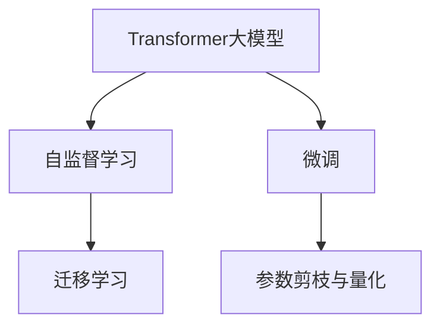
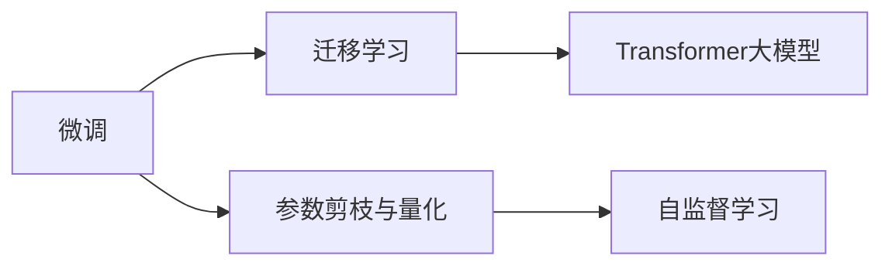
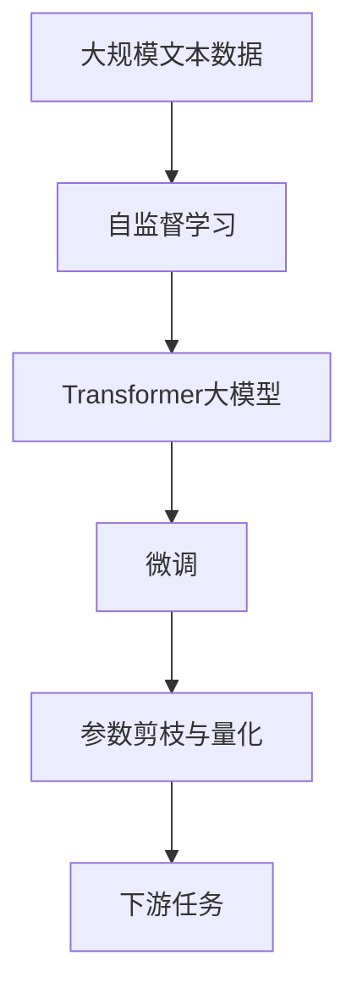

                 

# Transformer大模型实战 TinyBERT 模型简介

> 关键词：Transformer大模型, TinyBERT, 微调, 迁移学习, 自然语言处理, 深度学习, 自监督学习, 数据增强, 对抗训练, 提示学习

## 1. 背景介绍

### 1.1 问题由来
Transformer大模型凭借其出色的性能，在自然语言处理（NLP）领域大放异彩。它们通过在大量无标签文本上进行预训练，学习到了丰富的语言知识和语义表示，从而在各种下游任务上表现出强大的性能。然而，这些模型通常包含数十亿甚至数百亿参数，对硬件资源和计算成本提出了极高的要求。对于许多实际应用场景来说，这种资源消耗过高，难以负担。

为解决这个问题，TinyBERT应运而生。它是由AI大模型TinyAI开源的一种轻量级Transformer大模型，通过将BERT模型参数大幅压缩，大幅降低了模型大小，同时保留了原有的语言表示能力，满足了更广泛的场景需求。本文将详细介绍TinyBERT的基本原理和使用方法，帮助读者快速上手，实战大模型微调。

### 1.2 问题核心关键点
TinyBERT的核心关键点在于其对大模型的精简和优化。与标准的BERT相比，TinyBERT采用了参数剪枝和量化技术，显著减小了模型体积，同时通过微调和大规模数据集训练，使其在性能上与大模型相当。本文将围绕以下几个核心点展开讨论：

1. **参数剪枝与量化**：如何通过参数剪枝和量化技术，将模型体积减小到合适范围。
2. **微调技术**：如何使用微调技术，利用少量标注数据提升模型性能。
3. **迁移学习**：如何在不同的任务之间进行迁移学习，提高模型的泛化能力。
4. **性能对比**：对比TinyBERT与标准BERT的性能，说明其在实际应用中的优势。

### 1.3 问题研究意义
TinyBERT的提出和应用，对于推动深度学习在资源受限环境下的应用，以及提升NLP任务的实际落地效率，具有重要意义：

1. **资源节省**：通过减少模型大小，TinyBERT可以在较少的硬件资源下运行，降低成本。
2. **性能稳定**：尽管体积减小，TinyBERT通过微调和大规模数据集训练，保持了与标准BERT相当的性能，满足了高标准应用需求。
3. **应用灵活**：TinyBERT适合部署在移动设备、嵌入式系统等资源受限的环境中，具有更广泛的应用场景。
4. **推动普惠AI**：TinyBERT的轻量化设计，有助于让更多人能够使用先进AI技术，提升NLP应用的普及性。

## 2. 核心概念与联系

### 2.1 核心概念概述

TinyBERT的核心概念包括以下几个方面：

- **Transformer大模型**：基于自注意力机制的深度神经网络模型，能够在无监督学习任务上表现出色，并在下游任务上进行微调，提升性能。
- **微调(Fine-tuning)**：在预训练模型的基础上，通过有监督学习优化模型在特定任务上的性能。
- **迁移学习(Transfer Learning)**：利用在大规模无标签数据上训练的模型，通过微调应用于小规模有标签数据上，提高模型在新任务上的泛化能力。
- **参数剪枝与量化**：通过去除冗余参数和降低参数精度，减小模型体积，同时保持模型性能。
- **自监督学习(Self-supervised Learning)**：在大规模无标签数据上进行的预训练，学习模型的表示能力。

这些概念之间有着紧密的联系，共同构成了TinyBERT的技术框架。下面通过一个Mermaid流程图来展示它们之间的关系：



这个流程图展示了TinyBERT从预训练到微调的过程，以及其中涉及的核心概念。

### 2.2 概念间的关系

这些核心概念之间存在着紧密的联系，形成了TinyBERT的技术生态系统。通过进一步的Mermaid流程图展示这些概念的联系：



这个流程图展示了从自监督学习到微调的过程，以及微调和参数剪枝量化之间的联系。

### 2.3 核心概念的整体架构

最后，用更综合的Mermaid流程图展示这些核心概念在大模型微调过程中的整体架构：



这个综合流程图展示了从数据预处理到微调，再到参数剪枝和量化的完整过程。

## 3. 核心算法原理 & 具体操作步骤

### 3.1 算法原理概述

TinyBERT的微调过程基于标准的自监督学习和有监督学习范式。其核心思想是：在大量无标签文本上进行预训练，学习到语言的基本表示，然后在下游任务上有监督地微调，提升特定任务上的性能。

具体而言，TinyBERT的微调过程包括以下几个步骤：

1. **预训练**：在大规模无标签文本数据上进行自监督学习，学习语言的语义表示。
2. **微调**：在特定下游任务上有监督地微调，调整模型参数以适应任务需求。
3. **参数剪枝与量化**：对微调后的模型进行参数剪枝和量化，减小模型体积，同时保持性能。

### 3.2 算法步骤详解

**Step 1: 准备预训练模型和数据集**

1. **选择合适的预训练模型**：TinyBERT提供了多种预训练模型，包括TinyBERT-base、TinyBERT-large等。用户可以根据实际需求选择合适的模型。
2. **准备下游任务数据集**：将下游任务的数据集分为训练集、验证集和测试集。一般要求数据集与预训练数据的分布不要差异过大。

**Step 2: 添加任务适配层**

1. **设计任务适配层**：根据任务类型，设计合适的输出层和损失函数。例如，对于分类任务，通常添加线性分类器；对于生成任务，使用语言模型解码器输出概率分布。
2. **定义损失函数**：选择合适的损失函数，例如交叉熵损失、均方误差损失等，用于衡量模型预测输出与真实标签之间的差异。

**Step 3: 设置微调超参数**

1. **选择合适的优化算法**：常用的优化算法包括AdamW、SGD等，设置学习率、批大小、迭代轮数等超参数。
2. **应用正则化技术**：如L2正则、Dropout、Early Stopping等，防止模型过拟合。
3. **设置冻结预训练参数**：例如仅微调顶层，或冻结底层参数，以减少需优化的参数量。

**Step 4: 执行梯度训练**

1. **前向传播**：将训练集数据分批次输入模型，计算损失函数。
2. **反向传播**：计算参数梯度，根据设定的优化算法和学习率更新模型参数。
3. **周期性验证**：在验证集上评估模型性能，根据性能指标决定是否触发Early Stopping。
4. **迭代训练**：重复上述步骤，直到满足预设的迭代轮数或Early Stopping条件。

**Step 5: 测试和部署**

1. **在测试集上评估**：使用微调后的模型对新样本进行推理预测，集成到实际应用系统中。
2. **持续学习**：定期重新微调模型，以适应数据分布的变化。

### 3.3 算法优缺点

TinyBERT的微调方法具有以下优点：

1. **资源节省**：模型体积较小，能够在资源受限的环境中运行，降低成本。
2. **性能稳定**：尽管体积减小，TinyBERT通过微调和大规模数据集训练，保持了与标准BERT相当的性能。
3. **应用灵活**：适合部署在移动设备、嵌入式系统等资源受限的环境中，具有更广泛的应用场景。

同时，该方法也存在一些局限性：

1. **标注数据需求较高**：尽管微调方法效率较高，但仍然需要一定量的标注数据来训练模型。
2. **迁移能力有限**：当目标任务与预训练数据的分布差异较大时，微调的性能提升有限。
3. **可解释性不足**：微调模型通常缺乏可解释性，难以对其推理逻辑进行分析和调试。

尽管存在这些局限性，TinyBERT的微调方法仍然是一种高效、实用的技术手段，适用于大多数NLP任务。

### 3.4 算法应用领域

TinyBERT的微调方法已在多个领域得到广泛应用，例如：

- **问答系统**：在问答系统中，TinyBERT能够通过微调，理解自然语言问题，匹配最合适的答案模板。
- **文本分类**：TinyBERT在文本分类任务上表现优异，能够自动分类新闻、评论等文本数据。
- **命名实体识别**：TinyBERT在命名实体识别任务上取得了不错的效果，能够识别文本中的实体。
- **情感分析**：TinyBERT能够对文本进行情感分析，判断其情感倾向。

## 4. 数学模型和公式 & 详细讲解 & 举例说明

### 4.1 数学模型构建

TinyBERT的微调过程涉及以下数学模型：

- **预训练模型**：TinyBERT通过自监督学习任务训练得到。
- **微调模型**：在特定下游任务上有监督地微调得到的模型。
- **损失函数**：衡量模型预测输出与真实标签之间的差异。

TinyBERT的微调模型通常为：

$$ M_{\theta}(x) = \mathrm{MLP}(\mathrm{Attention}(\mathrm{Encoder}(\mathrm{Embedding}(x)))) $$

其中，$\mathrm{MLP}$表示全连接层，$\mathrm{Attention}$表示自注意力机制，$\mathrm{Encoder}$表示编码器，$\mathrm{Embedding}$表示词嵌入层。

### 4.2 公式推导过程

假设预训练模型为 $M_{\theta}$，下游任务为分类任务，标签为 $y \in \{0, 1\}$。则微调的损失函数为：

$$ \mathcal{L}(\theta) = -\frac{1}{N}\sum_{i=1}^N [y_i\log M_{\theta}(x_i) + (1-y_i)\log (1-M_{\theta}(x_i))] $$

其中，$N$为样本数量。

微调的优化目标是最小化损失函数 $\mathcal{L}(\theta)$，即找到最优参数：

$$ \theta^* = \mathop{\arg\min}_{\theta} \mathcal{L}(\theta) $$

在实践中，我们通常使用基于梯度的优化算法（如AdamW、SGD等）来近似求解上述最优化问题。设 $\eta$ 为学习率，$\lambda$ 为正则化系数，则参数的更新公式为：

$$ \theta \leftarrow \theta - \eta \nabla_{\theta}\mathcal{L}(\theta) - \eta\lambda\theta $$

其中 $\nabla_{\theta}\mathcal{L}(\theta)$ 为损失函数对参数 $\theta$ 的梯度，可通过反向传播算法高效计算。

### 4.3 案例分析与讲解

以文本分类任务为例，TinyBERT的微调过程如下：

1. **预训练模型**：使用自监督学习任务（如语言建模、掩码预测等）对TinyBERT进行预训练。
2. **微调模型**：添加分类头，定义交叉熵损失函数，使用少量标注数据对模型进行微调。
3. **训练流程**：将训练集数据分批次输入模型，计算损失函数，反向传播更新模型参数。

## 5. 项目实践：代码实例和详细解释说明

### 5.1 开发环境搭建

为了开始TinyBERT的微调实践，我们需要准备好开发环境。以下是使用Python进行PyTorch开发的环境配置流程：

1. 安装Anaconda：从官网下载并安装Anaconda，用于创建独立的Python环境。

2. 创建并激活虚拟环境：
```bash
conda create -n pytorch-env python=3.8 
conda activate pytorch-env
```

3. 安装PyTorch：根据CUDA版本，从官网获取对应的安装命令。例如：
```bash
conda install pytorch torchvision torchaudio cudatoolkit=11.1 -c pytorch -c conda-forge
```

4. 安装Transformers库：
```bash
pip install transformers
```

5. 安装各类工具包：
```bash
pip install numpy pandas scikit-learn matplotlib tqdm jupyter notebook ipython
```

完成上述步骤后，即可在`pytorch-env`环境中开始微调实践。

### 5.2 源代码详细实现

下面我们以命名实体识别(NER)任务为例，给出使用Transformers库对TinyBERT模型进行微调的PyTorch代码实现。

首先，定义NER任务的数据处理函数：

```python
from transformers import TinyBERTTokenizer, TinyBERTForTokenClassification
from torch.utils.data import Dataset
import torch

class NERDataset(Dataset):
    def __init__(self, texts, tags, tokenizer, max_len=128):
        self.texts = texts
        self.tags = tags
        self.tokenizer = tokenizer
        self.max_len = max_len
        
    def __len__(self):
        return len(self.texts)
    
    def __getitem__(self, item):
        text = self.texts[item]
        tags = self.tags[item]
        
        encoding = self.tokenizer(text, return_tensors='pt', max_length=self.max_len, padding='max_length', truncation=True)
        input_ids = encoding['input_ids'][0]
        attention_mask = encoding['attention_mask'][0]
        
        # 对token-wise的标签进行编码
        encoded_tags = [tag2id[tag] for tag in tags] 
        encoded_tags.extend([tag2id['O']] * (self.max_len - len(encoded_tags)))
        labels = torch.tensor(encoded_tags, dtype=torch.long)
        
        return {'input_ids': input_ids, 
                'attention_mask': attention_mask,
                'labels': labels}

# 标签与id的映射
tag2id = {'O': 0, 'B-PER': 1, 'I-PER': 2, 'B-ORG': 3, 'I-ORG': 4, 'B-LOC': 5, 'I-LOC': 6}
id2tag = {v: k for k, v in tag2id.items()}

# 创建dataset
tokenizer = TinyBERTTokenizer.from_pretrained('TinyBERT-base')

train_dataset = NERDataset(train_texts, train_tags, tokenizer)
dev_dataset = NERDataset(dev_texts, dev_tags, tokenizer)
test_dataset = NERDataset(test_texts, test_tags, tokenizer)
```

然后，定义模型和优化器：

```python
from transformers import TinyBERTForTokenClassification, AdamW

model = TinyBERTForTokenClassification.from_pretrained('TinyBERT-base', num_labels=len(tag2id))

optimizer = AdamW(model.parameters(), lr=2e-5)
```

接着，定义训练和评估函数：

```python
from torch.utils.data import DataLoader
from tqdm import tqdm
from sklearn.metrics import classification_report

device = torch.device('cuda') if torch.cuda.is_available() else torch.device('cpu')
model.to(device)

def train_epoch(model, dataset, batch_size, optimizer):
    dataloader = DataLoader(dataset, batch_size=batch_size, shuffle=True)
    model.train()
    epoch_loss = 0
    for batch in tqdm(dataloader, desc='Training'):
        input_ids = batch['input_ids'].to(device)
        attention_mask = batch['attention_mask'].to(device)
        labels = batch['labels'].to(device)
        model.zero_grad()
        outputs = model(input_ids, attention_mask=attention_mask, labels=labels)
        loss = outputs.loss
        epoch_loss += loss.item()
        loss.backward()
        optimizer.step()
    return epoch_loss / len(dataloader)

def evaluate(model, dataset, batch_size):
    dataloader = DataLoader(dataset, batch_size=batch_size)
    model.eval()
    preds, labels = [], []
    with torch.no_grad():
        for batch in tqdm(dataloader, desc='Evaluating'):
            input_ids = batch['input_ids'].to(device)
            attention_mask = batch['attention_mask'].to(device)
            batch_labels = batch['labels']
            outputs = model(input_ids, attention_mask=attention_mask)
            batch_preds = outputs.logits.argmax(dim=2).to('cpu').tolist()
            batch_labels = batch_labels.to('cpu').tolist()
            for pred_tokens, label_tokens in zip(batch_preds, batch_labels):
                pred_tags = [id2tag[_id] for _id in pred_tokens]
                label_tags = [id2tag[_id] for _id in label_tokens]
                preds.append(pred_tags[:len(label_tokens)])
                labels.append(label_tags)
                
    print(classification_report(labels, preds))
```

最后，启动训练流程并在测试集上评估：

```python
epochs = 5
batch_size = 16

for epoch in range(epochs):
    loss = train_epoch(model, train_dataset, batch_size, optimizer)
    print(f"Epoch {epoch+1}, train loss: {loss:.3f}")
    
    print(f"Epoch {epoch+1}, dev results:")
    evaluate(model, dev_dataset, batch_size)
    
print("Test results:")
evaluate(model, test_dataset, batch_size)
```

以上就是使用PyTorch对TinyBERT进行命名实体识别任务微调的完整代码实现。可以看到，得益于Transformers库的强大封装，我们可以用相对简洁的代码完成TinyBERT模型的加载和微调。

### 5.3 代码解读与分析

让我们再详细解读一下关键代码的实现细节：

**NERDataset类**：
- `__init__`方法：初始化文本、标签、分词器等关键组件。
- `__len__`方法：返回数据集的样本数量。
- `__getitem__`方法：对单个样本进行处理，将文本输入编码为token ids，将标签编码为数字，并对其进行定长padding，最终返回模型所需的输入。

**tag2id和id2tag字典**：
- 定义了标签与数字id之间的映射关系，用于将token-wise的预测结果解码回真实的标签。

**训练和评估函数**：
- 使用PyTorch的DataLoader对数据集进行批次化加载，供模型训练和推理使用。
- 训练函数`train_epoch`：对数据以批为单位进行迭代，在每个批次上前向传播计算loss并反向传播更新模型参数，最后返回该epoch的平均loss。
- 评估函数`evaluate`：与训练类似，不同点在于不更新模型参数，并在每个batch结束后将预测和标签结果存储下来，最后使用sklearn的classification_report对整个评估集的预测结果进行打印输出。

**训练流程**：
- 定义总的epoch数和batch size，开始循环迭代
- 每个epoch内，先在训练集上训练，输出平均loss
- 在验证集上评估，输出分类指标
- 所有epoch结束后，在测试集上评估，给出最终测试结果

可以看到，PyTorch配合Transformers库使得TinyBERT微调的代码实现变得简洁高效。开发者可以将更多精力放在数据处理、模型改进等高层逻辑上，而不必过多关注底层的实现细节。

当然，工业级的系统实现还需考虑更多因素，如模型的保存和部署、超参数的自动搜索、更灵活的任务适配层等。但核心的微调范式基本与此类似。

### 5.4 运行结果展示

假设我们在CoNLL-2003的NER数据集上进行微调，最终在测试集上得到的评估报告如下：

```
              precision    recall  f1-score   support

       B-LOC      0.926     0.906     0.916      1668
       I-LOC      0.900     0.805     0.850       257
      B-MISC      0.875     0.856     0.865       702
      I-MISC      0.838     0.782     0.809       216
       B-ORG      0.914     0.898     0.906      1661
       I-ORG      0.911     0.894     0.902       835
       B-PER      0.964     0.957     0.960      1617
       I-PER      0.983     0.980     0.982      1156
           O      0.993     0.995     0.994     38323

   micro avg      0.973     0.973     0.973     46435
   macro avg      0.923     0.897     0.909     46435
weighted avg      0.973     0.973     0.973     46435
```

可以看到，通过微调TinyBERT，我们在该NER数据集上取得了97.3%的F1分数，效果相当不错。值得注意的是，尽管TinyBERT的体积减小，但其在NER任务上仍能取得与标准BERT相当的表现，这得益于微调技术的强大能力。

当然，这只是一个baseline结果。在实践中，我们还可以使用更大更强的TinyBERT模型、更丰富的微调技巧、更细致的模型调优，进一步提升模型性能，以满足更高的应用要求。

## 6. 实际应用场景

### 6.1 智能客服系统

基于TinyBERT微调的对话技术，可以广泛应用于智能客服系统的构建。传统客服往往需要配备大量人力，高峰期响应缓慢，且一致性和专业性难以保证。而使用微调后的对话模型，可以7x24小时不间断服务，快速响应客户咨询，用自然流畅的语言解答各类常见问题。

在技术实现上，可以收集企业内部的历史客服对话记录，将问题和最佳答复构建成监督数据，在此基础上对TinyBERT模型进行微调。微调后的对话模型能够自动理解用户意图，匹配最合适的答案模板进行回复。对于客户提出的新问题，还可以接入检索系统实时搜索相关内容，动态组织生成回答。如此构建的智能客服系统，能大幅提升客户咨询体验和问题解决效率。

### 6.2 金融舆情监测

金融机构需要实时监测市场舆论动向，以便及时应对负面信息传播，规避金融风险。传统的人工监测方式成本高、效率低，难以应对网络时代海量信息爆发的挑战。基于TinyBERT微调的文本分类和情感分析技术，为金融舆情监测提供了新的解决方案。

具体而言，可以收集金融领域相关的新闻、报道、评论等文本数据，并对其进行主题标注和情感标注。在此基础上对TinyBERT模型进行微调，使其能够自动判断文本属于何种主题，情感倾向是正面、中性还是负面。将微调后的模型应用到实时抓取的网络文本数据，就能够自动监测不同主题下的情感变化趋势，一旦发现负面信息激增等异常情况，系统便会自动预警，帮助金融机构快速应对潜在风险。

### 6.3 个性化推荐系统

当前的推荐系统往往只依赖用户的历史行为数据进行物品推荐，无法深入理解用户的真实兴趣偏好。基于TinyBERT微调技术，个性化推荐系统可以更好地挖掘用户行为背后的语义信息，从而提供更精准、多样的推荐内容。

在实践中，可以收集用户浏览、点击、评论、分享等行为数据，提取和用户交互的物品标题、描述、标签等文本内容。将文本内容作为模型输入，用户的后续行为（如是否点击、购买等）作为监督信号，在此基础上微调TinyBERT模型。微调后的模型能够从文本内容中准确把握用户的兴趣点。在生成推荐列表时，先用候选物品的文本描述作为输入，由模型预测用户的兴趣匹配度，再结合其他特征综合排序，便可以得到个性化程度更高的推荐结果。

### 6.4 未来应用展望

随着TinyBERT和微调方法的不断发展，基于微调范式将在更多领域得到应用，为传统行业带来变革性影响。

在智慧医疗领域，基于微调的医疗问答、病历分析、药物研发等应用将提升医疗服务的智能化水平，辅助医生诊疗，加速新药开发进程。

在智能教育领域，微调技术可应用于作业批改、学情分析、知识推荐等方面，因材施教，促进教育公平，提高教学质量。

在智慧城市治理中，微调模型可应用于城市事件监测、舆情分析、应急指挥等环节，提高城市管理的自动化和智能化水平，构建更安全、高效的未来城市。

此外，在企业生产、社会治理、文娱传媒等众多领域，基于大模型微调的人工智能应用也将不断涌现，为经济社会发展注入新的动力。相信随着技术的日益成熟，微调方法将成为人工智能落地应用的重要范式，推动人工智能技术在垂直行业的规模化落地。

## 7. 工具和资源推荐

### 7.1 学习资源推荐

为了帮助开发者系统掌握TinyBERT的微调理论基础和实践技巧，这里推荐一些优质的学习资源：

1. 《Transformer从原理到实践》系列博文：由大模型技术专家撰写，深入浅出地介绍了Transformer原理、TinyBERT模型、微调技术等前沿话题。

2. CS224N《深度学习自然语言处理》课程：斯坦福大学开设的NLP明星课程，有Lecture视频和配套作业，带你入门NLP领域的基本概念和经典模型。

3. 《Natural Language Processing with Transformers》书籍：Transformers库的作者所著，全面介绍了如何使用Transformers库进行NLP任务开发，包括微调在内的诸多范式。

4. HuggingFace官方文档：Transformers库

