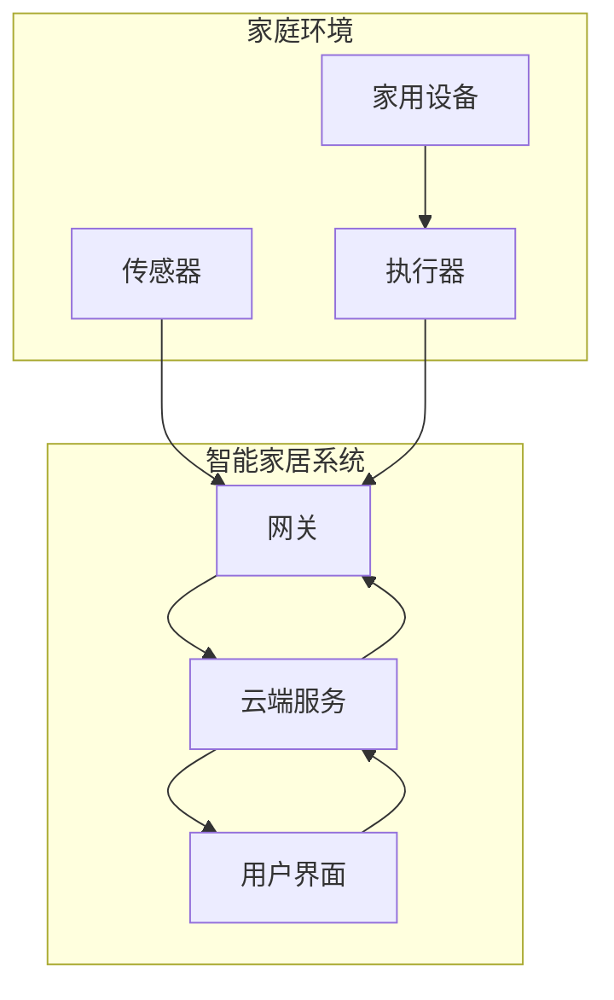

# 基于Java的智能家居设计：智能家居系统中的Java网络编程实战

## 1. 背景介绍

### 1.1 问题的由来

随着科技的不断发展,人们对生活品质的要求也越来越高。智能家居系统作为一种新兴的生活方式,越来越受到人们的青睐。智能家居系统可以通过各种传感器和执行器来监控和控制家中的各种设备,如灯光、空调、安防系统等,从而提高生活质量和能源利用效率。然而,传统的智能家居系统存在一些问题,如系统复杂、成本高昂、扩展性差等,因此需要一种新的解决方案来解决这些问题。

### 1.2 研究现状

目前,已有一些基于不同技术的智能家居系统解决方案,如基于蓝牙、ZigBee、Wi-Fi等无线技术的系统。但这些系统往往存在兼容性差、功能单一、扩展性差等问题。同时,也有一些基于云计算和物联网技术的智能家居系统,但这些系统往往需要较高的硬件成本和网络带宽,并且存在隐私和安全问题。

### 1.3 研究意义

基于Java的智能家居系统设计可以解决上述问题,具有以下优势:

1. **跨平台性强**: Java语言具有良好的跨平台性,可以在不同的操作系统和硬件平台上运行,从而提高系统的兼容性和可移植性。

2. **开源免费**: Java语言是开源的,可以免费使用,降低了系统的开发和部署成本。

3. **网络编程能力强**: Java语言内置了丰富的网络编程库,可以方便地进行网络通信和数据传输,适合构建分布式智能家居系统。

4. **安全性高**: Java语言具有良好的安全性,可以有效防止恶意代码的攻击,保护系统和用户的隐私。

5. **可扩展性强**: 基于Java的智能家居系统可以方便地进行功能扩展和升级,满足不同用户的需求。

因此,基于Java的智能家居系统设计具有重要的理论和实践意义,可以为智能家居系统的发展提供新的思路和解决方案。

### 1.4 本文结构

本文将详细介绍基于Java的智能家居系统的设计和实现,主要内容包括:

1. 智能家居系统的核心概念和架构
2. 基于Java的网络编程技术在智能家居系统中的应用
3. 智能家居系统的核心算法和数学模型
4. 基于Java的智能家居系统的实际项目实践
5. 智能家居系统的实际应用场景和未来发展趋势

## 2. 核心概念与联系

智能家居系统是一个复杂的系统,涉及多个领域的知识,包括计算机网络、嵌入式系统、人工智能、物联网等。下面我们介绍智能家居系统的一些核心概念及其联系。

1. **物联网(Internet of Things, IoT)**: 物联网是指通过各种信息传感设备,将各种物品与互联网相连接,进行信息交换和通信,实现智能化识别、位置、跟踪、监控和管理的一种网络。智能家居系统是物联网在家庭场景中的一种重要应用。

2. **传感器(Sensor)**: 传感器是智能家居系统的"眼睛"和"耳朵",用于采集家庭环境中的各种信息,如温度、湿度、光线、噪音等。常见的传感器有温度传感器、湿度传感器、红外传感器、声音传感器等。

3. **执行器(Actuator)**: 执行器是智能家居系统的"手脚",用于根据系统的指令控制家中的各种设备,如灯光、空调、窗帘等。常见的执行器有继电器、电机、蜂鸣器等。

4. **网关(Gateway)**: 网关是智能家居系统的"大脑",负责协调传感器、执行器和其他设备之间的通信,并将采集到的数据上传到云端进行处理和存储。网关通常具有较强的计算能力和网络通信能力。

5. **云端服务(Cloud Service)**: 云端服务是智能家居系统的"大脑",负责对采集到的数据进行处理和分析,并根据用户的需求和预设规则下发控制指令。云端服务通常采用分布式架构,具有强大的计算能力和存储能力。

6. **用户界面(User Interface)**: 用户界面是智能家居系统与用户交互的入口,可以是移动应用程序、网页界面或语音助手等形式。用户可以通过用户界面查看家庭环境信息、控制家中设备、设置自动化规则等。

上述核心概念相互关联,共同构成了智能家居系统的基本架构,如下图所示:



在这个架构中,传感器采集家庭环境信息,并将数据传输到网关;网关将数据上传到云端服务进行处理和存储;云端服务根据用户需求和预设规则下发控制指令;网关接收控制指令,并通过执行器控制家中的各种设备;用户可以通过用户界面与系统进行交互。

## 3. 核心算法原理 & 具体操作步骤

### 3.1 算法原理概述

在智能家居系统中,需要采用各种算法来实现数据处理、决策控制、自动化等功能。下面我们介绍一种常用的基于规则的决策算法。

基于规则的决策算法是一种简单但有效的算法,它通过预先定义一系列规则,根据当前的环境信息和用户需求,匹配相应的规则并执行相应的操作。这种算法的优点是简单易懂、易于实现,缺点是规则的维护和扩展较为困难。

### 3.2 算法步骤详解

基于规则的决策算法的具体步骤如下:

1. **规则定义**: 首先需要定义一系列规则,每个规则包括条件部分和操作部分。条件部分描述了触发该规则的环境条件,操作部分描述了执行该规则时需要执行的操作。例如,一个规则可以定义为:"如果温度高于30度,则打开空调"。

2. **数据采集**: 通过各种传感器采集家庭环境的信息,如温度、湿度、光线强度等。

3. **规则匹配**: 将采集到的环境信息与预定义的规则进行匹配,找出满足条件的规则。

4. **操作执行**: 对于匹配到的规则,执行其操作部分,即控制相应的执行器进行操作,如打开空调、关闭灯光等。

5. **日志记录**: 将匹配到的规则、执行的操作以及相关环境信息记录到日志中,用于后续的分析和优化。

6. **规则维护**: 根据用户反馈和系统运行情况,对规则进行调整和优化,如添加新规则、修改现有规则或删除无用规则。

下面是基于规则的决策算法的伪代码:

```
规则列表 = 加载预定义规则()

while True:
    环境信息 = 采集环境数据()

    for 规则 in 规则列表:
        if 规则.条件(环境信息):
            执行操作(规则.操作)
            记录日志(规则, 环境信息)
            break

    维护规则列表()
```

### 3.3 算法优缺点

基于规则的决策算法的优点包括:

1. **简单易懂**: 算法原理简单,易于理解和实现。
2. **高效执行**: 匹配规则和执行操作的过程高效快速。
3. **可解释性强**: 规则的条件和操作都是明确的,具有良好的可解释性。

缺点包括:

1. **规则维护困难**: 随着规则数量的增加,规则之间可能会出现冲突或重复,维护和优化规则会变得越来越困难。
2. **缺乏学习能力**: 算法无法自主学习和优化规则,需要人工维护和调整。
3. **适用场景有限**: 对于复杂的决策场景,基于规则的算法可能无法满足需求。

### 3.4 算法应用领域

基于规则的决策算法在智能家居系统中有广泛的应用,例如:

1. **家电控制**: 根据温度、时间等条件控制空调、加热器等家电设备的开关。
2. **安防系统**: 根据红外传感器、门磁传感器等信息判断是否有人入侵,并触发报警或通知用户。
3. **照明控制**: 根据光线强度、人体移动等条件控制灯光的开关和亮度。
4. **场景模式**: 根据用户预设的不同场景模式(如离家模式、睡眠模式等),自动执行一系列操作。

除了智能家居系统,基于规则的决策算法还广泛应用于其他领域,如工业控制、金融决策、医疗诊断等。

## 4. 数学模型和公式 & 详细讲解 & 举例说明

在智能家居系统中,我们往往需要对采集到的环境数据进行处理和分析,以便更好地控制和优化系统。在这个过程中,数学模型和公式发挥着重要作用。下面我们介绍一种常用的温度控制模型。

### 4.1 数学模型构建

我们考虑一个简单的情况:一个房间内有一台空调,需要根据室内温度自动控制空调的开关,以维持房间温度在一个舒适的范围内。

我们定义以下变量:

- $T(t)$: 时刻 $t$ 时房间的温度
- $T_0$: 期望的室内温度
- $T_\text{out}(t)$: 时刻 $t$ 时室外温度
- $u(t)$: 时刻 $t$ 时空调的状态,取值为 0(关闭)或 1(开启)
- $\alpha$: 房间的热传导系数,表示房间与外界环境的热交换能力
- $\beta$: 空调的制冷(制热)能力

我们可以建立如下微分方程来描述房间温度的变化:

$$
\frac{dT(t)}{dt} = \alpha(T_\text{out}(t) - T(t)) + \beta u(t)
$$

这个方程描述了房间温度变化的两个来源:一是与外界环境的热交换,二是空调的制冷(制热)效果。

我们的目标是通过控制空调的开关 $u(t)$,使房间温度 $T(t)$ 维持在期望值 $T_0$ 附近。

### 4.2 公式推导过程

为了实现上述目标,我们可以设计一个简单的控制规则:

- 如果房间温度 $T(t)$ 高于期望值 $T_0$ 加上一个正的阈值 $\epsilon_1$,则打开空调(制冷模式)
- 如果房间温度 $T(t)$ 低于期望值 $T_0$ 减去一个正的阈值 $\epsilon_2$,则打开空调(制热模式)
- 否则,关闭空调

用数学公式表示为:

$$
u(t) = \begin{cases}
1, & \text{if } T(t) > T_0 + \epsilon_1 \
1, & \text{if } T(t) < T_0 - \epsilon_2 \
0, & \text{otherwise}
\end{cases}
$$

将这个控制规则代入到房间温度的微分方程中,我们可以得到:

$$
\frac{dT(t)}{dt} = \begin{cases}
\alpha(T_\text{out}(t) - T(t)) + \beta, & \text{if } T(t) > T_0 + \epsilon_1 \
\alpha(T_\text{out}(t) - T(t)) + \beta, & \text{if } T(t) < T_0 - \epsilon_2 \
\alpha(T_\text{out}(t) - T(t)), & \text{otherwise}
\end{cases}
$$

这个微分方程描述了在上述控制规则下,房间温度的变化情况。

### 4.3 案例分析与讲解

现在,我们来分析一个具体的案