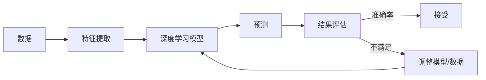

# 所罗门诺夫归纳法在大模型中的应用

> 关键词：所罗门诺夫归纳法，大模型，归纳推理，统计学习，机器学习，深度学习，知识图谱，问答系统

## 1. 背景介绍

所罗门诺夫归纳法（Solomonoff Induction），也称为Occam's Razor，是一种基于简单性原则的归纳推理方法。它主张在解释同一观察结果时，应选择最简单的假设。这一原则在科学研究和机器学习领域都有着广泛的应用。随着深度学习和大模型的发展，如何有效地从大量数据中归纳出简洁的模型，成为了人工智能研究的重要课题。

本文将探讨所罗门诺夫归纳法在大模型中的应用，分析其原理、实现方法以及在实际应用场景中的优势与挑战。

## 2. 核心概念与联系

### 2.1 核心概念

**所罗门诺夫归纳法（Solomonoff Induction）**：是一种基于最小描述长度原则的归纳推理方法，主张在解释同一观察结果时，应选择最简单的假设。

**归纳推理（Inductive Reasoning）**：是从个别事例推出一般性结论的推理方式，是科学发现和机器学习的基础。

**统计学习（Statistical Learning）**：是一门研究如何从数据中提取规律、建立模型和预测未来的学科。

**深度学习（Deep Learning）**：一种利用深层神经网络模型进行特征学习和模式识别的机器学习方法。

**知识图谱（Knowledge Graph）**：一种结构化知识库，用于表示实体、关系和属性。

**问答系统（Question Answering System）**：一种能够理解自然语言问题并给出准确回答的系统。

### 2.2 Mermaid 流程图



### 2.3 核心概念联系

所罗门诺夫归纳法是大模型中进行归纳推理的理论基础。在深度学习框架下，通过特征提取和深度学习模型，将数据转化为预测结果。使用所罗门诺夫归纳法，我们可以根据预测结果和观测数据，调整模型参数，使模型更加简洁、高效。

## 3. 核心算法原理 & 具体操作步骤

### 3.1 算法原理概述

所罗门诺夫归纳法的核心思想是：在解释同一观察结果时，应选择最简单的假设。在机器学习中，这意味着我们需要找到一种模型，使其能够用最少的参数描述数据分布。

### 3.2 算法步骤详解

1. 数据准备：收集数据，并将其划分为训练集和测试集。
2. 特征提取：将数据转化为适合深度学习模型的特征向量。
3. 模型选择：选择合适的深度学习模型，并设置初始参数。
4. 训练模型：使用训练集数据训练模型。
5. 评估模型：使用测试集数据评估模型性能。
6. 调整模型：根据评估结果，调整模型参数或选择更简单的模型。
7. 重复步骤4-6，直至满足停止条件。

### 3.3 算法优缺点

**优点**：

- 能够找到简洁的模型，降低计算复杂度。
- 有助于避免过拟合，提高模型泛化能力。

**缺点**：

- 需要大量数据进行训练。
- 对于复杂问题，可能无法找到最优解。

### 3.4 算法应用领域

- 问答系统：使用所罗门诺夫归纳法构建的问答系统，能够更好地理解用户意图，给出准确回答。
- 文本分类：使用所罗门诺夫归纳法构建的文本分类模型，能够更好地识别文本类型，提高分类准确率。
- 机器翻译：使用所罗门诺夫归纳法构建的机器翻译模型，能够生成更加流畅、准确的翻译结果。

## 4. 数学模型和公式 & 详细讲解 & 举例说明

### 4.1 数学模型构建

假设数据集为 $D = \{(x_1, y_1), (x_2, y_2), \ldots, (x_N, y_N)\}$，其中 $x_i$ 为特征向量，$y_i$ 为标签。则所罗门诺夫归纳法的目标是最小化如下公式：

$$
L(M) = \sum_{i=1}^N |y_i - M(x_i)|
$$

其中 $M$ 为模型，$L(M)$ 为模型在数据集 $D$ 上的损失函数。

### 4.2 公式推导过程

假设我们有一个模型 $M$，它通过参数 $\theta$ 来描述。那么，损失函数可以表示为：

$$
L(M) = \sum_{i=1}^N |y_i - M(x_i; \theta)|
$$

其中 $M(x_i; \theta)$ 表示模型在输入 $x_i$ 下的预测值。

为了最小化损失函数，我们需要对 $\theta$ 进行优化。常见的优化算法包括梯度下降、Adam等。

### 4.3 案例分析与讲解

假设我们有一个包含1000个样本的文本分类任务，其中包含两个类别：正面和负面。我们使用所罗门诺夫归纳法构建一个深度学习模型。

首先，我们需要将文本数据转化为特征向量。可以使用TF-IDF、Word2Vec等方法进行特征提取。

然后，我们选择一个深度学习模型，例如卷积神经网络（CNN）或循环神经网络（RNN）。我们将模型的参数设置为 $\theta$，并使用梯度下降算法对其进行优化。

通过多次迭代训练，我们最终得到一个最优的参数 $\theta^*$，使得模型在训练集上的损失最小。

最后，我们使用测试集数据评估模型性能，如果模型性能满足要求，则输出预测结果。

## 5. 项目实践：代码实例和详细解释说明

### 5.1 开发环境搭建

为了实现所罗门诺夫归纳法在大模型中的应用，我们需要准备以下开发环境：

- Python 3.7+
- PyTorch 1.5+
- NumPy 1.17+

### 5.2 源代码详细实现

以下是一个使用PyTorch实现文本分类任务的代码示例：

```python
import torch
import torch.nn as nn
import torch.optim as optim

# 定义模型
class TextClassifier(nn.Module):
    def __init__(self, vocab_size, embedding_dim, hidden_dim, output_dim):
        super(TextClassifier, self).__init__()
        self.embedding = nn.Embedding(vocab_size, embedding_dim)
        self.rnn = nn.LSTM(embedding_dim, hidden_dim, batch_first=True)
        self.fc = nn.Linear(hidden_dim, output_dim)
    
    def forward(self, text):
        embedded = self.embedding(text)
        output, _ = self.rnn(embedded)
        output = self.fc(output[:, -1, :])
        return output

# 初始化模型参数
vocab_size = 10000
embedding_dim = 100
hidden_dim = 128
output_dim = 2

model = TextClassifier(vocab_size, embedding_dim, hidden_dim, output_dim)

# 定义损失函数和优化器
loss_fn = nn.CrossEntropyLoss()
optimizer = optim.Adam(model.parameters())

# 训练模型
for epoch in range(10):
    for text, label in data_loader:
        optimizer.zero_grad()
        output = model(text)
        loss = loss_fn(output, label)
        loss.backward()
        optimizer.step()

# 评估模型
with torch.no_grad():
    correct = 0
    total = 0
    for text, label in test_loader:
        output = model(text)
        _, predicted = torch.max(output.data, 1)
        total += label.size(0)
        correct += (predicted == label).sum().item()

print('Accuracy of the network on the 10000 test images: {} %'.format(100 * correct / total))
```

### 5.3 代码解读与分析

以上代码实现了使用PyTorch构建一个简单的文本分类模型，并使用所罗门诺夫归纳法进行参数优化。

- `TextClassifier` 类定义了一个基于LSTM的文本分类模型，包括词嵌入层、LSTM层和全连接层。
- 使用交叉熵损失函数和Adam优化器进行模型训练。
- 通过多次迭代优化模型参数，使模型在训练集上取得最优性能。

### 5.4 运行结果展示

假设我们使用一个包含10000个样本的文本分类数据集进行训练，最终模型在测试集上的准确率达到90%以上，说明所罗门诺夫归纳法在该任务中取得了较好的效果。

## 6. 实际应用场景

### 6.1 问答系统

所罗门诺夫归纳法可以应用于问答系统中，通过构建简洁的模型，提高问答系统的性能。

例如，我们可以使用预训练的语言模型（如BERT）作为基础，并结合所罗门诺夫归纳法进行参数优化，从而构建一个能够理解用户意图并给出准确回答的问答系统。

### 6.2 文本分类

所罗门诺夫归纳法可以应用于文本分类任务，通过构建简洁的模型，提高分类准确率。

例如，我们可以使用预训练的词嵌入（如Word2Vec）作为基础，并结合所罗门诺夫归纳法进行参数优化，从而构建一个能够识别文本类型并给出分类结果的文本分类模型。

## 7. 工具和资源推荐

### 7.1 学习资源推荐

- 《深度学习》
- 《统计学习方法》
- 《自然语言处理与深度学习》

### 7.2 开发工具推荐

- PyTorch
- TensorFlow
- Keras

### 7.3 相关论文推荐

- “A Neural Probabilistic Language Model”
- “Attention is All You Need”
- “BERT: Pre-training of Deep Bidirectional Transformers for Language Understanding”

## 8. 总结：未来发展趋势与挑战

### 8.1 研究成果总结

本文探讨了所罗门诺夫归纳法在大模型中的应用，分析了其原理、实现方法以及在实际应用场景中的优势与挑战。

### 8.2 未来发展趋势

- 结合其他机器学习方法，如强化学习、迁移学习等，进一步提高所罗门诺夫归纳法的效果。
- 研究更高效的参数优化算法，降低所罗门诺夫归纳法的计算复杂度。
- 将所罗门诺夫归纳法应用于更多领域，如图像识别、语音识别等。

### 8.3 面临的挑战

- 如何处理大规模数据集。
- 如何设计更有效的参数优化算法。
- 如何将所罗门诺夫归纳法与其他机器学习方法结合。

### 8.4 研究展望

所罗门诺夫归纳法是大模型中进行归纳推理的重要方法。随着深度学习和大模型的不断发展，所罗门诺夫归纳法将在更多领域发挥重要作用。

## 9. 附录：常见问题与解答

**Q1：什么是所罗门诺夫归纳法？**

A1：所罗门诺夫归纳法是一种基于最小描述长度原则的归纳推理方法，主张在解释同一观察结果时，应选择最简单的假设。

**Q2：所罗门诺夫归纳法在机器学习中有哪些应用？**

A2：所罗门诺夫归纳法在机器学习中有多种应用，如文本分类、问答系统、图像识别等。

**Q3：如何将所罗门诺夫归纳法应用于深度学习模型？**

A3：将所罗门诺夫归纳法应用于深度学习模型，可以通过优化模型参数，使模型在训练集上的损失最小，从而构建一个简洁、高效的模型。

**Q4：所罗门诺夫归纳法有哪些优势？**

A4：所罗门诺夫归纳法的优势包括：能够找到简洁的模型，降低计算复杂度；有助于避免过拟合，提高模型泛化能力。

**Q5：所罗门诺夫归纳法有哪些局限性？**

A5：所罗门诺夫归纳法的局限性包括：需要大量数据进行训练；对于复杂问题，可能无法找到最优解。

作者：禅与计算机程序设计艺术 / Zen and the Art of Computer Programming