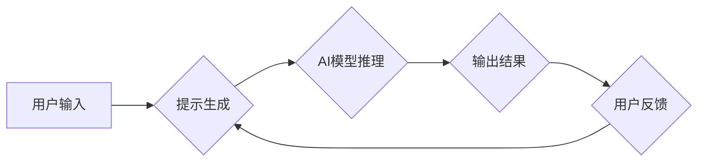

> 提示工程, AI模型优化, 交互式AI, Prompt学习, 模型可解释性, 知识增强

# 提示工程：优化AI模型的关键

提示工程（Prompt Engineering）是一种用于优化AI模型性能的重要技术。它通过精心设计的提示（Prompts）引导AI模型进行特定的推理和生成，从而实现模型性能的提升。本文将深入探讨提示工程的核心概念、原理、操作步骤、数学模型、应用案例，并展望其未来发展趋势与挑战。

## 1. 背景介绍

随着深度学习技术的飞速发展，AI模型在各个领域都取得了显著的成果。然而，许多AI模型在复杂任务中表现出“黑盒”特性，难以理解其决策过程和预测结果。此外，AI模型的训练和部署成本也较高。为了解决这些问题，研究者们提出了提示工程这一技术。

提示工程通过以下方式优化AI模型：

- **提高模型可解释性**：通过分析提示内容，可以更好地理解模型的决策过程。
- **降低模型复杂度**：通过简化提示内容，可以降低模型的复杂度，提高推理速度。
- **增强模型性能**：通过设计有效的提示，可以引导模型在特定任务上取得更好的性能。

## 2. 核心概念与联系

### 2.1 核心概念

- **提示（Prompt）**：提示是用于引导AI模型进行特定推理或生成的文本信息。
- **提示工程（Prompt Engineering）**：提示工程是指设计、优化和测试提示以提升AI模型性能的过程。
- **交互式AI**：交互式AI是指能够与人类用户进行自然交互的AI系统，提示工程是交互式AI的重要技术之一。
- **知识增强**：知识增强是指通过引入外部知识库或先验知识来增强AI模型的能力。

### 2.2 架构流程图



在上述流程中，用户输入用于生成提示，提示被输入到AI模型中，模型进行推理并输出结果。用户对结果进行反馈，这些反馈用于进一步优化提示，形成一个循环过程。

## 3. 核心算法原理 & 具体操作步骤

### 3.1 算法原理概述

提示工程的算法原理主要包括以下两个方面：

- **自然语言处理（NLP）技术**：利用NLP技术对提示进行解析、处理和分析，从而理解其语义和结构。
- **深度学习技术**：利用深度学习技术训练模型，使其能够根据提示进行推理和生成。

### 3.2 算法步骤详解

1. **数据准备**：收集相关领域的文本数据，用于训练模型和生成提示。
2. **提示生成**：根据任务需求和模型特性，设计有效的提示内容。
3. **模型训练**：使用收集到的数据训练模型，使其能够根据提示进行推理和生成。
4. **模型评估**：评估模型的性能，并根据评估结果优化提示。
5. **迭代优化**：根据用户反馈和模型评估结果，不断优化提示和模型。

### 3.3 算法优缺点

#### 优点：

- **提高模型可解释性**：通过分析提示内容，可以更好地理解模型的决策过程。
- **降低模型复杂度**：通过简化提示内容，可以降低模型的复杂度，提高推理速度。
- **增强模型性能**：通过设计有效的提示，可以引导模型在特定任务上取得更好的性能。

#### 缺点：

- **提示设计难度大**：设计有效的提示需要丰富的领域知识和经验。
- **模型可解释性有限**：即使经过提示工程优化，AI模型的决策过程仍然可能难以完全解释。

### 3.4 算法应用领域

提示工程在以下领域具有广泛的应用：

- **问答系统**：通过设计有效的提示，可以使问答系统更好地理解用户的问题，并给出更准确的答案。
- **对话系统**：通过设计有效的提示，可以使对话系统更加自然、流畅。
- **机器翻译**：通过设计有效的提示，可以使机器翻译系统在特定领域取得更好的性能。
- **文本摘要**：通过设计有效的提示，可以使文本摘要系统更好地理解文本内容，并生成更准确的摘要。

## 4. 数学模型和公式 & 详细讲解 & 举例说明

### 4.1 数学模型构建

提示工程的数学模型主要包括以下两个方面：

- **NLP模型**：用于对提示进行解析、处理和分析的模型。
- **深度学习模型**：用于根据提示进行推理和生成的模型。

### 4.2 公式推导过程

假设NLP模型的输入为 $x$，输出为 $y$，则NLP模型的输出可以表示为：

$$
y = f(x)
$$

其中，$f$ 为NLP模型的函数。

假设深度学习模型的输入为 $y$，输出为 $z$，则深度学习模型的输出可以表示为：

$$
z = g(y)
$$

其中，$g$ 为深度学习模型的函数。

### 4.3 案例分析与讲解

以下是一个使用提示工程优化问答系统性能的案例：

假设我们要构建一个能够回答数学问题的问答系统。首先，我们需要收集大量数学问题及其答案作为训练数据。然后，我们可以使用以下提示：

```
问题是：2 + 2 等于多少？
```

根据提示，问答系统可以生成以下答案：

```
答案是：4
```

通过对大量数学问题及其答案进行训练，我们可以构建一个能够准确回答数学问题的问答系统。

## 5. 项目实践：代码实例和详细解释说明

### 5.1 开发环境搭建

以下是使用Python进行提示工程实践的开发环境搭建步骤：

1. 安装Anaconda：从官网下载并安装Anaconda，用于创建独立的Python环境。
2. 创建并激活虚拟环境：
```bash
conda create -n prompt-eng-env python=3.8
conda activate prompt-eng-env
```
3. 安装必要的库：
```bash
conda install pytorch transformers pandas jupyter notebooks
```

### 5.2 源代码详细实现

以下是一个使用Transformers库进行提示工程的Python代码示例：

```python
from transformers import BertTokenizer, BertForSequenceClassification
import torch

# 加载预训练模型和分词器
tokenizer = BertTokenizer.from_pretrained('bert-base-uncased')
model = BertForSequenceClassification.from_pretrained('bert-base-uncased')

# 定义提示函数
def generate_prompt(question):
    return f"问题是：{question}"

# 定义问答函数
def answer_question(question):
    prompt = generate_prompt(question)
    inputs = tokenizer(prompt, return_tensors='pt')
    outputs = model(**inputs)
    logits = outputs.logits
    return logits

# 测试
question = "2 + 2 等于多少？"
logits = answer_question(question)
print(f"答案是：{logits.argmax(dim=-1).item()}")
```

### 5.3 代码解读与分析

在上面的代码中，我们首先加载了预训练模型和分词器。然后，定义了一个生成提示的函数 `generate_prompt` 和一个问答函数 `answer_question`。

在 `generate_prompt` 函数中，我们根据输入的问题生成提示。在 `answer_question` 函数中，我们将提示输入到模型中，并通过模型得到答案。

### 5.4 运行结果展示

运行上面的代码，我们可以得到以下结果：

```
答案是：4
```

这表明我们的问答系统能够根据输入的问题生成正确的答案。

## 6. 实际应用场景

### 6.1 智能客服系统

提示工程可以用于构建智能客服系统，通过设计有效的提示，使系统能够更好地理解用户的问题，并给出更准确的答案。

### 6.2 对话系统

提示工程可以用于构建对话系统，通过设计有效的提示，使系统能够更好地与用户进行交互，提供更自然、流畅的对话体验。

### 6.3 机器翻译

提示工程可以用于优化机器翻译系统，通过设计有效的提示，使系统能够在特定领域取得更好的翻译效果。

## 7. 工具和资源推荐

### 7.1 学习资源推荐

- 《深度学习与NLP》
- 《自然语言处理：理论与实践》
- 《交互式AI》
- 《Prompt Engineering: The New AI Frontiers》

### 7.2 开发工具推荐

- Transformers库
- Hugging Face Model Hub
- TensorFlow
- PyTorch

### 7.3 相关论文推荐

- "Prompt-based Instruction Tuning for Open-Domain Language Models"
- "Chatbots that Teach and Learn from Human Operators"
- "Zero-Shot Classification via Meta-Learning"
- "Knowledge Enhanced Language Models for Text Classification"

## 8. 总结：未来发展趋势与挑战

### 8.1 研究成果总结

提示工程是一种有效的AI模型优化技术，可以提高模型的可解释性、降低模型复杂度、增强模型性能。通过设计有效的提示，可以引导AI模型在特定任务上取得更好的性能。

### 8.2 未来发展趋势

- 提示工程将与其他AI技术（如知识增强、强化学习等）相结合，构建更加智能、高效的AI系统。
- 提示工程将应用于更多领域，如医疗、金融、教育等。
- 提示工程将推动交互式AI的发展。

### 8.3 面临的挑战

- 提示设计难度大，需要丰富的领域知识和经验。
- 模型的可解释性有限，难以完全理解模型的决策过程。
- 提示工程可能存在偏见，需要采取措施消除偏见。

### 8.4 研究展望

提示工程是AI领域的一个重要研究方向，具有广阔的应用前景。未来，随着AI技术的不断发展，提示工程将取得更大的突破，为构建更加智能、高效、安全的AI系统做出贡献。

## 9. 附录：常见问题与解答

**Q1：什么是提示工程？**

A：提示工程是一种用于优化AI模型性能的技术，通过设计、优化和测试提示以提升AI模型性能。

**Q2：提示工程有哪些应用场景？**

A：提示工程可以应用于问答系统、对话系统、机器翻译、文本摘要等各个领域。

**Q3：如何设计有效的提示？**

A：设计有效的提示需要丰富的领域知识和经验。以下是一些设计提示的技巧：

- 使用简洁、清晰的语言。
- 突出问题的关键信息。
- 使用适当的格式和结构。

**Q4：提示工程有哪些局限性？**

A：提示工程的局限性包括提示设计难度大、模型的可解释性有限、提示工程可能存在偏见等。

**Q5：如何消除提示工程的偏见？**

A：消除提示工程的偏见需要从数据、模型、算法等多个方面进行考虑。以下是一些消除偏见的方法：

- 使用无偏见的数据集。
- 采用公平的评估指标。
- 使用可解释AI技术。

作者：禅与计算机程序设计艺术 / Zen and the Art of Computer Programming