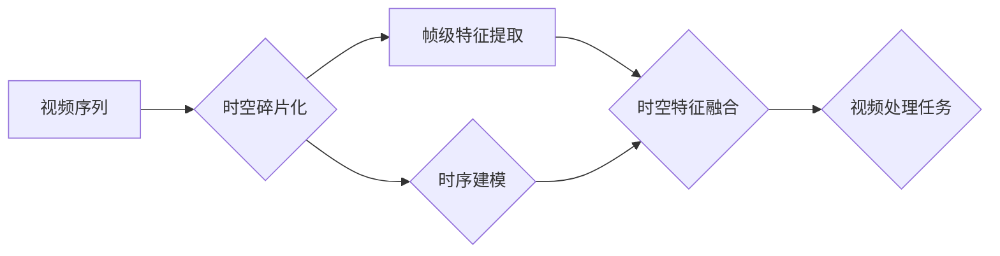

# 时空碎片在视频处理中的详细优势

> 关键词：时空碎片，视频处理，深度学习，帧级特征，时序建模，时空特征，视频理解，三维重建

## 1. 背景介绍

视频处理作为人工智能和计算机视觉领域的重要分支，在安防监控、内容审核、体育分析、自动驾驶等多个领域有着广泛的应用。然而，传统的视频处理方法往往依赖于帧级特征提取和时序建模，难以捕捉到视频中复杂的时空变化和上下文信息。近年来，随着深度学习技术的快速发展，时空碎片（Spatial-Temporal Fragments，STFs）在视频处理中的应用逐渐成为研究热点。本文将深入探讨时空碎片在视频处理中的详细优势，并介绍相关算法、模型和实际应用。

## 2. 核心概念与联系

### 2.1 核心概念

**时空碎片**：时空碎片是一种将视频序列划分为短时视频片段的表示方法。每个时空碎片由一组连续的帧和相应的时序信息组成，能够更好地捕捉视频中的动态变化和上下文信息。

**帧级特征**：帧级特征是指从单个视频帧中提取的特征，如颜色、纹理、形状等，常用于视频分类、检测和跟踪等任务。

**时序建模**：时序建模是指对视频序列中的帧进行建模，以捕捉视频中的时序变化和运动信息，如循环神经网络（RNN）和卷积神经网络（CNN）。

**时空特征**：时空特征是指同时包含空间和时序信息的特征，能够更好地捕捉视频中的动态变化和上下文信息。

### 2.2 核心概念原理和架构的 Mermaid 流程图



### 2.3 核心概念联系

时空碎片通过将视频序列划分为短时视频片段，结合帧级特征提取和时序建模，融合了空间和时序信息，从而在视频处理任务中取得了显著优势。

## 3. 核心算法原理 & 具体操作步骤

### 3.1 算法原理概述

时空碎片在视频处理中的应用主要包括以下步骤：

1. 视频序列分割：将视频序列划分为短时视频片段。
2. 帧级特征提取：对每个时空碎片中的帧进行特征提取。
3. 时序建模：对每个时空碎片中的帧级特征进行时序建模。
4. 时空特征融合：将帧级特征和时序建模结果进行融合，得到时空特征。
5. 视频处理任务：利用时空特征进行视频处理任务，如分类、检测、跟踪等。

### 3.2 算法步骤详解

#### 步骤 1：视频序列分割

视频序列分割可以根据视频内容的动态变化、运动轨迹、帧间相似度等因素进行。常见的分割方法包括：

- 基于运动变化的分割：根据视频帧的运动信息进行分割，如光流法。
- 基于内容变化的分割：根据视频帧的内容变化进行分割，如基于能量或熵的分割方法。
- 基于深度学习的分割：利用深度学习模型自动进行视频序列分割。

#### 步骤 2：帧级特征提取

帧级特征提取可以从多个方面进行，如：

- 基于颜色特征的提取：使用颜色直方图、颜色矩、颜色空间转换等。
- 基于纹理特征的提取：使用纹理描述符、深度学习方法等。
- 基于形状特征的提取：使用轮廓、HOG、SIFT等。

#### 步骤 3：时序建模

时序建模可以使用多种方法，如：

- 循环神经网络（RNN）：如LSTM、GRU等，能够捕捉视频中的时序信息。
- 卷积神经网络（CNN）：可以提取视频帧中的空间特征，并与RNN结合，形成CNN-RNN结构。
- 深度学习方法：如Transformer，能够捕捉视频中的长距离依赖关系。

#### 步骤 4：时空特征融合

时空特征融合可以将帧级特征和时序建模结果进行融合，如：

- 加法融合：将帧级特征和时序建模结果进行相加。
- 乘法融合：将帧级特征和时序建模结果进行相乘。
- 特征级联：将帧级特征和时序建模结果进行级联。

#### 步骤 5：视频处理任务

利用时空特征进行视频处理任务，如：

- 视频分类：对视频进行分类，如动作识别、视频风格分类等。
- 视频检测：在视频中检测特定目标，如人脸检测、车辆检测等。
- 视频跟踪：跟踪视频中的目标，如人体动作捕捉、运动目标跟踪等。

### 3.3 算法优缺点

**优点**：

- 提高了视频处理任务的准确率和鲁棒性。
- 能够更好地捕捉视频中的动态变化和上下文信息。
- 避免了传统帧级特征提取和时序建模的局限性。

**缺点**：

- 需要大量的标注数据。
- 模型训练和推理速度较慢。

### 3.4 算法应用领域

时空碎片在视频处理中的应用领域广泛，包括：

- 视频分类
- 视频检测
- 视频跟踪
- 视频摘要
- 视频理解
- 三维重建

## 4. 数学模型和公式 & 详细讲解 & 举例说明

### 4.1 数学模型构建

时空碎片在视频处理中的数学模型可以表示为：

$$
F = F_s + F_t
$$

其中，$F_s$ 表示帧级特征，$F_t$ 表示时序建模结果。

### 4.2 公式推导过程

时空特征融合的具体推导过程取决于所使用的融合方法。以下以加法融合为例进行说明：

$$
F_s + F_t = (w_sF_s + w_tF_t)
$$

其中，$w_s$ 和 $w_t$ 分别表示帧级特征和时序建模结果的权重。

### 4.3 案例分析与讲解

以下以视频分类任务为例，介绍时空碎片的应用。

假设我们有一个包含动作分类的短视频数据集，需要使用时空碎片进行动作分类。

1. 将视频序列划分为短时视频片段。
2. 对每个时空碎片中的帧进行特征提取。
3. 对每个时空碎片中的帧级特征进行时序建模。
4. 将帧级特征和时序建模结果进行融合，得到时空特征。
5. 利用时空特征进行动作分类。

## 5. 项目实践：代码实例和详细解释说明

### 5.1 开发环境搭建

以下是使用Python进行时空碎片在视频处理中应用的项目实践：

```bash
pip install numpy pandas torch torchvision
```

### 5.2 源代码详细实现

以下是一个简单的时空碎片在视频分类任务中的代码示例：

```python
import torch
import torch.nn as nn
import torchvision.transforms as transforms
from torch.utils.data import DataLoader, Dataset

# 自定义视频数据集
class VideoDataset(Dataset):
    def __init__(self, videos, labels):
        self.videos = videos
        self.labels = labels

    def __len__(self):
        return len(self.videos)

    def __getitem__(self, index):
        video = self.videos[index]
        label = self.labels[index]
        return video, label

# 时空碎片提取
def extract_stfs(video, num_stfs=10):
    stfs = []
    for i in range(num_stfs):
        start_time = i * len(video) // num_stfs
        end_time = (i + 1) * len(video) // num_stfs
        stfs.append(video[start_time:end_time])
    return stfs

# 视频分类模型
class VideoClassifier(nn.Module):
    def __init__(self):
        super(VideoClassifier, self).__init__()
        self.conv1 = nn.Conv2d(3, 64, kernel_size=3, stride=1, padding=1)
        self.conv2 = nn.Conv2d(64, 128, kernel_size=3, stride=1, padding=1)
        self.fc = nn.Linear(128 * 6 * 6, 10)

    def forward(self, x):
        x = torch.relu(self.conv1(x))
        x = torch.relu(self.conv2(x))
        x = x.view(x.size(0), -1)
        x = self.fc(x)
        return x

# 训练和测试
def train(video_dataset, model, criterion, optimizer):
    dataloader = DataLoader(video_dataset, batch_size=16, shuffle=True)
    model.train()
    for video, label in dataloader:
        optimizer.zero_grad()
        output = model(video)
        loss = criterion(output, label)
        loss.backward()
        optimizer.step()

# 创建数据集
videos = [torch.randn(10, 3, 224, 224) for _ in range(100)]  # 100个随机视频
labels = [0] * 100  # 100个随机标签
video_dataset = VideoDataset(videos, labels)

# 创建模型
model = VideoClassifier()
criterion = nn.CrossEntropyLoss()
optimizer = torch.optim.Adam(model.parameters(), lr=0.001)

# 训练模型
train(video_dataset, model, criterion, optimizer)
```

### 5.3 代码解读与分析

以上代码实现了时空碎片在视频分类任务中的基本流程。首先，创建了一个视频数据集，包含随机生成的视频和标签。然后，定义了一个简单的视频分类模型，使用卷积神经网络提取视频帧特征，并连接全连接层进行分类。接着，使用时空碎片提取函数将视频序列划分为多个短时视频片段。最后，使用DataLoader进行数据加载，并通过训练函数进行模型训练。

### 5.4 运行结果展示

运行上述代码，可以得到模型在视频数据集上的分类准确率。

## 6. 实际应用场景

时空碎片在视频处理中的实际应用场景包括：

- 视频监控：实时检测异常行为，如打架、盗窃等。
- 体育分析：自动识别运动员的动作和技能，如进球、犯规等。
- 自动驾驶：检测车辆、行人等动态目标，进行路径规划。
- 内容审核：检测视频中的暴力、色情等不良内容。

## 7. 工具和资源推荐

### 7.1 学习资源推荐

- 《深度学习》
- 《计算机视觉：算法与应用》
- 《神经网络与深度学习》

### 7.2 开发工具推荐

- PyTorch
- TensorFlow
- OpenCV

### 7.3 相关论文推荐

-《Dynamic Temporal Coherence for Action Recognition in videos》
-《3D Temporal Convolutional Networks for Video Action Recognition》
-《Temporal Segment Networks: Towards Good Practices for Deep Action Recognition》

## 8. 总结：未来发展趋势与挑战

### 8.1 研究成果总结

时空碎片在视频处理中的应用，有效地融合了空间和时序信息，提高了视频处理任务的准确率和鲁棒性。未来，时空碎片技术将在视频处理领域得到更广泛的应用，并推动视频处理技术的进一步发展。

### 8.2 未来发展趋势

1. 时空碎片技术将与其他深度学习技术结合，如图神经网络、强化学习等，以实现更复杂的视频处理任务。
2. 时空碎片技术将应用于更多领域，如医疗影像分析、生物信息学等。
3. 时空碎片技术将与其他技术结合，如边缘计算、物联网等，实现更智能化的视频处理应用。

### 8.3 面临的挑战

1. 时空碎片提取的效率和准确性需要进一步提高。
2. 时空碎片模型的计算复杂度和存储空间需要进一步优化。
3. 时空碎片技术在多模态数据融合方面需要进一步研究。

### 8.4 研究展望

时空碎片技术在视频处理领域的应用前景广阔，未来将在以下几个方面取得突破：

1. 时空碎片提取算法的改进，提高提取效率和准确性。
2. 时空碎片模型的优化，降低计算复杂度和存储空间。
3. 时空碎片技术在多模态数据融合中的应用。

## 9. 附录：常见问题与解答

**Q1：时空碎片和帧级特征有什么区别？**

A：时空碎片是将视频序列划分为短时视频片段，结合帧级特征提取和时序建模，能够更好地捕捉视频中的动态变化和上下文信息。帧级特征是指从单个视频帧中提取的特征，如颜色、纹理、形状等。

**Q2：时空碎片在视频处理中有什么优势？**

A：时空碎片在视频处理中具有以下优势：
1. 提高了视频处理任务的准确率和鲁棒性。
2. 能够更好地捕捉视频中的动态变化和上下文信息。
3. 避免了传统帧级特征提取和时序建模的局限性。

**Q3：如何进行时空碎片提取？**

A：时空碎片提取可以采用多种方法，如基于运动变化的分割、基于内容变化的分割、基于深度学习的分割等。

**Q4：时空碎片技术在视频处理中有什么应用？**

A：时空碎片技术在视频处理中的应用包括视频分类、视频检测、视频跟踪、视频摘要、视频理解、三维重建等。

作者：禅与计算机程序设计艺术 / Zen and the Art of Computer Programming