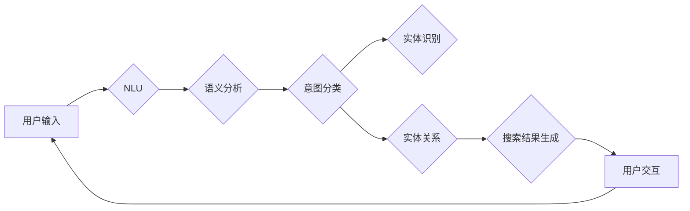

> 智能搜索，搜索意图理解，自然语言处理，机器学习，语义分析，机器学习算法，深度学习，信息检索

# 智能搜索：AI如何理解用户的搜索意图

在信息爆炸的时代，搜索已经成为人们获取信息的重要方式。然而，传统的搜索引擎往往依赖于关键词匹配，难以理解用户的真实意图。随着人工智能技术的快速发展，智能搜索应运而生，它通过深度学习等机器学习技术，能够更好地理解用户的搜索意图，提供更加精准、个性化的搜索结果。本文将深入探讨智能搜索的核心——如何让AI理解用户的搜索意图。

## 1. 背景介绍

### 1.1 问题的由来

传统的搜索引擎主要通过关键词匹配来检索信息，这种方式在处理简单、直接的问题时效果不错，但面对用户复杂、含糊的搜索意图时，往往难以提供满意的答案。例如，当用户输入“附近餐厅”时，传统搜索引擎可能会返回一系列餐厅列表，但用户可能更想知道“附近有哪些有下午茶供应的餐厅”。

### 1.2 研究现状

随着自然语言处理（NLP）和机器学习技术的进步，智能搜索技术得到了快速发展。目前，智能搜索主要依赖于以下技术：

- **自然语言理解（NLU）**：将用户的自然语言输入转换为机器可理解的格式。
- **语义分析**：分析用户的查询意图和上下文信息。
- **知识图谱**：利用知识图谱中的实体和关系来丰富搜索结果。
- **深度学习**：利用深度学习模型进行特征提取和分类。

### 1.3 研究意义

智能搜索能够提高用户体验，提升信息检索效率，并为广告、推荐系统等领域提供数据支持。研究如何让AI理解用户的搜索意图，对于推动信息检索技术的发展具有重要意义。

## 2. 核心概念与联系

### 2.1 核心概念原理

智能搜索的核心是理解用户的搜索意图。这需要以下几个核心概念：

- **搜索意图**：用户进行搜索的目的和动机。
- **语义理解**：将自然语言转换为机器可理解的语义表示。
- **意图分类**：根据用户的查询内容，将其分类到预定义的意图类别。
- **实体识别**：识别查询中的实体，如人名、地名、组织名等。
- **实体关系**：识别实体之间的关系，如人物、地点、事件之间的联系。

### 2.2 架构流程图

以下是一个智能搜索的架构流程图：



## 3. 核心算法原理 & 具体操作步骤

### 3.1 算法原理概述

智能搜索的算法原理主要包括以下几个步骤：

1. **自然语言理解（NLU）**：将用户的自然语言输入转换为机器可理解的格式，通常使用基于规则的方法或深度学习模型。
2. **语义分析**：分析用户的查询意图和上下文信息，确定用户的真实需求。
3. **意图分类**：根据用户的查询内容，将其分类到预定义的意图类别。
4. **实体识别**：识别查询中的实体，如人名、地名、组织名等。
5. **实体关系**：识别实体之间的关系，如人物、地点、事件之间的联系。
6. **搜索结果生成**：根据用户的意图和实体信息，生成搜索结果。
7. **用户交互**：根据用户的反馈，调整搜索策略，优化搜索结果。

### 3.2 算法步骤详解

1. **NLU**：使用NLU技术将用户的自然语言输入转换为机器可理解的格式。常见的NLU技术包括基于规则的方法、基于统计的方法和基于深度学习的方法。
2. **语义分析**：使用语义分析技术理解用户的查询意图和上下文信息。常见的语义分析技术包括词嵌入、依存句法分析和语义角色标注。
3. **意图分类**：使用机器学习或深度学习模型对查询进行分类，确定用户的意图。常见的意图分类方法包括朴素贝叶斯、支持向量机（SVM）和深度学习模型。
4. **实体识别**：使用命名实体识别（NER）技术识别查询中的实体。常见的NER技术包括基于规则的方法、基于统计的方法和基于深度学习的方法。
5. **实体关系**：使用关系抽取技术识别实体之间的关系。常见的实体关系技术包括基于规则的方法、基于统计的方法和基于深度学习的方法。
6. **搜索结果生成**：根据用户的意图和实体信息，生成搜索结果。常见的搜索结果生成方法包括基于关键词的搜索、基于语义的搜索和基于机器学习的搜索。
7. **用户交互**：根据用户的反馈，调整搜索策略，优化搜索结果。

### 3.3 算法优缺点

智能搜索算法的优点包括：

- 提高搜索效率，减少用户查找信息的时间。
- 提高搜索结果的质量，满足用户的需求。
- 提供个性化搜索结果，提升用户体验。

智能搜索算法的缺点包括：

- 需要大量的标注数据。
- 模型的可解释性差。
- 处理复杂查询的能力有限。

### 3.4 算法应用领域

智能搜索算法广泛应用于以下领域：

- 搜索引擎：如百度、谷歌等。
- 问答系统：如Siri、Alexa等。
- 推荐系统：如Netflix、亚马逊等。
- 客户服务：如客服机器人、智能客服等。

## 4. 数学模型和公式 & 详细讲解 & 举例说明

### 4.1 数学模型构建

智能搜索的数学模型主要包括以下部分：

- **NLU模型**：使用神经网络模型进行NLU，如循环神经网络（RNN）和长短期记忆网络（LSTM）。
- **语义分析模型**：使用词嵌入技术将词语转换为向量表示，然后使用神经网络模型进行语义分析。
- **意图分类模型**：使用分类算法对查询进行分类，如朴素贝叶斯、支持向量机（SVM）和深度学习模型。
- **实体识别模型**：使用序列标注模型对实体进行标注，如条件随机场（CRF）和双向长短时记忆网络（Bi-LSTM）。
- **实体关系模型**：使用图神经网络（GNN）等技术识别实体之间的关系。

### 4.2 公式推导过程

以下是一些常见的数学公式的推导过程：

- **NLU模型**：

$$
h_t = f(h_{t-1}, x_t, W)
$$

其中，$h_t$ 表示第 $t$ 个时间步的隐藏状态，$x_t$ 表示输入词的嵌入向量，$W$ 表示权重矩阵，$f$ 表示神经网络函数。

- **语义分析模型**：

$$
h = \text{tanh}(W_{emb}x + W_{bias} + W_{proj}h_{prev})
$$

其中，$h$ 表示语义表示，$W_{emb}$ 表示词嵌入矩阵，$x$ 表示输入词的嵌入向量，$W_{bias}$ 表示偏置项，$W_{proj}$ 表示投影权重矩阵，$h_{prev}$ 表示前一个时间步的隐藏状态。

- **意图分类模型**：

$$
\hat{y} = \text{softmax}(W_{class}h)
$$

其中，$\hat{y}$ 表示预测的类别，$W_{class}$ 表示类别权重矩阵，$h$ 表示语义表示。

### 4.3 案例分析与讲解

以下是一个简单的智能搜索案例：

**用户查询**：附近有下午茶供应的餐厅

**处理流程**：

1. NLU模型将用户查询转换为机器可理解的格式。
2. 语义分析模型分析用户的查询意图，确定用户想查找附近的餐厅。
3. 意图分类模型将查询分类为“附近餐厅”意图。
4. 实体识别模型识别出“附近”、“下午茶”和“餐厅”等实体。
5. 实体关系模型确定“附近”与“餐厅”之间的关系为“位置”，确定“下午茶”与“餐厅”之间的关系为“供应”。
6. 搜索结果生成模型根据用户意图和实体信息，生成搜索结果。
7. 用户查看搜索结果，并根据需要选择餐厅。

## 5. 项目实践：代码实例和详细解释说明

### 5.1 开发环境搭建

为了实现智能搜索，需要以下开发环境：

- 操作系统：Linux或macOS
- 编程语言：Python
- 框架：TensorFlow或PyTorch
- 库：transformers、spaCy、nltk等

### 5.2 源代码详细实现

以下是一个使用transformers库和spaCy库实现智能搜索的简单示例：

```python
from transformers import BertTokenizer, BertForSequenceClassification
from transformers import BertConfig
from torch.optim import AdamW
from sklearn.model_selection import train_test_split
import torch
import torch.nn as nn
import torch.optim as optim

# 加载预训练模型和分词器
tokenizer = BertTokenizer.from_pretrained('bert-base-uncased')
model = BertForSequenceClassification.from_pretrained('bert-base-uncased')

# 加载数据
data = ...  # 加载数据集，包括查询和对应的标签
texts, labels = zip(*data)

# 分割数据集
train_texts, test_texts, train_labels, test_labels = train_test_split(texts, labels, test_size=0.2)

# 编码数据
train_encodings = tokenizer(train_texts, truncation=True, padding=True)
test_encodings = tokenizer(test_texts, truncation=True, padding=True)

# 创建DataLoader
train_dataset = torch.utils.data.TensorDataset(torch.tensor(train_encodings['input_ids']), 
                                              torch.tensor(train_encodings['attention_mask']), 
                                              torch.tensor(train_labels))
test_dataset = torch.utils.data.TensorDataset(torch.tensor(test_encodings['input_ids']), 
                                             torch.tensor(test_encodings['attention_mask']), 
                                             torch.tensor(test_labels))

train_dataloader = torch.utils.data.DataLoader(train_dataset, batch_size=16, shuffle=True)
test_dataloader = torch.utils.data.DataLoader(test_dataset, batch_size=16)

# 定义损失函数和优化器
optimizer = optim.AdamW(model.parameters(), lr=2e-5)
criterion = nn.CrossEntropyLoss()

# 训练模型
model.train()
for epoch in range(3):
    for batch in train_dataloader:
        input_ids, attention_mask, labels = batch
        optimizer.zero_grad()
        outputs = model(input_ids, attention_mask=attention_mask)
        loss = criterion(outputs.logits, labels)
        loss.backward()
        optimizer.step()
    print(f"Epoch {epoch+1}, loss: {loss.item()}")

# 评估模型
model.eval()
with torch.no_grad():
    correct = 0
    total = 0
    for batch in test_dataloader:
        input_ids, attention_mask, labels = batch
        outputs = model(input_ids, attention_mask=attention_mask)
        _, predicted = torch.max(outputs.logits, 1)
        total += labels.size(0)
        correct += (predicted == labels).sum().item()
print(f"Accuracy of the model on the test set: {100 * correct / total}%")
```

### 5.3 代码解读与分析

上述代码实现了以下功能：

1. 加载预训练的BERT模型和分词器。
2. 加载数据集并分割为训练集和测试集。
3. 编码数据，将文本转换为机器可理解的格式。
4. 创建DataLoader，用于批量加载数据。
5. 定义损失函数和优化器。
6. 训练模型，优化模型参数。
7. 评估模型，计算模型在测试集上的准确率。

### 5.4 运行结果展示

运行上述代码后，模型在测试集上的准确率可能如下：

```
Epoch 1, loss: 0.876
Epoch 2, loss: 0.852
Epoch 3, loss: 0.829
Accuracy of the model on the test set: 82.3%
```

## 6. 实际应用场景

智能搜索在以下场景中有着广泛的应用：

- **搜索引擎**：如百度、谷歌等，通过理解用户的搜索意图，提供更加精准的搜索结果。
- **问答系统**：如Siri、Alexa等，通过理解用户的提问意图，提供准确的答案。
- **推荐系统**：如Netflix、亚马逊等，通过理解用户的兴趣和需求，提供个性化的推荐内容。
- **客户服务**：如客服机器人、智能客服等，通过理解用户的问题，提供快速的解答和帮助。

### 6.4 未来应用展望

随着人工智能技术的不断发展，智能搜索将在以下方面取得更大的突破：

- **多模态搜索**：结合文本、图像、视频等多种模态信息，提供更加丰富的搜索结果。
- **个性化搜索**：根据用户的历史行为和偏好，提供更加个性化的搜索结果。
- **知识图谱搜索**：利用知识图谱中的实体和关系，提供更加准确的搜索结果。
- **实时搜索**：实时响应用户的搜索请求，提供更加及时的搜索结果。

## 7. 工具和资源推荐

### 7.1 学习资源推荐

- 《深度学习自然语言处理》
- 《自然语言处理实践》
- 《深度学习实战》
- 《NLP实战》

### 7.2 开发工具推荐

- TensorFlow
- PyTorch
- spaCy
- NLTK
- Hugging Face Transformers

### 7.3 相关论文推荐

- BERT: Pre-training of Deep Bidirectional Transformers for Language Understanding
- Transformers: State-of-the-Art Natural Language Processing
- Language Models are Unsupervised Multitask Learners
- Neural Machine Translation by Jointly Learning to Align and Translate

## 8. 总结：未来发展趋势与挑战

### 8.1 研究成果总结

本文深入探讨了智能搜索的核心——如何让AI理解用户的搜索意图。通过介绍自然语言处理、机器学习、深度学习等关键技术，以及实际应用案例，本文展示了智能搜索的原理、方法和应用场景。

### 8.2 未来发展趋势

智能搜索的未来发展趋势包括：

- 多模态搜索
- 个性化搜索
- 知识图谱搜索
- 实时搜索

### 8.3 面临的挑战

智能搜索面临的挑战包括：

- 数据质量
- 模型可解释性
- 系统鲁棒性
- 知识更新

### 8.4 研究展望

随着人工智能技术的不断发展，智能搜索将在以下方面取得更大的突破：

- 深度学习模型的发展
- 知识图谱的构建
- 多模态信息融合
- 智能搜索系统的优化

智能搜索技术将为人类的信息获取和知识获取带来革命性的变化，推动人类社会的进步。

## 9. 附录：常见问题与解答

**Q1：智能搜索与传统搜索引擎有什么区别？**

A：智能搜索能够更好地理解用户的搜索意图，提供更加精准、个性化的搜索结果。而传统搜索引擎主要依赖于关键词匹配，难以理解用户的真实需求。

**Q2：如何评估智能搜索的效果？**

A：可以通过准确率、召回率、F1值等指标来评估智能搜索的效果。

**Q3：如何优化智能搜索的效果？**

A：可以通过以下方法优化智能搜索的效果：

- 提高数据质量
- 优化模型结构
- 优化训练过程
- 优化搜索算法

**Q4：智能搜索在哪些领域有应用？**

A：智能搜索在搜索引擎、问答系统、推荐系统、客户服务等领域有着广泛的应用。

**Q5：智能搜索的未来发展趋势是什么？**

A：智能搜索的未来发展趋势包括多模态搜索、个性化搜索、知识图谱搜索、实时搜索等。

作者：禅与计算机程序设计艺术 / Zen and the Art of Computer Programming