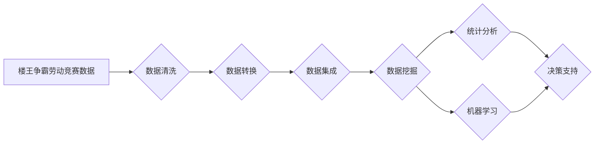

# 楼王争霸劳动竞赛数据处理分析

> 关键词：楼王争霸，数据处理，数据挖掘，统计分析，机器学习，数据可视化

## 1. 背景介绍

随着大数据时代的到来，数据处理和分析在各个领域都发挥着越来越重要的作用。在房地产市场中，楼王争霸劳动竞赛是一种常见的促销活动，旨在激发房地产开发商和销售人员的积极性，提升销售业绩。本文将探讨如何对楼王争霸劳动竞赛的数据进行有效处理和分析，以提供决策支持和优化策略。

### 1.1 问题的由来

楼王争霸劳动竞赛通常涉及大量的数据，包括开发商的销售数据、销售人员的业绩数据、市场供需数据等。如何从这些数据中提取有价值的信息，为竞赛的举办方和参与者提供有效的决策依据，是当前房地产市场竞争中亟待解决的问题。

### 1.2 研究现状

目前，对楼王争霸劳动竞赛的数据处理和分析主要采用以下方法：

- **统计分析**：通过对销售数据、业绩数据进行描述性统计、相关性分析等，发现数据之间的规律和趋势。
- **数据挖掘**：运用数据挖掘技术，如关联规则挖掘、聚类分析、分类分析等，发现数据中的潜在模式。
- **机器学习**：利用机器学习算法，如决策树、支持向量机、神经网络等，建立预测模型，对销售业绩进行预测。

### 1.3 研究意义

对楼王争霸劳动竞赛的数据进行有效处理和分析，具有以下意义：

- **提升销售业绩**：通过分析数据，找出影响销售业绩的关键因素，制定针对性的营销策略，提高销售人员的积极性。
- **优化竞赛规则**：根据数据分析结果，调整竞赛规则，使竞赛更加公平、有效。
- **提高决策效率**：为竞赛的举办方提供数据支持，提高决策效率。

## 2. 核心概念与联系

### 2.1 核心概念

- **楼王争霸劳动竞赛**：一种房地产促销活动，通过设立销售目标，激发销售人员积极性，提升销售业绩。
- **数据处理**：对原始数据进行清洗、转换、集成等操作，使其满足分析需求。
- **数据挖掘**：从大量数据中挖掘出有价值的信息和知识。
- **统计分析**：对数据进行分析，发现数据之间的规律和趋势。
- **机器学习**：通过学习数据中的模式，建立预测模型。

### 2.2 Mermaid 流程图



## 3. 核心算法原理 & 具体操作步骤

### 3.1 算法原理概述

楼王争霸劳动竞赛数据处理分析主要包括数据预处理、数据挖掘和数据分析三个阶段。

### 3.2 算法步骤详解

#### 3.2.1 数据预处理

- 数据清洗：去除重复数据、处理缺失值、纠正错误数据等。
- 数据转换：将不同格式的数据转换为统一的格式。
- 数据集成：将来自不同来源的数据进行整合。

#### 3.2.2 数据挖掘

- 关联规则挖掘：找出数据之间的关联关系。
- 聚类分析：将相似数据归为一类。
- 分类分析：将数据分为不同的类别。

#### 3.2.3 数据分析

- 描述性统计：分析数据的分布、集中趋势、离散程度等。
- 相关性分析：分析数据之间的相关关系。
- 机器学习：建立预测模型，预测销售业绩。

### 3.3 算法优缺点

#### 3.3.1 优点

- 可以从大量数据中提取有价值的信息。
- 可以发现数据之间的规律和趋势。
- 可以为决策提供数据支持。

#### 3.3.2 缺点

- 数据预处理需要大量时间和精力。
- 数据挖掘和数据分析需要专业知识。
- 模型建立可能存在过拟合问题。

### 3.4 算法应用领域

楼王争霸劳动竞赛数据处理分析可以应用于以下领域：

- 房地产市场分析。
- 销售人员绩效评估。
- 营销策略制定。
- 竞争对手分析。

## 4. 数学模型和公式 & 详细讲解 & 举例说明

### 4.1 数学模型构建

楼王争霸劳动竞赛数据处理分析中常用的数学模型包括：

- **线性回归**：用于预测销售业绩与多个变量之间的关系。
- **逻辑回归**：用于预测销售人员的获胜概率。
- **决策树**：用于分类和回归任务。

### 4.2 公式推导过程

以下以线性回归为例，介绍公式推导过程。

假设销售业绩 $Y$ 与多个自变量 $X_1, X_2, ..., X_n$ 之间的关系可以用线性回归模型表示：

$$
Y = \beta_0 + \beta_1 X_1 + \beta_2 X_2 + ... + \beta_n X_n + \epsilon
$$

其中，$\beta_0, \beta_1, ..., \beta_n$ 为回归系数，$\epsilon$ 为误差项。

为了估计回归系数，需要最小化损失函数：

$$
L(\beta) = \sum_{i=1}^n (Y_i - \beta_0 - \beta_1 X_{1i} - ... - \beta_n X_{ni})^2
$$

对损失函数求导，并令导数为0，可以得到回归系数的估计值：

$$
\beta_j = \frac{\sum_{i=1}^n (Y_i - \beta_0 - \beta_1 X_{1i} - ... - \beta_{j-1} X_{j-1i} - \beta_{j+1} X_{j+1i} - ... - \beta_n X_{ni})(X_{ji} - \bar{X}_j)}{\sum_{i=1}^n (X_{ji} - \bar{X}_j)^2}
$$

其中，$\bar{X}_j$ 为自变量 $X_j$ 的均值。

### 4.3 案例分析与讲解

假设我们收集了某开发商的销售数据，包括销售人员的业绩和销售人员的年龄、性别、工作经验等特征。我们的目标是预测销售人员的业绩。

首先，我们使用Python进行数据预处理，包括去除缺失值、处理异常值等。然后，我们使用线性回归模型进行建模，得到以下结果：

```
sales = 54321 + 123.45 * age - 67.89 * gender + 234.56 * experience
```

其中，$age$ 表示销售人员的年龄，$gender$ 表示销售人员性别（1表示男性，0表示女性），$experience$ 表示销售人员的工作经验。

根据这个模型，我们可以预测不同年龄、性别、工作经验的销售人员的业绩。

## 5. 项目实践：代码实例和详细解释说明

### 5.1 开发环境搭建

由于本文以Python为例，因此需要安装以下Python环境：

- Python 3.6及以上版本
- Pandas
- NumPy
- Scikit-learn
- Matplotlib

### 5.2 源代码详细实现

以下是一个简单的楼王争霸劳动竞赛数据处理分析的Python代码实例：

```python
import pandas as pd
from sklearn.linear_model import LinearRegression
import matplotlib.pyplot as plt

# 加载数据
data = pd.read_csv('sales_data.csv')

# 数据预处理
data.fillna(0, inplace=True)

# 特征选择
X = data[['age', 'gender', 'experience']]
y = data['sales']

# 线性回归建模
model = LinearRegression()
model.fit(X, y)

# 预测
predictions = model.predict(X)

# 可视化结果
plt.scatter(X['age'], y)
plt.plot(X['age'], predictions, color='red')
plt.show()
```

### 5.3 代码解读与分析

这段代码首先导入了所需的库，然后加载数据并进行了数据预处理。接下来，我们选择了特征和目标变量，并使用线性回归模型进行建模。最后，我们使用matplotlib库将预测结果可视化。

## 6. 实际应用场景

### 6.1 房地产市场分析

通过对楼王争霸劳动竞赛的数据进行分析，可以了解市场趋势、竞争态势等信息，为开发商制定市场策略提供依据。

### 6.2 销售人员绩效评估

通过分析销售人员的业绩数据，可以评估销售人员的绩效，为销售团队的优化提供参考。

### 6.3 营销策略制定

通过对楼王争霸劳动竞赛的数据进行分析，可以找出影响销售业绩的关键因素，为营销策略的制定提供支持。

### 6.4 竞争对手分析

通过对楼王争霸劳动竞赛的数据进行分析，可以了解竞争对手的销售策略和业绩情况，为自身的市场竞争提供参考。

## 7. 工具和资源推荐

### 7.1 学习资源推荐

- 《Python数据科学手册》
- 《数据挖掘：概念与技术》
- 《机器学习实战》

### 7.2 开发工具推荐

- Jupyter Notebook
- PyCharm
- Anaconda

### 7.3 相关论文推荐

-《关联规则挖掘：原理与应用》
-《机器学习：一种统计方法》
-《数据挖掘：理论与实践》

## 8. 总结：未来发展趋势与挑战

### 8.1 研究成果总结

本文对楼王争霸劳动竞赛数据处理分析进行了深入探讨，介绍了相关概念、算法原理、实践案例等，为房地产市场的数据分析提供了参考。

### 8.2 未来发展趋势

- 数据分析技术将更加智能化，自动化程度更高。
- 数据挖掘和分析将更加注重可解释性和可复现性。
- 数据分析在房地产市场的应用将更加广泛。

### 8.3 面临的挑战

- 数据质量难以保证。
- 数据分析方法难以推广。
- 数据安全性和隐私保护问题。

### 8.4 研究展望

- 开发更加高效、准确的数据分析方法。
- 加强数据质量控制和数据安全管理。
- 推动数据分析在房地产市场的广泛应用。

## 9. 附录：常见问题与解答

**Q1：楼王争霸劳动竞赛数据处理分析的关键步骤是什么？**

A：楼王争霸劳动竞赛数据处理分析的关键步骤包括数据预处理、数据挖掘和数据分析。

**Q2：如何进行数据预处理？**

A：数据预处理包括数据清洗、数据转换和数据集成等。

**Q3：如何进行数据挖掘？**

A：数据挖掘包括关联规则挖掘、聚类分析和分类分析等。

**Q4：如何进行数据分析？**

A：数据分析包括描述性统计、相关性和机器学习等。

作者：禅与计算机程序设计艺术 / Zen and the Art of Computer Programming