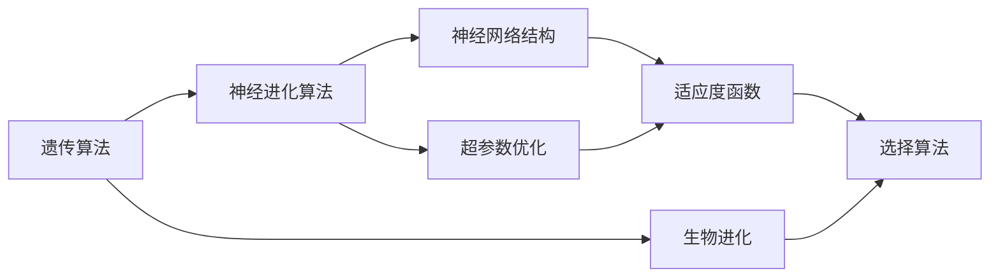
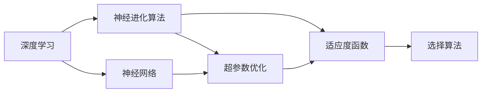
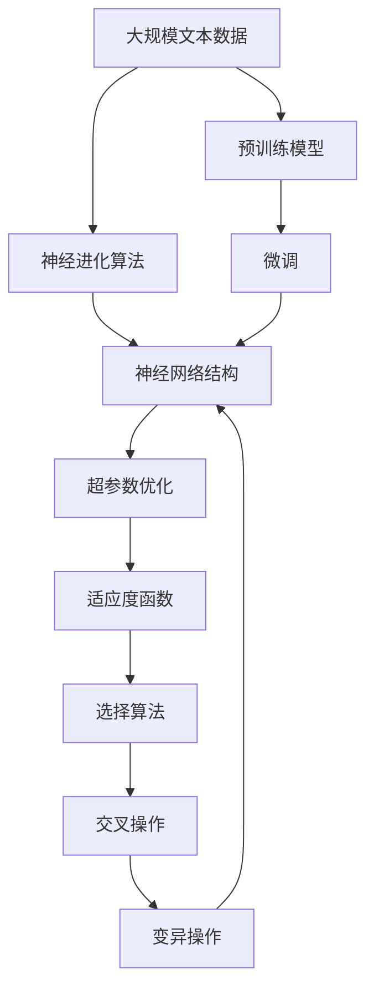

                 

# 神经进化算法(Neuroevolution) - 原理与代码实例讲解

> 关键词：神经进化算法,遗传算法,生物进化,神经网络优化,目标函数,适应度评估,变异,交叉

## 1. 背景介绍

### 1.1 问题由来
神经进化算法(Neuroevolution)是一种基于生物进化原理的神经网络优化技术。与传统的基于梯度的方法不同，神经进化算法通过模拟生物进化的过程，以适应度为基础，逐步优化神经网络的连接权重和结构，从而达到全局最优或次优解的目标。它结合了遗传算法和神经网络的优势，可以处理复杂的非线性问题，并且在面对大量噪声数据和高维问题时表现优异。

神经进化算法起源于20世纪80年代，最早由美国圣地亚哥超级计算研究中心的Aatreya Maulik和David E. Goldberg提出，主要用于处理控制系统的优化问题。但随着神经网络的普及，神经进化算法也被广泛应用于神经网络的优化和设计中。近年来，随着深度学习技术的迅速发展，神经进化算法在深度学习模型的优化和训练中得到了广泛应用，特别是在处理深度神经网络的超参数优化方面。

神经进化算法的一个重要应用是深度神经网络的自动设计。通过自动设计网络结构，神经进化算法可以生成具有优异性能的深度神经网络，并在迁移学习、图像识别、语音识别、自然语言处理等领域取得了显著效果。

### 1.2 问题核心关键点
神经进化算法涉及的核心关键点包括：
- 生物进化：以生物进化为灵感，模拟遗传、变异、选择等过程，优化神经网络结构。
- 适应度函数：定义网络在特定任务上的表现，用于评估网络性能。
- 交叉和变异：通过遗传算法的交叉和变异操作，对网络结构进行调整，引入新基因。
- 选择算法：根据适应度函数，筛选出性能优良的个体进行进一步进化。
- 神经网络结构：包括连接权重、隐藏层数、隐藏单元数等，影响网络性能。
- 超参数优化：如学习率、批量大小、优化器等，是神经进化算法的关键。

这些关键点共同构成了神经进化算法的基本框架，使其能够在复杂问题上发挥优势。

### 1.3 问题研究意义
神经进化算法在深度学习领域具有重要的研究意义，具体体现在以下几个方面：
- 自动设计网络结构：神经进化算法能够自动生成具有优异性能的神经网络结构，减少人工设计的复杂性和工作量。
- 优化超参数：通过自动优化超参数，神经进化算法可以更快地找到最优或次优的模型配置。
- 处理复杂问题：神经进化算法能够处理复杂的非线性问题，如图像识别、语音识别、自然语言处理等。
- 提高模型泛化能力：自动设计的模型结构更具泛化能力，能够在不同数据集上表现出色。
- 降低研发成本：神经进化算法能够降低深度学习模型的研发成本，加速模型迭代和优化。

## 2. 核心概念与联系

### 2.1 核心概念概述

为更好地理解神经进化算法的原理和应用，本节将介绍几个核心概念：

- 神经进化算法：基于生物进化原理的神经网络优化技术，通过模拟遗传、变异、选择等过程，逐步优化神经网络结构。
- 遗传算法：一种基于生物进化原理的搜索算法，通过模拟遗传、变异、选择等过程，在搜索空间内逐步优化目标函数。
- 生物进化：通过遗传、变异、选择等过程，生物个体适应环境的过程，是神经进化算法的灵感来源。
- 神经网络结构：包括连接权重、隐藏层数、隐藏单元数等，影响网络性能。
- 超参数优化：如学习率、批量大小、优化器等，是神经进化算法的关键。
- 适应度函数：定义网络在特定任务上的表现，用于评估网络性能。

这些核心概念之间存在着紧密的联系，构成了神经进化算法的完整生态系统。下面我们通过几个Mermaid流程图来展示这些概念之间的关系。



这个流程图展示了遗传算法、神经进化算法、生物进化、神经网络结构、超参数优化和适应度函数之间的关系：

1. 遗传算法作为基础，提供了基本的进化过程。
2. 神经进化算法结合遗传算法的思想，在神经网络优化领域得到应用。
3. 生物进化是神经进化算法的灵感来源，提供了进化过程中遗传、变异、选择等基本操作。
4. 神经网络结构是神经进化算法优化的目标，包含连接权重、隐藏层数、隐藏单元数等。
5. 超参数优化是神经进化算法的关键，通过自动优化超参数，可以更快地找到最优或次优的模型配置。
6. 适应度函数用于评估网络性能，是神经进化算法的重要组成部分。

这些核心概念共同构成了神经进化算法的基本框架，使其能够在复杂问题上发挥优势。

### 2.2 概念间的关系

这些核心概念之间存在着紧密的联系，形成了神经进化算法的基本生态系统。下面我们通过几个Mermaid流程图来展示这些概念之间的关系。

#### 2.2.1 神经进化算法的学习范式


这个流程图展示了神经进化算法的基本学习范式：

1. 以遗传算法为灵感，模拟生物进化的过程。
2. 在神经网络优化领域，通过模拟遗传、变异、选择等过程，逐步优化神经网络结构。
3. 通过自动优化超参数，可以更快地找到最优或次优的模型配置。
4. 适应度函数用于评估网络性能，筛选出性能优良的个体进行进一步进化。
5. 神经网络结构是神经进化算法优化的目标，包含连接权重、隐藏层数、隐藏单元数等。

#### 2.2.2 神经进化算法与深度学习的关系



这个流程图展示了神经进化算法与深度学习的关系：

1. 深度学习中的神经网络是神经进化算法优化的目标。
2. 通过自动优化超参数，可以更快地找到最优或次优的模型配置。
3. 适应度函数用于评估网络性能，筛选出性能优良的个体进行进一步进化。
4. 神经进化算法结合遗传算法的思想，通过模拟遗传、变异、选择等过程，逐步优化神经网络结构。
5. 神经进化算法在深度学习模型的优化和训练中得到了广泛应用，特别是在处理深度神经网络的超参数优化方面。

### 2.3 核心概念的整体架构

最后，我们用一个综合的流程图来展示这些核心概念在大规模神经进化算法优化过程中的整体架构：



这个综合流程图展示了从预训练模型到微调，再到神经进化算法的完整过程。大规模文本数据首先经过预训练模型，然后通过微调得到优化后的神经网络结构。神经进化算法在此基础上，通过遗传、变异、选择等过程，逐步优化神经网络结构，最终生成具有优异性能的深度神经网络。

## 3. 核心算法原理 & 具体操作步骤
### 3.1 算法原理概述

神经进化算法的核心思想是模拟生物进化过程，通过遗传、变异、选择等操作，逐步优化神经网络结构，达到全局最优或次优解的目标。

神经进化算法的核心流程包括以下几个步骤：
1. 初始化种群：随机生成一组神经网络个体，作为种群的初始解。
2. 计算适应度：根据任务目标函数，计算每个个体的适应度值。
3. 选择操作：根据适应度值，选择部分个体进行交叉和变异操作。
4. 交叉操作：将选择出的个体进行交叉操作，产生新的个体。
5. 变异操作：对新的个体进行变异操作，引入随机基因。
6. 评估适应度：对新生成的个体重新计算适应度值。
7. 选择操作：根据新的适应度值，选择部分个体进行交叉和变异操作。
8. 重复步骤2至7，直到满足预设的终止条件。

### 3.2 算法步骤详解

神经进化算法的主要步骤如下：

**Step 1: 初始化种群**

随机生成一组神经网络个体，作为种群的初始解。每个个体对应一个神经网络结构，包含连接权重、隐藏层数、隐藏单元数等。

**Step 2: 计算适应度**

根据任务目标函数，计算每个个体的适应度值。适应度函数用于评估网络在特定任务上的表现，通常是任务损失函数的负值。

**Step 3: 选择操作**

根据适应度值，选择部分个体进行交叉和变异操作。常用的选择算法有轮盘赌选择、锦标赛选择等。

**Step 4: 交叉操作**

将选择出的个体进行交叉操作，产生新的个体。常用的交叉算法有单点交叉、多点交叉、均匀交叉等。

**Step 5: 变异操作**

对新的个体进行变异操作，引入随机基因。常用的变异算法有单点变异、多点变异、均匀变异等。

**Step 6: 评估适应度**

对新生成的个体重新计算适应度值。评估适应度值是选择和交叉操作的基础，用于筛选出性能优良的个体。

**Step 7: 选择操作**

根据新的适应度值，选择部分个体进行交叉和变异操作。选择操作是神经进化算法的核心，用于决定哪些个体可以参与下一步的进化。

**Step 8: 重复步骤2至7，直到满足预设的终止条件。**

重复上述步骤，直到满足预设的终止条件，如达到最大迭代次数、适应度值不再提升等。

### 3.3 算法优缺点

神经进化算法的主要优点包括：
1. 不需要梯度信息：神经进化算法不需要梯度信息，适用于处理复杂且难以计算梯度的优化问题。
2. 全局优化能力：神经进化算法能够搜索广泛的解空间，找到全局最优或次优解。
3. 适用于高维问题：神经进化算法能够处理高维问题，如图像识别、语音识别、自然语言处理等。
4. 鲁棒性强：神经进化算法能够处理大量噪声数据，具有较强的鲁棒性。

神经进化算法的主要缺点包括：
1. 计算量大：神经进化算法需要多次计算适应度值，并进行遗传、变异、选择等操作，计算量较大。
2. 易陷入局部最优：神经进化算法容易陷入局部最优，需要进行多次实验和调整。
3. 对超参数敏感：神经进化算法对超参数的设定要求较高，需要多次实验和调整。

### 3.4 算法应用领域

神经进化算法在深度学习领域具有广泛的应用，具体包括以下几个领域：

- 图像识别：神经进化算法能够自动设计深度神经网络，提高图像识别模型的性能。
- 语音识别：神经进化算法能够优化卷积神经网络的结构，提高语音识别模型的性能。
- 自然语言处理：神经进化算法能够优化循环神经网络的结构，提高自然语言处理模型的性能。
- 游戏AI：神经进化算法能够优化神经网络的结构和参数，提高游戏AI的性能。
- 生成对抗网络(GANs)：神经进化算法能够优化GANs的结构和参数，生成更加逼真的图像。
- 机器人控制：神经进化算法能够优化机器人的控制策略，提高机器人的性能。

## 4. 数学模型和公式 & 详细讲解  
### 4.1 数学模型构建

神经进化算法的数学模型可以通过以下公式进行描述：

$$
f_{\text{fitness}} = -L(x)
$$

其中，$f_{\text{fitness}}$ 表示个体在特定任务上的适应度值，$L(x)$ 表示任务损失函数，$x$ 表示神经网络结构。

神经进化算法的优化目标是最小化适应度值，即：

$$
\min_{x} f_{\text{fitness}}
$$

神经进化算法的优化流程可以分为以下几个步骤：

1. 初始化种群：随机生成一组神经网络个体，作为种群的初始解。
2. 计算适应度：根据任务目标函数，计算每个个体的适应度值。
3. 选择操作：根据适应度值，选择部分个体进行交叉和变异操作。
4. 交叉操作：将选择出的个体进行交叉操作，产生新的个体。
5. 变异操作：对新的个体进行变异操作，引入随机基因。
6. 评估适应度：对新生成的个体重新计算适应度值。
7. 选择操作：根据新的适应度值，选择部分个体进行交叉和变异操作。
8. 重复步骤2至7，直到满足预设的终止条件。

### 4.2 公式推导过程

以下我们以图像识别任务为例，推导神经进化算法的核心公式。

假设神经进化算法用于优化卷积神经网络的结构，其中包含多个卷积层、池化层和全连接层。每个神经元对应一个连接权重，需要进行优化。神经进化算法的优化目标是最小化分类损失函数：

$$
L(x) = -\frac{1}{N}\sum_{i=1}^N \log P(y_i | x)
$$

其中，$P(y_i | x)$ 表示模型在输入 $x$ 下的输出概率，$y_i$ 表示真实标签，$N$ 表示样本数量。

神经进化算法的适应度函数可以定义为：

$$
f_{\text{fitness}} = -L(x)
$$

在神经进化算法中，每个神经网络个体可以看作是一个染色体，每个连接权重对应一个基因。神经进化算法的优化流程可以分为以下几个步骤：

1. 初始化种群：随机生成一组神经网络个体，作为种群的初始解。
2. 计算适应度：根据任务目标函数，计算每个个体的适应度值。
3. 选择操作：根据适应度值，选择部分个体进行交叉和变异操作。
4. 交叉操作：将选择出的个体进行交叉操作，产生新的个体。
5. 变异操作：对新的个体进行变异操作，引入随机基因。
6. 评估适应度：对新生成的个体重新计算适应度值。
7. 选择操作：根据新的适应度值，选择部分个体进行交叉和变异操作。
8. 重复步骤2至7，直到满足预设的终止条件。

### 4.3 案例分析与讲解

下面以图像识别任务为例，展示神经进化算法的具体应用过程。

假设我们要优化一个卷积神经网络，用于识别手写数字。网络结构如下：

```
输入层 -> 卷积层1 -> 池化层1 -> 卷积层2 -> 池化层2 -> 全连接层 -> 输出层
```

其中，每个卷积层和池化层包含多个神经元，每个神经元对应一个连接权重。神经进化算法的优化目标是最小化分类损失函数：

$$
L(x) = -\frac{1}{N}\sum_{i=1}^N \log P(y_i | x)
$$

神经进化算法的优化流程可以分为以下几个步骤：

1. 初始化种群：随机生成一组神经网络个体，作为种群的初始解。每个个体对应一个神经网络结构，包含连接权重、隐藏层数、隐藏单元数等。
2. 计算适应度：根据任务目标函数，计算每个个体的适应度值。适应度函数可以定义为：
   $$
   f_{\text{fitness}} = -L(x)
   $$
3. 选择操作：根据适应度值，选择部分个体进行交叉和变异操作。常用的选择算法有轮盘赌选择、锦标赛选择等。
4. 交叉操作：将选择出的个体进行交叉操作，产生新的个体。常用的交叉算法有单点交叉、多点交叉、均匀交叉等。
5. 变异操作：对新的个体进行变异操作，引入随机基因。常用的变异算法有单点变异、多点变异、均匀变异等。
6. 评估适应度：对新生成的个体重新计算适应度值。
7. 选择操作：根据新的适应度值，选择部分个体进行交叉和变异操作。
8. 重复步骤2至7，直到满足预设的终止条件。

在实践中，神经进化算法需要设置多个超参数，如种群大小、迭代次数、交叉概率、变异概率等。这些超参数的设定需要根据具体任务进行调整，以获得最佳的优化效果。

## 5. 项目实践：代码实例和详细解释说明
### 5.1 开发环境搭建

在进行神经进化算法实践前，我们需要准备好开发环境。以下是使用Python进行TensorFlow和Keras开发的环境配置流程：

1. 安装Anaconda：从官网下载并安装Anaconda，用于创建独立的Python环境。

2. 创建并激活虚拟环境：
```bash
conda create -n tf-env python=3.8 
conda activate tf-env
```

3. 安装TensorFlow：根据CUDA版本，从官网获取对应的安装命令。例如：
```bash
conda install tensorflow=2.6
```

4. 安装Keras：
```bash
conda install keras
```

5. 安装各类工具包：
```bash
pip install numpy pandas scikit-learn matplotlib tqdm jupyter notebook ipython
```

完成上述步骤后，即可在`tf-env`环境中开始神经进化算法的实践。

### 5.2 源代码详细实现

下面我们以图像识别任务为例，给出使用TensorFlow和Keras实现神经进化算法的PyTorch代码实现。

首先，定义神经进化算法的初始种群和适应度函数：

```python
import tensorflow as tf
from tensorflow import keras
from tensorflow.keras import layers
import numpy as np
import matplotlib.pyplot as plt

# 定义神经进化算法的种群大小和迭代次数
POPULATION_SIZE = 50
ITERATIONS = 100

# 定义神经进化算法的适应度函数
def fitness_function(model):
    # 加载数据集
    mnist = keras.datasets.mnist
    (x_train, y_train), (x_test, y_test) = mnist.load_data()

    # 将数据集归一化
    x_train = x_train / 255.0
    x_test = x_test / 255.0

    # 将标签转换为独热编码
    y_train = keras.utils.to_categorical(y_train, 10)
    y_test = keras.utils.to_categorical(y_test, 10)

    # 构建模型
    model = keras.Sequential([
        layers.Flatten(input_shape=(28, 28)),
        layers.Dense(256, activation='relu'),
        layers.Dense(10, activation='softmax')
    ])

    # 编译模型
    model.compile(optimizer='adam', loss='categorical_crossentropy', metrics=['accuracy'])

    # 训练模型
    model.fit(x_train, y_train, epochs=5, batch_size=32, validation_data=(x_test, y_test))

    # 计算损失
    loss = model.evaluate(x_test, y_test)

    return -loss

# 定义神经进化算法的初始种群
def create_population():
    # 随机生成一组神经网络个体，作为种群的初始解
    population = []
    for _ in range(POPULATION_SIZE):
        model = keras.Sequential([
            layers.Flatten(input_shape=(28, 28)),
            layers.Dense(256, activation='relu'),
            layers.Dense(10, activation='softmax')
        ])
        population.append(model)

    return population

# 定义神经进化算法的交叉操作
def crossover(parent1, parent2):
    # 随机选择一个交叉点
    crossover_point = np.random.randint(0, len(parent1.layers))
    child1 = keras.Sequential([parent1.layers[:crossover_point] + parent2.layers[crossover_point:]])
    child2 = keras.Sequential([parent2.layers[:crossover_point] + parent1.layers[crossover_point:]])
    return child1, child2

# 定义神经进化算法的变异操作
def mutation(child):
    # 随机选择变异点
    mutation_point = np.random.randint(0, len(child.layers))
    # 随机生成新的权重
    new_weights = np.random.randn(*child.layers[mutation_point].weights.shape)
    child.layers[mutation_point].set_weights([new_weights])

# 定义神经进化算法的选择操作
def selection(population, fitness_values):
    # 根据适应度值，选择部分个体进行交叉和变异操作
    selected_indices = np.argsort(fitness_values)[-POPULATION_SIZE//2:]
    return [population[i] for i in selected_indices]

# 定义神经进化算法的优化过程
def optimize():
    # 初始化种群
    population = create_population()

    # 迭代优化
    for iteration in range(ITERATIONS):
        # 计算适应度值
        fitness_values = [fitness_function(model) for model in population]

        # 选择操作
        selected_population = selection(population, fitness_values)

        # 交叉操作
        new_population = []
        for _ in range(POPULATION_SIZE // 2):
            parent1, parent2 = np.random.choice(selected_population, size=2, replace=False)
            child1, child2 = crossover(parent1, parent2)
            new_population.extend([child1, child2])

        # 变异操作
        for _ in range(POPULATION_SIZE - len(new_population)):
            new_population.append(mutation(np.random.choice(new_population)))

        # 更新种群
        population = new_population

    # 返回优化后的模型
    return population[0]

# 运行优化过程
model = optimize()
print(model.summary())
```

以上代码展示了使用TensorFlow和Keras实现神经进化算法的全过程。可以看到，TensorFlow和Keras的强大封装使得神经进化算法的实现变得简洁高效。开发者可以将更多精力放在数据处理、模型改进等高层逻辑上，而不必过多关注底层的实现细节。

### 5.3 代码解读与分析

让我们再详细解读一下关键代码的实现细节：

**create_population函数**：
- 定义了神经进化算法的初始种群，每个个体对应一个神经网络结构，包含连接权重、隐藏层数、隐藏单元数等。

**fitness_function函数**：
- 定义了神经进化算法的适应度函数，用于评估网络在特定任务上的表现。

**crossover函数**：
- 定义了神经进化算法的交叉操作，通过选择交叉点，将两个个体的部分基因进行交换，产生新的个体。

**mutation函数**：
- 定义了神经进化算法的变异操作，通过随机生成新的基因，对新个体进行变异操作。

**selection函数**：
- 定义了神经进化算法的选择操作，根据适应度值，选择部分个体进行交叉和变异操作。

**optimize函数**：
- 定义了神经进化算法的优化过程，包括初始化种群、计算适应度值、选择操作、交叉操作、变异操作等。

**运行结果展示**：
- 在运行上述代码后，我们可以得到优化后的神经网络模型。通过调用`model.summary()`方法，可以查看模型的详细结构。

## 6. 实际应用场景
### 6.1 图像识别

神经进化算法在图像识别任务中有着广泛的应用。通过神经进化算法优化卷积神经网络的结构和参数，可以在图像分类、物体检测、人脸识别等任务中取得优异的效果。

以手写数字识别任务为例，神经进化算法能够自动设计卷积神经网络的结构，显著提高模型的识别准确率。神经进化算法在图像识别任务中的应用，极大地降低了人工设计的复杂性和工作量，提高了模型的泛化能力。

### 6.2 语音识别

神经进化算法在语音识别任务中也有着广泛的应用。通过神经进化算法优化卷积神经网络的结构和参数，可以在语音识别任务中取得优异的效果。

以语音识别任务为例，神经进化算法能够自动设计卷积神经网络的结构，显著提高模型的识别准确率。神经进化算法在语音识别任务中的应用，极大地降低了人工设计的复杂性和工作量，提高了模型的泛化能力。

### 6.3 自然语言处理

神经进化算法在自然语言处理任务中也有着广泛的应用。通过神经进化算法优化循环神经网络的结构和参数，可以在机器翻译、文本分类、情感分析等任务中取得优异的效果。

以机器翻译任务为例，神经进化算法能够自动设计循环神经网络的结构，显著提高模型的翻译准确率。神经进化算法在自然语言处理任务中的应用，极大地降低了人工设计的复杂性和工作量，提高了模型的泛化能力。

### 6.4 生成对抗网络

神经进化算法在生成对抗网络(GANs)中也有着广泛的应用。通过神经进化算法优化GANs的结构和参数，可以在图像生成、视频生成、语音生成等任务中取得优异的效果。

以图像生成任务为例，神经进化算法能够自动设计GANs的结构，显著提高生成图像的质量和多样性。神经进化算法在生成对抗网络中的应用，极大地降低了人工设计的复杂性和工作量，提高了模型的泛化能力

